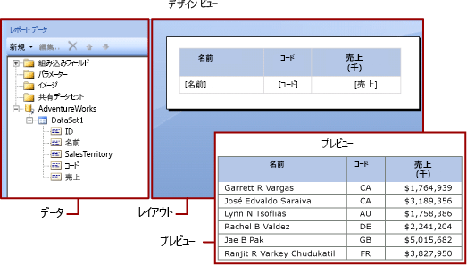

# Power BI レポート ビルダーでの式
  式は、Power BI Report Builder のページ分割されたレポート全体で、データの取得、計算、表示、グループ化、並べ替え、フィルター処理、パラメーター化、および書式設定を行うために広く使用されます。 
  
  式には、多くのレポート アイテムのプロパティを設定できます。 式は、レポートのコンテンツ、デザイン、および対話機能を制御するために役立ちます。 式は、Microsoft Visual Basic で記述され、レポート定義内に保存され、レポートを実行したときにレポート プロセッサによって評価されます。  
  
 ワークシート内で直接データを操作する Microsoft Office Excel などのアプリケーションとは異なり、レポートでは、データのプレースホルダーである式を操作します。 評価された式からの実際のデータを確認するには、レポートをプレビューする必要があります。 レポートを実行すると、レポート プロセッサーによって各式が評価され、レポート データとレポート レイアウト要素 (テーブルやグラフなど) が結合されます。  
  
 レポートをデザインすると、レポート アイテム用の多数の式が自動的に設定されます。 たとえば、フィールドをデータ ペインからレポート デザイン画面上のテーブル セルにドラッグすると、テーブル ボックスの値には、そのフィールド用の単純な式が設定されます。 次の図では、レポート データ ペインに、ID、Name、SalesTerritory、Code、および Sales というデータセット フィールドが表示されています。 テーブルには、[Name]、[Code]、および [Sales] という 3 つのフィールドが追加されています。 デザイン画面上の [Name] という表記は、基になる式 `=Fields!Name.Value` を表しています。  
  

  
 レポートをプレビューすると、レポート プロセッサによって、テーブル データ領域とデータ接続からの実際のデータが結合され、テーブルの行に結果セット内のすべての行が表示されます。  
  
 式を手動で入力するには、デザイン画面上でアイテムを選択し、ショートカット メニューとダイアログ ボックスを使用して、そのアイテムのプロパティを設定します。 ***(fx)*** ボタンまたはドロップダウン リストでの値 `<Expression>` の表示によって、式にプロパティを設定できることがわかります。 
  
##   単純な式と複雑な式を理解する  
 式は等号 (=) で始まり、Microsoft Visual Basic で記述されます。 式には、定数、演算子、および組み込みの値 (フィールド、コレクション、および関数)、外部またはカスタム コードへの参照の組み合わせを含めることができます。  
  
 式を使用して、多くのレポート アイテムのプロパティの値を指定できます。 最も一般的なプロパティは、テキスト ボックスとプレースホルダー テキストの値です。 通常、テキスト ボックスに式が 1 つだけ含まれている場合は、その式がテキスト ボックスのプロパティの値になります。 テキスト ボックスに複数の式が含まれている場合は、各式がテキスト ボックス内のプレースホルダー テキストの値になります。  
  
 既定では、式はレポート デザイン画面上に "*単純な式*" または "*複雑な式*" として表示されます。  
  
-   **単純**: 単純な式には、データセット フィールド、パラメーター、または組み込みフィールドなどの組み込みコレクション内の 1 つのアイテムへの参照が含まれています。 デザイン画面では、単純な式は角かっこで囲まれて表示されます。 たとえば、`[FieldName]` は、基になる式 `=Fields!FieldName.Value` に対応します。 単純な式は、レポート レイアウトを作成し、レポート データ ペインからデザイン画面にアイテムをドラッグしたときに、自動的に作成されます。 さまざまな組み込みコレクションを表す記号の詳細については、[単純な式のプレフィックス記号の理解](#DisplayText)に関する記事を参照してください。  
  
-   **複雑**: 複雑な式には、複数の組み込み参照、演算子、および関数呼び出しへの参照が含まれます。 式の値に単純な参照を超えるものが含まれている場合は、<\<Expr>> という形式で複雑な式が表示されます。 式を表示するには、その上にマウス ポインターを置いて、ツールヒントを使用します。 式を編集するには、それを **[式]** ダイアログ ボックスに開きます。  
  
 次の図は、テキスト ボックスとプレースホルダー テキストの両方での一般的な単純な式と複雑な式を示しています。  
  
 
  
 式のテキストではなくサンプル値を表示するには、テキスト ボックスまたはプレースホルダー テキストに書式を適用します。 次の図は、サンプル値を表示するように切り替えられたレポート デザイン画面を示しています。  
  
  

##  単純な式でのプレフィックス記号について  

単純な式では、記号を使用して、参照先が、フィールド、パラメーター、組み込みコレクション、または ReportItems コレクションであるかどうかが示されます。 次の表に、表示と式のテキストの例を示します。  
  
|項目|表示テキストの例|式テキストの例|  
|----------|--------------------------|-----------------------------|  
|データセット フィールド|`[Sales]`   `[SUM(Sales)]`   `[FIRST(Store)]`|`=Fields!Sales.Value`   `=Sum(Fields!Sales.Value)`   `=First(Fields!Store.Value)`|  
|レポート パラメーター|`[@Param]`   `[@Param.Label]`|`=Parameters!Param.Value`   `=Parameters!Param.Label`|  
|組み込みフィールド|`[&ReportName]`|`=Globals!ReportName.Value`|  
|表示テキストで使用されるリテラル文字|`\[Sales\]`|`[Sales]`|  
  
##   複雑な式の記述  
 式には、関数、演算子、定数、フィールド、パラメーター、組み込みコレクションのアイテムに加え、埋め込まれたカスタム コードまたはカスタム アセンブリへの参照を含めることができます。  
  
 次の表に、式に含めることができる参照の種類を示します。  
  
|リファレンス|説明|例|  
|----------------|-----------------|-------------|  
|定数|定数値 (フォントの色など) が必要なプロパティに対話的にアクセスできる定数を記述します。|`="Blue"`|  
|演算子|式の中で参照を組み合わせるために使用できる演算子を記述します。 たとえば、文字列の連結では **&** 演算子が使用されます。|`="The report ran at: " & Globals!ExecutionTime & "."`|  
|組み込みコレクション|式に含めることができる組み込みコレクションを記述します (`Fields`、`Parameters`、`Variables` など)。|`=Fields!Sales.Value`   `=Parameters!Store.Value`   `=Variables!MyCalculation.Value`|  
|組み込みのレポート関数と集計関数|式からアクセスできる組み込み関数を記述します (`Sum` や `Previous` など)。|`=Previous(Sum(Fields!Sales.Value))`|  
|レポート ビルダーの式内のカスタム コードとアセンブリ参照 |組み込み CLR クラスの `xref:System.Math` と `xref:System.Convert`、他の CLR クラス、Visual Basic ランタイム ライブラリ関数、または外部アセンブリのメソッドにアクセスする方法を記述します。   レポートに埋め込んだカスタム コード、またはコンパイルしてレポート クライアントとレポート サーバーの両方にカスタム アセンブリとしてインストールしたカスタム コードにアクセスする方法を記述します。|`=Sum(Fields!Sales.Value)`   `=CDate(Fields!SalesDate.Value)`   `=DateAdd("d",3,Fields!BirthDate.Value)`   `=Code.ToUSD(Fields!StandardCost.Value)`|  
   
##   式の検証  
 特定のレポート アイテムのプロパティ用の式を作成するときに、式に含めることができる参照は、レポート アイテムのプロパティで許容される値とプロパティで評価されるスコープによって異なります。 例:  
  
-   既定では、式 [Sum] は、式の評価時にスコープ内にあるデータの合計を計算します。 テーブル セルでは、スコープは、行と列グループのメンバーシップによって決まります。 
  
-   Font プロパティの値では、値はフォントの名前に評価される必要があります。  
  
-   式の構文は、デザイン時に検証されます。 式のスコープの検証は、レポートの発行時に行われます。 実際のデータに依存する検証では、エラーは実行時にのみ検出されます。 これらの式の一部では、レンダリングされるレポート内にエラー メッセージとして #Error が生成されます。 

## 次の手順

- [Power BI Premium のページ分割されたレポートとは](paginated-reports-report-builder-power-bi.md)
