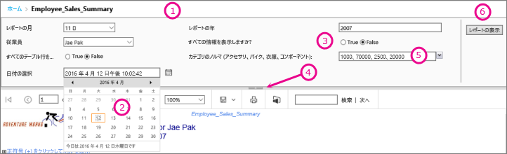
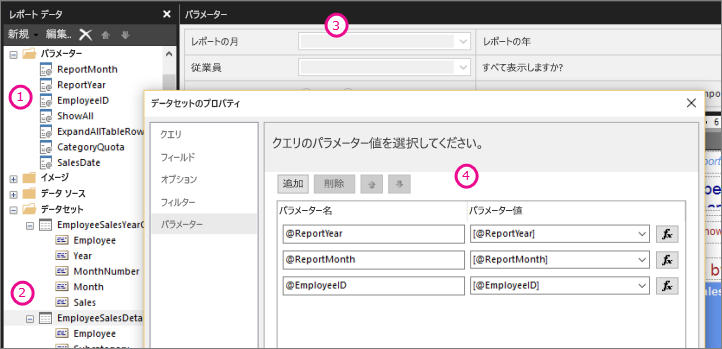

# Power BI レポート ビルダーでのレポート パラメーター

このトピックでは、Power BI Report Builder のレポート パラメーターの一般的な用途や設定できるプロパティなどについて説明します。 レポート パラメーターを使用して、レポート データを制御し、関連するレポートを連携させ、さまざまな方法でレポートの表示方法を変更することができます。 レポート パラメーターは、レポート ビルダーで作成するページ分割されたレポートで使用できます。

##  パラメーターの一般的な用途

 パラメーターを使用する最も一般的ないくつかの方法を次に示します。  
  
**ページ分割されたレポートのデータ**
  
- 変数が含まれるデータセット クエリを記述することで、ページ分割されたレポートのデータをデータ ソースでフィルター処理します。  
  
- ページ分割されたレポートのデータをカスタマイズする値をユーザーが指定できるようにします。 たとえば、売上データに対して、開始日と終了日用の 2 つのパラメーターを提供します。  
  
**レポートの表示方法を変更する**
  
- レポートの外観をカスタマイズするための値をユーザーが指定できるようにします。 たとえば、テーブル内の入れ子になっているすべての行グループを展開するか折りたたむかを指示するブール値パラメーターを提供します。  
  
- 式にパラメーターを含めることで、レポート データと外観をユーザーがカスタマイズできるようにします。  
  
##  パラメーターがあるページ分割されたレポートの表示

パラメーターのあるレポートを表示すると、レポート ビューアーのツール バーに各パラメーターが表示されて、対話的に値を指定できます。 次の図では、@ReportMonth、@ReportYear、@EmployeeID、@ShowAll、@ExpandTableRows、@CategoryQuota、および @SalesDate の各パラメーターを含むレポートのパラメーター領域を示します。  

  
1. **パラメーター ペイン**: レポート ビューアーのツール バーに、各パラメーターのプロンプトと既定値が表示されます。 パラメーター ペインでは、パラメーターのレイアウトをカスタマイズできます。  
  
2. **@SalesDate パラメーター**: @SalesDate パラメーターは **DateTime** データ型です。 テキスト ボックスの横に [日付を選択] プロンプトが表示されます。 日付を変更するには、テキスト ボックスに新しい日付を入力するか、カレンダー コントロールを使用します。  
  
3. **@ShowAll パラメーター**: @ShowAll パラメーターは **Boolean** データ型です。 ラジオ ボタンを使用して **[True]** または **[False]** を指定します。  
  
4. **パラメーター領域の表示/非表示ハンドル**: パラメーター ペインの表示/非表示を切り替えるには、レポート ビューア―のツールバーでこの矢印をクリックします。  
  
5. **@CategoryQuota パラメーター**: @CategoryQuota パラメーターは **Float** データ型であるため、数値が使用されます。  @CategoryQuota は、複数の値を許可するように設定されています。  
  
6. **[レポートの表示]** : パラメーターの値を入力した後、 **[レポートの表示]** をクリックしてレポートを実行します。 すべてのパラメーターに既定値がある場合、レポートは最初に表示した時点で自動的に実行されます。  
  
##  パラメーターを作成する

レポート パラメーターは限られた方法で作成できます。
  
> [!NOTE]
>  すべてのデータ ソースでパラメーターがサポートされているわけではありません。
  
**パラメーターがあるデータセット クエリまたはストアド プロシージャ**
  
 変数を含むデータセット クエリまたは入力パラメーターを含むデータセット ストアド プロシージャを追加します。 各変数または入力パラメーターに対してデータセット パラメーターを作成し、各データセット パラメーターに対してレポート パラメーターを作成します。  
  

  
 レポート ビルダーのこの図は、以下を示しています。  
  
1.  レポート データ ペインに表示されるレポート パラメーター。  
  
2.  パラメーターがあるデータセット。  
  
3.  パラメーター ペイン。  
  
4.  [データセットのプロパティ] ダイアログ ボックスに表示されているパラメーター。  
  
**パラメーターを手動で作成する**
  
レポート データ ペインからパラメーターを手動で作成します。 ユーザーがレポートの内容または外観をカスタマイズするための値を対話的に入力できるように、レポート パラメーターを構成できます。 ユーザーが構成済みの値を変更できないように、レポート パラメーターを構成することもできます。  
  
> [!NOTE]  
>  パラメーターは、サーバーで個別に管理されるため、新しいパラメーター設定でメイン レポートを再発行しても、レポートの既存のパラメーター設定が上書きされることはありません。  

### パラメーターの値

 レポートのパラメーター値を選択するためのオプションを次に示します。  
  
- ドロップダウン リストから単一のパラメーター値を選択します。  
  
- ドロップダウン リストから複数のパラメーター値を選択します。  
  
- 1 つのパラメーターのドロップダウン リストから値を選択します。これにより、別のパラメーターのドロップダウン リストで使用できる値が決まります。 これらは、カスケード型パラメーターです。 カスケード型パラメーターを使用して連続してフィルター処理することで、数千個あるパラメーターの値を管理しやすい数に減らすことができます。 詳細については、「[ページ分割されたレポートでカスケード型パラメーターを使用する](../guidance/paginated-report-cascading-parameter.md)」を参照してください。
  
- パラメーターの既定値が設定されているため、パラメーターを選択しなくてもレポートを実行できます。  
  
##  レポート パラメーターのプロパティ

 [レポートのプロパティ] ダイアログ ボックスを使用して、レポート パラメーターのプロパティを変更できます。 次の表は、各パラメーターに対して設定できるプロパティをまとめたものです。  
  
|プロパティ|説明|  
|--------------|-----------------|  
|名前|大文字と小文字が区別されるパラメーターの名前を入力します。 名前は英字で始まる必要があり、英字、数字、アンダー スコア (_) を使用できます。 名前にスペースを含めることはできません。 自動的に生成されるパラメーターでは、名前はデータセット クエリ内のパラメーターと一致します。 既定では、手動で作成されたパラメーターは ReportParameter1 のようになります。|  
|プロンプト|レポート ビューアー ツールバー上のパラメーターの横に表示されるテキスト。|  
|データ型|レポート パラメーターは、次のいずれかのデータ型である必要があります。   **Boolean**。 ユーザーがラジオ ボタンの [True] または [False] を選択します。   **DateTime**。 ユーザーがカレンダー コントロールから日付を選択します。   **Integer**。 ユーザーがテキスト ボックスに値を入力します。   **Float**。 ユーザーがテキスト ボックスに値を入力します。   **Text**。 ユーザーがテキスト ボックスに値を入力します。   パラメーターに対して使用可能な値が定義されている場合は、データ型が **DateTime** であっても、ユーザーはドロップダウン リストから値を選択します。|  
|空白の値を許可する|パラメーターの値で空の文字列または空白が可能な場合は、このオプションを選択します。   パラメーターに対して有効な値を指定するときに、有効な値の 1 つとして空白の値を指定する場合は、指定する値の 1 つとしてそれを含める必要があります。 このオプションを選択しても、空白が使用可能な値として自動的に含まれることはありません。|  
|null 値を許可する|パラメーターの値を null にできる場合は、このオプションを選択します。   パラメーターに対して有効な値を指定するときに、有効な値の 1 つとして null を指定する場合は、指定する値の 1 つとして null を含める必要があります。 このオプションを選択しても、null が使用可能な値として自動的に含まれることはありません。|  
|複数の値を許可する|ユーザーがそこから選択できるドロップダウン リストを作成するために使用可能な値を提供します。 これは、データセット クエリで有効な値だけが確実に送信されるようにする効果的な方法です。   パラメーターの値として、ドロップダウン リストに表示される複数の値を指定できる場合は、このオプションを選択します。 null 値は許可されません。 このオプションを選択すると、パラメーターのドロップダウン リスト内の使用可能な値の一覧にチェック ボックスが追加されます。 リストの一番上に、 **[すべて選択]** チェック ボックスが含まれます。 ユーザーは、必要な値をオンにできます。   値を提供するデータが急速に変化する場合は、ユーザーに表示される一覧が最新でない可能性があります。|  
|表示|レポートが実行されたときに、レポートの上部にレポート パラメーターを表示するには、このオプションを選択します。 このオプションによって、ユーザーが実行時にパラメーター値を選択することができます。|  
|非表示|発行されたレポート内のレポート パラメーターを非表示にするには、このオプションを選択します。 レポートの URL、サブスクリプション定義、またはレポート サーバー上で、引き続きレポート パラメーターの値を設定できます。|  
|Internal|レポート パラメーターを非表示にするには、このオプションを選択します。 発行されたレポートでは、レポート定義内でのみレポート パラメーターを確認することができます。|  
|使用可能な値|パラメーターに対して使用可能な値を指定している場合は、有効な値が常にドロップダウン リストとして表示されます。 たとえば、**DateTime** パラメーターで使用可能な値を指定すると、カレンダー コントロールの代わりに日付用のドロップダウン リストがパラメーター ペインに表示されます。   レポートとサブレポート間で値の一覧に一貫性があるようにするには、データ ソースに関連付けられているデータセットのすべてのクエリで単一のトランザクションを使用するオプションをデータ ソースに設定できます。   **セキュリティ上の注意**: **Text** データ型のパラメーターが含まれるレポートでは、使用可能な値の一覧 (有効な値の一覧とも呼ばれます) が使用され、レポートを実行するすべてのユーザーがレポートにデータを表示するために必要なアクセス許可のみを持っていることを確認します。|  
|既定値|クエリまたは静的な一覧からの既定値を設定します。   各パラメーターに既定値がある場合、レポートは最初に表示した時点で自動的に実行されます。|  
|詳細設定|このパラメーターがレポートのデータに対して直接的または間接的に影響するかどうかを示す値であるレポート定義属性 **UsedInQuery** を設定します。   **更新のタイミングを自動的に決定する**  この値の設定をレポート プロセッサに決定させる場合は、このオプションを選択します。 レポート プロセッサーでこのパラメーターへの直接的または間接的な参照があるデータセット クエリが検出された場合、またはレポートにサブレポートがある場合、値は **True** になります。   **常に更新する**  レポート パラメーターがデータセット クエリまたはパラメーター式で直接的または間接的に使用される場合は、このオプションを選択します。 このオプションでは、**UsedInQuery** が True に設定されます。   **更新しない**  レポート パラメーターがデータセット クエリまたはパラメーター式で直接的または間接的に使用されない場合は、このオプションを選択します。 このオプションでは、**UsedInQuery** が False に設定されます。   **注意**: **[更新しない]** は慎重に使用してください。 レポート サーバー上で、**UsedInQuery** は、レポート データとレンダリングされたレポート用のキャッシュ オプションと、スナップショット レポート用のパラメーター オプションの制御を支援するために使用されます。 **[更新しない]** の設定が不適切な場合、間違ったレポート データやレポートがキャッシュされたり、スナップショット レポートのデータに一貫性がなくなったりする可能性があります。 |  
  
##   データセット クエリ  
 データセット クエリでデータをフィルター処理するには、結果セットに追加するか除外する値を指定することで、取得したデータを制限する制限句を含めることができます。  
  
 パラメーター化クエリの構築に役立つようにデータ ソースのクエリ デザイナーを使用します。  
  
-   Transact SQL クエリでは、さまざまなデータ ソースで、異なるパラメーターの構文がサポートされます。 サポートは、クエリ内で位置または名前で識別されるパラメーターなど、多岐に割ります。 リレーショナル クエリ デザイナーで、パラメーター化クエリを作成するためのフィルター用のパラメーター オプションを選択する必要があります。   
  
-   Microsoft SQL Server Analysis Services などの多次元データ ソースに基づくクエリでは、クエリ デザイナーで指定したフィルターに基づいてパラメーターを作成するかどうかを指定できます。 
  
##   発行されたレポートのパラメーターの管理  
 レポートをデザインすると、レポート パラメーターがレポート定義に保存されます。 レポートを発行すると、レポート パラメーターはレポート定義とは別に保存されて管理されます。  
  
 発行されたレポートでは、以下を使用できます。  
  
-   **レポート パラメーターのプロパティ。** レポート定義とは別に、レポート サーバー上でレポート パラメーターの値を直接変更します。  
  
-   **レポート サブスクリプション。** データをフィルター処理し、サブスクリプションを通じてレポートを配信するためのパラメーター値を指定できます。 
  
 レポート定義を再発行しても、発行されたレポート用のパラメーターのプロパティは保持されます。 レポート定義が同じレポートとして再発行されるときに、パラメーターの名前とデータの種類が同じ場合、プロパティの設定は保持されます。 レポート定義でパラメータを追加または削除するか、既存のパラメーターのデータ型または名前を変更した場合は、発行されたレポート内でパラメーターのプロパティを変更しなければならない可能性があります。  
  
 すべてのケースですべてのパラメーターを変更できるわけではありません。 レポート パラメーターでデータセット クエリからの既定値が取得される場合、その値を発行されたレポートで変更することも、レポート サーバー上で変更することもできません。 実行時に使用される値は、クエリが実行されるときに決定されます。式ベースのパラメーターの場合は、式が評価されるときに決定されます。  
  
 レポート実行オプションは、パラメーターの処理方法に影響を与える可能性があります。 スナップショットとして実行されるレポートでは、クエリにパラメーターの既定値が含まれていない限り、クエリから派生するパラメーターを使用することはできません。  
  
##  サブスクリプションのパラメーター  
 オンデマンドまたはスナップショット用のサブスクリプションを定義し、サブスクリプションの処理中に使用するパラメーター値を指定できます。  
  
-   **オンデマンド レポート。**  オンデマンド レポートでは、レポート用に表示される各パラメーターに対して、発行された値とは異なるパラメーター値を指定できます。 たとえば、"*期間*" パラメーターを使用して、1 日、1 週間、または 1 か月のカスタマー サービス リクエストを返すコール サービス レポートがあるとします。 このレポートで、既定のパラメーター値が **[本日]** に設定されている場合、サブスクリプションでは別のパラメーター値 ( **[週]** や **[月]** など) を使用して、週次または月次の数値が含まれるレポートを生成できます。  
  
## 次の手順

- [Power BI Premium のページ分割されたレポートとは](paginated-reports-report-builder-power-bi.md)  
- [ページ分割されたレポートでカスケード型パラメーターを使用する](../guidance/paginated-report-cascading-parameter.md)
