# Power BI 共有データセットを基づいて改ページ調整されたレポートを作成する

Power BI Desktop で作成したデータセットは、Power BI レポート ビルダーの改ページ調整されたレポートのデータ ソースとして利用できます。 次のようなシナリオを考えてみましょう。Power BI Desktop で Power BI レポートを作成しました。 データ モデルの設計に多大な時間を費やしたので、多種多様なビジュアルを使った美しい Power BI レポートを作成することができました。 レポートのマトリックスには行が多数あり、全部を確認するにはスクロールが必要です。 レポートの読者からすると、印刷ができて、かつ、マトリックス内の行がすべて表示されるようなレポートが理想です。 Power BI の改ページ調整されたレポートなら、そのようなことが可能です。数ページに及ぶテーブルやマトリックスを、ページのヘッダーやフッターを含めて、設計どおりの完璧なレイアウトで印刷することができるのです。 これは、Power BI Desktop のレポートを補完するものです。 これらはまったく同じデータに基づいている必要があり、不一致があってはならないので、同じデータセットを使用します。

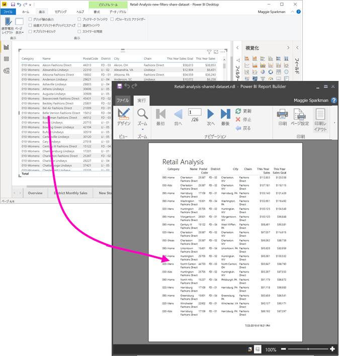

データセットを Premium 容量のワークスペースに配置する必要はありません。また、そのワークスペースのメンバーである必要もありません。 必要なのは、対象のデータセットについて[ビルドのアクセス許可](../connect-data/service-datasets-build-permissions.md)があることだけです。 改ページ調整されたレポートを発行するには、Power BI Pro のライセンスが必要です。 また、ワークスペースが Premium 容量にある場合には、最低限その共同作成者ロールが必要です。

## 必要な操作

Power BI レポート ビルダーで共有データセットを使用するうえで必要なものと、必要のないものを以下に示します。

- Power BI レポート ビルダー。 [Power BI レポート ビルダーをダウンロードおよびインストール](https://aka.ms/pbireportbuilder)してください。
- Power BI データセットにアクセスするには、そのデータセットについてビルドのアクセス許可が必要です。 [ビルドのアクセス許可](../connect-data/service-datasets-build-permissions.md)に関する記事を参照してください。
- レポート ビルダーで改ページ調整されたレポートを作成する操作には、Power BI Pro のライセンスは必要ありません。 
- 改ページ調整されたレポートの発行には、Power BI Pro のライセンスが必要です。 また、ワークスペースが Premium 容量にある場合には、最低限その共同作成者ロールが必要です。 
- 任意:この記事に従って作業を進める場合には、Power BI Desktop 用の [Retail Analysis sample.pbix](https://download.microsoft.com/download/9/6/D/96DDC2FF-2568-491D-AAFA-AFDD6F763AE3/Retail%20Analysis%20Sample%20PBIX.pbix) ファイルをダウンロードし、Power BI Desktop で開いて、多数の列を含むテーブルを追加します。 **[形式]** ペインで、 **[合計]** をオフにします。 その後、Power BI サービス内のワークスペースに発行します。

    ![[合計] をオフにしたところ](media/report-builder-shared-datasets/power-bi-desktop-totals-off.png)

## Power BI データセットに接続する

1. Power BI レポート ビルダーを開きます。
1. レポート ビルダーの右上隅にある **[サインイン]** を選択して、自分の Power BI アカウントにサインインします。
1. レポート データ ペインで、 **[新規]**  >  **[Power BI Dataset Connection]\(Power BI データセットの接続\)** の順に選択します。

    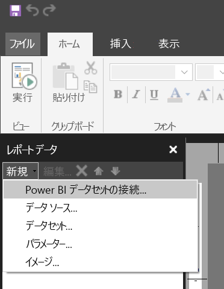

    > [!NOTE]
    > レポート ビルダーのテーブル、マトリックス、またはグラフのウィザードを使って Power BI データセット用のデータ ソースまたはデータセットを作成することはできません。 これらを作成した後であれば、ウィザードを使用して、これらに基づいたテーブル、マトリックス、またはグラフを作成できます。

1. データセットまたはそのデータセットが存在するワークスペースを検索または参照し、 **[選択]** をクリックします。
    データセット名は、レポート ビルダーにより入力されます。

    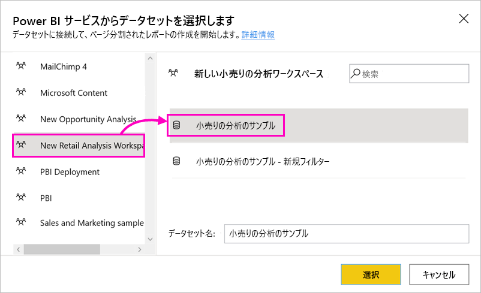
    
1. レポート データ ペインの [データ ソース] の下に、データセットが表示されます。

    ![レポート データ ペイン内の [データ ソース] の下に表示されたデータセット](media/report-builder-shared-datasets/power-bi-report-builder-data-source.png)

    複数の Power BI データセットに接続したり、同じ改ページ調整されたレポート内の別のデータ ソースに接続したりすることもできます。

## データセットの DAX クエリを取得する

Power BI レポート内とレポート ビルダー内とでデータを同じにする必要がある場合には、データセットに接続するだけでは十分ではありません。 ほかに、そのデータセットに基づいて作成されたクエリが必要になります。

### ビデオ:DAX クエリを取得する

次のビデオでは、ページ分割されたレポートに必要な DAX を取得する方法を Chris Finlan が実演します。

<iframe width="400" height="450" src="https://www.youtube.com/embed/NfoOK4QRkhI" frameborder="0" allowfullscreen></iframe>

### DAX クエリを取得する手順

クエリを取得する手順を次に示します。

1. Power BI Desktop で Power BI レポート (.pbix) を開きます。
1. レポート内のテーブルに、改ページ調整されたレポートで必要なデータがすべて含まれていることを確認してください。 このテーブルでは、次の 2 つの要件を満たす必要があります。
    - マトリックスやその他のビジュアルではなく、フラット テーブルにする必要があります。 テーブルではない場合、ここでテーブルに変換し、それに続くパフォーマンス アナライザーの手順を完了し、再度変換して必要なビジュアルに戻します。
    - 数値フィールドについては、"*定義済みのメジャー*" を使用する必要があります。 電卓シンボルが横に付いています。 メジャーの作成方法については[こちら](../transform-model/desktop-measures.md)をご覧ください。 

        ![[メジャー] アイコン](media/report-builder-shared-datasets/power-bi-measure-icon.png)

1. **[表示]** リボンで、 **[パフォーマンス アナライザー]** を選択します。

    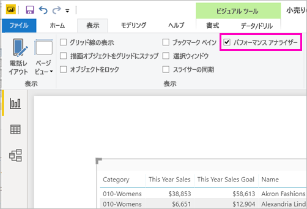

1. **[パフォーマンス アナライザー]** ペインで **[記録の開始]** 、 **[ビジュアルを更新します]** の順に選択します。

    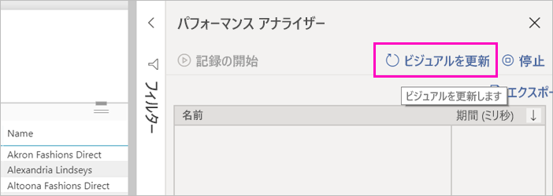

1. テーブル名の横にあるプラス記号 ( **+** ) を展開して、 **[クエリのコピー]** を選択します。 クエリは、Power BI レポート ビルダーのデータセットに必要な DAX 式になっています。

    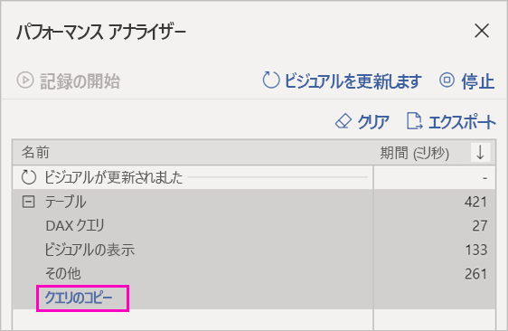

## クエリを使ってデータセットを作成する

1. Power BI レポート ビルダーに戻ります。
1. **[データ ソース]** の下にあるデータセットを右クリックし、 **[データセットの追加]** を選択します。

    

1. [データセットのプロパティ] で名前を設定し、 **[クエリ デザイナー]** を選択します。

4. **[DAX]** が選択されていることを確認し、 **[デザイン モード]** アイコンの選択を解除します。

    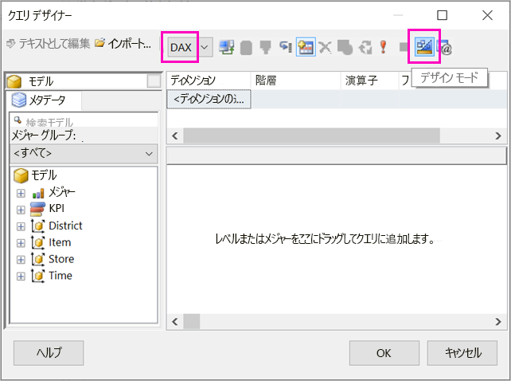

1. 上部のボックスに、Power BI Desktop からコピーしたクエリを貼り付けます。

1. **[クエリの実行]** (赤い感嘆符) を選択して、クエリが機能することを確認します。 

    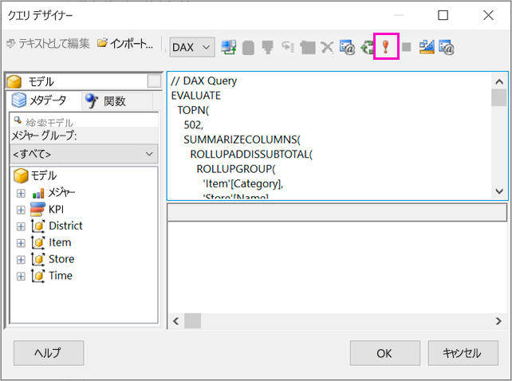

    クエリの結果が、下部のボックスに表示されます。

    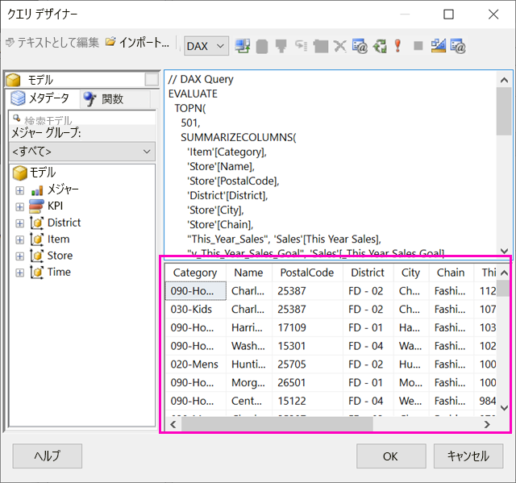

1. **[OK]** を選択します。

    **[データセットのプロパティ]** ダイアログ ボックスの **[クエリ]** ウィンドウにクエリが表示されます。

    ![[データセットのプロパティ] ダイアログ ボックス](media/report-builder-shared-datasets/power-bi-report-builder-dataset-properties.png)

1. **[OK]** を選択します。

    これで、レポート データ ペインで新しいデータセットと、そのフィールドの一覧が表示されるようになりました。

    

## レポートにテーブルを作成する

テーブルをすばやく作成できる方法の 1 つが、テーブル ウィザードを使用することです。

1. **[挿入]** リボンで **[テーブル]**  >  **[テーブル ウィザード]** の順に選択します。

    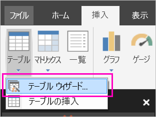

1. DAX クエリを使って作成したデータセット > **[次へ]** の順に選択します。

    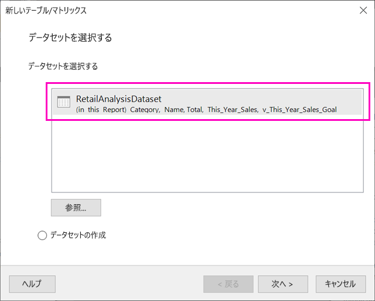

1. フラット テーブルを作成するには、 **[使用できるフィールド]** から必要なフィールドを選択します。 必要なフィールドのうち、一番上にあるものを選択した後、Shift キーを押しながら一番下にあるものを選択すると、一度に複数のフィールドを選択できます。

    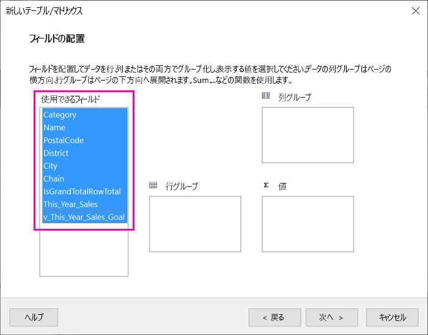

1. フィールドを **[値]** ボックスにドラッグして、 **[次へ]** を選択します。

    

1. 必要なレイアウト オプションを選択して **[次へ]** を選択します。

1. **[完了]** を選びます。
    デザイン ビューにテーブルが表示されます。

    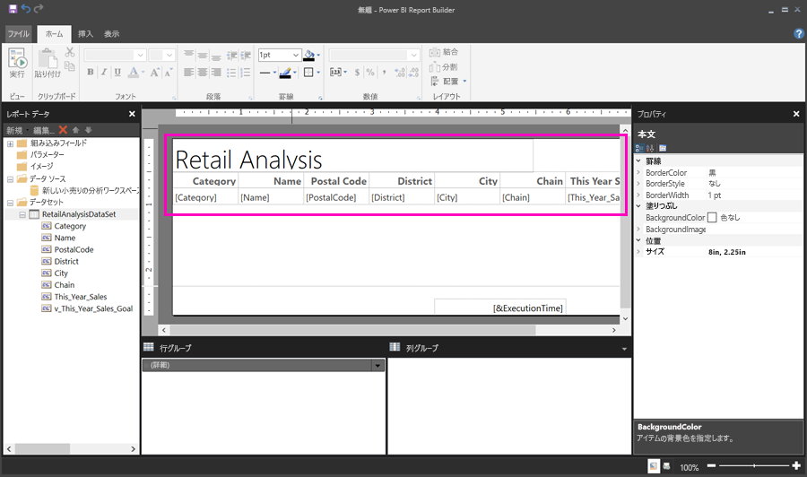

1. **[クリックしてタイトルを追加]** を選択して、タイトルを追加します。

1. **[実行]** を選択してレポートをプレビューします。

    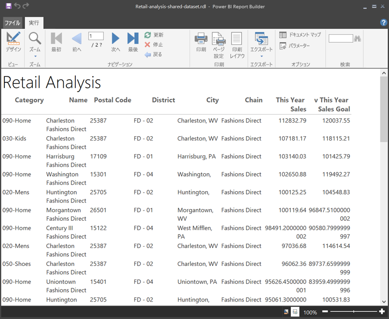

1. **[印刷レイアウト]** を選択して、レポートがどのように印刷されるかを確認します。 

    このレポート レイアウトでは、多少の作業が必要です。 列と余白が原因でテーブルの幅が 2 ページ分あるので、ページ数が 54 になっています。

    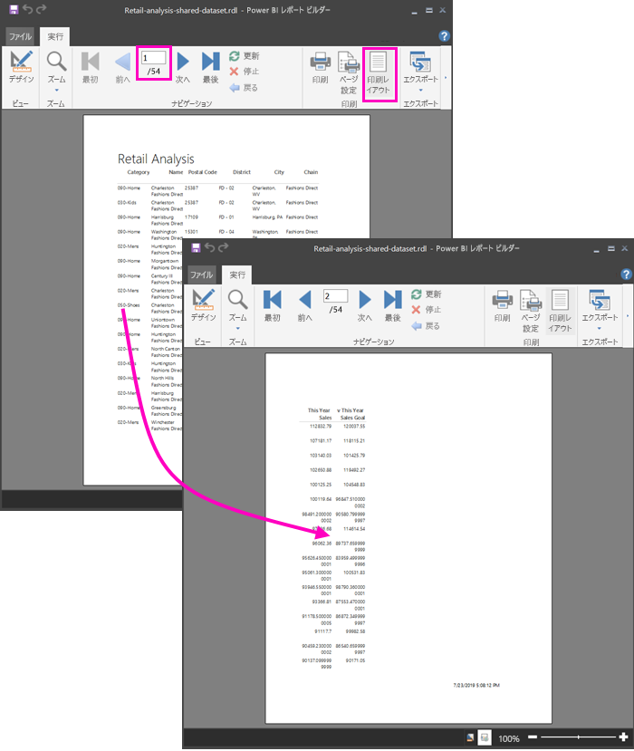

## レポートを書式設定する

テーブルを 1 ページに収めるうえで役立つ書式設定オプションはいくつかあります。 

1. [プロパティ] ペインでは、ページの余白を小さくすることができます。 [プロパティ] ペインが表示されない場合は、 **[表示]** リボンで **[プロパティ]** チェック ボックスを選択します。

1. テーブルまたはタイトルではなく、レポートを選択します。
1. **[レポートのプロパティ]** ペインの **[ページ]** の下にある **[余白]** を展開し、それぞれを **0.75in** に変更します。

    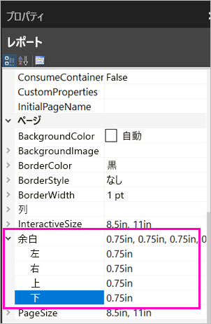

1. 列の幅を狭めることもできます。 列の境界線を選択し、右側を左にドラッグします。

    

1. もう 1 つのオプションは、数値の形式が適切かどうかを確認するというものです。 数値が入力されているセルを選択します。 
    > [!TIP]
    > Shift キーを押しながら他のセルを選択すると、複数のセルの形式を同時に設定できます。

    

1. **[ホーム]** リボンの **[数値]** セクションで、 **[標準]** の形式から数値の形式 ( **[通貨]** など) に変更します。

    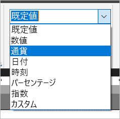

1. **[プレースホルダー]** のスタイルを **[サンプル値]** に変更すると、セル内の書式設定を確認できます。 

    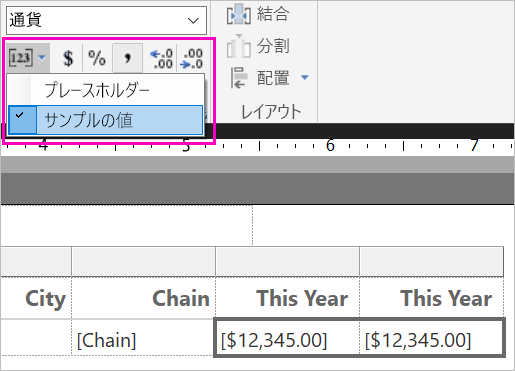

1. 必要があれば、 **[数値]** セクションで小数点以下桁数を小さくすると、スペースを節約できます。

### 空白のページを削除する

余白とテーブルの列の幅を狭くしても、空白のページが残ってしまうことがあります。 なぜでしょうか。 原因は数学的な話です。 

ページの余白として設定した値と、レポートの "*本体*" の幅の値を足した結果が、レポートの形式の幅よりも小さくなっている必要があります。

たとえば、レポートの形式が 8.5" x 11" で、横の余白をそれぞれ 0.75 に設定しているとします。 2 つの余白は合計 1.5" になるので、本体の幅は 7" インチ未満にする必要があります。

1. レポートのデザイン サーフェスの右端を選択してドラッグし、ルーラー上で目的の数字よりも小さくなるようにします。 

    > [!TIP]
    > **[本体]** の各種プロパティを使うと、もっと正確に設定できます。 **[サイズ]** の下の **[幅]** プロパティを設定してください。

    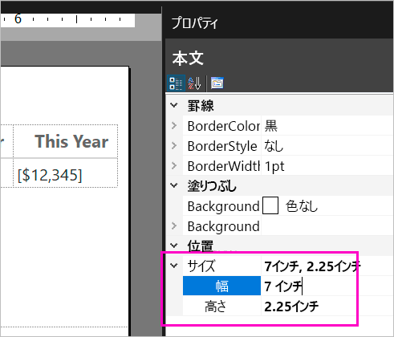

1. **[実行]** を選択してレポートをプレビューし、空白のページがなくなっていることを確認します。 レポートのページ数が元の 54 から減少し、26 になりました。 成功しました!

    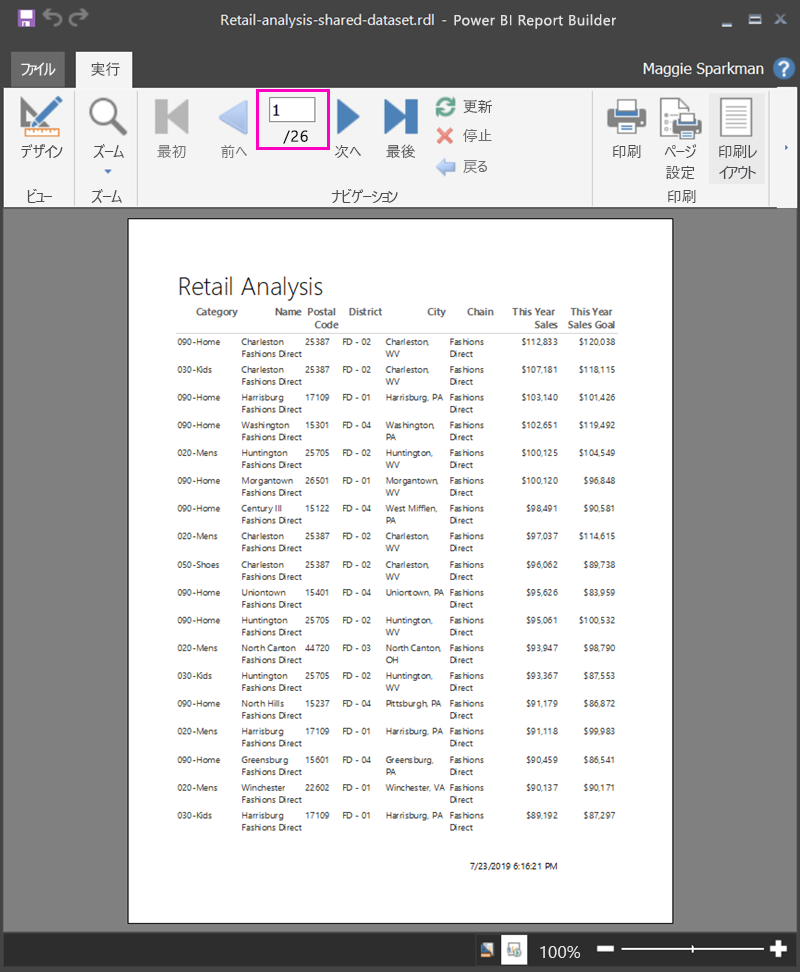

## 制限事項と考慮事項 

- Analysis Services に対するライブ接続を使用しているデータセットには、共有データセットではなく基になる Analysis Services 接続を使用すると、直接接続できます。
- 推奨度が [昇格しました] または [認定済み] のデータセットは、使用可能なデータセットの一覧に表示されるものの、そのような推奨度を示すマークは付きません。 
- "アプリ所有データ" シナリオでは、Power BI 共有データセットを基盤とし、ページ分割されたレポートを埋め込むことはできません。

## 次の手順

- [Power BI Premium のページ分割されたレポートとは](paginated-reports-report-builder-power-bi.md)
