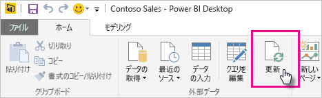

# OneDrive または SharePoint Online に格納されているデータセットを更新する
OneDrive または SharePoint Online から Power BI サービスへのファイルのインポートは、Power BI Desktop での作業と Power BI サービスとの同期を確実に維持するための優れた方法です。

## OneDrive または SharePoint Online に Power BI Desktop ファイルを保存することの利点
Power BI Desktop ファイルを OneDrive または SharePoint Online に保存すると、ファイルのモデルに読み込んだすべてのデータがデータセットにインポートされます。 そのファイルに作成したすべてのレポートは、Power BI サービスの**レポート**に読み込まれます。 たとえば、OneDrive または SharePoint Online 上のファイルに変更を加えるとします。 これらの変更には、新しいメジャーの追加、列名の変更、視覚化の編集を含めることができます。 ファイルを保存すると、通常は約 1 時間内に Power BI サービスもそれらの変更と同期します。

**[ホーム]** リボンの **[更新]** を選択して、1 回限りの手動更新を Power BI Desktop で実行することができます。 **[更新]** を選択すると、ファイルのモデルが、元のデータ ソースの更新されたデータで最新に更新されます。 この種の更新は、完全に Power BI Desktop アプリケーション自体から行われます。 Power BI での手動またはスケジュールされた更新とは異なるため、違いを理解することが重要です。

OneDrive または SharePoint Online から Power BI Desktop ファイルをインポートすると、データおよびモデルの情報が Power BI のデータセットに読み込まれます。 Power BI サービス内のデータセットは、レポートの基準となるため、最新の情報に更新する必要があります。 データ ソースは外部であるため、 **[今すぐ更新]** を使用してデータセットを手動で更新するか、または **[更新のスケジュール設定]** を使用して更新スケジュールを設定することができます。 

データセットを更新しても、Power BI は OneDrive または SharePoint Online のファイルに接続して更新されたデータのクエリを実行しません。 データセットの情報を使用してデータ ソースに直接接続し、更新されたデータのクエリを実行します。 次に、そのデータをデータセットに読み込みます。 データセットのこの更新データは、OneDrive または SharePoint Online 上のファイルに再度同期されることはありません。

## サポートされている機能
Power BI では、 **[データの取得]** または **[クエリ エディター]** を使用して次のデータ ソースに接続してデータを読み込んでいるローカル ドライブがある場合、そのローカル ドライブからインポートされた Power BI Desktop ファイルから作成したデータセットについては、 **[更新]** と **[更新のスケジュール設定]** をサポートしています。

> [!NOTE]
> ライブ接続データセットの Onedrive の更新がサポートされています。 ただし、OneDrive の更新シナリオでは、既に接続されているレポートのライブ データセットを別のデータセットに変更することはサポートされていません。

### Power BI Gateway - Personal
* Power BI Desktop の **[データの取得]** および **[クエリ エディター]** に表示されるすべてのオンライン データ ソース。
* Hadoop ファイル (HDFS) と Microsoft Exchange を除く、Power BI Desktop の **[データの取得]** および **[クエリ エディター]** に表示されるすべてのオンプレミスのデータ ソース。

<!-- Refresh Data sources-->
[!INCLUDE [refresh-datasources](./includes/refresh-datasources.md)]

> [!NOTE]
> Power BI からオンプレミスのデータ ソースに接続し、そのデータセットを更新するには、ゲートウェイをインストールして実行する必要があります。
> 
> 

## OneDrive と OneDrive for Business。 違いは何ですか?
個人用の OneDrive と OneDrive for Business の両方がある場合は、Power BI にインポートするすべてのファイルを OneDrive for Business に保存する必要があります。 これは、サインインのために 2 種類のアカウントを使用する可能性があるためです。

Power BI の OneDrive for Business に接続するとき、Power BI アカウントは多くの場合、OneDrive for Business アカウントと同じアカウントであるため、接続は簡単です。 個人用の OneDrive では、通常、異なる [Microsoft アカウント](https://account.microsoft.com)を使用してサインインします。

Microsoft アカウントにサインインしたら、必ず **[サインアウトしない]** を選択してください。 これで、Power BI が Power BI Desktop のファイルに行ったすべての変更を Power BI のデータセットに同期できるようになります。

Microsoft 資格情報を変更した場合は、OneDrive のファイルと Power BI のデータセットの間で変更を同期することはできません。 OneDrive に接続して、そこからファイルを再度インポートする必要があります。

## 更新のスケジュール方法
更新のスケジュールを設定すると、Power BI は、データ ソースに直接接続します。 Power BI はデータセット内の接続情報と資格情報を使用して、更新されたデータのクエリを実行します。 次に、Power BI は、更新されたデータをデータセットに読み込みます。 そして、Power BI サービス内のそのデータセットに基づくレポート視覚化およびダッシュボードをすべて更新します。

スケジュールされた更新を設定する方法について詳しくは、「[スケジュールされた更新の構成](refresh-scheduled-refresh.md)」をご覧ください。

## 問題が発生した場合
問題が発生した場合は通常、Power BI がデータ ソースにサインインできないことが原因です。 データセットがオンプレミスのデータ ソースに接続しようとしたが、ゲートウェイがオフラインである場合も、問題が発生することがあります。 こうした問題を回避するために、Power BI がデータ ソースにサインインできることを確認してください。 **データ ソースの資格情報**でデータ ソースへのサインインを試してみてください。 データ ソースへのサインインに使用するパスワードが変更されたり、Power BI がデータ ソースからサインアウトされたりすることがあります。

OneDrive 上の Power BI Desktop ファイルに変更を保存して、1 時間ほど経過してもその変更内容が Power BI に表示されない場合、Power BI が OneDrive に接続できないことが原因である可能性があります。 OneDrive 上のファイルにもう一度接続してみてください。 サインインを求められた場合は、必ず **[サインアウトしない]** を選択します。 Power BI が OneDrive に接続してファイルと同期できなかったため、もう一度ファイルをインポートする必要があります。

**[更新が失敗したらメールで通知する]** はオンのままにしてください。 スケジュールの更新が失敗した場合、すぐに通知されます。

## トラブルシューティング
期待どおりにデータが更新されないことがあります。 通常、ゲートウェイに接続するときに、データ更新の問題が発生します。 ツールと既知の問題については、ゲートウェイに関するトラブルシューティングの記事を参照してください。

[オンプレミス データ ゲートウェイのトラブルシューティング](service-gateway-onprem-tshoot.md)

[Power BI Gateway - Personal のトラブルシューティング](service-admin-troubleshooting-power-bi-personal-gateway.md)

他にわからないことがある場合は、 [Power BI コミュニティ](https://community.powerbi.com/)で質問してみてください。

