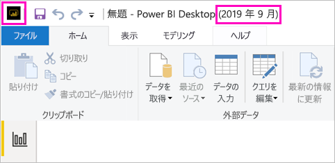

# Power BI レポート サーバー向けに最適化された Power BI Desktop のインストール

Power BI Report Server の Power BI レポートを作成するには、Power BI Report Server 向けに最適化された Power BI Desktop のバージョンをダウンロードしてインストールする必要があります。 このリリースは、Power BI サービスで使用される Power BI Desktop とは別のものです。 たとえば、Power BI サービス向けの Power BI Desktop 版にはプレビュー機能が含まれていていますが、これらのプレビュー機能は Power BI Report Server 版にはなく、それらが一般提供されて初めて含められます。 このリリースを使用すると、レポート サーバーが、既知のバージョンのレポートおよびモデルと対話できることを確認できます。 

Power BI Desktop と、Power BI Report Server 向けに最適化された Power BI Desktop は、同じコンピューターにサイド バイ サイドでインストールできます。

## Power BI Desktop のダウンロードおよびインストール

Power BI Report Server 向けに最適化された Power BI Desktop のバージョンが最新のものであることを確認するための最も簡単な方法は、レポート サーバーの Web ポータルから起動することです。

1. レポート サーバーの Web ポータルで、**ダウンロード**の矢印、 **[Power BI Desktop]** の順に選択します。

    

    あるいは、[Power BI Report Server](https://powerbi.microsoft.com/report-server/) ホーム ページに進み、 **[高度なダウンロード オプション]** を選択します。

2. ダウンロード センター ページで、言語を選択し、 **[ダウンロード]** を選択します。

3. 使用しているコンピューターに適したものを以下から選択します。 

    - **PBIDesktopRS.msi** (32 ビット バージョン)
    - **PBIDesktopRS_x64.msi** (64 ビット バージョン)

1. インストーラーをダウンロードしたら、Power BI Desktop (2019 年 9 月) のセットアップ ウィザードを実行します。

2. インストールの最後に、 **[Launch Power BI Desktop]\(Power BI Desktop を起動する\)** を選択します。

    Power BI Desktop が自動的に起動し、すぐに使えます。

## 正しいバージョンを使用していることを確認する
正しい Power BI Desktop を使用しているかどうかは、Power BI Desktop の起動画面またはタイトル バーを見れば容易に確認できます。 適切なバージョンでは、タイトル バーに **Power BI Desktop (2019 年 9 月)** と表示されます。 また、Power BI のロゴの色の表示も反転し、黄色の背景に黒の前景ではなく、黒の背景に黄色の前景となります。

Power BI サービスの Power BI Desktop のバージョンの場合、タイトル バーに月と年は示されません。

## ファイル拡張子の関連付け
Power BI Desktop と Power BI Report Server 向けに最適化された Power BI Desktop を同じコンピューターにインストールした場合、最後にインストールした Power BI Desktop が .pbix ファイルと関連付けられます。 したがって、.pbix ファイルをダブルクリックすると、最後にインストールした Power BI Desktop が起動されます。

Power BI Desktop をインストールし、次に Power BI Report Server 向けに最適化された Power BI Desktop をインストールした場合、既定ではすべての pbix ファイルが Power BI Report Server 向けに最適化された Power BI Desktop で開かれます。 pbix ファイルを開く際に既定で Power BI Desktop が起動されるようにする場合は、[Microsoft Store から Power BI Desktop を](https://aka.ms/pbidesktopstore)再インストールします。

最初に使用したい Power BI Desktop のバージョンを常に開くことができます。 その後、Power BI Desktop からファイルを開きます。

Power BI Report Server 内で Power BI レポートを編集したり、Web ポータルから新しい Power BI レポートを作成すると、適切なバージョンの Power BI Desktop が常に開きます。

## 考慮事項と制限事項

Power BI Report Server、Power BI サービス (`https://app.powerbi.com`)、Power BI モバイル アプリの Power BI レポートは、ほぼ同じように機能しますが、いくつかの機能は異なります。

### 言語の選択

Power BI Report Server 用に最適化された Power BI Desktop について、アプリをインストールするときに言語を選択します。 後でこれを変更することはできませんが、別の言語のバージョンをインストールすることはできます。

### ブラウザーのレポートのビジュアル

Power BI Report Server のレポートでは、Power BI ビジュアルなど、ほぼすべての視覚化がサポートされます。 Power BI レポート サーバーのレポートは、次をサポートしません。

* R ビジュアル
* ArcGIS マップ
* 階層リンク
* Power BI Desktop のプレビュー機能

### Power BI モバイル アプリのレポート

Power BI レポート サーバーのレポートは、次を含む [Power BI モバイル アプリ](../consumer/mobile/mobile-apps-for-mobile-devices.md)のすべての基本機能をサポートします。

* [電話のレポート レイアウト](../desktop-create-phone-report.md):Power BI モバイル アプリのレポートを最適化することができます。 携帯電話では、最適化されたレポートに特別なアイコン 、およびレイアウトが提供されます。
  
    

Power BI レポート サーバーのレポートは、Power BI モバイル アプリの次の機能をサポートしません。

* R ビジュアル
* ArcGIS マップ
* Power BI ビジュアル
* 階層リンク
* geo フィルタリングまたはバー コード

### カスタム セキュリティ

Power BI Report Server 向けに最適化された Power BI Desktop では、カスタム セキュリティはサポートされません。 Power BI Report Server がカスタム セキュリティ拡張機能を使用して構成されている場合、Power BI レポートを (Power BI Report Server 用に最適化された) Power BI Desktop から Power BI Report Server インスタンスに保存することはできません。 Power BI Desktop から .pbix レポート ファイルを保存し、Power BI Report Server ポータル サイトにアップロードする必要があります。

### 別のドメイン内の Power BI Report Server にレポートを保存する

Power BI Report Server に Power BI レポートを保存するときは、Windows 資格情報が使用されます。 使用している Windows 資格情報とは異なるドメインにあるレポート サーバーに直接保存することは、サポートされていません。 代わりに、Web ブラウザーを使用してレポート サーバーを表示し、コンピューターから手動でファイルをアップロードすることができます。

## 以前のバージョンの Power BI Report Server の Power BI Desktop

ご利用のレポート サーバーが以前のバージョンである場合、対応するバージョンの Power BI Desktop が必要です。 このリンクから前のバージョンをダウンロードできます。

- Microsoft Power BI Desktop ([Power BI Report Server (2019 年 9 月) 向けに最適化](https://go.microsoft.com/fwlink/?linkid=2103723))

## 次の手順

Power BI Desktop をインストールしたので、Power BI レポートの作成を開始できます。

[Power BI Report Server の Power BI レポートの作成](quickstart-create-powerbi-report.md)  
[Power BI Report Server とは](get-started.md)

他にわからないことがある場合は、 [Power BI コミュニティで質問してみてください](https://community.powerbi.com/)。
