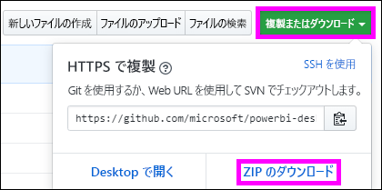

# <a name="embed-a-power-bi-report-server-report-using-an-iframe-in-sharepoint-server"></a>SharePoint Server の iFrame を使用して Power BI Report Server レポートを埋め込む

この記事では、SharePoint ページの iFrame を使用して Power BI Report Server レポートを埋め込む方法について説明します。 SharePoint Online を使用している場合は、Power BI Report Server にパブリックにアクセスできる必要があります。 SharePoint Online では、Power BI サービスで動作する Power BI Web パーツは、Power BI Report Server で動作しません。  


## <a name="prerequisites"></a>前提条件
* [Power BI Report Server](https://powerbi.microsoft.com/report-server/) をインストールし、構成しておくこと。
* [Power BI Report Server 向けに最適化された Power BI Desktop](install-powerbi-desktop.md) をインストールしておくこと。
* [SharePoint](https://docs.microsoft.com/sharepoint/install/install) 環境をインストールし、構成しておくこと。
* Internet Explorer 11 は、ドキュメント モードが IE11 (Edge) モードに設定されている場合か、SharePoint Online を使用している場合にのみサポートされます。 SharePoint オンプレミスと SharePoint Online を使用して、サポートされている他のブラウザーを使用できます。

## <a name="create-the-power-bi-report-url"></a>Power BI レポート URL の作成

1. GitHub からサンプル [Blog Demo](https://github.com/Microsoft/powerbi-desktop-samples) をダウンロードします。 **[Clone or download]\(複製またはダウンロード\)** を選択し、 **[Download ZIP]\(ZIP のダウンロード\)** を選択します。

    

2. ファイルを解凍し、Power BI Report Server 向けに最適化された Power BI Desktop でサンプルの .pbix ファイルを開きます。

    

3. レポートを **Power BI Report Server** に保存します。 

    

4. Power BI Report Server Web ポータルでレポートを表示します。

    

### <a name="capture-the-url-parameter"></a>URL パラメーターの取得

URL を用意したら、レポートをホストする iFrame を SharePoint ページ内に作成できます。 どの Power BI Report Server レポート URL の場合でも、次のクエリ文字列パラメーター `?rs:embed=true` を追加し、SharePoint iFrame にレポートを埋め込みます。

   例:
    ``` 
    https://myserver/reports/powerbi/Sales?rs:embed=true
    ```
## <a name="embed-the-report-in-a-sharepoint-iframe"></a>SharePoint iFrame にレポートを埋め込む

1. SharePoint の **[サイト コンテンツ]** ページに移動します。

    ![[サイト コンテンツ] ページ](media/quickstart-embed/quickstart_embed_05.png)

2. レポートを追加するページを選択します。

    ![[サイト コンテンツ] ページ アプリ](media/quickstart-embed/quickstart_embed_06.png)

3. 右上の歯車アイコンを選択し、 **[ページの編集]** を選択します。

    ![[ページの編集] オプション](media/quickstart-embed/quickstart_embed_07.png)

4. **[Web パーツの追加]** を選択します。

5. **[カテゴリ]** で **[メディアとコンテンツ]** を選択します。 **[パーツ]** で **[コンテンツ エディター]** を選択し、 **[追加]** を選択します。

    

6. **[ここをクリックして新しいコンテンツを追加]** を選択します。

7. 一番上のメニューから **[テキストの書式設定]** を選択し、 **[ソースの編集]** を選択します。

     

8. **[ソースの編集]** ウィンドウで、 **[HTML ソース]** に iFrame コードを貼り付け、 **[OK]** を選択します。

    

     例:
     ```html
     <iframe width="800" height="600" src="https://myserver/reports/powerbi/Sales?rs:embed=true" frameborder="0" allowFullScreen="true"></iframe>
     ```

9. 一番上のメニューで、 **[ページ]** を選択し、 **[編集の終了]** を選択します。

    

    ページにレポートが表示されます。

    

## <a name="next-steps"></a>次の手順

- [Power BI Report Server 用の Power BI レポートを作成する](quickstart-create-powerbi-report.md)。  
- [Power BI Report Server のページ分割されたレポートを作成する](quickstart-create-paginated-report.md)。  

他にわからないことがある場合は、 [Power BI コミュニティを利用してください](https://community.powerbi.com/)。 
