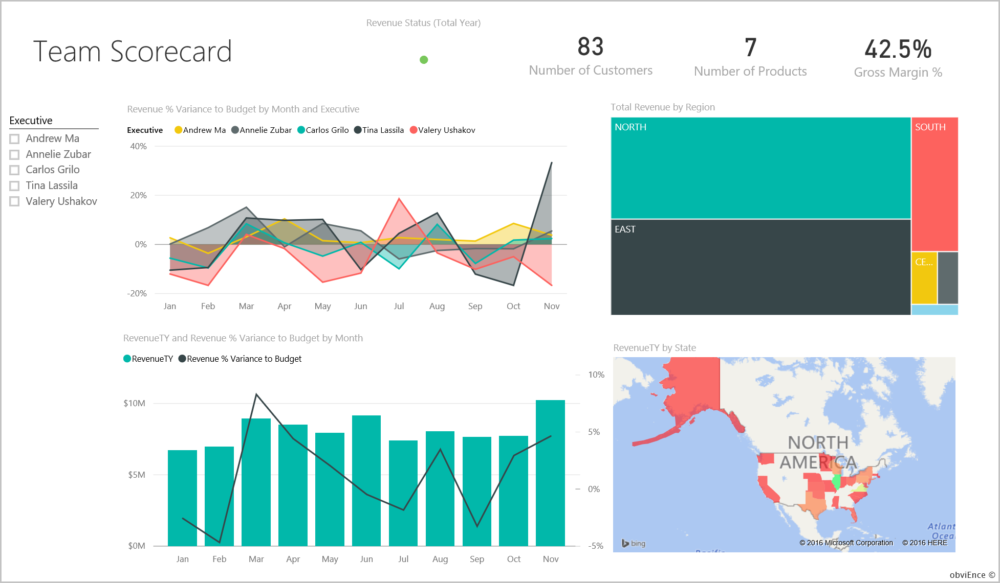
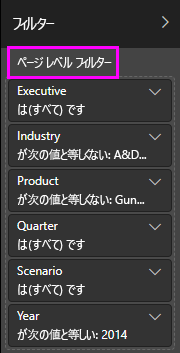

# Power BI のお客様の収益性のサンプル:ツアーを開始する

## お客様の収益性のサンプルの概要
"お客様の収益性のサンプル" コンテンツ パックには、マーケティング資料を製作する会社向けのダッシュボード、レポート、データセットが含まれています。 このダッシュボードは、5 つの事業部のマネージャー (役員)、製品、顧客、および粗利益 (GM) に関する主要なメトリックを確認するために、CFO によって作成されました。 これにより、収益性に影響する要因を一目で確認できます。

このサンプルは、ビジネス用のデータ、レポート、ダッシュボードを用いて Power BI を使う方法について説明するシリーズの一部です。 このサンプルは、obviEnce ([www.obvience.com](http://www.obvience.com/)) による匿名化された実データを使用して作成されています。 データは次の複数の形式で使用できます: コンテンツ パック/コンテンツ アプリ、Excel ブック、.pbix Power BI Desktop ファイル。 [Power BI 用のサンプル](sample-datasets.md)を参照してください。

## 前提条件
どうしたらよいでしょうか? このチュートリアルでは、Power BI サービスと "お客様の収益性のサンプル" コンテンツ パックを使用します。 レポート エクスペリエンスはよく似ているので、Power BI Desktop とサンプルの .pbix ファイルを使用して作業することもできます。 次のセクションで、コンテンツ パックと .pbix ファイルに接続する手順を示します。

### このサンプルのコンテンツ パックを入手する

1. Power BI サービス (app.powerbi.com) を開き、サインインし、サンプルを保存するワークスペースを開きます。

2. 左下隅にある **[データを取得]** を選びます。

    
3. 表示された **[データを取得]** ページで、 **[サンプル]** を選びます。

4. **[お客様の収益性のサンプル]** を選び、 **[接続]** を選びます。  

   
5. Power BI によってコンテンツ パックがインポートされ、新しいダッシュボード、レポート、およびデータセットが現在のワークスペースに追加されます。

   

### このサンプルの .pbix ファイルを取得する

または、Power BI Desktop で使用するように設計された .pbix ファイルとして、[お客様の収益性のサンプル](http://download.microsoft.com/download/6/A/9/6A93FD6E-CBA5-40BD-B42E-4DCAE8CDD059/Customer%20Profitability%20Sample%20PBIX.pbix)をダウンロードすることもできます。

### このサンプルの Excel ブックを取得する

このサンプルのデータ ソースを確認する場合は、[Excel ブック](http://go.microsoft.com/fwlink/?LinkId=529781) として入手することもできます。 ブックには、表示および変更可能な Power View シートが含まれています。 生データを表示するには、データ分析アドインを有効にし、 **[PowerPivot] > [管理]** を選択します。 Power View アドインと Power Pivot アドインの有効化の詳細については、[Excel 内での Excel のサンプルの確認](sample-datasets.md#optional-take-a-look-at-the-excel-samples-from-inside-excel-itself)に関する記事を参照してください。

## ダッシュボードからわかること

サンプルを保存したワークスペースで、お客様の収益性ダッシュボードを探して選択します。

### 会社全体のダッシュボードのタイル
1. Power BI サービスでダッシュボードを開きます。 CFO はこのダッシュボードのタイルから、自身にとって重要な、会社の高水準なメトリックに関する概要を得ることができます。 何か興味深いものがある場合は、タイルを選んで詳しいデータを確認できます。

2. 左側にあるダッシュボードのタイルを確認します。

    

- 会社の粗利益は 42.5% です。
- 顧客数は 80 です。
- 5 つの異なる製品を販売しています。
- 予算に対する収益差異 % が最低だったのは 2 月で、3 月は最高でした。
- 収益のほとんどは、東部地域と北部地域から発生しています。 粗利益が予算を超えたことはなく、ER-0 と MA-0 のビジネス ユニットではさらに調査が必要です。
- 年間の総収益はほぼ予算どおりです。

### マネージャー固有のダッシュボード タイル
ダッシュボードの右側にあるタイルには、チームのスコアカードが表示されます。 CFO はマネージャーについて把握しておく必要があり、これらのタイルでは GM% を使用して利益の概要が示されます。 いずれかのマネージャーに関して予期しない GM% の傾向が見られる場合は、さらに調査できます。

マネージャー固有のダッシュボード タイルを分析することで、以下の所見を得ることができます。

- Carlos を除いた経営陣全員が、既に売上目標を上回っています。 ただし、Carlos の売上実績はもっとも高い値です。
- Annelie の GM% は最低ですが、3 月以降、安定的に増加しているのがわかります。
- その一方で、Valery は GM% が大幅に低下しています。
- Andrew は不安定な 1 年でした。

## ダッシュボードの基になるデータの調査
このダッシュボードのタイルはレポートと Excel ブックにリンクされています。

### Excel Online のデータ ソースを開く
ダッシュボード上の **[Target vs Actual]\(目標と実績\)** と **[前年比収益成長]** の 2 つのタイルは、Excel ブックからピン留めされたものです。 このタイルのどちらかを選択すると、Power BI によってデータ ソース (この場合は Excel Online) が開きます。

1. Excel からピン留めされたこれらのタイルのいずれかを選択します。 Excel Online が Power BI サービス内で開きます。
2. ブックにはタブ 3 つ分のデータがあることに注意してください。 **[収益]** を開きます。
3. Carlos がまだ目標に達していない理由を見てみましょう。  
    a. **[役員]** スライダーから、 **[Carlos Grilo]** を選択します。   
    b. 最初のピボットテーブルからは、Carlos がもっとも高い収益を上げている [製品] である [Primus] が、昨年と比べて 152% の減益となっていることがわかります。 前年比収益差異グラフでは、ほとんどの月で予算を下回っています。  

    

    

4. 調査を続けます。 興味のあるものが見つかったら右上隅にある **[ピン留め]** ![[ピン留め] アイコン](media/sample-customer-profitability/power-bi-excel-pin.png) を選択して、[ダッシュボードにピン留め](service-dashboard-pin-tile-from-excel.md)します。

5. ダッシュボードに戻るには、ブラウザーの戻る矢印を使用します。

### 基になる Power BI レポートを開く
お客様の収益性のサンプル ダッシュボードのタイルは、その大部分が、基になっているお客様の収益性のサンプルのレポートからピン留めされたものです。

1. これらのタイルのいずれかを選択して、読み取りビューでレポートを開きます。

   タイルが Q&A で作成されている場合は、それを選択すると、Q&A ウィンドウが開きます。 **[Exit Q&A]\(Q&A の終了\)** を選択してダッシュボードに戻り、別のタイルを試します。

2. レポートには 3 つのページがあります。 レポートの下部にあるタブは、それぞれが異なるページを表しています。

    

    * **チーム スコアカード**では、5 人のマネージャーの業績とその顧客管理手法に焦点を合わせます。
    * **業界の利益分析**では、業界全体の状況と比較して収益性を分析する方法が提供されます。
    * **役員スコアカード**では、Cortana での表示用に書式設定されたマネージャーのそれぞれのビューが提供されます。

### 「チーム スコアカード」ページ

2 人のチーム メンバーを詳しく考察し、どのような洞察が得られるかを確認してみましょう。 左側の **[役員]** ボックスで Andrew の名前を選んで、Andrew のデータのみが表示されるようにレポート ページをフィルター処理します。

* クイック KPI では、Andrew の**収益の状態 (合計年)** に注目します。それは緑色であり、業績が良好であることを意味しています。
* **[Revenue % Variance to Budget by Month and Executive]\(月および役員別の予算に対する収益 % 差異\)** グラフには、2 月の落ち込みを除き、Andrew は全体として良好な結果を出していることが示されています。 Andrew の主要な地域は東部で、49 社の顧客と (7 つのうち) 5 つの製品を扱っています。 彼の GM% は、最上位でも最下位でもありません。
* **[RevenueTY and Revenue % Var to Budget by Month]\(月別の予算に対する収益年合計と収益 % 差異\)** グラフには、安定した一様の収益利益が示されています。 ところが、地域ツリーマップ内の **[Central]\(中部\)** の四角形をクリックしてフィルター処理すると、Andrew は 3 月にインディアナ州でのみ売上があることがわかります。 これは計画的なものでしょうか、それとも検討する必要があるものでしょうか。

次は Valery です。 **[役員]** ボックスで Valery の名前を選んで、Valery のデータのみを表示するようにレポート ページをフィルター処理します。 

* **[Revenue Status (Total Year)]\(収益の状態 (年合計)\)** の赤色の KPI に注意してください。 この項目は、明らかにさらなる調査が必要です。
* 彼女の収益差異は、収益マージンを満たしていないという懸念点を示しています。
* Valery の顧客はわずか 9 社で、2 製品のみを扱い、取引先はほぼ北部地域の顧客のみに限られています。 この特殊性は、彼女の変動幅が大きいことの説明になる可能性があります。
* ツリーマップ内の **[North]\(北部\)** の四角形を選ぶと、北部での Valery の粗利益が彼女の全体的な利益と一貫性があることがわかります。
* **[Total Revenue by Region]\(地域別合計収益\)** の他の四角形を選択すると、興味深いことがわかります。彼女の GM% は 23% から 79% の範囲にあるのです。 彼女の収益の数値は、北部地域を除くすべての地域で、非常に季節性があります。

なぜ Valery の領域で業績が良くないかを知るためにデータの詳しい調査を続けます。 複数の地域、他の事業部、レポートの次のページ **[Industry Margin Analysis]\(業界の利益分析\)** を調べます。

### 業界の利益分析
このレポート ページでは、データの別のスライスを提供します。 これは、セグメントごとに分割した、業界全体の粗利益を考察します。 CFO はこのページを利用して、会社と事業部のメトリックを業界のメトリックと比較し、傾向と収益性の説明に役立てます。 **[Gross Margin % by Month and Executive]\(月と役員別の粗利益\)** グラフはチーム固有であるにもかかわらず、なぜこのページ上にあるのか不思議に思われるかもしれません。 ここに表示することで、事業部のマネージャー別にページをフィルター処理することができます。  

![[Industry Margin Analysis] レポート ページ](media/sample-customer-profitability/customer6.png)

業界によって収益性はどのように異なるでしょうか。 製品と顧客は業界別にどのように分類されるでしょうか。 これらの質問に回答するには、左上から 1 つまたは複数の業界を選択します (CPG 業界から始まっています)。 フィルターを消去するには、消しゴムのアイコンを選びます。

バブル チャート ( **[Revenue Var % to Budget, GM%, and RevenueTY by Industry]\(業界別の予算、GM%、および収益年合計に対する収益差異 %\)** ) で、CFO は最も大きなバブルを探します。収益に対する影響が最も大きいためです。 業界セグメント別の各マネージャーの影響を確認しやすくするには、面グラフ内の各マネージャーの名前をクリックすることで、ページをフィルター処理します。

* Andrew が影響を与える領域は多数のさまざまな業界セグメントにまたがり、GM% (ほとんどの正の側) と Var% は大きく異なります。
* Annelie のグラフは似ていますが、少数の業界セグメントにのみ集中し、連邦政府セグメントと Gladius 製品に焦点を合わせています。
* Carlos は明らかにサービスのセグメントに重点を置き、良好な収益を得ています。 ハイテク セグメントで差異 % を大幅に向上させ、彼にとっての新しいセグメントである産業セグメントでは、予算に対して特に優れた業績を上げています。
* Tina がいくつかのセグメントを担当し、最高の GM% を実現していますが、バブルのほとんどが小さいことは、企業の最終的な収益への影響が最小限であることを示しています。
* Valery が扱っている製品は 1 つのみで、担当の業界セグメントはわずかに 5 つです。 Valery の業界への影響は季節的ですが常に大きなバブルを生み出すことは、会社の最終的な収益に大きな影響を与えていることを示します。 業界セグメントは、彼女の業績が悪いことの説明になりますか。

### 役員スコアカード
このページは Cortana 用の Cortana 回答カードとして書式が設定されています。 詳細については、[Cortana 用のカスタム回答ページの作成](service-cortana-answer-cards.md)に関する記事をご覧ください。

## Q&A で質問をすることによるデータの詳しい考察
どの業界が Valery の最大の収益を生み出すかを判別することは分析に役立つ場合があります。 Q&A を利用してみましょう

1. **[レポートの編集]** を選択して、レポートを編集ビューで開きます。 編集ビューは、自分がレポートを所有している場合にのみ使用できます。 このビューは、**作成者**モードと呼ばれることがあります。 自分がレポートを共有しているだけの場合は、編集ビューで開くことはできません。

2.  上部のメニューバーから、 **[質問する]** を選択して Q&A 質問ボックスを開きます。

    

3. 「*Valery Ushakov の業界別合計収益*」と入力します。 質問を入力するに従って視覚化が更新されることにご注意ください。

    

   ご覧のように、Valery にとって最大の売上領域は流通業界です。

### フィルターの追加による詳しい調査
流通業界を見てみましょう。  

1. **[Industry Margin Analysis]\(業界の利益分析\)** レポートのページを開きます。
2. レポート ページで視覚エフェクトが選択されていない状態で、(まだ展開されていない場合は) 右側のフィルター ウィンドウを展開します。 **フィルター** ペインには、**ページ レベル フィルター**のみが表示されます。  

   
3. **[Industry]** フィルターを選択し、矢印を選択して一覧を展開します。 流通業界のページ フィルターを追加してみましょう。 まず **[Select All]** チェックボックスをオフにして、すべての選択を解除します。 次に **[運輸/物流]** だけを選択します。  

   
4. **[月と役員別の粗利益]** グラフから、この業種の顧客を担当しているのは Valery と Tina だけであり、Valery がこの業種を担当していたのは 6 月から 11 月までの間だけであることがわかります。   
5. **[月と役員別の粗利益]** グラフの凡例で、 **[Tina]** 、 **[Valery]** の順に選びます。 **[製品別の合計売上]** グラフの Tina の部分は、Valery と比較して小さいことに注意してください。
6. 実際の収益を確認するには、Q&A を使用して、「*シナリオ別の流通に対する役員別の合計収益*」と入力します。  

     

    同様に他の業界を調査して、視覚化に顧客を追加し、Valery の業績の原因を理解することもできます。

これは、試してみるのに安全な環境です。 変更内容を保存しないようにいつでも選択できます。 ただし、それらを保存した場合は、 **[データを取得]** を選択して、常にこのサンプルの新しいコピーを取得できます。

[このサンプルのデータセット (Excel ブック) だけをダウンロード](http://go.microsoft.com/fwlink/?LinkId=529781)することもできます。

## 次の手順:データへの接続
この記事から、Power BI ダッシュボード、Q&A、レポートから顧客データへの洞察をどのように得られるかがご理解いただけたでしょうか。 次はあなたの番です。ご自分のデータに接続してみてください。 Power BI を使用すると、広範なデータ ソースに接続することができます。 詳細については、「[Power BI の概要](service-get-started.md)」をご覧ください。

[Power BI 用のサンプル](sample-datasets.md)  
