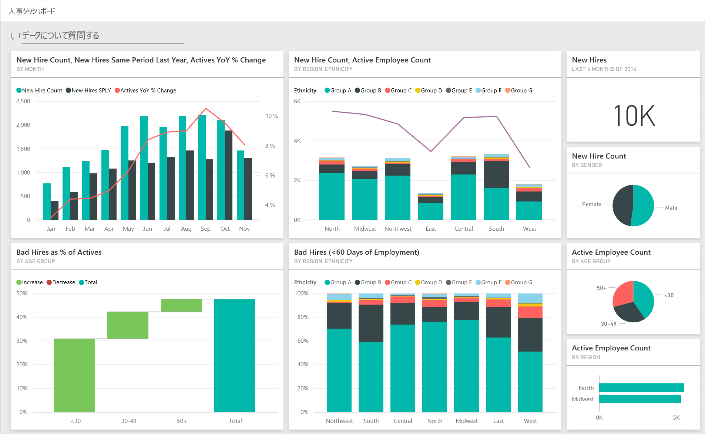
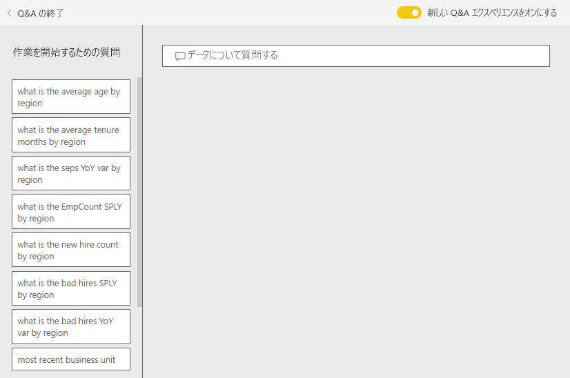
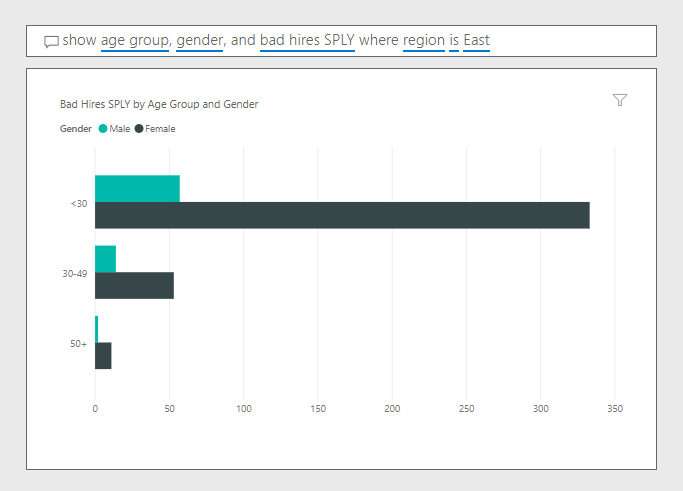

# Power BI の人事のサンプル:ツアーを開始する

人事のサンプル コンテンツ パックには、人事部向けのダッシュボード、レポート、およびデータセットが含まれています。 このサンプルでは、業界や規模が違っても、人事部が使用するレポート モデルはどの企業でも変わりがありません。 このサンプルでは、新規採用者、在職者、退職者を調査します。 採用戦略の傾向を明らかにすることを試みます。 主な目的は次を理解することです。

* 雇用した人材
* 雇用戦略のバイアス
* 自主的な退職の傾向

このサンプルは、ビジネス用のデータ、レポート、ダッシュボードを用いて Power BI を使う方法について説明するシリーズの一部です。 匿名化された実際のデータを使用し、[obviEnce](http://www.obvience.com/) によって作成されています。 データは複数の形式 (コンテンツ パック、Power BI Desktop の .pbix ファイル、Excel ブック) で使用できます。 [Power BI 用のサンプル](sample-datasets.md)を参照してください。 

このチュートリアルでは、Power BI サービス内の人事のサンプル コンテンツ パックを調べます。 Power BI Desktop とサービスのレポート エクスペリエンスは似ているので、Power BI Desktop 内のサンプルの .pbix ファイルを使用して作業することもできます。 

Power BI Desktop 内でサンプルを調べるために Power BI ライセンスは不要です。 Power BI Pro ライセンスを持っていない場合は、Power BI サービス内で、マイ ワークスペースにサンプルを保存できます。 

## サンプルを入手する

このサンプルを使用するには、事前にサンプルを[コンテンツ パック](#get-the-content-pack-for-this-sample)、[.pbix ファイル](#get-the-pbix-file-for-this-sample)、または [Excel ブック](#get-the-excel-workbook-for-this-sample)としてダウンロードしておく必要があります。

### このサンプルのコンテンツ パックを入手する

1. Power BI サービス (app.powerbi.com) を開いてサインインし、サンプルを保存するワークスペースを開きます。

   Power BI Pro ライセンスを持っていない場合は、マイ ワークスペースにサンプルを保存できます。

2. 左下隅にある **[データを取得]** を選びます。
   
   ![[データを取得] を選択](media/sample-datasets/power-bi-get-data.png)
3. 表示された **[データを取得]** ページで、 **[サンプル]** を選びます。
   
4. **[Human Resources Sample]** を選択し、 **[接続]** を選択します。  
   
   

5. Power BI によってコンテンツ パックがインポートされ、新しいダッシュボード、レポート、およびデータセットが現在のワークスペースに追加されます。
   
   
  
### このサンプルの .pbix ファイルを取得する

あるいは、Power BI Desktop で使用するために設計された [.pbix ファイル](http://download.microsoft.com/download/6/9/5/69503155-05A5-483E-829A-F7B5F3DD5D27/Human%20Resources%20Sample%20PBIX.pbix)として、人事のサンプルをダウンロードすることもできます。

### このサンプルの Excel ブックを取得する

このサンプルのデータ ソースを確認する場合は、[Excel ブック](http://go.microsoft.com/fwlink/?LinkId=529780) として入手することもできます。 ブックには、表示および変更可能な Power View シートが含まれています。 生データを表示するには、データ分析アドインを有効にし、 **[PowerPivot] > [管理]** を選択します。 Power View アドインと Power Pivot アドインの有効化の詳細については、[Excel 自体での Excel のサンプルの表示](sample-datasets.md#optional-take-a-look-at-the-excel-samples-from-inside-excel-itself)に関する記事を参照してください。

## 新規採用者
まず、新規採用者を調べてみましょう。

1. ワークスペースで、 **[ダッシュボード]** タブを選択し、 **[Human Resources Sample]** ダッシュボードを開きます。
2. ダッシュボードで、 **[New Hire Count, New Hires Same Period Last Year, Actives YoY % Change By Month]** タイルを選びます。  

   ![[New Hire Count] タイル](media/sample-human-resources/hr2.png)  

   [人事のサンプル] レポートで、 **[新規採用者]** ページが開きます。  

   ![[New Hires] ページ](media/sample-human-resources/hr3.png)

3. 以下の関心のある項目を見ていきます。

    * **[New Hire Count, New Hires SPLY and Actives YoY % Change by Month]** 複合グラフには、昨年に比べて毎月新規採用者数が増加したことが示されています。 いくつかの月では著しく増加しています。
    * 複合グラフ **[地域および民族性別の新規採用者数と在職者数]** には、 **[東]** 地域で新規採用者数が減少していることが示されています。
    * **[年齢グループ別の新規採用者の前年比]** ウォーターフォール グラフには、主に若い人を採用していることが示されています。 この傾向は、仕事が主にパートタイム的な性質のものであることに主に起因する可能性があります。
    * **[New Hire Count by Gender]** 円グラフには、ほぼ均等な分割が示されています。

    より多くの分析情報が得られるでしょうか。 たとえば、性別の分割が均等でないリージョンなどです。 

4. グラフ内のさまざまな年齢グループと性別を選んで、年齢、性別、地域、民族性グループ間の関連性を探ります。

5. 上部のナビゲーション バーで **[Human Resource Sample]** を選んでダッシュボードに戻ります。

   

## 現在の在職者と退職者を比較する
現在の在職者と既に退職した従業員のデータについて調べましょう。

1. ダッシュボードで、 **[年齢別の在職者数]** タイルを選びます。

   ![[Active Employee Count by Age Group] タイル](media/sample-human-resources/pbi_hr_sample_activepie.png)

   [人事のサンプル] レポートで、 **[Active Employees vs.Separations]** (在職者対離職者) ページが開きます。  

   ![[Active Employees vs.Separations] ページ](media/sample-human-resources/hr5.png)

 2. 以下の関心のある項目を見ていきます。

    * 左側の 2 つの複合グラフには、在職者と離職者の前年比変化が示されます。 急速な採用のために今年はより多くの従業員が在籍していますが、離職者も昨年より多くなっています。
    * 8 月は、他の月と比較してより多くの離職者がいました。 異なる年齢グループ、性別、地域を選んで、他にも異常値があるかどうかを調べます。
    * 円グラフを見ると、性別と年齢グループ別の在職者でも均等な分割があることがわかります。 異なる年齢グループを選んで、年齢別の性別分割を表示します。 性別による均等な分割があらゆる年齢グループで見られますか。

## 離職の理由
編集ビューでレポートを見てみましょう。 在職者のデータの代わりに離職者のデータを表示するように円グラフを変更できます。

1. 左上隅の **[レポートの編集]** を選びます。

2. **[年齢別の在職者数]** 円グラフを選びます。

3. **[フィールド]** で、 **[Employees]** を選択して **[Employees]** テーブルを展開します。 **[Active Employee Count]** をオフにして、そのフィールドを削除します。

4. **[Employees]** テーブルで **[Separation Count]** を選択して、 **[フィールド]** 領域の **[値]** ボックスに追加します。

5. レポート キャンバスで、 **[Separation Count by Separation Reason]** 横棒グラフの **[Voluntary]** バーを選びます。 

   このバーにより、レポートの他のビジュアルで自主的に離職した従業員が強調表示されます。

6. **[Separation Count by Age Group]** 円グラフの 50+ スライスを選択します。

7. 右下隅にある折れ線グラフをご覧ください。 このグラフはフィルター処理され、自主的な離職が表示されます。  

   

   50 歳以上の年齢グループの傾向に注目します。 年の後半には、50 歳以上の従業員で自主的に離職した人が増えています。 この傾向は、より多くのデータを使用して、さらに調査すべき領域です。

8. **[Active Employee Count by Gender]** 円グラフについても同じ手順に従い、在職者ではなく離職者に変更できます。 性別ごとに自主的な退職のデータを見て、他の洞察が得られるかどうかご確認ください。

9. 上部のナビゲーション バーで **[Human Resource Sample]** を選んでダッシュボードに戻ります。 レポートに行った変更は保存することもできます。

## 不適切な人材採用
調査する最後の領域は、不適切な人材採用です。 不適切な人材採用は、雇用期間が 60 日以下の従業員として定義されます。 急速な採用を実施していますが、適切な候補を採用しているでしょうか。

1. **[年齢グループ別の在職者の不適切な人材採用 %]** ダッシュボード タイルを選びます。 レポートで、3 番目のタブ **[Bad Hires]** が開きます。

   ![[Bad Hires as % of Actives by Age Group] タイル](media/sample-human-resources/hr7.png)  
2. 左側にある **[Region]** スライサーの **[Northwest]** を選択し、 **[Bad Hire Count by Gender]** ドーナツ グラフの **[Male]** を選択します。 **[Bad Hires]** ページのその他のグラフを確認します。 不適切な人材採用は女性より男性の方が多く、グループ A の不適切な人材採用が多いことがわかります。

     

3. **[Bad Hire Count by Gender]** ドーナツ グラフを表示して、 **[Region]** スライサーで異なるリージョンを選択すると、不適切な人材採用が男性よりも女性の方が多いのは東部リージョンのみであることがわかります。  

4. 上部のナビゲーション バーからダッシュボードの名前を選択して、ダッシュボードに戻ります。

## ダッシュボードの Q&A ボックスで質問する
ダッシュボードの [Q&A の質問ボックス](power-bi-tutorial-q-and-a.md)では、自然言語を使用してデータに関する質問ができます。 Q&A は、入力した用語を認識して、回答を探す場所 (データセット) を見つけ出します。

1. Q&A の質問ボックスを選択します。 入力を開始する前でも、Q&A で質問を作るときに役立つ情報が表示されることがわかります。

   

2. これらの候補から 1 つ選ぶか、「*show age group, gender, and bad hires SPLY where region is east*」と入力します。  

   

   女性の不適切な人材採用のほとんどは 30 歳未満であることにご注意ください。

## 次の手順:データへの接続
変更内容を保存しないことを選択できるため、この環境で試してみるのは安全です。 一方、それらを保存した場合は、 **[データを取得]** を選択して、常にこのサンプルの新しいコピーを取得できます。

この記事から、Power BI ダッシュボード、Q&A、レポートからサンプル データの分析情報をどのように得られるかがご理解いただけたでしょうか。 次はあなたの番です。ご自分のデータに接続してみてください。 Power BI を使用すると、広範なデータ ソースに接続することができます。 詳細については、[Power BI サービスの概要](service-get-started.md)に関するページを参照してください。
