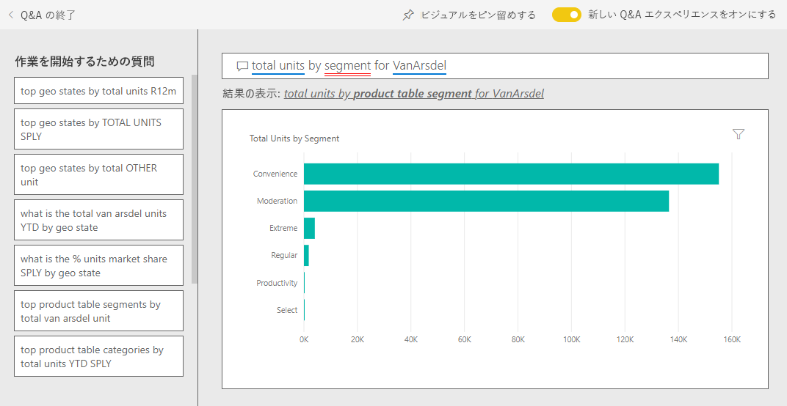

# Power BI の売上およびマーケティングのサンプル:ツアーを開始する

売上およびマーケティングのサンプルには、VanArsdel Ltd という名前の架空の製造会社のダッシュボードとレポートが含まれています。業界の動向、マーケットに占める会社のシェア、製品の数量や売上、センチメントを監視する目的で、VanArsdel 社の最高マーケティング責任者 (CMO) がこのダッシュボードを作成しました。

VanArsdel 社には多くの競合他社が存在しますが、その業界における市場リーダーです。 CMO は市場シェアの拡大と成長の機会を狙っています。 しかしながら、何らかの理由で、VanArsdel 社の市場シェアが縮小し始め、6 月には急激な落ち込みを見せました。

このサンプルは、ビジネス用のデータ、レポート、ダッシュボードを用いて Power BI を使う方法について説明するシリーズの一部です。 匿名化された実際のデータを使用し、[obviEnce](http://www.obvience.com/) によって作成されています。 データは複数の形式 (コンテンツ パック、Power BI Desktop の .pbix ファイル、Excel ブック) で使用できます。 [Power BI 用のサンプル](sample-datasets.md)を参照してください。 

このチュートリアルでは、Power BI サービス内の売上およびマーケティングのサンプル コンテンツ パックを調べます。 Power BI Desktop とサービスのレポート エクスペリエンスは似ているので、Power BI Desktop 内のサンプルの .pbix ファイルを使用して作業することもできます。 

Power BI Desktop 内でサンプルを調べるために Power BI ライセンスは不要です。 Power BI Pro ライセンスを持っていない場合は、Power BI サービス内で、マイ ワークスペースにサンプルを保存できます。 

## サンプルを入手する

このサンプルを使用するには、事前にサンプルを[コンテンツ パック](#get-the-content-pack-for-this-sample)、[.pbix ファイル](#get-the-pbix-file-for-this-sample)、または [Excel ブック](#get-the-excel-workbook-for-this-sample)としてダウンロードしておく必要があります。

### このサンプルのコンテンツ パックを入手する

1. Power BI サービス (app.powerbi.com) を開いてサインインし、サンプルを保存するワークスペースを開きます。

   Power BI Pro ライセンスを持っていない場合は、マイ ワークスペースにサンプルを保存できます。

2. 左下隅にある **[データを取得]** を選びます。
   
   ![[データを取得] を選択](media/sample-datasets/power-bi-get-data.png)
3. 表示された **[データを取得]** ページで、 **[サンプル]** を選びます。
   
4. **[売上およびマーケティングのサンプル]** を選択し、 **[接続]** を選択します。   
  
   
   
5. Power BI によってコンテンツ パックがインポートされ、新しいダッシュボード、レポート、およびデータセットが現在のワークスペースに追加されます。
   
   
  
### このサンプルの .pbix ファイルを取得する

あるいは、Power BI Desktop で使用するために設計された [.pbix ファイル](http://download.microsoft.com/download/9/7/6/9767913A-29DB-40CF-8944-9AC2BC940C53/Sales%20and%20Marketing%20Sample%20PBIX.pbix)とし、売上およびマーケティングのサンプルをダウンロードすることもできます。

### このサンプルの Excel ブックを取得する

このサンプルのデータ ソースを確認する場合は、[Excel ブック](http://go.microsoft.com/fwlink/?LinkId=529785) として入手することもできます。 ブックには、表示および変更可能な Power View シートが含まれています。 生データを表示するには、データ分析アドインを有効にし、 **[PowerPivot] > [管理]** を選択します。 Power View アドインと Power Pivot アドインの有効化の詳細については、[Excel 自体での Excel のサンプルの表示](sample-datasets.md#optional-take-a-look-at-the-excel-samples-from-inside-excel-itself)に関する記事を参照してください。

## ダッシュボードからわかること
ダッシュボードのツアーを開始し、CMO がピン留めしたタイルを確認してみましょう。 市場シェア、売上、センチメントに関する情報が表示されます。 データは地域、時刻、競合会社別に分類されています。

* 左側に縦に並んでいる数値タイルは、過去 1 年間の業界販売高 (50,000)、市場シェア (32.86%)、販売高 (16,000)、センチメント スコア (68)、センチメント ギャップ (4)、販売個数合計 (100 万) を示しています。
* 一番上の折れ線グラフ ( **[% Units Market Share vs. % Units Market Share Rolling 12 Months]\(個数市場シェア % と 12 か月連続の個数市場シェア %\)** ) は、ある期間にわたる市場シェアの変動を示しています。 6 月の大きな落ち込みに注目してください。 しばらく上昇を見せていた R12M (連続する 12 か月間) のシェアが失速し始めています。
* 中央の縦棒グラフ タイル (**年度累計ユニット数差異 %** ) からわかるように、最大の競合他社は Aliqui 社です。
* ビジネスのほとんどが東部および中部地域に集中しています。
* 下部にある折れ線グラフ (**2014 年の合計ユニット数**) は、6 月の急落が季節によるものでないことを示しています。同時期に同様の落ち込みを見せている競合他社はありません。
* 右側にある **[Total Units Overall]\(全体個数合計\)** タイルと **[Total Units YTD]\(年度累計個数\)** タイルは、セグメント別および地域/製造元別に販売された個数を示します。 この業界の最大の市場セグメントは、 **[Productivity]\(生産性\)** と **[Convenience]\(利便性\)** です。

## Q&A を使用した詳しい調査

Q&A を使用し、データの追加詳細を確認できます。

### 売上に影響するセグメントは? 業界の傾向に一致しているか?
1. **[Total Units Overall by Segment]\(セグメント別の全体個数合計\)** タイルを選択します。Q&A が開き、"*セグメント別の合計個数*" というクエリが入力されます。
2. 既存のクエリの終わりに、"*for VanArsdel*" を追加します。 Q&A が質問を解釈し、更新されたグラフと回答を表示します。 製品数量の多くが **[Convenience]\(利便性\)** セグメントと **[Moderation]\(モデレーション\)** セグメントからであることにご留意ください。

   
3. **[Moderation]\(モデレーション\)** カテゴリと **[Convenience]\(利便性\)** カテゴリにおけるシェアが高く、これらのセグメントで会社は競争しています。
4. 上部のナビゲーション バーにある **[売上およびマーケティングのサンプル]** を選択し、ダッシュボードに戻ります。

### 各カテゴリ (対地域) における個数合計の市場シェアの動向は?
1. **[Total Units YTD by Manufacturer, Region]\(製造元、地域別の年度累計個数\)** タイルにご留意ください。 カテゴリ別合計個数の市場シェアは?

   ![[製造元、地域別の年度累計個数] タイル](media/sample-sales-and-marketing/sales3.png)
2. ダッシュボードの上部にある [質問] ボックスを選択し、「*total units by manufacturer and category for 2014 as a treemap*」 (2014 年のメーカー別およびカテゴリ別合計個数をツリーマップとして表示) という質問を入力します。 質問を入力するに従って視覚化が更新されることにご注意ください。

   
3. 結果を比較するには、ダッシュボードにグラフをピン留めします。 次の興味深い事実にご留意ください。2014 年、VanArsdel は **[アーバン]** というカテゴリの製品のみを販売しました。
4. ダッシュボードに戻ります。

## [売上およびマーケティングのサンプル] レポート

ダッシュボードはレポートのエントリ ポイントの 1 つです。 基となるレポートからタイルが作成された場合、そのタイルを選択すると、レポートが開きます。

ダッシュボードにある **[% Units Market Share vs. % Units Market Share Rolling 12 Months]\(個数市場シェア % と 12 か月連続の個数市場シェア %\)** グラフの **[% Units Market Share R12M]\(12 か月連続の個数市場シェア %\)** ラインは、一定期間にわたり、会社の市場シェアが増えなくなっていることを示しています。 下降さえわずかに見られます。 さらに、6 月にはなぜ市場シェアが急落を見せたのでしょうか? 

売上およびマーケティングのサンプルのレポートには、4 つのページがあります。
 
### [VanArsdel - 市場シェア] ページ
レポートの 1 ページ目では、VanArsdel 社の市場シェアが取り上げられています。

1. ダッシュボードで **[% Units Market Share vs. % Units Market Share Rolling 12 Months]\(個数市場シェア % と 12 か月連続の個数市場シェア %\)** グラフを選択し、売上およびマーケティングのサンプル レポートの **[VanArsdel - 市場シェア]** ページを開きます。

   ![[VanArsdel - 市場シェア] ページ](media/sample-sales-and-marketing/sales5.png)

2. レポートの下部にある縦棒グラフ **[Total Units by Month and isVanArsdel]\(VanArsdel 社の月次個数合計\)** をご覧ください。 黒の列は VanArsdel 社 (弊社製品) を表しており、緑の列は競合他社を表しています。 VanArsdel 社で 2014 年 6 月に発生した急落は、競合他社では起きていません。

3. 右にある横棒グラフ **[Total Category Volume by Segment]\(セグメント別カテゴリ数量合計\)** はフィルター処理され、VanArsdel 社の上位 2 セグメントが表示されています。 このフィルターの作成方法を確認しましょう。  

   a. **[Total Category Volume by Segment]\(セグメント別のカテゴリ数量合計\)** グラフを選択します。

   b. 右にある **[フィルター]** ペインを選択し、展開します。  

   c. **[ビジュアル レベル フィルター]** の下で、 **[セグメント]** がフィルター処理され、 **[Convenience]\(利便性\)** セグメントと **[Moderation]\(モデレーション\)** セグメントのみが含まれていることにご留意ください。  

   d. フィルターを変更するには、 **[セグメント]** を選択して展開し、 **[Productivity]\(生産性\)** をオンにしてそのセグメントを追加します。  

4. **[Total Units by Month and isVanArsdel]\(VanArsdel 社の月次個数合計\)** グラフの凡例で **[はい]** を選択し、VanArsdel でページにクロスフィルターを適用します。 **[Total Category Volume by Segment]\(セグメント別のカテゴリ数量合計\)** グラフで、 **[Productivity]\(生産性\)** セグメントには競争相手がいないことにご注目ください。

5. 凡例で **[はい]** をもう一度選択すると、フィルターが解除されます。

6. 折れ線グラフの **[% Units Market Share and % Units Market Share R12M by Month]\(個数市場シェア % と 12 か月連続の月別個数市場シェア %\)** をご覧ください。 毎月の市場シェアと 12 か月連続の市場シェアが表示されます。 連続する月データは、毎月の変動を平滑化したもので、長期的な傾向を示します。 **[Total Category Volume by Segment]\(セグメント別のカテゴリ数量合計\)** グラフで、 **[Convenience]\(利便性\)** と **[Moderation]\(モデレーション\)** を選択し、市場シェアにおけるセグメント別の変動を確認します。 **[Moderation]\(モデレーション\)** セグメントは市場シェアの変動が大きくなっています。

引き続き、6 月に市場シェアが急落した理由を解明していきます。 次に、レポートの **[感情分析]** ページを確認しましょう。

### [感情分析] ページ
レポートの 3 ページ目では、消費者の感情に注目しています。

![[感情分析] ページ](media/sample-sales-and-marketing/sales6.png)

ページの左側にある 2 つの折れ線グラフが消費者の感情ですが、その一因となっているのがツイート、Facebook、ブログ、記事です。 左上隅にある **[VanArsdel - Sentiment by Month]\(VanArsdel - 月別のセンチメント\)** グラフからは、2 月までは会社製品に対するセンチメントはほぼ中立であったことがわかります。 その後、2 月に急落が始まり、6 月に底を打ちました。 センチメントがこのように悪化した原因は何でしょうか? 

外部ソースを見てみましょう。 2 月に、いくつかの記事とブログ投稿が VanArsdel のカスタマー サービスが業界で最悪であると評価しました。 この悪評が顧客のセンチメントや販売に直接影響したのです。 VanArsdel 社がカスタマー サービスを向上させる努力を重ねた結果、顧客と業界がそのことに気づきました。 7 月にはポジティブなセンチメントが上昇し始め、60 台というこれまでにない高い値を保てるようになりました。 センチメントがこのように上昇したことは、レポートの 1 ページ目と 2 ページ目にある **[Total Units by Month]\(月別の合計個数\)** グラフに反映されました。 おそらくこのことが、6 月に市場シェアが低下した原因の一部です。

センチメントのギャップは、調査すべきもう 1 つの領域かもしれません。 センチメントのギャップが最も大きいのはどの地区か? 経営者はそれをどのように利用できるか? 他の地区で再現する方法は?

### [年度累計のカテゴリ傾向分析] ページ
レポートの 2 ページ目では、年度累計のカテゴリ傾向を取り上げています。

![[年度累計のカテゴリ傾向分析] ページ](media/sample-sales-and-marketing/reportpage2.png)

次の詳細にご注意ください。
* VanArsdel 社はこのカテゴリで最大規模を誇る企業であり、その最大の競争相手は Natura、Aliqui、Pirium です。 この 3 社の動向を監視しておく必要があります。
* Aliqui 社は成長を見せていますが、製品数量を VanArsdel 社と比較すると、依然低いことがわかります。
* ツリーマップでは VanArsdel 社は緑色で表示されています。 東部地域では、お客様は競合他社を支持していますが、中央地域では弊社は好調です。 東部地域でシェアが最低になっています。
* 地理的要素が販売個数に影響しています。 東部地域はほとんどのメーカーにとって優勢な地域であり、VanArsdel 社は中部地域でも強力な存在感を示しています。
* 右下にある **[Total Units YTD Var % by Month and Manufacturer]\(月別および製造元別の年度累計個数の変化\)** でプラスの変動が見られることにご注目ください。これは良い兆候です。 昨年度より好調ですが、それは競合他社の Aliqui も同じです。

### [成長の機会] ページ
レポートの 4 ページ目では、競合製品分析を取り上げています。

![[成長の機会] ページ](media/sample-sales-and-marketing/sales8.png)

次の詳細にご注意ください。
* 左下の **[Total Units by Segment]\(セグメント別の合計個数\)** グラフには、VanArsdel 社が最も強いセグメント 2 つを除くすべてのカテゴリ セグメントが表示されています。 各セグメントを順番に選択し、VanArsdel がさらに進出できる可能性がある領域を特定します。 
* **[Extreme]\\(エクストリーム\)** セグメントと **[Productivity]\(生産性\)** セグメントが他のセグメントよりも急速に成長していることにご注目ください。 しかしながら、これらのセグメントでは VanArsdel 社は劣勢です。これらのセグメントを強化する場合、データから、どの地域でどのセグメントが強いのかを確認できます。 さらに、どの地域でより成長を見せているのか、そのセグメントにおける最大の競合他社はどこなのか、といった疑問についても深く調べることができます。
* 6 月の市場シェア低下についてはどうでしょう? 6 月は **[Productivity]\(生産性\)** セグメントにとって重要な月ですが、弊社は劣勢です。 この詳細を見ることで、6 月の市場シェア低下が説明できるかもしれません。

視覚化を VanArsdel 社、セグメント別、月別、地域別でフィルター処理すると、VanArsdel 社の成長機会を見い出すことができます。

## 次の手順:データへの接続
変更内容を保存しないことを選択できるため、この環境で試してみるのは安全です。 一方、それらを保存した場合は、 **[データを取得]** を選択して、常にこのサンプルの新しいコピーを取得できます。

この記事から、Power BI ダッシュボード、Q&A、レポートから人事データへの洞察をどのように得られるかがご理解いただけたでしょうか。 次はあなたの番です。ご自分のデータに接続してみてください。 Power BI を使用すると、広範なデータ ソースに接続することができます。 詳細については、[Power BI サービスの概要](service-get-started.md)に関するページを参照してください。
