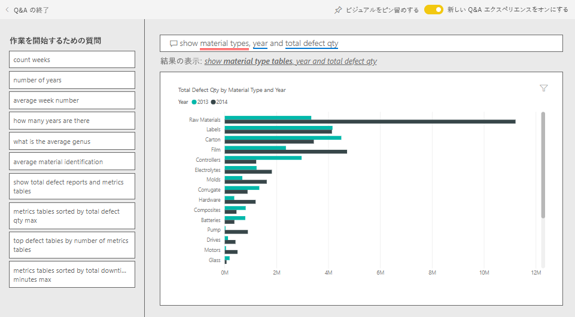
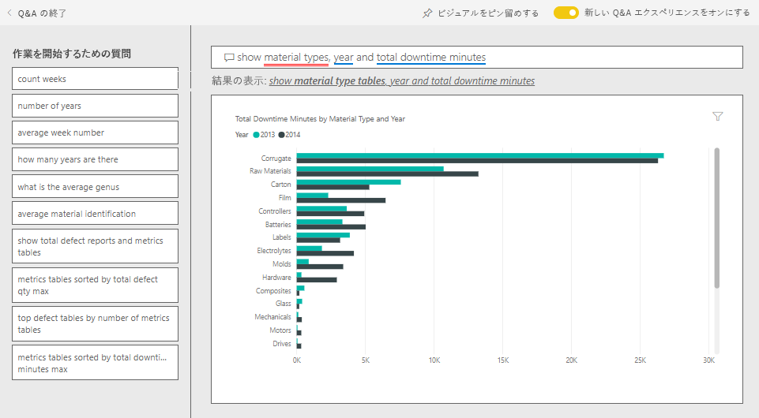

# Power BI のサプライヤー クオリティ分析のサンプル:ツアーを開始する

この業界サンプル ダッシュボードおよび基になるレポートは、典型的なサプライ チェーンの課題の 1 つである、サプライヤー クオリティ分析に焦点を合わせています。 この分析では、欠陥の総数と、欠陥が引き起こす総ダウンタイムという 2 つの主要な指標を確認できます。 

このサンプルには、2 つの主要な目的が組み込まれています。

* 最も優れたサプライヤーおよび最も改善が必要なサプライヤーをクオリティの面から示すという目的です。
* どのプラントがより的確に問題を検出して受領を拒否し、ダウンタイムを最小化しているかを特定します。

このサンプルは、ビジネス用のデータ、レポート、ダッシュボードを用いて Power BI を使う方法について説明するシリーズの一部です。 匿名化された実際のデータを使用し、[obviEnce](http://www.obvience.com/) によって作成されています。 データは複数の形式 (コンテンツ パック、Power BI Desktop の .pbix ファイル、Excel ブック) で使用できます。 [Power BI 用のサンプル](sample-datasets.md)を参照してください。 

このチュートリアルでは、Power BI サービス内のサプライヤー クオリティ分析のサンプル コンテンツ パックを調べます。 Power BI Desktop とサービスのレポート エクスペリエンスは似ているので、Power BI Desktop 内のサンプルの .pbix ファイルを使用して作業することもできます。 

Power BI Desktop 内でサンプルを調べるために Power BI ライセンスは不要です。 Power BI Pro ライセンスを持っていない場合は、Power BI サービス内で、マイ ワークスペースにサンプルを保存できます。 

## サンプルを入手する

このサンプルを使用するには、事前にサンプルを[コンテンツ パック](#get-the-content-pack-for-this-sample)、[.pbix ファイル](#get-the-pbix-file-for-this-sample)、または [Excel ブック](#get-the-excel-workbook-for-this-sample)としてダウンロードしておく必要があります。

### このサンプルのコンテンツ パックを入手する

1. Power BI サービス (app.powerbi.com) を開いてサインインし、サンプルを保存するワークスペースを開きます。

   Power BI Pro ライセンスを持っていない場合は、マイ ワークスペースにサンプルを保存できます。

2. 左下隅にある **[データを取得]** を選びます。
   
   ![[データを取得] を選択](media/sample-datasets/power-bi-get-data.png)
3. 表示された **[データを取得]** ページで、 **[サンプル]** を選びます。
   
4. **[サプライヤー クオリティ分析サンプル]** を選び、 **[接続]** を選びます。  
   
   

5. Power BI によってコンテンツ パックがインポートされ、新しいダッシュボード、レポート、およびデータセットが現在のワークスペースに追加されます。
   
   
  
### このサンプルの .pbix ファイルを取得する

あるいは、Power BI Desktop で使用するために設計された [.pbix ファイル](https://download.microsoft.com/download/8/C/6/8C661638-C102-4C04-992E-9EA56A5D319B/Supplier-Quality-Analysis-Sample-PBIX.pbix)として、サプライヤー クオリティ分析のサンプルをダウンロードすることもできます。

### このサンプルの Excel ブックを取得する

このサンプルのデータ ソースを確認する場合は、[Excel ブック](https://go.microsoft.com/fwlink/?LinkId=529779) として入手することもできます。 ブックには、表示および変更可能な Power View シートが含まれています。 生データを表示するには、データ分析アドインを有効にし、 **[PowerPivot] > [管理]** を選択します。 Power View アドインと Power Pivot アドインの有効化の詳細については、[Excel 自体での Excel のサンプルの表示](sample-datasets.md#optional-take-a-look-at-the-excel-samples-from-inside-excel-itself)に関する記事を参照してください。

## 欠陥のある素材によって発生するダウンタイム
欠陥のある素材に伴うダウンタイムを分析し、責任のあるベンダーを確認してみましょう。  

1. ダッシュボードで **[Total Defect Quantity]\(欠陥数量合計\)** タイルまたは **[Total Downtime Minutes]\(ダウンタイム合計 (分)\)** タイルを選びます。

     

   [サプライヤー クオリティ分析サンプル] レポートの **[Downtime Analysis]\(ダウンタイムの分析\)** ページが表示されます。

   欠陥品が 3,300 万個あり、ダウンタイムの合計が 77,000 分であることにご注目ください。 一部の素材では欠陥品が少ないですが、遅延を招き、それがダウンタイムを増やしています。 レポート ページで詳しく見てみましょう。  
2. **[Defects and Downtime (min) by Material Type]\(素材の種類別欠陥とダウンタイム (分)\)** 複合グラフの **[Total Downtime Minutes]\(ダウンタイム合計 (分)\)** の線を見ると、波形素材が最大のダウンタイムを発生させていることがわかります。  
3. **[Corrugate]\(波形素材\)** の縦棒を選ぶと、この欠陥の影響を最も強く受けているプラントと責任のあるベンダーを確認できます。  

   ![[波形素材] 列を選択する](media/sample-supplier-quality/supplier3.png)  
4. 反対に **[Downtime (min) by Plant]\(プラント別のダウンタイム (分)\)** マップでプラントを個別に選ぶと、そのプラントにおけるダウンタイムに責任のあるベンダーまたは素材を確認できます。

### 最も改善が必要なサプライヤー
 最も改善が必要なサプライヤーを 8 社特定し、各社が発生させているダウンタイムの割合を確認します。 そのために、 **[Downtime (min) by Vendor]\(ベンダー別ダウンタイム (分)\)** 面グラフをツリーマップに変更します。  

1. レポートの **[Downtime Analysis]\(ダウンタイムの分析\)** ページで、左上隅にある **[レポートの編集]** を選びます。  
2. **[Downtime (min) by Vendor]\(ベンダー別ダウンタイム (分)\)** 面グラフを選び、 **[視覚化]** ウィンドウで **[ツリーマップ]** アイコンを選びます。  

   ![[ツリーマップ] アイコンを選択する](media/sample-supplier-quality/supplier4.png)  

    ツリーマップでは、 **[ベンダー]** フィールドが **[グループ]** として自動的に設定されます。  

    ![[ベンダー別ダウンタイム (分)] ツリーマップ](media/sample-supplier-quality/supplier5.png)  

   このツリーマップでは、最上位の 8 つのベンダーが、ツリーマップの左側にある 8 つのブロックで表されています。 また、これらの 8 社がダウンタイム (分) 全体の約 50% を占めていることがわかります。  
3. 上部のナビ ペインで **[サプライヤー クオリティ分析サンプル]** を選んでダッシュボードに戻ります。

### プラントの比較
次に、欠陥のある素材の管理体制に優れ、結果的にダウンタイムを削減できたプラントを確認してみましょう。  

1. ダッシュボードで **[Total Defect Reports by Plant, Defect Type]\(プラント別および欠陥種類別の合計欠陥数レポート\)** マップ タイルを選びます。      

   ![[プラント別および欠陥種類別の合計欠陥数レポート] タイル](media/sample-supplier-quality/supplier6.png)  

   **[サプライヤー クオリティ分析]** ページにレポートが表示されます。  

2. **[プラント別および欠陥種類別の合計欠陥数レポート]** の凡例で **[影響]** と書いてある円を選択します。  

    ![[影響] を選択する](media/sample-supplier-quality/supplier7.png)  

    バブル チャートで **[ロジスティクス]** が最も厄介なカテゴリとなっていることにご注目ください。 欠陥数量の合計、欠陥の報告数、ダウンタイム分数が最大となっています。 このカテゴリをさらに詳しく見てみましょう。  
3. バブル チャートで **[ロジスティクス]** バブルを選択し、イリノイ州の Springfield と Naperville のプラントを観察します。 Naperville は受領拒否の件数が多く、Springfield (影響の件数が多い) と比べて影響の件数も少ないことから、欠陥品の管理に大変優れていることが伺えます。  

   ![[ロジスティクス] を選択する](media/sample-supplier-quality/supplier8.png)  
4. 上部のナビ ペインで **[サプライヤー クオリティ分析サンプル]** を選んでダッシュボードに戻ります。

## 最も管理の行き届いている素材の種類
最も管理が行き届いている素材の種類は、欠陥数量に関係なく、ダウンタイムが最短であるか、ダウンタイムにまったく影響のない種類です。

1. ダッシュボードで **[Total Defect Quantity by Material Type, Defect Type]** (素材種類別、欠陥種類別の欠陥数量合計) タイルを確認してみてください。

   ![[素材種類別、欠陥種類別の欠陥数量合計] タイル](media/sample-supplier-quality/supplier9.png)

   材料の種類のうち、 **[原材料]** で合計欠陥数が多くなっていますが、そのような欠陥品のほとんどは拒否されているか、影響を出していません。

   この種類の材料は、欠陥数量が多くても、大きなダウンタイムを引き起こさないことを確認してみましょう。

2. ダッシュボードで **[Total Defect Qty, Total Downtime Minutes by Material Type]** (素材種類別欠陥数量合計、ダウンタイム合計 (分)) タイルを確認してみてください。

   ![[素材種類別欠陥数量合計、ダウンタイム合計 (分)] タイル](media/sample-supplier-quality/supplier10.png)

   原材料の管理は十分に管理されているように見えます。欠陥数は多いですが、ダウンタイムの合計時間 (分) は短いです。

### 欠陥とダウンタイムの年別比較
1. **[Total Defect Reports by Plant, Defect Type]** (プラント別および欠陥種類別の合計欠陥数レポート) マップ タイルを選ぶと、 **[サプライヤー クオリティ分析]** ページでレポートが開きます。
2. **[月別および年別の欠陥数合計]** グラフで、欠陥数量については、2013 年より 2014 年の方が多いことにご注目ください。  

    ![[月別および年別の欠陥数合計] グラフ](media/sample-supplier-quality/supplier11.png)  
3. 欠陥が増えるとダウンタイムも増えるのでしょうか? 質問を [Q&A] ボックスに入力し、答えを見つけてください。  
4. 上部のナビ ペインで **[サプライヤー クオリティ分析サンプル]** を選んでダッシュボードに戻ります。  
5. [Raw Materials]\(原材料\) の欠陥数が最も多いため、質問ボックスに「*show material types, year and total defect qty*」 (素材の種類、年、欠陥数量合計を表示) と入力します。  

    原材料欠陥数は 2013 年より 2014 年の方が増えています。  

      
6. 次に、質問を「_show material types, year, and total **downtime minutes**_ 」 (素材の種類、年、ダウンタイム合計 (分) を表示) に変更します。  

   

   原材料の欠陥は 2014 年の方が多いですが、原材料のダウンタイムが 2013 年と 2014 年でだいたい同じであったことにご注目ください。 2014 年に原材料の欠陥が多かったことは、2014 年の原材料のダウンタイムをそれだけ増やしたことにはつながっていないようです。

### 欠陥とダウンタイムの月別比較
欠陥数量合計に関連するダッシュボード タイルをもう 1 つ見てみましょう。  

1. 左上隅の **[Exit Q&A]\(Q&A を終了する\)** を選択し、ダッシュボードに戻ります。  

    **[Total Defect Quantity by Month, Year]\(月別、年別欠陥数量合計\)** タイルをよく見てください。 2014 年前半の欠陥数が 2013 年と同等であるのに対し、2014 年後半には欠陥数が大幅に増加していることがわかります。  

    ![[月別、年別欠陥数量合計] タイル](media/sample-supplier-quality/supplier14.png)  

    欠陥数量のこの増加が起因して、ダウンタイム (分) も同様に増加しているかどうかを確認してみましょう。  
2. 質問ボックスに「*total downtime minutes by month and year as a line chart*」 (月別および年別ダウンタイム合計 (分) を折れ線グラフで表示) と入力します。  

   ![Q&A 質問:[月別および年別の合計ダウンタイム (分)] 折れ線グラフ](media/sample-supplier-quality/supplier15.png)

   6 月と 10 月でダウンタイムに飛躍がある以外、欠陥数は大きなダウンタイムにつながっていません。 この結果は、欠陥の管理が行き届いていることを示します。  
3. このグラフをダッシュボードにピン留めするには、質問ボックスの上にあるピン留めアイコン  を選択します。  
4. 外れ値のある月について調査するため、「*total downtime minutes in October by plant*」 (10 月のプラント別ダウンタイム合計 (分)) などの質問を入力して、10 月のダウンタイム (分) を素材の種類、プラントの場所、カテゴリ別に調べます。 
5. 左上隅の **[Exit Q&A]\(Q&A を終了する\)** を選択し、ダッシュボードに戻ります。

## 次の手順:データへの接続
変更内容を保存しないことを選択できるため、この環境で試してみるのは安全です。 一方、それらを保存した場合は、 **[データを取得]** を選択して、常にこのサンプルの新しいコピーを取得できます。

この記事から、Power BI ダッシュボード、Q&A、レポートからサンプル データの分析情報をどのように得られるかがご理解いただけたでしょうか。 次はあなたの番です。ご自分のデータに接続してみてください。 Power BI を使用すると、広範なデータ ソースに接続することができます。 詳細については、[Power BI サービスの概要](service-get-started.md)に関するページを参照してください。
