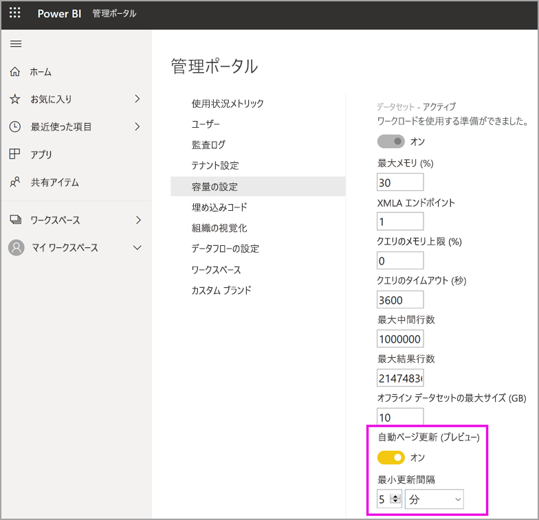

# Premium 容量でワークロードを構成する

この記事では、Power BI Premium 容量に対するワークロードの構成と有効化について説明します。 既定では、容量は、Power BI のクエリの実行に関連付けられているワークロードのみをサポートします。 **[AI (Cognitive Services)](service-cognitive-services.md)** 、 **[データフロー](service-dataflows-overview.md#dataflow-capabilities-on-power-bi-premium)** 、および **[ページ分割されたレポート](paginated-reports/paginated-reports-save-to-power-bi-service.md)** に対する追加のワークロードの有効化と構成を行うこともできます。

## 既定のメモリ設定

クエリのワークロードは、Premium 容量の SKU によって決定されるリソース用に最適化され、そのリソースによって制限されます。 Premium 容量では、容量のリソースを使用できる追加のワークロードもサポートされます。 これらのワークロードの既定のメモリの値は、SKU で使用可能な容量ノードに基づきます。 最大メモリの設定は、累積ではありません。 指定された最大値までのメモリは、AI とデータフローには動的に割り当てられますが、ページ分割されたレポートには静的に割り当てられます。

### サービスとしてのソフトウェア (SaaS) シナリオにおける Microsoft Office の SKU

|                     | EM2                      | EM3                       | P1                      | P2                       | P3                       |
|---------------------|--------------------------|--------------------------|-------------------------|--------------------------|--------------------------|
| AI | 40% (既定値)、40% (最小値) | 20% (既定値)、20% (最小値) | 20% (既定値)、8% (最小値) | 20% (既定値)、4% (最小値) | 20% (既定値)、2% (最小値) |
| データフロー | 該当なし |20% (既定値)、12% (最小値)  | 20% (既定値)、5% (最小値)  | 20% (既定値)、3% (最小値) | 20% (既定値)、2% (最小値)  |
| ページ分割されたレポート | 該当なし |該当なし | 20% (既定値)、10% (最小値) | 20% (既定値)、5% (最小値) | 20% (既定値)、2.5% (最小値) |
| | | | | | |

### サービスとしてのプラットフォーム (PaaS) シナリオにおける Microsoft Azure の SKU

|                  | A1                       | A2                       | A3                      | A4                       | A5                      | A6                        |
|-------------------|--------------------------|--------------------------|-------------------------|--------------------------|-------------------------|---------------------------|
| AI | 該当なし  | 40% (既定値)、40% (最小値)  | 20% (既定値)、20% (最小値) | 20% (既定値)、8% (最小値) | 20% (既定値)、4% (最小値) | 20% (既定値)、2% (最小値) |
| データフロー         | 40% (既定値)、40% (最小値) | 24% (既定値)、24% (最小値) | 20% (既定値)、12% (最小値) | 20% (既定値)、5% (最小値)  | 20% (既定値)、3% (最小値) | 20% (既定値)、2% (最小値)   |
| ページ分割されたレポート | 該当なし                      | 該当なし                      | 該当なし                     | 20% (既定値)、10% (最小値) | 20% (既定値)、5% (最小値) | 20% (既定値)、2.5% (最小値) |
| | | | | | |

## ワークロードの設定

### AI (プレビュー)

AI ワークロードを使用すると、Power BI で cognitive services と自動 Machine Learning を使用できます。 次の設定を使用して、ワークロードの動作を制御します。

| 設定名 | 説明 |
|---------------------------------|----------------------------------------|
| **最大メモリ (%)** | 容量のうち、AI プロセスが使用できるメモリの最大割合。 |
| **Power BI Desktop からの使用を許可します** | この設定は将来使用するために予約されており、すべてのテナントに表示されるわけではありません。 |
| **機械学習モデルの構築を許可します** | ビジネス アナリストが Power BI で直接機械学習モデルをトレーニング、検証、および呼び出すことができるかどうかを指定します。 詳細については、「[Power BI での自動 Machine Learning (プレビュー)](service-machine-learning-automated.md)」を参照してください。 |
| **AI 要求に対して並列処理を有効にします** | AI 要求を並列で実行できるかどうかを指定します。 |
|  |  |

### データセット

データセット ワークロードは既定で有効になっており、無効にすることはできません。 次の設定を使用して、ワークロードの動作を制御します。 一部の設定については、表の下に使用に関する追加情報があります。

| 設定名 | 説明 |
|---------------------------------|----------------------------------------|
| **最大メモリ (%)** | 容量のうち、データセットが使用できるメモリの最大割合。 |
| **XMLA エンドポイント** | クライアント アプリケーションからの接続で、ワークスペース レベルとアプリ レベルで設定されたセキュリティ グループ メンバーシップが優先されることを指定します。 詳細については、「[クライアント アプリケーションとツールでデータセットに接続する](service-premium-connect-tools.md)」を参照してください。 |
| **Max Intermediate Row Set Count (中間行セットの最大数)** | DirectQuery によって返される中間行の最大数。 既定値は 1,000,000 に設定されており、許容範囲は 100,000 - 2,147,483,647 です。 |
| **オフライン データセットの最大サイズ (GB)** | メモリ内のオフライン データセットの最大サイズ。 これはディスク上の圧縮サイズです。 既定値は SKU によって設定され、許容範囲は 0.1 - 10 GB です。 |
| **Max Result Row Set Count (結果行セットの最大数)** | DAX クエリで返される行の最大数。 既定値は -1 (無制限) に設定されており、許容範囲は 100,000 - 2,147,483,647 です。 |
| **クエリのメモリ制限 (%)** | ワークロード内で、MDX または DAX クエリの実行に使用できる空きメモリの最大の割合。 既定値は 0 です。この場合、SKU に固有の自動的なクエリのメモリの制限が適用されます。 |
| **クエリのタイムアウト (秒)** | クエリがタイムアウトするまでの最大時間。既定値は 3,600 秒 (1 時間) です。 値 0 は、クエリがタイムアウトしないことを指定します。 |
| **Automatic page refresh (preview) (ページの自動更新 (プレビュー))** | Premium ワークスペースでページの自動更新を含むレポートを作成する機能のオン/オフを切り替えます。 |
| **Minimum refresh interval (最小更新間隔)** | ページの自動更新がオンの場合に、ページ更新間隔に許容される最小間隔。 既定値は 5 分であり、許容される最小値は 1 秒です。 |
|  |  |  |

#### Max Intermediate Row Set Count (中間行セットの最大数)

リソースの消費量が多い、または設計が不十分なレポートの影響を制御するには、この設定を使用します。 DirectQuery データセットに対するクエリによって、ソース データベースから得られた結果が非常に大きくなった場合、メモリ使用量および処理のオーバーヘッドが急増する可能性があります。 このような状況では、他のユーザーやレポートでリソースが不足する可能性があります。 この設定により、容量管理者は、個々のクエリでデータソースから取り込むことができる行数を調整できます。

また、容量が 100 万行を超える既定値に対応でき、大規模なデータセットをご使用の場合は、この設定を大きくすることで、より多くの行を取り込むことができます。

この設定は DirectQuery クエリにのみ影響します。一方、[Max Result Row Set Count (結果行セットの最大数)](#max-result-row-set-count) は DAX クエリに影響します。

#### オフライン データセットの最大サイズ

レポート作成者が、容量に悪影響を及ぼす可能性のある大規模なデータセットを発行できないようにするには、この設定を使用します。 Power BI では、データセットがメモリに読み込まれるまで、実際のメモリ内サイズを特定できないことに注意してください。 オフライン サイズがより小さいデータセットは、オフライン サイズがより大きいデータセットの場合よりもメモリ占有領域が大きくなる可能性があります。

既存のデータセットが、この設定で指定したサイズより大きい場合、ユーザーがそのデータセットにアクセスを試みても、データセットの読み込みに失敗します。

#### Max Result Row Set Count (結果行セットの最大数)

リソースの消費量が多い、または設計が不十分なレポートの影響を制御するには、この設定を使用します。 DAX クエリでこの制限に達すると、レポート ユーザーには次のエラーが表示されます。 そのユーザーはエラーの詳細をコピーし、管理者に連絡する必要があります。

この設定は DAX クエリにのみ影響します。一方、[Max Intermediate Row Set Count (中間行セットの最大数)](#max-intermediate-row-set-count) は DirectQuery クエリに影響します。

#### クエリのメモリ制限

リソースの消費量が多い、または設計が不十分なレポートの影響を制御するには、この設定を使用します。 クエリと計算によっては、容量のメモリを大量に使用する中間結果が生じる場合があります。 この状況では、他のクエリの実行が非常に遅くなったり、容量から他のデータセットが削除されたり、容量の他のユーザーでメモリ不足エラーが発生したりする可能性があります。

Power BI レポート、Excel で分析レポートだけでなく、XMLA エンドポイントを介して接続できる他のツールによって実行されるすべての DAX および MDX クエリに、この設定が適用されます。

データ更新操作によって、データセット内のデータが更新された後のダッシュボード タイルとビジュアル キャッシュの更新処理の一環して、DAX クエリも実行される可能性があることに注意してください。 このようなクエリは、この設定が原因で失敗することもあります。また、これが原因で、データセット内のデータが正常に更新された場合でも、データ更新操作が失敗状態と表示されることがあります。

既定の設定は 0 です。この場合、次の SKU に固有の自動的なクエリのメモリの制限が適用されます。

|                              | EM1 / A1 | EM2 / A2 | EM3 / A3 | P1 / A4 | P2 / A5 | P3 / A6 |   
|------------------------------|----------|----------|----------|---------|---------|---------|
| 自動的なクエリのメモリの制限 | 1 GB     | 2 GB     | 2 GB     | 6 GB    | 6 GB    | 10 GB   |
|                              |          |          |          |         |         |         |

#### クエリのタイムアウト

この設定を使用すると、実行時間の長いクエリのより適切な制御が維持されますが、ユーザーのレポートの読み込みに時間がかかることがあります。

Power BI レポート、Excel で分析レポートだけでなく、XMLA エンドポイントを介して接続できる他のツールによって実行されるすべての DAX および MDX クエリに、この設定が適用されます。

データ更新操作によって、データセット内のデータが更新された後のダッシュボード タイルとビジュアル キャッシュの更新処理の一環して、DAX クエリも実行される可能性があることに注意してください。 このようなクエリは、この設定が原因で失敗することもあります。また、これが原因で、データセット内のデータが正常に更新された場合でも、データ更新操作が失敗状態と表示されることがあります。

この設定は、データセットまたはレポートの更新に関連付けられたすべてのクエリを実行するのにかかる時間ではなく、単一のクエリに適用されます。 次の例を考えてみましょう。

- **[クエリのタイムアウト]** 設定は 1200 (20 分) です。
- 実行するクエリは 5 つあり、それぞれ 15 分間実行されます。

すべてのクエリの合計時間は 75 分ですが、個々のクエリはいずれも実行時間が 20 分未満であるため、設定の上限に達しません。

Power BI のレポートでは、容量に対するクエリごとに、この既定値をはるかに小さいタイムアウトにオーバーライドされることに注意してください。 各クエリのタイムアウトは通常約 3 分です。

#### ページの自動更新 (プレビュー)

ページの自動更新を有効にすると、Premium 容量のユーザーは、DirectQuery ソースに対して定義された間隔でレポート内のページを更新できます。 容量管理者は、次の操作を行うことができます。

1.  ページの自動更新のオン/オフを切り替える
2.  最小更新間隔を定義する

次の図は、自動更新間隔の設定の場所を示しています。

ページの自動更新によって作成されたクエリは、データ ソースに直接送られるため、組織でページの自動更新を許可する場合は、それらのソースに対する信頼性と負荷を考慮することが重要です。 

### データフロー

データフロー ワークロードを使用すると、データフローのセルフサービスのデータ準備を使用して、データの取り込み、変換、統合、および強化を行うことができます。 次の設定を使用して、ワークロードの動作を制御します。

| 設定名 | 説明 |
|---------------------------------|----------------------------------------|
| **最大メモリ (%)** | 容量のうち、データフローが使用できるメモリの最大割合。 |
| **拡張データフロー コンピューティング エンジン (プレビュー)** | このオプションを有効にすると、大規模なデータ ボリュームを操作するときに、計算されたエンティティの計算を最大 20 倍高速化できます。 **新しいエンジンをアクティブ化するには、容量を再起動する必要があります。** 詳細については、「[拡張データフロー コンピューティング エンジン](#enhanced-dataflows-compute-engine)」を参照してください。 |
| **コンテナー サイズ** | データフロー内の各エンティティに対してデータフローが使用するコンテナーの最大サイズ。 既定値は 700 MB です。 詳細については、「[コンテナー サイズ](#container-size)」を参照してください。 |
|  |  |

#### 拡張データフロー コンピューティング エンジン

新しいコンピューティング エンジンを活用するために、データの取り込みを個別のデータフローに分割し、変換ロジックを異なるデータフローの計算されたエンティティに配置します。 コンピューティング エンジンは、既存のデータフローを参照するデータフローで動作するため、この方法をお勧めします。 インジェスト データフローでは機能しません。 このガイダンスに従うことで、最適なパフォーマンスを得るために、新しいコンピューティング エンジンが結合やマージなどの変換手順を確実に処理できるようになります。

#### コンテナー サイズ

データフローを更新すると、データフロー ワークロードによってデータフロー内の各エンティティに対してコンテナーが生成されます。 各コンテナーでは、[コンテナー サイズ] の設定で指定されたボリュームまでのメモリを使用できます。 すべての SKU の既定値は 700 MB です。 次の場合は、この設定を変更することができます。

- データフローの更新に時間がかかりすぎるか、データフローの更新がタイムアウトで失敗する。
- データフロー エンティティに、結合などの計算手順が含まれている。  

[Power BI Premium 容量メトリック](service-admin-premium-monitor-capacity.md) アプリを使用して、データフロー ワークロードのパフォーマンスを分析することをお勧めします。

場合によっては、コンテナー サイズを増やしてもパフォーマンスが向上しないことがあります。 たとえば、データフローで大量の計算を実行せずに、ソースからのみデータを取得する場合、コンテナー サイズを変更しても改善しない可能性があります。 コンテナー サイズを大きくすることで、データフロー ワークロードでエンティティの更新操作により多くのメモリを割り当てることができる場合は、改善する可能性があります。 割り当てられるメモリを増やすことで、大量の計算されたエンティティを更新するのにかかる時間を短縮できます。

コンテナー サイズの値は、データフロー ワークロードの最大メモリを超えることはできません。 たとえば、P1 容量に 25 GB のメモリがあるとします。 データフロー ワークロードの最大メモリ (%) が 20% に設定されている場合、コンテナー サイズ (MB) は 5,000 を超えることはできません。 いずれの場合も、より大きい値を設定したとしても、コンテナー サイズが最大メモリを超えることはできません。

### ページ分割されたレポート

ページ分割されたレポート ワークロードを使用すると、標準の SQL Server Reporting Services 形式に基づいて、Power BI サービスでページ分割されたレポートを実行できます。 次の設定を使用して、ワークロードの動作を制御します。

| 設定名 | 説明 |
|---------------------------------|----------------------------------------|
| **最大メモリ (%)** | 容量のうち、ページ分割されたレポートが使用できるメモリの最大割合。 |
|  |  |

ページ分割されたレポートには、レポートの作成者がカスタム コードを追加できるなど、現行の SQL Server Reporting Services (SSRS) レポートと同じ機能があります。  それにより、コード式に基づいてテキストの色を変更するなど、作成者はレポートを動的に変更できます。  確実に正しく分離されるようにするため、ページ分割されたレポートは、容量単位で保護されるサンドボックス内で実行されます。 同じ容量でレポートが実行されると、レポート間で副作用が発生することがあります。 SSRS のインスタンスにコンテンツを公開できる作成者を制限する場合と同じような慣行を、ページ分割されたレポートに実践することをお勧めします。 コンテンツを容量に公開する作成者が組織に信頼されていることを確保します。 複数の容量をプロビジョニングし、容量ごとに異なる作成者を割り当てることで、さらに環境を保護できます。 

場合によっては、ページ分割されたレポート ワークロードが使用できなくなることがあります。 その場合、管理ポータルではワークロードがエラー状態であると表示され、ユーザーに対してはレポートの表示がタイムアウトしたと表示されます。 この問題を軽減するには、ワークロードを無効にしてからもう一度有効にしてください。

## ワークロードを構成する

容量の使用可能なリソースを最大化するには、使用する場合にのみワークロードを有効にします。 メモリ設定およびその他の設定を変更するのは、既定の設定では容量のリソース要件が満たされないことが判明した場合のみにしてください。

### Power BI 管理ポータルでワークロードを構成するには

1. **[容量の設定]**  >  **[Premium 容量]** で、容量を選択します。

1. **[その他のオプション]** で **[ワークロード]** を展開します。

1. 1 つ以上のワークロードを有効にして、 **[最大メモリ]** の値とその他の設定を設定します。

1. **[適用]** を選びます。

### REST API

ワークロードの有効化と容量への割り当ては、[Capacities](https://docs.microsoft.com/rest/api/power-bi/capacities) REST API を使用します。

## ワークロードの監視

[Power BI Premium 容量メトリック アプリ](service-admin-premium-monitor-capacity.md)のデータセット、データフロー、およびページ分割されたレポートのメトリックにより、容量に対して使用可能なワークロードを監視できます。 

## 次の手順

[Power BI Premium の容量の最適化](service-premium-capacity-optimize.md)     
[データフローを使用した Power BI でのセルフサービスのデータ準備](service-dataflows-overview.md)   
[Power BI Premium のページ分割されたレポートとは](paginated-reports/paginated-reports-report-builder-power-bi.md)   
[Power BI Desktop でのページの自動更新 (プレビュー)](desktop-automatic-page-refresh.md)

他にわからないことがある場合は、 [Power BI コミュニティに質問する](https://community.powerbi.com/)
