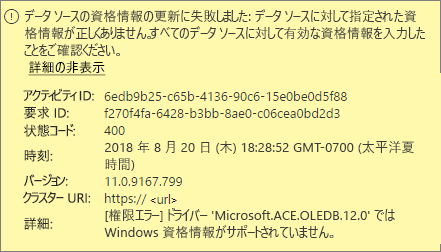
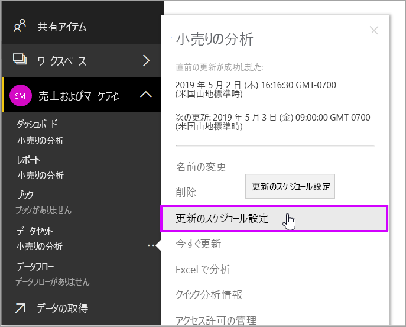

# Power BI Gateway - Personal のトラブルシューティング

[!INCLUDE [gateway-rewrite](includes/gateway-rewrite.md)]

以下のセクションでは、Power BI Gateway-Personal を使用するときに発生する可能性のある一般的な問題について説明します。

## 最新のバージョンに更新する

個人用のゲートウェイの現在のバージョンは、**オンプレミス データ ゲートウェイ (個人用)** です。 このバージョンを使用する場合は、現在インストールしているバージョンを更新してください。

多くの問題は、ゲートウェイのバージョンが期限切れになると発生します。  常に最新のバージョンを使用することは一般に適切な方法です。 ゲートウェイを 1 か月以上更新していない場合は、ゲートウェイの最新バージョンのインストールを検討してください。 次に、問題を再現できるかどうかを確認します。

## インストール
**個人用ゲートウェイは 64 ビット** - マシンが 32 ビットの場合、個人用ゲートウェイをインストールすることはできません。 オペレーティング システムは、64 ビット バージョンである必要があります。 64 ビット バージョンの Windows をインストールするか、64 ビット マシンに個人用ゲートウェイをインストールします。

**ユーザーがコンピューターのローカル管理者であるにもかかわらず個人用ゲートウェイのサービスとしてのインストールに失敗した** - ユーザーが、コンピューターのローカル管理者グループのメンバーであるものの、グループ ポリシーで対象ユーザー名をサービスとしてサインインすることが許可されていない場合、インストールが失敗する可能性があります。 現時点では、ユーザーがサービスとしてサインインできるようにグループ ポリシーを使用してください。 この問題の修正に取り組んでいます。 [詳細情報](https://technet.microsoft.com/library/cc739424.aspx)

**操作がタイムアウトした** - このメッセージは、パーソナル ゲートウェイをインストールしているコンピューター (物理マシンまたは仮想マシン) に搭載されているのが単一コア プロセッサである場合に一般的なことです。 すべてのアプリケーションを閉じ、不要なプロセスすべてをオフにしてもう一度インストールしてください。

**個人用ゲートウェイと同じコンピューターに Data Management Gateway または Analysis Services Connector をインストールできない** - Analysis Services Connector または Data Management Gateway が既にインストールされている場合は、まずコネクタまたはゲートウェイをアンインストールする必要があります。 次に、個人用ゲートウェイをインストールしてみてください。

> [!NOTE]
> インストール中に問題が発生した場合は、セットアップ ログに問題の解決に役立つ情報が記録されている可能性があります。 詳細については、「[セットアップ ログ](#SetupLogs)」を参照してください。
> 
> 

 **プロキシの構成** お使いの環境でプロキシを使用する必要がある場合は、パーソナル ゲートウェイの構成で問題が発生する可能性があります。 プロキシの構成方法の詳細については、[オンプレミス データ ゲートウェイのプロキシ設定の構成](/data-integration/gateway/service-gateway-proxy)に関するページを参照してください。

## 更新のスケジュール設定
**エラー:The credential stored in the cloud is missing. (クラウドに格納されている資格情報がありません。)**

スケジュールされている更新がある場合に個人用ゲートウェイをアンインストールしてから再インストールすると、\<データセット\>の [設定] にこのエラーが表示されることがあります。 個人用ゲートウェイをアンインストールすると、更新用に構成されているデータセットのデータ ソース資格情報が、Power BI サービスから削除されます。

**解決方法:** Power BI で、データセットの [設定の更新] に移動します。 [データ ソースの管理] で、エラーがあるいずれかのデータ ソースに関して **[資格情報の編集]** を選択し、もう一度、そのデータ ソースにサインインします。

**エラー:データセットに提供されている資格情報が無効です。続行するには、[更新] または [データ ソースの設定] ダイアログ ボックスで資格情報を更新してください。**

**解決方法**:資格情報についてのメッセージが表示される場合、次の原因が考えられます。

* データ ソースへのサインイン用のユーザー名とパスワードが最新のものであることを確認します。 Power BI で、対象データ セットの [設定の更新] に移動します。 [データ ソースの管理] にある **[資格情報の編集]** を選択し、データ ソースの資格情報を更新します。
* クラウド ソースとオンプレミス ソースの間のマッシュアップを単一のクエリで実現しようとすると、いずれかのソースが認証に OAuth を使用している場合、個人用ゲートウェイでの更新に失敗します。 この問題の一例として、CRM Online とローカル SQL Server の間のマッシュアップが挙げられます。 CRM Online には OAuth が必要なので、マッシュアップに失敗します。
  
  このエラーは既知の問題であり、調査中です。 この問題を回避するには、クラウド ソースとオンプレミス ソースに対して個別のクエリを用意します。 次に、クエリのマージまたは追加を使用してそれらを結合します。

**エラー:Unsupported data source. (サポートされていないデータ ソースです。)**

**解決方法:** [更新のスケジュール設定] でサポートされていないデータ ソースであることを示すメッセージが表示される場合、次のことを意味する可能性があります。 

* 現在、このデータ ソースは Power BI での更新がサポートされていません。 
* Excel ブックにワークシート データのみが含まれ、データ モデルが含まれていません。 現在 Power BI で更新がサポートされているのは、アップロードされた Excel ブックにデータ モデルが含まれている場合だけです。 Excel で Power Query を使用してデータをインポートする場合には、データ モデルにデータをロードするオプションを必ず選択してください。 このオプションにより、データ モデルにデータがインポートされます。 

**エラー: [データを結合できません] &lt;query part&gt;/&lt;…&gt;/&lt;…&gt; が、同時に使用できないプライバシー レベルの複数のデータ ソースにアクセスしています。このデータの組み合わせを再構築してください。**

**解決方法**:このエラーは、プライバシー レベルの制限と、使用しているデータ ソースの種類によって発生します。

**エラー:データ ソース エラー:値 "\[Table\]" を型 Table に変換できません。**

**解決方法**:このエラーは、プライバシー レベルの制限と、使用しているデータ ソースの種類によって発生します。

**エラー:この行に十分な領域がありません。**

これは、1 つのサイズが 4 MB を超える行がある場合に発生します。 データ ソースからその行を見つけて、フィルターにかけてその行を外すか、サイズを小さくしてください。

## データ ソース
**データ プロバイダーがない** - 個人用ゲートウェイは 64 ビット専用です。 つまり、パーソナル ゲートウェイのインストール先コンピューターに、64 ビット バージョンのデータ プロバイダーをインストールする必要があります。 たとえば、データセット内のデータ ソースが Microsoft Access の場合は、パーソナル ゲートウェイがインストールされているのと同じコンピューターに 64 ビットの ACE プロバイダーをインストールする必要があります。  

>[!NOTE]
>32 ビット バージョンの Excel を使用している場合は、同じコンピューターに 64 ビットバージョンの ACE プロバイダーをインストールすることはできません。

**Access データベースで Windows 認証がサポートされない** - 現在 Power BI がサポートしているのは Access データベースの匿名認証のみです。 Access データベースで Windows 認証を有効にするように取り組んでいるところです。

**データ ソースの資格情報を入力するときにサインイン エラーが発生する** - データ ソースに Windows 資格情報を入力するとこの種のエラーが表示される場合には、個人用ゲートウェイが古いバージョンである可能性があります。 [最新バージョンの Power BI Gateway - Personal をインストール](https://powerbi.microsoft.com/gateway/)してください。

  

**エラー:ACE OLEDB を使用して、データ ソースに対して Windows 認証を選択するときに、サインイン エラーが発生する** - ACE OLEDB プロバイダーを使用して、データ ソースのデータ ソース資格情報を入力するときに、次のエラーが発生することがあります。

現在、Power BI では ACE OLEDB プロバイダーを使用したデータ ソースに対する Windows 認証はサポートされていません。

**解決方法:** このエラーを回避するには、**匿名認証**を選択できます。 従来の ACE OLEDB プロバイダーでは、匿名の資格情報と Windows 資格情報は同じです。

## タイルの更新
ダッシュボード タイルの更新時にエラーが発生する場合は、次の記事を参照してください。

[タイルのエラーのトラブルシューティング](refresh-troubleshooting-tile-errors.md)

## トラブルシューティングするためのツール
### 更新履歴
**[更新履歴]** では、発生したエラーを確認できます。また、サポート リクエストを作成する必要がある場合に役立つデータが提供されます。 スケジュールされた更新とオンデマンドの更新の両方を表示できます。 **[更新履歴]** を取得する方法を次に示します。

1. Power BI ナビゲーション ウィンドウの **[データセット]** で、データセットを選択してから、&gt;[メニューを開く] &gt; **[更新のスケジュール設定]** を選択します。
   
1. **[設定]** で、 **[更新履歴]** を選択します。  
   
   
   

### イベント ログ
一部のイベント ログでは情報を提供されることがあります。 最初の 2 つのイベントである **Data Management Gateway** と **PowerBIGateway**は、コンピューター上の管理者に対して表示されます。  管理者ではないユーザーが個人用ゲートウェイを使用している場合は、**アプリケーション** ログ内にログ エントリが表示されます。

**Data Management Gateway** と **PowerBIGateway** ログは、 **アプリケーションとサービス ログ**の下に表示されます。

### Fiddler のトレース
[Fiddler](http://www.telerik.com/fiddler) は、HTTP トラフィックを監視する Telerik 提供の無償ツールです。 クライアント マシンからの Power BI サービスとの通信を確認できます。 この通信には、エラーやその他の関連情報が示される場合があります。

### セットアップ ログ
**個人用ゲートウェイ**のインストールに失敗した場合、セットアップ ログを表示するためのリンクが表示されます。 セットアップ ログには、エラーの詳細が示されることがあります。 これらのログは、MSI ログとも呼ばれる Windows インストールのログです。 これらのログは非常に複雑で、読み解くのが困難です。 通常は下部にエラーが示されますが、エラーの原因を特定するのは簡単ではありません。 見ているものが別のログのエラーの結果であることも、ログの上の部分に含まれているエラーの結果であることもあります。

また、**Temp フォルダー** (%temp%) に移動して、**Power\_BI\_** で始まるファイルを検索することもできます。

> [!NOTE]
> %temp% に移動すると、temp のサブフォルダーに移動する場合があります。**Power\_BI\_** ファイルは、temp ディレクトリのルート内にあります。  1 レベルまたは 2 レベル上に移動する必要がある場合があります。
> 
> 

## 次の手順
[オンプレミス データ ゲートウェイのプロキシ設定を構成する](/data-integration/gateway/service-gateway-proxy)  
[データ更新](refresh-data.md)  
[Power BI Gateway - Personal](service-gateway-personal-mode.md)  
[タイルのエラーのトラブルシューティング](refresh-troubleshooting-tile-errors.md)  
[オンプレミス データ ゲートウェイのトラブルシューティング](service-gateway-onprem-tshoot.md)  
他にわからないことがある場合は、 [Power BI コミュニティを利用してください](http://community.powerbi.com/)。

