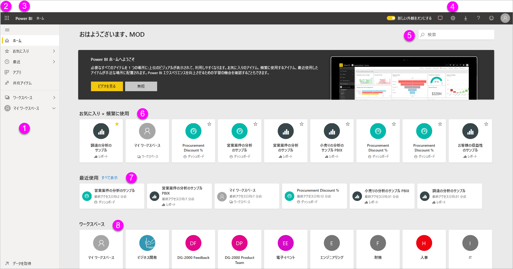
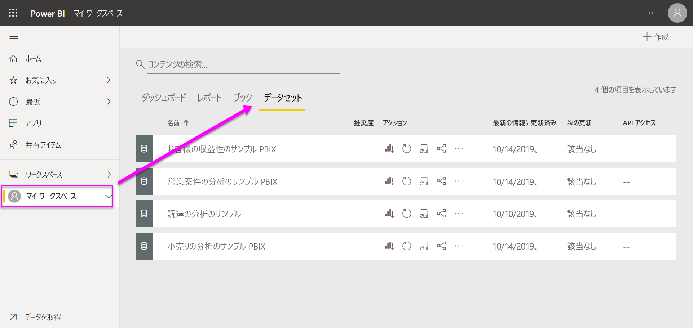
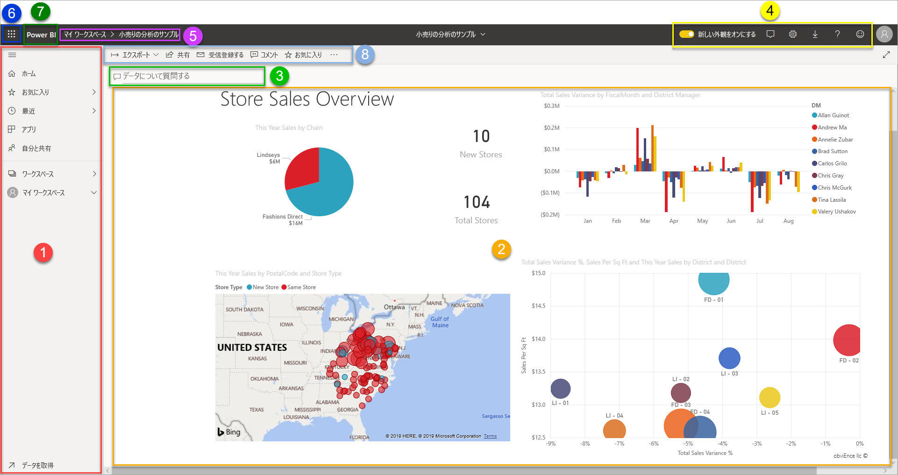
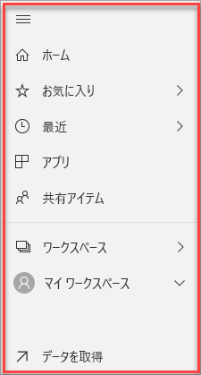
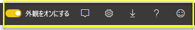
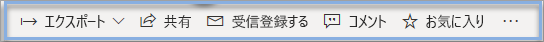

# Power BI サービスのデザイナー向けの基本的な概念

この記事の目的は、Power BI サービスに対するご自分の位置を確認することです。さまざまな要素とそれらが連動するしくみ、およびその操作方法について説明します。 既に [Power BI サービスにサインアップ](service-self-service-signup-for-power-bi.md)して[いくつかデータを追加](service-get-data.md)している場合は、より役に立つかもしれません。 デザイナーの一般的なワークフローは、Power BI Desktop でレポートを作成することから始まります。 次に、それらを Power BI サービスに公開します。ここで引き続きそれを変更できます。 また、Power BI サービスでは、レポートに基づくダッシュボードを作成することもできます。 

この記事では、ご自分のレポートがまだない場合、[Power BI サンプル コンテンツ パック](sample-datasets.md#the-power-bi-samples-as-content-packs)をインストールしてみてください。

ブラウザーで Power BI サービスを開くと、最初にホーム画面が表示されます。 表示される可能性がある要素は次のとおりです。

1. ナビゲーション ウィンドウ
2. Office 365 アプリ起動ツール
3. Power BI ホーム ボタン
4. アイコン ボタン (設定、ヘルプ、フィードバックを含む)
5. 検索ボックス
6. お気に入りとよく使用するダッシュボード、レポート、ワークスペース
7. 最近のダッシュボード、レポート、ワークスペース
8. ワークスペース

あなたと、ご自分のレポートおよびダッシュボードのエンド ユーザーは、ブラウザーの Power BI サービスでの開始時のエクスペリエンスは同じです。

これらの機能については後に詳しく説明しますが、まずいくつかの Power BI の概念を確認します。 または、このビデオを最初に視聴することもできます。  このビデオでは、Will が Power BI サービスの基本的な概念と概要について説明しています。

<iframe width="560" height="315" src="https://www.youtube.com/embed/B2vd4MQrz4M" frameborder="0" allowfullscreen></iframe>

## Power BI の概念
Power BI の 5 つの主要な構成要素は、"*ダッシュボード*"、"*レポート*"、"*ブック*"、"*データセット*"、"*データフロー*" です。 これらはすべて "*ワークスペース*" にまとめられており、"*容量*" に基づいて作成されます。  5 つの構成要素について詳しく説明する前に、容量とワークスペースを理解しておくことが重要であるため、そこから始めましょう。

## 容量
容量は、Power BI コンテンツのホストと配信に使用される一連のリソース (ストレージ、プロセッサ、メモリ) を表す Power BI の中心的な概念です。 容量は "_共有_" または "_専用_" のいずれかです。 共有容量は他の Microsoft のお客様と共有されますが、専用容量はそれぞれのお客様に完全にコミットされます。 専用容量には[サブスクリプション](service-premium-what-is.md)が必要です。詳しくは、「[Premium 容量を管理する](service-premium-capacity-manage.md)」の記事で説明されています。

既定では、ワークスペースは共有容量で作成されます。 共有容量の場合、ワークロードは他のお客様と共有される計算リソースで実行されます。 この容量ではリソースを共有する必要があるため、最大モデル サイズ (1 GB) や最大日次更新頻度 (1 日 8 回) など、"フェア プレイ" を確保するための制限が課されます。

## ワークスペース
ワークスペースは容量に基づいて作成されます。 基本的に、Power BI のダッシュボード、レポート、ブック、データセット、データフロー用のコンテナーになります。

2 種類のワークスペース、"*マイ ワークスペース*" と "*ワークスペース*" があります。

- "*マイ ワークスペース*" は、自分のコンテンツを使う Power BI ユーザー向けの個人用ワークスペースです。 ユーザーは自分のマイ ワークスペースにのみアクセスできます。 マイ ワークスペースからダッシュボードとレポートを共有できます。 ダッシュボードとレポートで共同作業する場合や、アプリを作成する場合は、ワークスペースで作業できます。      
-  "*ワークスペース*" は、同僚とコンテンツの共同作業および共有を行うために使われます。 ワークスペースに同僚を追加して、ダッシュボード、レポート、ブック、データセットの共同作業を行うことができます。 1 つの例外として、ワークスペース メンバーにはすべて Power BI Pro ライセンスが必要です。 新しいワークスペースの詳細については、[こちら](service-create-the-new-workspaces.md)を参照してください。 

    ワークスペースは、組織向け "*アプリ*" を作成、公開、管理する場所でもあります。 ワークスペースは Power BI アプリを構成するコンテンツのステージング領域およびコンテナーと考えることができます。 ところで、"*アプリ*" とは何でしょうか。 組織の Power BI の顧客に主要なメトリックを提供するために作成された、ダッシュボードとレポートのコレクションです。 アプリは対話型ですが、コンシューマーがそれを編集することはできません。 アプリの使用者 (アプリへのアクセス権を持つ同僚) には必ずしも Pro ライセンスは必要ありません。  

一般的な共有について学ぶ場合は、[作業のダッシュボードを共有する方法](service-how-to-collaborate-distribute-dashboards-reports.md)に関する記事から始めてください。

次に、5 つの Power BI の構成要素について説明します。

## データフロー
"*データフロー*" を使用すると、組織はさまざまなソースからデータを統合できます。 これらは省略可能であり、プロジェクトが複雑な場合や大規模なで場合によく使用されます。 これらは、データセットで使用するために準備およびステージングされたデータを表します。 しかし、レポートのためのソースとして直接使用することはできません。 オンプレミスとクラウドベースのデータ ソースからデータを取り込むことができるように、Microsoft のデータ コネクタの豊富なコレクションが利用されます。

データフローは、ワークスペース (しかし "*マイ ワークスペース*" 以外) でのみ作成および管理され、Azure Data Lake Storage Gen2 の Common Data Model (CDM) にエンティティとして格納されます。 通常、これらは最新のデータを保存するために、定期的に更新するようにスケジュールされています。 データセットによって使用される (および再利用される可能性がある) データを準備するのに適しています。 詳細については、「[Power BI でのセルフサービスのデータ準備](service-dataflows-overview.md)」の記事を参照してください。

ダッシュボードやレポートは、データがないと使用できません (空のダッシュボードや空のレポートを用意することもできますが、データが取り込まれるまでは利用価値がありません)。そのため、今度は**データセット**を紹介しましょう。

## データセット
*データセット* は、*インポート先*または*接続先*となるデータのコレクションです。 Power BI を使うと、あらゆる種類のデータセットに接続してインポートし、すべてを 1 か所にまとめることができます。 データセットは、データフローからのデータをソースにすることもできます。

データセットは "*ワークスペース*" と関連付けられており、1 つのデータセットが多くのワークスペースの一部になることができます。 ワークスペースを開くと、関連付けられているデータセットが **[データセット]** タブに一覧表示されます。表示されている各データセットは、データの 1 つのソースを表します。たとえば、OneDrive の Excel ブック、オンプレミスの SSAS 表形式データセット、Salesforce データセットなどです。 多くのさまざまなデータ ソースがサポートされており、頻繁に新しいデータソースが追加されていきます。 [Power BI で使用できるデータセットの種類](service-get-data.md)の一覧を参照してください。

次の例は、"Sales and marketing" ワークスペースを選んで、 **[データセット]** タブをクリックしたものです。

**1 つの** データセットを...

* 1 つのワークスペースまたは多くのワークスペースで繰り返し使うことができます。
* 多くのさまざまなレポートで使用できます。
* その 1 つのデータセットからの視覚エフェクトを、多くのさまざまなダッシュボードで表示できます。

  

[データセットに接続したりデータセットをインポートしたり](service-get-data.md)するには、ナビ ペインの下部にある **[データの取得]** を選択します。 手順に従って、特定のソースに接続するかソースをインポートして、アクティブなワークスペースにデータセットを追加します。 新しいデータセットは、黄色のアスタリスクで示されます。 Power BI 内で行う作業によって、基になるデータセットが変更されることはありません。

1 人のワークスペース メンバーによって追加されたデータセットは、"*管理者*"、"*メンバー*"、または "*共同作成者*" のロールを持つ他のワークスペース メンバーが使用できます。

データセットの更新、名前変更、探索、削除を行うことができます。 データセットを使ってレポートを最初から作成するか、[クイック インサイト](service-insights.md)を実行します。  データセットを既に使っているレポートとダッシュボードを確認するには、 **[関連の表示]** を選びます。 データセットを調べるには、そのデータセットを選択します。 この操作によって、実際にはそのデータセットをレポート エディターで開いています。ここで視覚エフェクトを作成することにより、データの調査を実際に開始できます。

それでは、次のトピック「レポート」に進みましょう。

### 詳細情報
* [Power BI サービスのデータセット](service-datasets-understand.md)
* [Power BI サービスのデータセット モード](service-dataset-modes-understand.md)
* [Power BI Premium とは何ですか?](service-premium-what-is.md)
* [Power BI のデータの取得](service-get-data.md)
* [Power BI 用のサンプル データセット](sample-datasets.md)

## レポート
Power BI レポートは、1 ページまたは複数ページの視覚エフェクト (チャート、グラフ、ツリーマップ) からなります。 視覚エフェクトは **_ビジュアル_** とも呼ばれます。 レポートのすべての視覚エフェクトは 1 つのデータセットから取得されます。 レポートは、Power BI 内で最初から作成すること、ダッシュボードを使用して同僚が共有しているものをインポートすること、Excel、Power BI Desktop、データベース、SaaS アプリケーションからデータセットに接続するときに Power BI で作成することができます。  たとえば、Power View シートを含む Excel ブックに接続するとき、Power BI はそのシートに基づくレポートを作成します。 SaaS アプリケーションに接続すると、Power BI は構築済みのレポートをインポートします。

レポートを表示して操作するモードは 2 つ、"*読み取りビュー*" と "*編集ビュー*" です。 レポートを開くと、読み取りビューで開きます。 編集アクセス許可を持っている場合は、左上隅の **[レポートの編集]** が表示され、編集ビューでレポートを表示できます。  レポートがワークスペース内にある場合は、"*管理者*"、"*メンバー*"、または "*共同作成者*" のロールを持つすべてのユーザーが編集できます。 これらのユーザーは、そのレポートの編集ビューのすべての探索、設計、構築、および共有機能にアクセスできます。 それらのユーザーがレポートを共有した相手のみが、読み取りビューでレポートを閲覧できます。   

ワークスペースを開くと、関連付けられているレポートが **[レポート]** タブに一覧表示されます。リストされている各レポートは、基になるただ 1 つのデータセットに基づく、視覚エフェクトの 1 つ以上のページを表します。 レポートを開くには、それを選択します。

アプリを開くと、ダッシュボードが表示されます。  基になるレポートにアクセスするには、レポートからピン留めされたダッシュボードのタイルを選びます (タイルについては詳しく後で説明)。 すべてのタイルがレポートからピン留めされているわけではないので、レポートを探すにはタイルをいくつかクリックすることが必要な場合があることに注意してください。

既定では、レポートは読み取りビューで開きます。  編集ビューで開くには、 **[レポートの編集]** を選びます (必要なアクセス許可がある場合)。

次の例は、"Sales and marketing" ワークスペースを選んで、 **[レポート]** タブをクリックしたものです。

**1 つの** レポートを...

* 1 つのワークスペースに含めることができます。
* そのワークスペース内の複数のダッシュボードに関連付けることができます。 1 つのレポートからピン留めされたタイルは、複数のダッシュボードに表示できます。
* 1 つのデータセットのデータを使用して作成できます。 Power BI Desktop を使用すると、複数のデータ ソースをレポート内の 1 つのデータセットに結合し、そのレポートを Power BI にインポートできます。

  

### 詳細情報
- [データセットをインポートして Power BI サービスでレポートを作成する](service-report-create-new.md)
- [Power BI モバイル アプリのレポートを最適化する](desktop-create-phone-report.md)

## ダッシュボード
"*ダッシュボード*" は、**Power BI サービス**を使って自分で作成する場合と、同僚が **Power BI サービス**で作成したものを共有してもらう場合があります。 これは 0 または 1 つ以上のタイルとウィジェットを含む単一のキャンバスです。 レポートまたは [Q&A](power-bi-q-and-a.md) からピン留めされた各タイルには、データセットのデータから作成され、ダッシュボードに固定された単一の[視覚エフェクト](power-bi-report-visualizations.md)が表示されます。 レポート ページ全体をダッシュボードに 1 つのタイルとしてピン留めすることもできます。 ダッシュボードにタイルを追加する方法は多数ありますが、多すぎるためこの概要トピックでは紹介できません。 詳しくは、「[Power BI のダッシュボードのタイル](service-dashboard-tiles.md)」をご覧ください。

なぜダッシュボードを作成しますか。  理由の一部は以下のとおりです。

* 意思決定に必要なすべての情報をひとめで確認できるようにするため。
* 業務に関する最も重要な情報を監視するため。
* すべての同僚が、同じ情報を表示および使用して、同じ考えを持てるようにするため。
* ビジネス、製品、ビジネス単位、またはマーケティング キャンペーンの正常性を監視するため
* 大きなダッシュボードの個人ビューを作成して、自分の関心のあるメトリックスをそこに表示するため。

ワークスペースを開くと、関連付けられているダッシュボードが **[ダッシュボード]** タブに一覧表示されます。ダッシュボードを開くには、それを選びます。 アプリを開くと、ダッシュボードが表示されます。  各ダッシュボードは、基になるデータセットの一部のサブセットのカスタマイズしたビューを表します。  ダッシュボードを所有している場合は、基になるデータセットとレポートの編集アクセス権限もあります。  他のユーザーからダッシュボードを共有されている場合、ダッシュボードおよび基になっているレポートを操作することはできますが、変更を保存することはできません。

ユーザーまたは同僚が[ダッシュボードを共有する](service-share-dashboards.md)には、さまざまな方法があります。 ダッシュボードを共有するには Power BI Pro が必要であり、共有ダッシュボードを表示するときも必要になる場合があります。

**1 つの** ダッシュボードに...

* 1 つのワークスペースが関連付けられます。
* 多くの異なるデータセットの視覚エフェクトを表示できます。
* 多くの異なるレポートの視覚エフェクトを表示できます。
* 他のツール (Excel など) からピン留めされた視覚エフェクトを表示できます。

  

### 詳細情報
* [空のダッシュボードを作成して、データを取得する](service-dashboard-create.md)。
* [ダッシュボードを複製する](service-dashboard-copy.md)
* [ダッシュボードの Phone ビューを作成する](service-create-dashboard-mobile-phone-view.md)

## ブック
ブックは特別な種類のデータセットです。 上記の「**データセット**」セクションを読まれていれば、ブックについて知っておく必要のあることは既にほぼ理解されています。 ただし、Power BI によって Excel ブックが**データセット**として分類される場合と**ブック**として分類される場合がある理由が気になるかもしれません。

Excel ファイルで **[データの取得]** を使うときは、ファイルを "*インポート*" する、またはファイルに "*接続*" するオプションがあります。 [接続] を選ぶと、ブックは Excel Online に存在する場合と同じように Power BI に表示されます。 ただし、Excel Online とは異なり、ワークシートの要素をダッシュボードにピン留めするのに役立ついくつかの優れた機能を利用できます。

Power BI ではブックを編集できません。 しかし、変更を加える必要がある場合は、[編集] をクリックして、Excel Online でブックを編集するかまたは自分のコンピューターの Excel で開くかを選択できます。 ブックに加えたすべての変更は、OneDrive 上のブックに保存されます。

### 詳細情報
* [Excel ブック ファイルからデータを取得する](service-excel-workbook-files.md)
* [Excel から Power BI に発行する](service-publish-from-excel.md)

## [マイ ワークスペース] のダッシュボード
ここまで、ワークスペースと構成要素について説明してきました。 ここで一度振り返り、Power BI サービスのダッシュボードを構成する要素をもう一度確認しましょう。

### 1.**ナビゲーション ペイン**
ワークスペースを探したり、Power BI の構成要素 (ダッシュボード、レポート、ブック、データセット) の間を移動したりするには、ナビ ペインを使います。  

  

* [データセット、レポート、ダッシュボードを Power BI に追加する](service-get-data.md)には、 **[データの取得]** を選びます。
* ナビ ペインを展開したり折りたたんだりするには、次のアイコンを使用します: .
* お気に入りのコンテンツを開いたり管理したりするには、 **[お気に入り]** を選びます。
* 最近アクセスしたコンテンツを表示して開くには、 **[最近]** を選びます。
* アプリを表示したり、開いたり、削除したりするには、 **[アプリ]** を選びます。
* 同僚からコンテンツを共有されている場合、 そのコンテンツを並べ替えて必要なものを探すには、 **[自分と共有]** を選びます。
* **[ワークスペース]** を選び、ワークスペースを表示して開きます。

これらの要素を 1 回クリックします。

* アイコンまたは見出しをクリックすると、コンテンツ ビューで開きます
* 右矢印 (>) で、[お気に入り]、[最近]、[ワークスペース] のポップアップ メニューが開きます。
* シェブロン アイコンをクリックすると、 **[マイ ワークスペース]** にダッシュボード、レポート、ブック、データセットのスクロール可能な一覧が表示されます。

### 2.**キャンバス**
ダッシュボードを開いたので、キャンバス領域には視覚エフェクトのタイルが表示されています。 たとえばレポート エディターを開いた場合は、レポート ページがキャンバス領域に表示されます。

ダッシュボードは、[タイル](service-dashboard-tiles.md)で構成されます。  タイルは、レポートの編集ビュー、Q&A、他のダッシュボードで作成され、Excel、SSRS などからピン留めできます。 [ウィジェット](service-dashboard-add-widget.md)と呼ばれる特別な種類のタイルがダッシュボードに直接追加されます。 ダッシュボードに表示されるタイルは、レポートの作成者/所有者によってそこに配置されています。  ダッシュボードにタイルを追加する動作は、 *ピン留め*と呼ばれます。

詳しくは、前の「[ダッシュボード](#dashboards)」をご覧ください。

### 3.**Q&A 質問ボックス**
データを探索する方法の 1 つは、質問をして、Power BI Q&A から視覚エフェクトの形式で回答を受け取ることです。 Q&A を使って、ダッシュボードまたはレポートにコンテンツを追加できます。

Q&A は、ダッシュボードに接続されたデータセットで回答を検索します。  接続されたデータセットとは、ダッシュボードに 1 つ以上のタイルが固定されているものです。

Q&A では、質問の入力を開始するとすぐに Q&A ページが表示されます。 入力中に Q&A は言い直し、オートコンプリート、候補表示などの方法により、正しく質問して最適な回答を得られるように支援します。 求めている視覚エフェクト (回答) を得ることができたら、それをダッシュボードにピン留めします。 詳しくは、「[Power BI での Q&A](power-bi-q-and-a.md)」をご覧ください。

### 4.**黒いヘッダー バーのアイコン**
右上隅のアイコンは、設定、通知、ダウンロード、ヘルプの表示、 **[新しい外観]** のオン/オフ、Power BI チームへのフィードバックの送信を行うためのリソースです。  

### 5.**ダッシュボード タイトル** (ナビゲーション パス、または階層リンク)
アクティブになっているワークスペースやダッシュボードがわかりにくい場合があるため、Power BI ではナビゲーション パスが作成されます。  この例では、ワークスペース (マイ ワークスペース) とダッシュボードのタイトル (Retail Analysis Sample) が表示されています。  レポートが開かれている場合は、レポートの名前がナビゲーション パスの末尾に追加されます。  パスの各セクションは、アクティブなハイパーリンクになっています。  

ダッシュボードのタイトルの後にある [C] というアイコンに注意してください。 このダッシュボードには、"confidential (機密)" の[データ分類タグ](service-data-classification.md)が設定されています。 タグは、データの秘密度とセキュリティ レベルを示します。 管理者がデータの分類を有効にしている場合、すべてのダッシュボードに既定のタグが設定されます。 ダッシュボードの所有者は、ダッシュボードの適切なセキュリティ レベルと一致するようにタグを変更する必要があります。

### 6.**Office 365 アプリ起動ツール**
アプリ起動ツールを使うと、すべての Office 365 アプリを 1 回のクリックで簡単に利用できます。 ここからは、メール、ドキュメント、予定表などをすばやく起動できます。

### 7.**Power BI ホーム**
**[Power BI]** を選ぶと、Power BI のホームに戻ることができます。

   

### 8.**灰色のメニュー バーのラベル付きアイコン**
画面のこの領域には、コンテンツ (この場合はダッシュボード) を操作するための他のオプションが表示されます。  ラベルの付いたアイコン以外にも、 **[その他のオプション (...)]** を選択すると、ダッシュボードの複製、印刷、更新などのオプションが開きます。

   

## 次の手順
- [Power BI とは?](fundamentals/power-bi-overview.md)  
- [Power BI のビデオ](videos.md)  
- [レポート エディター...紹介を見る](service-the-report-editor-take-a-tour.md)
- 他にわからないことがある場合は、 [Power BI コミュニティで質問してみてください](https://community.powerbi.com/)。
