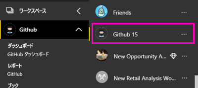

# Power BI で GitHub に接続する
この記事では、Power BI テンプレート アプリを使用して GitHub アカウントからデータをプルする手順について説明します。 このテンプレート アプリは、ダッシュボード、一連のレポート、およびデータセットを含むワークスペースを生成して、GitHub データの探索を可能にします。 Power BI 用の GitHub アプリは、投稿、問題、pull request、アクティブなユーザーなどに関するデータを含む、GitHub リポジトリ (リポジトリとも呼ばれます) の分析情報を示します。

テンプレート アプリをインストールした後は、ダッシュボードとレポートを変更できます。 その後、組織内の同僚にアプリとして配布することができます。

[GitHub テンプレート アプリ](https://app.powerbi.com/groups/me/getapps/services/pbi-contentpacks.pbiapps-github)に接続するか、Power BI と [GitHub との統合](https://powerbi.microsoft.com/integrations/github)について詳細をお読みください。

[GitHub のチュートリアル](service-tutorial-connect-to-github.md)を試すこともできます。 この場合、Power BI のドキュメントのパブリック リポジトリに関する実際の GitHub データがインストールされます。

>[!NOTE]
>テンプレート アプリを使用するには、リポジトリにアクセスするための GitHub アカウントが必要です。 要件の詳細については、このあと説明します。

## 接続する方法
[!INCLUDE [powerbi-service-apps-get-more-apps](./includes/powerbi-service-apps-get-more-apps.md)]
   
3. **[GitHub]** \> **[今すぐ入手する]** の順に選択します。
4. **[この Power BI アプリをインストールしますか?]** で、 **[インストール]** を選択します。
4. **[アプリ]** ウィンドウで、 **[GitHub]** タイルを選択します。

    

6. **[新しいアプリを開始する]** で **[データに接続]** を選択します。

    

5. リポジトリの名前とリポジトリの所有者を入力します。 [これらのパラメーターの見つけ方](#FindingParams)について詳しくは、後述します。
   
    

5. 自分の GitHub の資格情報を入力します (ブラウザーで既にサインインしている場合、この手順は省略される可能性があります)。 
6. **[認証方法]** として **[oAuth2]** を選択し、\> **[サイン イン]** をクリックします。 
7. GitHub の認証画面に従います。 GitHub データへのアクセス許可を Power BI 用 GitHub テンプレート アプリに付与します。
   
   
   
    Power BI が、GitHub と対象のデータに接続します。  データは、1 日に 1 回更新されます。 Power BI によってデータがインポートされると、新しい GitHub ワークスペースの内容が表示されます。

## アプリを変更して配布する

GitHub テンプレート アプリをインストールできました。 これは、GitHub アプリ ワークスペースも作成されたことを意味します。 ワークスペースでは、レポートとダッシュボードを変更して、それを組織内の同僚に "*アプリ*" として配布することができます。 

1. 左側のナビゲーション バーで、ワークスペース名の横にある矢印を選択します。 ワークスペースにダッシュボードとレポートが含まれていることがわかります。

    

8. 新しい [GitHub ダッシュボード](https://powerbi.microsoft.com/integrations/github)を選択します。    
    

3. 新しい GitHub ワークスペースのすべてのコンテンツを表示するには、左側のナビゲーション バーで、 **[ワークスペース]**  > **GitHub** を選択します。
 
   

    このビューは、ワークスペースのコンテンツ リストです。 右上隅に、 **[アプリを更新]** が表示されます。 同僚にアプリを配布する準備ができたら、そこが出発地点になります。 

    

2. ワークスペース内の他の要素を表示するには、 **[レポート]** および **[データセット]** を選択します。

    同僚に[アプリを配布する](service-create-distribute-apps.md)方法に関する記事を参照してください。

## アプリに含まれるもの
Power BI では、次のデータを GitHub から使用できます。     

| テーブル名 | 説明 |
| --- | --- |
| 貢献 |投稿物のテーブルは、共同作成者によって作成された追加、削除、コミットの合計を週ごとに集計して示します。 上位 100 人の共同作成者が含まれています。 |
| Issues |選択したリポジトリのすべての問題の一覧を表示します。問題が閉じられるまでの合計時間と平均時間、開かれている問題の合計、閉じられた問題の合計などの計算が含まれます。 リポジトリに問題がない場合、このテーブルは空になります。 |
| Pull requests |このテーブルには、リポジトリのすべての Pull Requests と、要求をプルした人が含まれています。 また、開かれている pull request、閉じられている pull request、pull request の合計、要求をプルするまでにかかった時間、pull request にかかった平均時間などに関する計算も含まれます。 リポジトリに問題がない場合、このテーブルは空になります。 |
| ユーザー |このテーブルは、選択されたリポジトリで投稿を行った、問題をファイリングした、または pull request を解決した GitHub ユーザー (共同作成者) の一覧を示します。 |
| Milestones |これは、選択したリポジトリのすべてのマイルス トーンです。 |
| DateTable |このテーブルには本日から過去数年間の日付が含まれており、これによって日付ごとに GitHub のデータを分析できます。 |
| ContributionPunchCard |このテーブルは、選択したリポジトリの投稿物のパンチ カードとして使用できます。 曜日別および時間別のコミット数を示します。 このテーブルは、モデル内の他のテーブルに接続されていません。 |
| RepoDetails |このテーブルは、選択したリポジトリの詳細を説明します。 |

## システム要件
* リポジトリにアクセスできる GitHub アカウント。  
* 初めてログインするときに Power BI for GitHub アプリに与えられるアクセス許可。 アクセスを取り消す方法については、下記の詳細を参照してください。  
* データのプルと更新に使用できる十分な API 呼び出し。  

### Power BI の承認解除
Power BI と GitHub リポジトリとの接続の承認を解除するには、GitHub のアクセスを取り消します。 詳しくは、この [GitHub ヘルプ](https://help.github.com/articles/keeping-your-ssh-keys-and-application-access-tokens-safe/#reviewing-your-authorized-applications-oauth) トピックをご覧ください。

## パラメーターの見つけ方
GitHub 自体のリポジトリを見ることで、所有者とリポジトリを確認できます。

最初の部分の "Azure" が所有者で、2 番目の部分の "azure-sdk-for-php" がリポジトリそのものです。  リポジトリの URL にこれらの同じ 2 つ項目が現れます。

    <https://github.com/Azure/azure-sdk-for-php> .

## トラブルシューティング
必要に応じて、GitHub の資格情報を確認することができます。  

1. 別のブラウザー ウィンドウで、GitHub の Web サイトに移動して GitHub にサインインします。 GitHub サイトの右上隅でログイン状態を確認できます。    
2. GitHub で、Power BI でアクセスしようとしているリポジトリの URL に移動します。 たとえば、 https://github.com/dotnet/corefx です。  
3. Power BI に戻って GitHub に接続します。 [GitHub の構成] ダイアログ ボックスで、その同じリポジトリの名前と所有者を使用します。  

## 次の手順

* [チュートリアル:Power BI を使用して GitHub リポジトリに接続する](service-tutorial-connect-to-github.md)
* [Power BI で新しいワークスペースを作成する](service-create-the-new-workspaces.md)
* [Power BI にアプリをインストールし、使用する](consumer/end-user-apps.md)
* [外部サービス用の Power BI アプリに接続する](service-connect-to-services.md)
* わからないことがある場合は、 [Power BI コミュニティで質問してみてください](http://community.powerbi.com/)。

