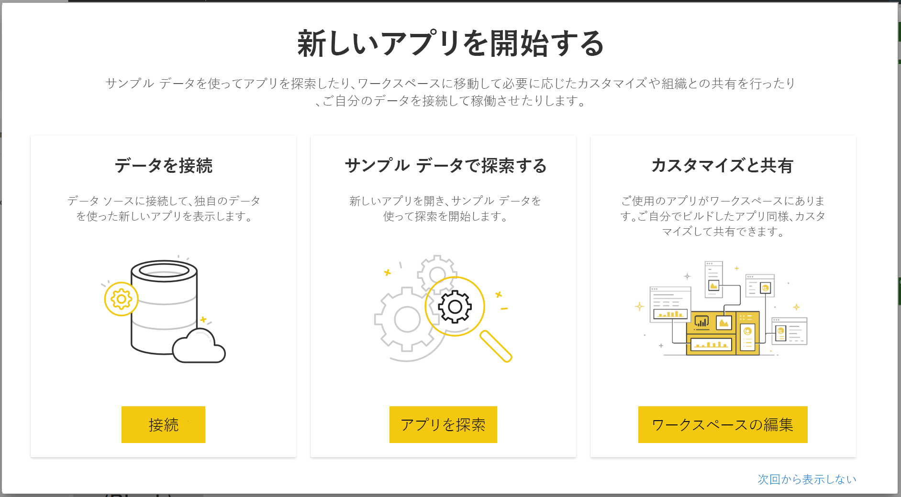

# Power BI で Project Web App に接続する
Microsoft Project Web App は、プロジェクト ポートフォリオ管理 (PPM) および日常の作業用の柔軟なオンライン ソリューションです。 Project Web App を使用すると、プロジェクト ポートフォリオの投資を開始して優先順位を設定し、意図したとおりのビジネス価値を提供できます。 Power BI 用 Project Web App テンプレート アプリでは、Project Web App から分析情報をロック解除し、プロジェクト、ポートフォリオ、リソースの管理に役立てることができます。

Power BI 用 [Project Web App テンプレート アプリ](https://appsource.microsoft.com/product/power-bi/pbi_msprojectonline.pbi-microsoftprojectwebapp)に接続します。

## 接続する方法

1. ナビ ペインの **[アプリ]** を選択し、右上隅にある **[アプリの取得]** を選択します。

    

2. **[サービス]** ボックスで、 **[取得]** を選択します。
   
   
3. AppSource で **[アプリ]** タブを選択し、 **[Microsoft Project Web App]** を検索して選択します。
   
4. **[この Power BI アプリをインストールしますか?]** というメッセージが表示されます。 **[インストール]** を選択します。 

   
5. **[アプリ]** ウィンドウで、 **[Microsoft Project Web App]** タイルを選択します。 
   
   
6. **[新しいアプリを開始する]** で **[データに接続]** を選択します。
   
   
7. **[Project Web App の URL]** テキスト ボックスに、接続する Project Web App (PWA) の URL を入力します。  カスタム ドメインを使用している場合は例と異なる場合があることに注意してください。 **[PWA Site Language]\(PWA サイトの言語\)** テキスト ボックスに、PWA サイト言語に対応する番号を入力します。 英語には '1' を、フランス語には '2' を、ドイツ語には '3' を、ブラジルのポルトガル語には '4' を、ポルトガルのポルトガル語には '5' を、スペイン語には '6' を入力します。 
   
   
8. 認証方式として、 **[oAuth2]** \> **[サインイン]** を選択します。 プロンプトが表示されたら、Project Web App の資格情報を入力し、認証プロセスに従います。

    > [!NOTE]
    > 接続先の Project Web App のポートフォリオ閲覧者、ポートフォリオ マネージャー、または管理者のアクセス許可が必要です。

9. データを読み込んでいることを示す通知が表示されます。 アカウントの大きさによっては時間がかかる可能性があります。 Power BI でデータがインポートされると、新しいワークスペースの内容が表示されます。 最新の更新を取得するには、データセットを更新する必要がある場合があります。 

    Power BI でデータをインポートすると、データセットを含む 13 ページのレポートがナビ ペインに表示されます。 

10. レポートの準備ができたら、Project Web App データの探索を開始してください。 テンプレート アプリには、ポートフォリオ概要 (6 レポート ページ)、リソース概要 (5 レポート ページ)、プロジェクト ステータス (2 レポート ページ) からなる、13 の多機能かつ詳細なレポートが付属しています。 

    
   
    
   
    

**実行できる操作**

* データセットは毎日更新するようにスケジュール設定されますが、更新のスケジュールは変更でき、また **[今すぐ更新]** を使えばいつでも必要なときに更新できます。

**テンプレート アプリを展開する**

コンテンツ パックをさらにカスタマイズし、更新するには、[GitHub PBIT ファイル](https://github.com/OfficeDev/Project-Power-BI-Content-Packs)をダウンロードします。

## 次のステップ
[Power BI の概要](service-get-started.md)

[Power BI におけるデータの取り出し](service-get-data.md)

