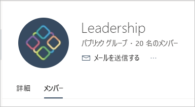

# Power BI でクラシック ワークスペースを作成する

Power BI では、"*ワークスペース*" を作成することができます。このワークスペースは、同僚と共同でダッシュボード、レポート、およびページ分割されたレポートのコレクションを作成して調整するための場所です。 その後、それらのコレクションをまとめて "*アプリ*" にバンドルできます。これにより、所属の組織全体や特定のユーザーまたはグループに配布することができます。 

**ご存知でしたか?** Power BI で新しいワークスペース エクスペリエンスが提供されるようになりました。これは既定値となります。 新しいワークスペースの詳細については、「[Power BI の新しいワークスペースで作業を整理する](service-new-workspaces.md)」を参照してください。 

クラシック ワークスペースを作成するときは、基になる、関連する Office 365 グループを作成します。 ワークスペースの管理はすべて Office 365 で行われます。 こうしたワークスペースには、メンバーまたは管理者として、同僚を追加することができます。 ワークスペースでは、より広範な対象ユーザーに発行する予定のダッシュボード、レポート、およびその他の記事で、全員が共同作業を行うことできます。 ワークスペースに追加するすべてのユーザーに、Power BI Pro のライセンスが必要となります。 

## ビデオ:アプリとワークスペース
<iframe width="640" height="360" src="https://www.youtube.com/embed/Ey5pyrr7Lk8?showinfo=0" frameborder="0" allowfullscreen></iframe>

## Office 365 グループに基づいてクラシック ワークスペースを作成する

ワークスペースは Office 365 グループを基に作成します。

[!INCLUDE [powerbi-service-create-app-workspace](./includes/powerbi-service-create-app-workspace.md)]

最初に作成するとき、場合によっては、ワークスペースが Office 365 に反映されるまで 1 時間程度待つ必要があります。 

### Office 365 ワークスペースにイメージを追加する (省略可能)
既定では、Power BI は、アプリの頭文字を使用した色付きの小さな丸をアプリに作成します。 しかし、画像でカスタマイズする必要があるかもしれません。 画像を追加するには、Exchange Online ライセンスが必要です。

1. **[ワークスペース]** を選択し、ワークスペースの名前の横にある**その他のオプション** (...) を選択して、 **[メンバー]** を選択します。 
   
     
   
    ワークスペースの Office 365 Outlook アカウントが、新しいブラウザー ウィンドウで開きます。
2. **[編集]** 鉛筆を選択します。
   
     
3. カメラ画像を選択し、使用する画像を検索します。
   
     

     画像には、.png、.jpg、.bmp のいずれかのファイルを使用できます。 ファイルのサイズは、最大で 3 MB にすることができます。 

4. **[OK]** を選択し、 **[保存]** を選択します。
   
    Office 365 Outlook のウィンドウで、色付きの丸がその画像に置き換えられます。 
   
     
   
    数分後に、Power BI のアプリでも画像が表示されます。

## ワークスペースにコンテンツを追加する

ワークスペースを作成したら、次はコンテンツを追加します。 これはマイ ワークスペースにコンテンツを追加する場合と似ていますが、ワークスペース内の他のユーザーが表示だけでなく編集もできる点が異なります。 大きな違いは、作業が完了したら、アプリとしてコンテンツを発行できることです。 ワークスペースのコンテンツ リストでコンテンツを表示すると、ワークスペースの名前が所有者としてリストされます。

### ワークスペースでサード パーティ サービスに接続する

Power BI でサポートされるすべてのサード パーティ サービスに対してアプリが提供されます。これにより、Microsoft Dynamics CRM、Salesforce、Google Analytics などの使用するサービスからデータを簡単に取得することができます。 組織のアプリを発行して、ユーザーが必要とするデータをそのユーザーに提供することができます。

現在のワークスペースでは、組織のコンテンツ パックと、Microsoft Dynamics CRM、Salesforce、Google Analytics などのサード パーティのコンテンツ パックを使用して接続することもできます。 組織のコンテンツ パックをアプリに移行することを検討してください。

## アプリを配布する

組織内の大勢の対象ユーザーに公式コンテンツを配布する場合は、ワークスペースからアプリを発行できます。  コンテンツが用意できたら、発行するダッシュボードやレポートを選択し、それを "*アプリ*" として発行します。 各ワークスペースから 1 つのアプリを作成できます。

ナビ ペインにあるアプリの一覧には、インストールしたすべてのアプリが表示されます。 同僚はいくつかの異なる方法でアプリを取得することができます。 
- Microsoft AppSource からアプリを検索してインストールできます。
- これらのユーザーに直接リンクを送信できます。 
- Power BI 管理者からアクセス許可が与えられている場合は、同僚の Power BI アカウントにアプリを自動的にインストールすることができます。 

ワークスペースから更新プログラムを公開すると、更新されたアプリ コンテンツがユーザーに自動的に表示されます。 ワークスペースのアプリ コンテンツによって使用されるデータセットの更新スケジュールを設定すると、データ更新の頻度を制御できます。 詳細については、「[Power BI でアプリを発行する](service-create-distribute-apps.md)」を参照してください。

## Power BI クラシック アプリに関する FAQ

### アプリと組織のコンテンツ パックとの違いは何ですか?
アプリは、組織のコンテンツ パックが進化したものです。 組織のコンテンツ パックが既にある場合は、アプリと並行して使用することになります。 アプリとコンテンツ パックには、大きな違いがいくつかあります。 

* ビジネス ユーザーがコンテンツ パックをインストールすると、グループ化された ID が失われ、他のダッシュボードやレポートと混在した単なるダッシュボードとレポートの一覧になります。 一方、アプリではインストール後もグループ化および ID が維持されます。 このグループ化により、ビジネス ユーザーは時間が経っても簡単にアクセスすることができます。
* 任意のワークスペースから複数のコンテンツ パックを作成できますが、アプリとそのワークスペースの間には 1 対 1 の関係があります。 
* 将来的には、組織のコンテンツ パックは廃止される予定のため、今後はアプリを作成することをお勧めします。  
* 新しいワークスペース エクスペリエンスの使用は、組織のコンテンツ パックの廃止への第一歩となります。 それらを新しいワークスペースで使用したり、作成したりすることはできません。

2 つを比較するには、[新しいワークスペースと既存のワークスペースの相違点](service-new-workspaces.md#how-the-new-workspaces-are-different)に関する記事を参照してください。 

## 次の手順
* [Power BI にアプリをインストールし、使用する](service-create-distribute-apps.md)
- [新しいワークスペースを作成する](service-create-the-new-workspaces.md)
* わからないことがある場合は、 [Power BI コミュニティで質問してみてください](https://community.powerbi.com/)。
