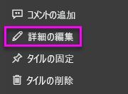

# <a name="add-images-videos-and-more-to-your-dashboard"></a>画像やビデオなどをダッシュボードに追加する

ダッシュボードにタイルを追加すると、画像、テキスト ボックス、ビデオ、ストリーミング データ、Web コードをダッシュボードに配置できます。 

Amanda がダッシュボードにタイルを追加する様子をご覧ください。

   
<iframe width="560" height="315" src="https://www.youtube.com/embed/e2PD8m1Q0vU" frameborder="0" allowfullscreen></iframe>


## <a name="add-an-image-video-or-other-tile"></a>画像、ビデオ、またはその他のタイルを追加する
画像、テキスト ボックス、ビデオ、ストリーミング データ、または Web コードをダッシュボードに直接追加できます。

1. ダッシュボードの上部のメニュー バーから **[タイルの追加]** を選択します。 領域の制限によっては、プラス  記号のみが表示される場合があります。
   
    
2. 次の中から追加するタイルを選択します: 

    **[Web コンテンツ](#add-web-content)**

    **[画像](#add-an-image)**

    **[テキスト ボックス](#add-a-text-box-or-dashboard-heading)**

    **[ビデオ](#add-a-video)**

    **[カスタム ストリーミング データ](#add-streaming-data)**
   
    ![[タイルの追加] ウィンドウ](media/service-dashboard-add-widget/power-bi-add-tile.png)

## <a name="add-an-image"></a>イメージの追加
会社のロゴまたはその他の画像をダッシュボードに追加する場合は、画像ファイルをオンラインで保存し、それにリンクします。 画像ファイルへのアクセスにセキュリティ資格情報が必要ないことを確認します。 たとえば、OneDrive と SharePoint では認証を必要とするため、そこに格納されている画像をこの方法でダッシュボードに追加することはできません。  

1. **[タイルの追加]** ウィンドウから、 **[画像]**  >  **[次へ]** の順に選択します。

2. **[画像タイルの追加]** ウィンドウで、画像の情報を追加します。   
   
   a. 画像の上にタイトルを表示するには、 **[タイトルとサブタイトルの表示]** を選び、 **[タイトル]** と省略可能な **[サブタイトル]** を入力します。

   b. 画像の **[URL]** を入力します。

   c. タイルにハイパーリンクを設定するには、 **[カスタム リンクの設定]** を選び、 **[URL]** を入力します。 

      同僚が画像またはタイトルをクリックすると、この URL に移動します。

   d.グループ メンバーがコンテンツ パックを簡単に見つけられるようにロゴを追加します。 **[適用]** を選択します。 

      

3. ダッシュボードで、必要に応じてイメージのサイズを変更したり、移動したりします。
     
     

## <a name="add-a-text-box-or-dashboard-heading"></a>テキスト ボックスまたはダッシュボードの見出しを追加する

ダッシュボードの見出しを追加するには、テキスト ボックスに見出しを入力して、フォントを大きくします。

1. **[タイルの追加]** ウィンドウで、 **[テキスト ボックス]**  >  **[次へ]** の順に選択します。

2. テキスト ボックスの書式を設定します。
   
   a. テキスト ボックスの上にタイトルを表示するには、 **[タイトルとサブタイトルの表示]** を選び、 **[タイトル]** と省略可能な **[サブタイトル]** を入力します。

   b. テキスト ボックスの **[コンテンツ]** を入力し、書式を設定します。  

   c. 必要に応じて、タイトルのカスタム リンクを設定します。 カスタム リンクは、外部のサイトでも、ワークスペース内のダッシュボードやレポートでもかまいません。 しかし、この例では、テキスト ボックス自体にハイパーリンクを追加しました。そのため、 **[カスタム リンクの設定]** はオフのままにします。

   d.グループ メンバーがコンテンツ パックを簡単に見つけられるようにロゴを追加します。 **[適用]** を選択します。 

     ![[テキストボックス タイルの追加] ウィンドウ](media/service-dashboard-add-widget/power-bi-add-textbox.png)
   
3. ダッシュボードで、必要に応じてテキスト ボックスのサイズを変更したり、移動したりします。
   
   

## <a name="add-a-video"></a>ビデオの追加
ダッシュボードに YouTube または Vimeo ビデオ タイルを追加すると、ダッシュボードでビデオが再生されます。

1. **[タイルの追加]** ウィンドウで、 **[ビデオ]**  >  **[次へ]** の順に選択します。
2. **[ビデオ タイルの追加]** ウィンドウでビデオの情報を追加します。   
   
   a. ビデオ タイルの上部にタイトルとサブタイトルを表示するには、 **[タイトルとサブタイトルの表示]** を選び、 **[タイトル]** と必要に応じて **[サブタイトル]** を入力します。 この例では、 **[サブタイトル]** を追加し、それを YouTube の再生リスト全体へのハイパーリンクに変換します。

   b. ビデオの **[ビデオの URL]** を入力します。

   c. **[タイトル]** と **[サブタイトル]** のハイパーリンクを追加し、同僚が埋め込みビデオを視聴した後に YouTube の再生リスト全体を表示できるようにします。 これを行うには、 **[機能]** で **[カスタム リンクの設定]** を選択し、再生リストの **[URL]** を入力します。

   d.グループ メンバーがコンテンツ パックを簡単に見つけられるようにロゴを追加します。 **[適用]** を選択します。  

   ![[ビデオ タイルの追加] ウィンドウ](media/service-dashboard-add-widget/power-bi-add-video-new.png)

3. ダッシュボードで、必要に応じてビデオのサイズを変更したり、移動したりします。
     
   
4. ビデオを再生するビデオ タイルを選びます。
5. サブタイトルを選び、YouTube の再生リストにアクセスします。

## <a name="add-streaming-data"></a>ストリーミング データの追加
PubNub を使用して、Twitter フィードやセンサー データなどのストリーミング データを、ダッシュボードのタイルに追加することができます。 PubNub からデータを取得するための統合は、Power BI によって作成されています。 ここでは、Will がそのしくみについて説明します。
   

<iframe width="560" height="315" src="https://www.youtube.com/embed/kOuINwgkEkQ" frameborder="0" allowfullscreen></iframe>

1. **[タイルの追加]** ウィンドウで、 **[カスタム ストリーミング データ]**  >  **[次へ]** の順に選択します。
2. **[ストリーミング データセットの追加]** を選択します。
3. Power BI API または PubNub を使用して、**新しいストリーミング データセット**を作成します。
4. **[データセット名]** 、 **[サブスクリプション キー]** 、 **[チャネル名]** の各フィールドに入力します。 セキュリティで保護された接続の場合は、承認キーもあります。 PubNub のサンプル値を使って試してみることができます。
5. **[次へ]** を選びます。
    データセットで使用できるフィールドと、データ型および JSON 形式が表示されます。
6. **[接続]** を選択します。
    ストリーミング データセットを作成しました。
7. ダッシュボードに戻り、もう一度 **[タイルの追加]**  >  **[カスタム ストリーミング データ]**  >  **[次へ]** の順に選択します。
8. 作成したセンサー データ データセット > **[次へ]** の順に選択します。
9. 必要な視覚化タイプを選択します。 多くの場合、このデータには折れ線グラフが適しています。
10. **[軸]** 、 **[凡例]** 、および **[値]** を選択します。
11. 秒、分、または時単位で表示する時間の長さを決定します。
12. **[次へ]** を選びます。
13. 必要に応じて、 **[タイトル]** と **[サブタイトル]** を指定します。
14. それをダッシュボードにピン留めします。


1. **[タイルの追加]** ウィンドウで、 **[カスタム ストリーミング データ]**  >  **[次へ]** の順に選択します。

2. **[ストリーミング データセットの追加]** を選択します。

3. Power BI API または PubNub を使用して、**新しいストリーミング データセット**を作成します。

4. **[データセット名]** 、 **[サブスクリプション キー]** 、 **[チャネル名]** の各フィールドに入力します。 セキュリティで保護された接続の場合は、承認キーもあります。 PubNub のサンプル値を使って試してみることができます。

5. **[次へ]** を選びます。

   データセットで使用できるフィールドと、データ型および JSON 形式が表示されます。

6. **[接続]** を選択します。

   ストリーミング データセットを作成しました。

7. ダッシュボードに戻り、もう一度 **[タイルの追加]**  >  **[カスタム ストリーミング データ]**  >  **[次へ]** の順に選択します。

8. 作成したセンサー データ データセット > **[次へ]** の順に選択します。

9. 必要な視覚化タイプを選択します。 多くの場合、このデータには折れ線グラフが適しています。

10. **[軸]** 、 **[凡例]** 、および **[値]** を選択します。

11. 秒、分、または時単位で表示する時間の長さを決定します。

12. **[次へ]** を選びます。

13. 必要に応じて、 **[タイトル]** と **[サブタイトル]** を指定します。

14. それをダッシュボードにピン留めします。

## <a name="add-web-content"></a>Web コンテンツの追加
任意の HTML コンテンツをタイルとして、レポートまたはダッシュボードに貼り付けるか、あるいは入力することができます。 埋め込みコードを手動で入力するか、Twitter、YouTube、embed.ly などのサイトからコピーして貼り付けます。

1. **[タイルの追加]** ウィンドウで、 **[Web コンテンツ]**  >  **[次へ]** の順に選択します。

2. **[Web コンテンツ タイルの追加]** ウィンドウに情報を追加します。
   
   a. タイルの上にタイトルを表示するには、 **[タイトルとサブタイトルの表示]** を選び、 **[タイトル]** と省略可能な **[サブタイトル]** を入力します。

   b. 埋め込みコードを入力します。 この例では、Twitter フィードをコピーして貼り付けています。

   c. **[適用]** を選択します。

   ![[Web コンテンツ タイルの追加] ウィンドウ](media/service-dashboard-add-widget/power-bi-add-web-content.png)
   

3. ダッシュボードで、必要に応じて Web コンテンツのサイズを変更したり、移動したりします。
     
   

### <a name="tips-for-embedding-web-content"></a>Web コンテンツを埋め込むためのヒント
* iframe には、セキュリティで保護されたソースを使います。 iframe の埋め込みコードを入力したときにタイルが空白になった場合は、iframe ソースに *http* を使用していないことを確認します。 使用している場合は、*https* に変更します。
  
  ```html
  <iframe src="https://xyz.com">
  ```
* 幅と高さの情報を編集します。 埋め込みコードでは、ビデオを埋め込み、ビデオ プレーヤーを 560 x 315 ピクセルに設定します。 タイルのサイズを変更しても、このサイズは変わりません。
  
  ```html
  <iframe width="560" height="315"
  src="https://www.youtube.com/embed/Cle_rKBpZ28" frameborder="0"
   allowfullscreen></iframe>
  ```
  
  タイルのサイズに合わせてプレーヤーのサイズを変更する場合は、幅と高さを 100% に設定します。
  
  ```html
  <iframe width="100%" height="100%"
  src="https://www.youtube.com/embed/Cle_rKBpZ28" frameborder="0"
   allowfullscreen></iframe>
  ```
* このコードでは、ツイートを埋め込み、AFK ポッドキャスト、\@GuyInACube の Twitter ページ、フォロー、#analytics、返信、リツイート、いいねのリンクが、ダッシュボードに別個のリンクとして保持されます。  タイルそのものを選択すると、Twitter のポッドキャストに移動します。
  
  ```html
  <blockquote class="twitter-tweet" data-partner="tweetdeck">
  <p lang="en" dir="ltr">Listen to
  <a href="https://twitter.com/GuyInACube">@GuyInACube</a> talk to
  us about making videos about Microsoft Business Intelligence
  platform
  <a href="https://t.co/TmRgalz7tv">https://t.co/TmRgalz7tv </a>
  <a href="https://twitter.com/hashtag/analytics?src=hash">
  #analytics</a></p>&mdash; AFTK Podcast (@aftkpodcast) <a
  href="https://twitter.com/aftkpodcast/status/693465456531771392">
  January 30, 2016</a></blockquote> <script async src="//platform.twitter.com/widgets.js" charset="utf-8"></script>
  ```

## <a name="edit-a-tile"></a>タイルを編集する
既存のタイルに変更を加えるには:

1. タイルの右上隅にマウス ポインターを移動し、**その他のオプション** (...) を選択します。
   
    
2. **[詳細の編集]** を選択し、 **[タイルの詳細]** ウィンドウを表示して変更を加えます。
   
    

## <a name="considerations-and-troubleshooting"></a>考慮事項とトラブルシューティング
* ダッシュボードのタイルを移動しやすくするには、タイトルと省略可能なサブタイトルを追加します。
* Web サイトからコンテンツを埋め込みたいが、コピーして貼り付けるための埋め込みコードが Web サイトで提供されていない場合は、embed.ly で埋め込みコードの生成に関するヘルプを参照してください。

## <a name="next-steps"></a>次のステップ
[Power BI デザイナーのダッシュボードのタイルの概要](service-dashboard-tiles.md)

他にわからないことがある場合は、 [Power BI コミュニティを利用してください](https://community.powerbi.com/)。

