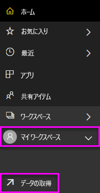
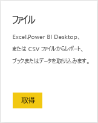
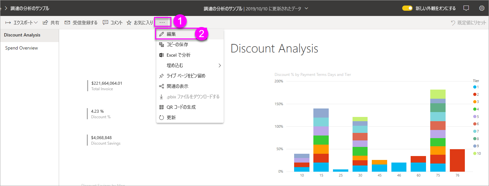
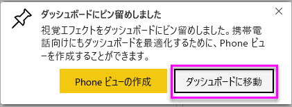
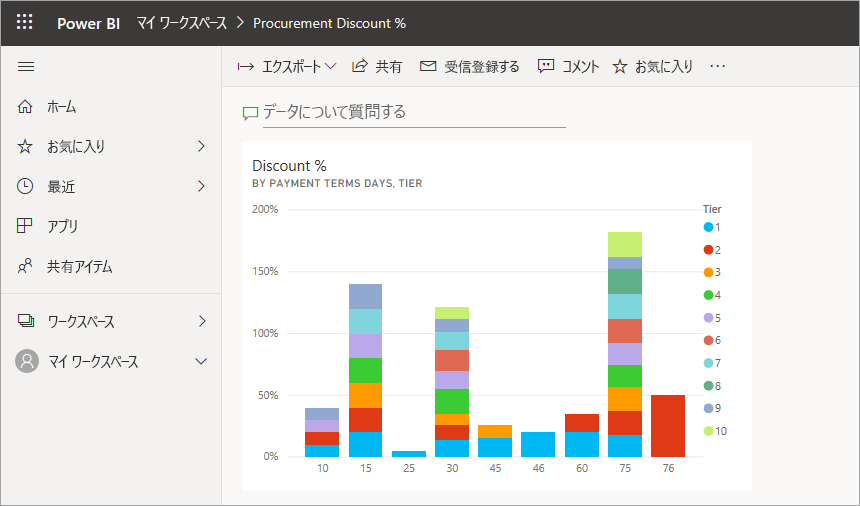
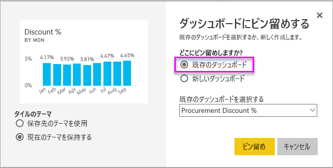
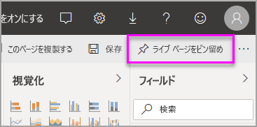
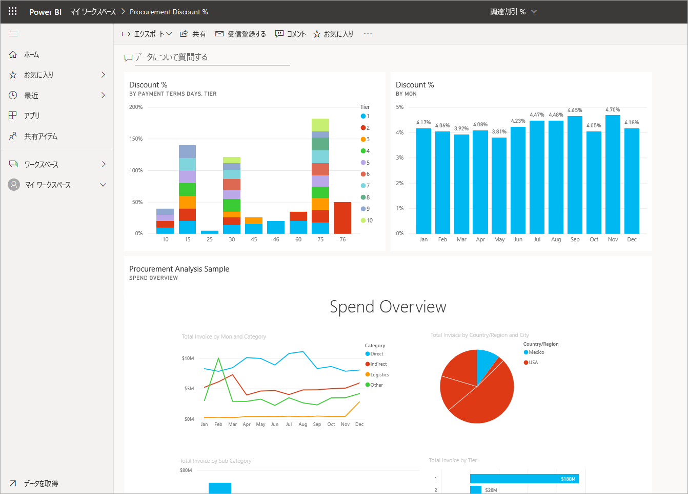

# レポートから Power BI ダッシュボードを作成する
「[Power BI デザイナーのダッシュボードの概要](service-dashboards.md)」を読みました。今度は自分のダッシュボードを作成します。 ダッシュボードを作成するには、さまざまな方法があります。 たとえば、レポートから、何もない状態から、データセットから、または既存のダッシュボードを複製して、ダッシュボードを作成できます。  

初めて取り掛かるときは難しそうに見えるかもしれません。そのため、まずはレポートから視覚エフェクトをピン留めして、手早く簡単にダッシュボードを作成します。レポートはあらかじめ用意されているものを使用します。 

このクイックスタートを完了すると、次のことを十分に理解できるようになります。
- ダッシュボードとレポートの関係
- レポート エディターで編集ビューを開く方法
- タイルをピン留めする方法 
- ダッシュボードとレポートの間を移動する方法 

## ダッシュボードを作成できるユーザー
ダッシュボードを作成する機能は "*作成者*" の機能であり、レポートに対する編集のアクセス許可が必要です。 編集のアクセス許可はレポート作成者と、作成者からアクセス許可を付与された同僚が使用できます。 たとえば、David が WorkspaceABC でレポートを作成し、そのワークスペースのメンバーとしてユーザーを追加した場合、David とそのユーザーの両方に編集のアクセス許可があることになります。 これに対して、直接または [Power BI アプリ](service-create-distribute-apps.md)の一部としてレポートが共有されている場合 (ユーザーはレポートを "*使用*" します)、ダッシュボードにタイルをピン留めすることはできません。
 

> [!NOTE] 
> ダッシュボードは、Power BI Desktop ではなく、Power BI サービスの機能です。 Power BI モバイルでは、ダッシュボードを作成することはできませんが、そこで[表示して共有する](consumer/mobile/mobile-apps-view-dashboard.md)ことはできます。
>
> 

## ビデオ:レポートからビジュアルとイメージをピン留めすることでダッシュボードを作成する
レポートからの視覚化をピン留めして、新しいダッシュボードを作成する手順をご覧ください。 その後は、「[レポートでデータセットをインポートする](#import-a-dataset-with-a-report)」で説明されている手順に従い、調達の分析のサンプルを使ってご自身でお試しください。
    

<iframe width="560" height="315" src="https://www.youtube.com/embed/lJKgWnvl6bQ" frameborder="0" allowfullscreen></iframe>

## レポートでデータセットをインポートする
Power BI サンプル データセットの 1 つをインポートし、それを使って新しいダッシュボードを作成します。 ここで使うサンプルは、2 つの PowerView を含む Excel ブックです。 Power BI でブックをインポートすると、データセットとレポートがワークスペースに追加されます。 レポートは、PowerView シートから自動的に作成されます。

1. 調達の分析のサンプルの [Excel ファイル](http://go.microsoft.com/fwlink/?LinkId=529784)をダウンロードします。 OneDrive for Business に保存することをお勧めします。
2. ブラウザーで Power BI サービス (app.powerbi.com) を開きます。
3. 左側のナビゲーション パネルから **[マイ ワークスペース]** を選択し、次に **[データの取得]** を選択します。

    
5. **[ファイル]** を選択します。

   
6. 調達の分析のサンプルの Excel ファイルを保存した場所に移動します。 ファイルを選び、 **[接続]** を選択します。

   
7. この演習では、 **[インポート]** を選択します。

    
8. 成功メッセージが表示されたら、 **[x]** を選択して閉じます。

   

### レポートを開いてダッシュボードにタイルをピン留めする
1. 同じワークスペースで **[レポート]** タブを選択し、 **[調達の分析のサンプル]** を選択してレポートを開きます。

    ![[レポート] タブ](media/service-dashboard-create/power-bi-reports.png) 読み取りビューでレポートが開きます。 下部に 2 つのタブがあります。 **[割引の分析]** と **[支出の概要]** です。 各タブはレポートのページを表します。

2. **[レポートの編集]** を選んで、編集ビューでレポートを開きます。

    
3. 視覚化をポイントして、使用可能なオプションを表示します。 ダッシュボードに視覚エフェクトを追加するには、ピン留めアイコンを選択します .

    
4. ここでは新しいダッシュボードを作成しているため、 **[新しいダッシュボード]** オプションを選択して名前を指定します。

    
5. **[ピン留め]** を選択すると、現在のワークスペースに新しいダッシュボードが作成されます。 **[ダッシュボードにピン留めしました]** というメッセージが表示されたら、 **[ダッシュボードに移動]** を選択します。 レポートの保存を求めるメッセージが表示されたら、 **[保存]** を選択します。

    

    Power BI で新しいダッシュボードが開きます。 1 つのタイルがあります。ピン留めしたばかりの視覚エフェクトです。

   
7. タイルを選択してレポートに戻ります。 新しいダッシュボードにさらにいくつかタイルをピン留めします。 **[ダッシュボードにピン留めする]** ウィンドウが表示されたら、 **[既存のダッシュボード]** を選択します。  

   

## レポート ページ全体をダッシュボードにピン留めする
1 度に 1 つのビジュアルをピン留めするのではなく、[レポート ページ全体を*ライブ タイル*としてピン留め](service-dashboard-pin-live-tile-from-report.md)できます。 やってみましょう。

1. レポート エディターで、 **[支出の概要]** タブを選択して、レポートの 2 ページ目を開きます。

   

2. ダッシュボードにレポートの視覚エフェクトをすべて表示してみましょう。 メニューバーの右上隅で、 **[ライブ ページをピン留めする]** を選択します。 ダッシュボードではページが更新されるたびに、ライブ ページのタイルが更新されます。

   

3. **[ダッシュボードにピン留めする]** ウィンドウが表示されたら、 **[既存のダッシュボード]** を選択します。

   

4. 成功メッセージが表示されたら、 **[ダッシュボードに移動]** を選択します。 そこに、レポートからピン留めされたタイルが表示されています。 次の例では、レポートの 1 ページ目から 2 つのタイルを、レポートの 2 ページ目から 1 つのライブ タイルをピン留めしています。

   

## 次の手順
これで初めてのダッシュボードを作成できました。 作成したダッシュボードでは、さらに多くの処理を行うことができます。 以下に提案されている記事のいずれかに従うか、ご自分で調査を開始してください。 

* [タイルのサイズを変更したり、移動したりする](service-dashboard-edit-tile.md)
* [ダッシュボードのタイルの概要](service-dashboard-tiles.md)
* [アプリを作成することによってダッシュボードを共有する](service-create-workspaces.md)
* [Power BI - 基本的な概念](service-basic-concepts.md)
* [優れたダッシュボードのデザインに関するヒント](service-dashboards-design-tips.md)

他にわからないことがある場合は、 [Power BI コミュニティを利用してください](http://community.powerbi.com/)。
