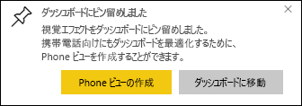

# レポートから Power BI ダッシュボードにタイルをピン留め

[ダッシュボード タイル](consumer/end-user-tiles.md)を追加する方法の 1 つは、[Power BI レポート](consumer/end-user-reports.md)から追加することです。 これらのタイルのいずれかを選択すると、レポートに表示されます。

レポート ページ全体をダッシュボードにピン留めすることができます。これは "*ライブ*" タイルのピン留めと呼ばれます。 ダッシュボード上でタイルを操作できるので、ライブ タイルと呼ばれます。 個々の視覚化タイルとは異なり、レポートに加えた変更は自動的にダッシュボードと同期されます。 詳細については、「[レポート ページ全体をピン留めする](#pin-an-entire-report-page)」をご覧ください。

他のユーザーと共有したレポートから、または Power BI Desktop から、タイルをピン留めすることはできません。 

> [!TIP]
> 一部の視覚エフェクトでは背景画像が使用されるため、背景画像が大きすぎると、ピン留めが機能しないことがあります。 画像のサイズを小さくするか、画像の圧縮を使ってみてください。  
> 
> 

## レポートからタイルをピン留めする
Amanda が Power BI レポートからビジュアルとイメージを固定することでダッシュ ボードを作成している様子をご覧ください。
    

<iframe width="560" height="315" src="https://www.youtube.com/embed/lJKgWnvl6bQ" frameborder="0" allowfullscreen></iframe>

それでは、Power BI サンプル レポートの 1 つを使用して、独自のダッシュ ボードを作成していきましょう。

1. レポート内で、ピン留めする視覚エフェクトにポインターを合わせ、ピン留めアイコン  を選択します。 Power BI で **[ダッシュボードにピン留め]** 画面が開きます。
   
     ![[ダッシュボードにピン留め] ウィンドウ](media/service-dashboard-pin-tile-from-report/pbi_themes2.png)
2. 既存のダッシュボードと新しいダッシュボードのどちらにピン留めするかを選択します。
   
   * **既存のダッシュボード**: ドロップダウンから、ダッシュボードの名前を選びます。 共有したダッシュボードはドロップダウンに表示されません。
   * **新しいダッシュボード**: 新しいフォルダーの名前を入力します。
3. 場合によっては、ピン留めする項目には既に "*テーマ*" が適用されている場合があります。 たとえば、Excel ブックからピン留めされたビジュアルの場合です。 その場合、タイルに適用するテーマを選びます。
4. **[Pin]** (ピン留め) を選択します。
   
   右上隅の近くに表示される成功メッセージによって、視覚エフェクトがダッシュボードにタイルとして追加されたことが通知されます。
   
   
5. ナビ ペインから、新しいタイルを持つダッシュボードを選びます。 [タイルの表示と動作を編集する](service-dashboard-edit-tile.md)か、タイルを選択してレポートに戻ります。

## レポート ページ全体をピン留めする
別のオプションとして、レポート ページ全体をダッシュボードにピン留めすることもできます。これは、一度に複数の視覚エフェクトをピン留めする簡単な方法です。 ページ全体をピン留めすると、タイルは "*ライブ*" になります。 つまり、ダッシュボード上で操作できます。 レポート エディターで視覚エフェクトに加えるすべての変更 (フィルターの追加、チャートで使用されるフィールドの変更など) は、ダッシュボード タイルにも反映されます。  

詳細については、「[レポート ページ全体をピン留めする](service-dashboard-pin-live-tile-from-report.md)」をご覧ください。

## 次の手順
- [Power BI サービスの利用者向けのダッシュボード](consumer/end-user-dashboards.md)
- [Power BI のダッシュボードのタイル](consumer/end-user-tiles.md)
- [Power BI のレポート](consumer/end-user-reports.md)
- [Power BI でのデータの更新](refresh-data.md)
- [Power BI サービスのデザイナー向けの基本的な概念](service-basic-concepts.md)

他にわからないことがある場合は、 [Power BI コミュニティを利用してください](https://community.powerbi.com/)。

