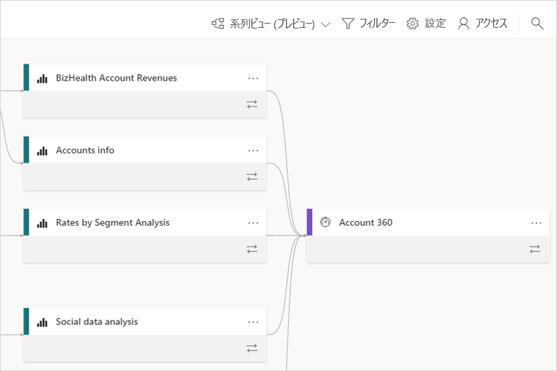
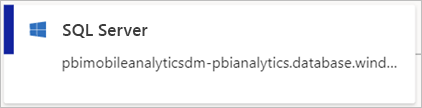
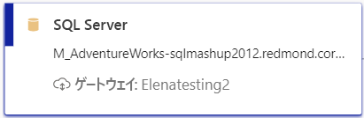
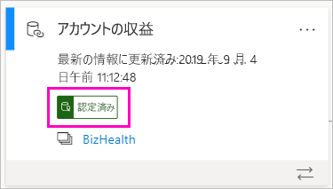
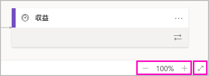

# データ系列 (プレビュー)
最新のビジネス インテリジェンス (BI) プロジェクトでは、データ ソースから宛先へのデータ フローを理解することが課題となる可能性があります。 複数のデータ ソース、成果物、および依存関係にまたがる高度な分析プロジェクトを構築した場合、この課題はさらに大きくなります。  "このデータを変更すると、どうなりますか?" または、"このレポートが最新の状態ではないのはなぜですか" などの質問に 答えるのは難しい場合があります。 そのような質問を理解するには、専門家のチームまたは詳細な調査が必要な場合があります。 お客様がそれらの質問に容易に答えられるように、データ系列ビューを設計しました。

 
Power BI には、ダッシュボード、レポート、データセット、データフローなど、複数の種類の成果物があります。 データセットおよびデータフローの多くは、SQL Server などの外部データソースや、他のワークスペース内にある外部データセットに接続されます。 ご自分のワークスペースの外部にあるデータセットの場合は、それは、IT 部門のだれか、または別のアナリストが所有するワークスペース内に存在している可能性があります。 外部のデータソースおよびデータセットを使用すると、最終的にデータの取得元を把握することが難しくなります。 複雑なプロジェクトにも、よりシンプルなプロジェクトにも対応する系列ビューを導入しました。 

系列ビューでは、ワークスペース内のすべての成果物と、そのすべての外部依存関係との系列リレーションシップが表示されます。 データフローには既にダイアグラム ビューが用意されていますが、系列ビューではそのビューが拡張されています。 系列ビューでは、すべてのワークスペース成果物間の接続 (アップストリームおよびダウンストリームの両方のデータフローへの接続を含む) が表示されます。 個別のデータフロー ダイアグラム ビューは 11 月から廃止されます。

## 系列ビューの探索

[マイワークスペース] を除くすべてのワークスペース (新規またはクラシックに関わらず) には、系列ビューが自動的に用意されます。 ワークスペースで系列ビューを表示するには、少なくとも共同作成者ロールが必要です。 詳細については、この記事の「[アクセス許可](#permissions)」を参照してください。 

- 系列ビューにアクセスするには、ワークスペースのリスト ビューにアクセスします。 **[リスト ビュー]** の横にある矢印をタップし、 **[系列ビュー]** を選択します。

    

    このビューでは、すべてのワークスペース成果物が表示されると共に、ワークスペース成果物間でのデータの流れが示されます。

**データ ソース**

データセットおよびデータフローのデータ取得元であるデータ ソースが表示されます。 データ ソース カードには、ソースを識別するのに役立つ詳細情報が表示されます。 たとえば、Azure SQL サーバーの場合は、データベース名も表示されます。

 
**ゲートウェイ**

オンプレミスのゲートウェイ経由でデータソースが接続されている場合は、データソース カードにはゲートウェイに関する情報が追加されます。 ゲートウェイ管理者またはデータ ソース ユーザーとしてのアクセス許可を持っている場合は、ゲートウェイ名などの詳細情報が表示されます。

**データセットとデータフロー**
 
データセットに関しては、前回の更新時刻と、データセットが認定または昇格されているかどうかが表示されます。

 
ワークスペース内のレポートが別のワークスペース内のデータセットに基づいて作成されている場合は、データセット カードにソース ワークスペースの名前が表示されます。 ソース ワークスペース名を選択して、そのワークスペースにアクセスします。
 
- 任意の成果物について、省略記号 (...) を選択すると、[オプション] メニューが表示されます。 リスト ビューで使用できるすべてのアクションが用意されています。
  
データセットに関する詳細なメタデータを表示するには、データセット カード自体を選択します。 作業ウィンドウにデータセットに関する追加情報が表示されます。

 
## 任意の成果物について系列を表示する 

特定の成果物に対する系列を表示したいとします。

- 成果物の下にある二重矢印を選択します。

    

    Power BI では、その成果物に関連するすべての成果物が強調表示され、残りは灰色表示になります。 

## ナビゲーションと全画面表示 

系列ビューは対話型のキャンバスです。 マウスおよびタッチパッドを使用することで、キャンバス内を移動し、拡大または縮小を行うことができます。  

- 拡大および縮小を行うには、右下隅にあるメニューを使用するか、マウスまたはタッチパッドを使用します。 

- グラフ自体の領域を大きくするには、右下隅にある全画面表示オプションを使用します。 

    

## アクセス許可

- 系列ビューを表示するには、Power BI Pro ライセンスが必要です。
- 系列ビューを使用できるのは、ワークスペースへのアクセス権を持つユーザーに限られています。
- ユーザーは、ワークスペース内での管理者ロール、メンバー ロール、または共同作成者ロールを持っている必要があります。 ビューアー ロールしか持たないユーザーは、系列ビューに切り替えることができません。

## 考慮事項と制限事項

系列ビューは、Internet Explorer で使用することはできません。 詳細については、「[Supported browsers for Power BI](power-bi-browsers.md)」 (Power BI 用にサポートされているブラウザー) を参照してください。

## 次の手順

- [ワークスペース全体のデータセットの概要 (プレビュー)](service-datasets-across-workspaces.md)
