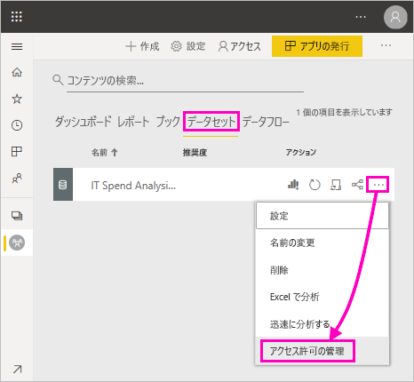
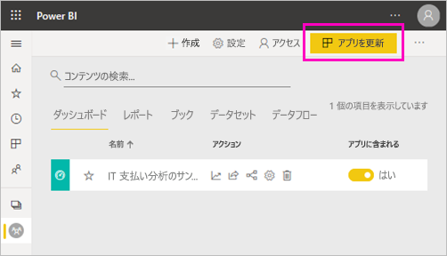

# 共有データセットのビルド アクセス許可 (プレビュー)

Power BI Desktop の*データ モデル*の作成者であれば、それらを Power BI サービスの*データセット*として共有できます。 これで、レポート作成者は共有したデータセットを簡単に見つけて再利用できるようになります。 ビルド アクセス許可を使用して、データにアクセスできるユーザーを制御する方法について説明します。

ビルド アクセス許可は、データセットにのみ関連します。 ユーザーにビルド アクセス許可を付与すると、レポート、ダッシュボード、Q&A のピン留めされたタイル、Insights Discovery などの新しいコンテンツをデータセット上に構築できます。 また、Excel で分析、XMLA、基になるデータのエクスポートを利用した Excel シートなど、Power BI 外部のデータセット上で新しいコンテンツを構築することもできます。

## ビルド アクセス許可を付与する方法

データセットに対するビルド アクセス許可は、次のいくつかの方法で付与します。

- 少なくとも共同作成者ロールを持つワークスペースのメンバーには、そのワークスペースのデータセットに対するビルド アクセス許可と、レポートをコピーするアクセス許可が自動的に付与されます。
 
- データセットが存在するワークスペースのメンバーは、アクセス許可センターの特定のユーザーまたはセキュリティ グループにアクセス許可を割り当てることができます。 ワークスペースのメンバーの場合、データセットの横にある省略記号 (...)、 **[アクセス許可の管理]** の順に選択します。

    

    これで、そのデータセットのアクセス許可センターが開き、そこでアクセス許可を設定および変更できます。

    

- データセットが存在するワークスペースの管理者またはメンバーは、アプリの発行時に、そのアプリに対するアクセス許可を持つユーザーは、基となるデータセットに対するビルド アクセス許可も取得することを決定できます。 詳細については、[データセットの共有](service-datasets-share.md)に関するページを参照してください。

- たとえば、データセットに対して再共有およびビルドのアクセス許可を持っているとします。 そのデータセットに基づいて構築されたレポートまたはダッシュボードを共有するとき、受信者が、基となるデータセットのビルド アクセス許可を取得するように指定できます。

    

データセットに対するユーザーのビルド アクセス許可を削除できます。 そうした場合、共有データセットに基づいて構築されたレポートを表示することはできますが、編集することはできなくなります。 詳細については、次のセクションを参照してください。

## データセットに対するビルド アクセス許可の削除

ある時点で、共有データセットの一部のユーザーに対するビルド アクセス許可の削除が必要になることがあります。 

1. ワークスペースで、 **[データセット]** リスト ページに移動します。 
1. データセットの横にある省略記号 (...)、 **[アクセス許可の管理]** の順に選択します。

    

1. 名前の横にある省略記号 (...)、 **[ビルドの削除]** の順に選択します。

    

    共有データセットに基づいて構築されたレポートを引き続き表示することはできますが、編集することはできなくなります。

### アプリ内のデータセットに対するビルド アクセス許可の削除

たとえば、ワークスペースからユーザーのグループにアプリを配布したとします。 後で、一部のユーザーに対するアプリへのアクセス権を削除することにします。 アプリへのアクセス権を削除しても、そのビルドが自動的に削除されることはなく、アクセス許可は再共有されます。 これは追加の手順です。 

1. ワークスペースのリスト ページで、 **[アプリを更新]** を選択します。 

    

1. **[アクセス許可]** タブで、 **[X]** を選択して人またはグループを削除します。 

    ![[X] の選択](media/service-datasets-build-permissions/power-bi-app-delete-user.png)
1. **[アプリを更新]** を選択します。

    既存のアクセス権を持つユーザーに対するビルド アクセス許可を削除するために、 **[アクセス許可の管理]** にアクセスする必要があることを示すメッセージが表示されます。 

    

1. **[更新]** を選択します。

1. ワークスペースで、 **[データセット]** リスト ページに移動します。 
1. データセットの横にある省略記号 (...)、 **[アクセス許可の管理]** の順に選択します。

    

1. 名前の横にある省略記号 (...)、 **[ビルドの削除]** の順に選択します。

    

    共有データセットに基づいて構築されたレポートを引き続き表示することはできますが、編集することはできなくなります。

## より詳細なアクセス許可

Power BI では、既存のアクセス許可である読み取りと再共有を補完するものとして、2019 年 6 月にビルド アクセス許可が導入されました。 その時点で、アプリのアクセス許可、共有、またはワークスペースのアクセスによるデータセットの読み取りアクセス許可を既に持っていたすべてのユーザーが、その同じデータセットのビルド アクセス許可も取得しました。 ビルド アクセス許可が自動的に付与された理由は、読み取りアクセス許可によって、Excel の [分析] または [エクスポート] を使用してデータセットに基づいて新しいコンテンツを構築する権限が既に付与されていたためです。

このより詳細なビルド アクセス許可を使用すると、既存のレポートまたはダッシュボードのコンテンツのみを表示できるユーザーと、基となるデータセットに接続されたコンテンツを作成できるユーザーを選択できます。

データセットがデータセット ワークスペース以外のレポートで使用されている場合、そのデータセットを削除することはできません。 代わりに、エラー メッセージが表示されます。

ビルド アクセス許可を削除できます。 この場合、アクセス許可を取り消したユーザーは、引き続きレポートを表示できますが、レポートを編集したり、基になるデータをエクスポートしたりすることはできなくなります。 読み取りアクセス許可のみを持つユーザーは、集計データを引き続きエクスポートできます。 

## 次の手順

- [ワークスペース全体でデータセットを使用する (プレビュー)](service-datasets-across-workspaces.md)
- わからないことがある場合は、 [Power BI コミュニティで質問してみてください](http://community.powerbi.com/)。
