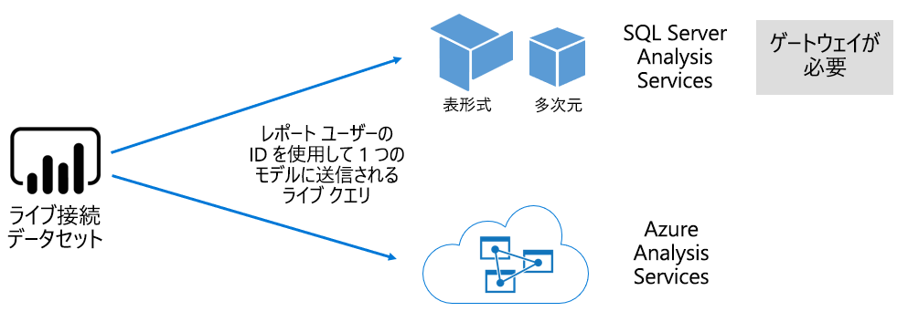

# Power BI サービスのデータセット

この記事には、Power BI データセットに関する技術的な説明が記載されています。

## データセットの種類

Power BI データセットは、レポート作成と視覚化の準備ができたデータのソースを表します。 次の方法で作成される、5 種類の異なるデータセットがあります。

- Power BI 容量でホストされていない既存のデータ モデルへの接続
- モデルを含む Power BI Desktop ファイルのアップロード
- (1 つ以上の Excel テーブル、ブックのデータ モデル、またはその両方を含む) Excel ブックのアップロード、または CSV (コンマ区切り値) ファイルのアップロード
- Power BI サービスを使用した[プッシュ データセット](developer/automation/walkthrough-push-data.md)の作成
- Power BI サービスを使用した[ストリーミング データセットまたはハイブリッド ストリーミング データセット](service-real-time-streaming.md)の作成

ストリーミング データセットを除き、データセットはデータ モデルを表し、[Analysis Services](/analysis-services/analysis-services-overview) の成熟したモデリング テクノロジが活用されます。

> [!NOTE]
> このドキュメントでは、"_データセット_" と "_モデル_" という用語が同じ意味で使用される場合があります。 これは一般に、Power BI サービスの観点からは**データセット**と呼ばれ、開発の観点からは**モデル**と呼ばれています。 このドキュメントのコンテキストでは、それらはほぼ同じ意味です。

### 外部でホストされるモデル

外部でホストされるモデルには、次の 2 種類があります:SQL Server Analysis Services と [Azure Analysis Services](/azure/analysis-services/analysis-services-overview) です。

SQL Server Analysis Services モデルに接続する場合は、それがオンプレミスであるか、VM でホストされたサービスとしてのインフラストラクチャ (IaaS) であるかにかかわらず、[オンプレミス データ ゲートウェイ](service-gateway-onprem.md)をインストールする必要があります。 Azure Analysis Services にはゲートウェイは必要ありません。

既存のモデルへの投資がある場合 (通常はエンタープライズ データ ウェアハウス (EDW) の一部を形成しています) は、Analysis Services への接続が適していることがよくあります。 Power BI では、Analysis Services への "_ライブ接続_" を作成し、Power BI レポート ユーザーの ID を使用してデータのアクセス許可を適用することができます。 SQL Server Analysis Services の場合は、多次元モデル (キューブ) と表形式モデルの両方がサポートされています。 次の図に示すように、ライブ接続データセットによって、外部でホストされるモデルにクエリが渡されます。

### Power BI Desktop で開発されたモデル

Power BI Desktop (Power BI 開発のためのクライアント アプリケーション) を使用して、モデルを開発することができます。 そのモデルは、実質的には Analysis Services 表形式モデルです。 モデルは、データフローからデータをインポートすることで開発できます。その後、これを外部データ ソースと統合できます。 モデリングを実現する方法の詳細についてはこの記事では説明しませんが、Power BI Desktop を使用して開発できるモデルには、3 つの異なる種類 (または "_モード_") が存在することを理解しておくことが重要です。 これらのモードによって、データがモデルにインポートされるかどうか、またはデータ ソース内に残るかどうかが決定されます。 次の 3 つのモードがあります:インポート、DirectQuery、複合です。 各モードの詳細については、「[Power BI サービスでのデータセットのモード](service-dataset-modes-understand.md)」の記事をご覧ください。

外部でホストされるモデルと Power BI Desktop のモデルでは、行レベルのセキュリティ (RLS) を適用して、特定のユーザーが取得できるデータを制限できます。 たとえば、**販売員**セキュリティ グループに割り当てられているユーザーは、自分が割り当てられている販売地域のレポート データのみを表示できます。 RLS ロールは、"_動的_" または "_静的_" です。 動的ロールではレポート ユーザーごとにフィルター処理されますが、静的ロールでは、そのロールに割り当てられているすべてのユーザーに対して同じフィルターが適用されます。 詳しくは、「[Power BI での行レベルのセキュリティ (RLS)](service-admin-rls.md)」をご覧ください。

### Excel ブックのモデル

[Excel ブック](service-excel-workbook-files.md)または [CSV ファイル](service-comma-separated-value-files.md)に基づいてデータセットを作成すると、モデルが自動的に作成されます。 Excel テーブルと CSV データは、モデル テーブルを作成するためにインポートされます。一方、Excel ブックのデータ モデルは、Power BI モデルを作成するために入れ替えられます。 いずれの場合でも、ファイル データはモデルにインポートされます。

## 概要

これで、モデルを表す各 Power BI データセットを区別することができます。

- それは、Power BI サービスでホストされているか、Analysis Services によって外部でホストされています。
- インポートされたデータを格納できるか、基になるデータ ソースにパススルー クエリ要求を発行できるか、またはその両方の組み合わせを使用できます。

モデルを表す Power BI データセットに関する重要な情報を、次にまとめます。

- SQL Server Analysis Services でホストされるモデルには、ライブ接続クエリを実行するためにゲートウェイが必要です。
- Power BI でホストされるモデル (データをインポートする場合):
  - クエリを実行できるように、メモリに完全に読み込む必要があります。
  - データを最新の状態に保つために更新が必要です。また、インターネット経由でソース データに直接アクセスできない場合は、ゲートウェイを使う必要があります。
- Power BI でホストされるモデルで、[DirectQuery](desktop-directquery-about.md) ストレージ モードを使用する場合は、ソース データへの接続が必要です。 このモデルに対してクエリが実行されると、Power BI によってソース データにクエリが発行され、現在のデータが取得されます。 このモードでは、インターネット経由でソース データに直接アクセスできない場合は、ゲートウェイを使う必要があります。
- モデルでは、RLS ルールを適用し、フィルターを適用して特定のユーザーに対するデータ アクセスを制限することができます。

## 考慮事項

Power BI を正常にデプロイして管理するためには、モデルがホストされている場所、そのモデルのストレージ モード、ゲートウェイへの依存、インポートされるデータのサイズ、更新の種類と頻度を把握することが重要です。 これらの構成はすべて、Power BI の容量リソースに大きな影響を与える可能性があります。 さらに、データ準備のクエリ、リレーションシップ、計算など、モデルの設計自体もすべて考慮事項に含める必要があります。

また、Power BI でホストされるインポート モデルは、スケジュールに従って更新したり、Power BI サービスのユーザーが必要に応じてトリガーしたりできることを理解しておくことも重要です。

## 次の手順

- [Power BI サービスでのデータセットのモード](service-dataset-modes-understand.md)
- 他にわからないことがある場合は、 [Power BI コミュニティで質問してみてください](https://community.powerbi.com/)。
