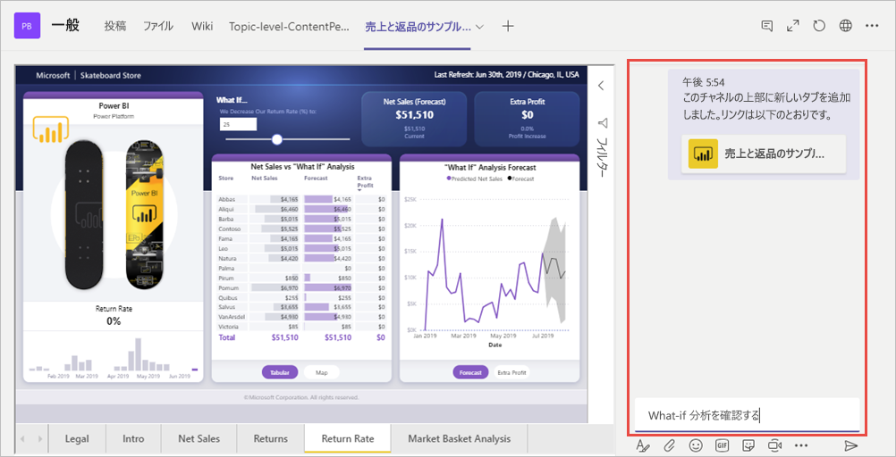

# Microsoft Teams の [Power BI] タブを使用してレポートを埋め込む

Microsoft Teams の更新済みの [Power BI] タブを使用すると、対話形式のレポートを Microsoft Teams のチャンネルまたはチャットに簡単に埋め込むことができます。

Microsoft Teams の [Power BI] タブを使用すると、チームが使用するデータを検索したり、チームのチャネル内のデータについて話し合うことができます。

## 要件

**Microsoft Teams の [Power BI] タブ**が機能するには、次のものが必要です。

- Power BI Pro ライセンス。または、レポートが含まれている、Power BI ライセンスのある [Power BI Premium 容量 (EM または P SKU)](service-premium-what-is.md)。
- Microsoft Teams の [Power BI] タブ。
- レポートを使用するには、ユーザーは Power BI サービスにサインインし、自分の Power BI ライセンスをアクティベートする必要があります。
- データを表示する権限を持つ必要があります。

## レポートを埋め込む
Microsoft Teams のチャネルまたはチャットにレポートを埋め込むには、以下の説明に従って追加します。

1. Microsoft Teams で目的のチャネルまたはチャットを開き、[ **+** ] アイコンを選択します。

    

2. [Power BI] タブを選択します。

    ![[Power BI] が選択された Microsoft Teams のタブ リスト](media/service-embed-report-microsoft-teams/service-embed-report-microsoft-teams-tab.png)

3. 指定されたオプションを使用して、ワークスペース、[自分と共有]、または Power BI アプリからレポートを選択します。

    ![Microsoft Teams の設定の [Power BI] タブ](media/service-embed-report-microsoft-teams/service-embed-report-microsoft-teams-tab-settings.png)

4. タブ名は、レポート名と一致するように自動的に更新されますが、変更することもできます。 

5. **[保存]** をクリックします。

## サポートされるレポート

このタブでは、次のレポートを埋め込むことができます。

- 対話型レポートとページ分割されたレポート
- 個人用ワークスペース、新しいワークスペース エクスペリエンス、およびクラシック ワークスペースのレポート
- Power BI アプリのレポート

## レポートへのアクセスを許可する

Microsoft Teams にレポートを埋め込んだだけで、レポートを表示するアクセス許可が自動的にユーザーに与えられることはありません。[Power BI でユーザーにレポートの表示を許可する](service-share-dashboards.md)必要があります。 チームに Office 365 グループを使用すると、作業を容易にすることができます。 

> [!IMPORTANT]
> Power BI サービスでレポートを表示できるユーザーを確認し、一覧に含まれないユーザーにアクセスを許可します。

埋め込みのレポートにチーム内のすべてのユーザーがアクセスできるようにする方法の 1 つとして、Power BI の 1 つのワークスペースにレポートを配置し、チームがワークスペースにアクセスできるように Office 365 グループを設定します。

## 会話の開始

Power BI レポート タブを Teams に追加すると、レポートに付随するタブの会話が Teams によって自動的に作成されます。 

- 右上隅にある **[[会話] タブを表示します]** を選択します。

    ![[[会話] タブを表示します] アイコン](media/service-embed-report-microsoft-teams/power-bi-teams-conversation-icon.png)

    最初のコメントは、レポートへのリンクです。 その Teams チャネル内のすべてのユーザーが、会話でレポートを表示してディスカッションできます。

    

## 既知の問題と制限事項

- Power BI では、Microsoft Teams と同じローカライズされた言語はサポートされていません。 そのため、埋め込みのレポートが適切にローカライズされていない可能性があります。
- Power BI ダッシュボードを Microsoft Teams の Power BI タブに埋め込むことはできません。
- Power BI のライセンスまたはレポートへのアクセス許可を持たないユーザーには、"コンテンツは利用できません" というメッセージが表示されます。
- この問題は Internet Explorer 10 を使用する場合に発生する可能性があります。 <!--You can look at the [browsers support for Power BI](consumer/end-user-browsers.md) and for [Office 365](https://products.office.com/office-system-requirements#Browsers-section). -->
- [URL フィルター](service-url-filters.md)は、Microsoft Teams の [Power BI] タブではサポートされていません。
- 国内のクラウドでは、新しい [Power BI] タブは使用できません。Power BI アプリの新しいワークスペース エクスペリエンスのワークスペースやレポートをサポートしていない古いバージョンを使用できる可能性があります。 
- タブを保存すると、タブの設定を使用してタブ名を変更することはできません。 変更するには、名前変更オプションを使用します。

## 次の手順
- [同僚や他のユーザーとダッシュボードやレポートを共有する](service-share-dashboards.md)  
- [Power BI でのアプリの作成および配布](service-create-distribute-apps.md)  
- [Power BI Premium とは何ですか?](service-premium-what-is.md)

他にわからないことがある場合は、 [Power BI コミュニティで質問してみてください](https://community.powerbi.com/)。
