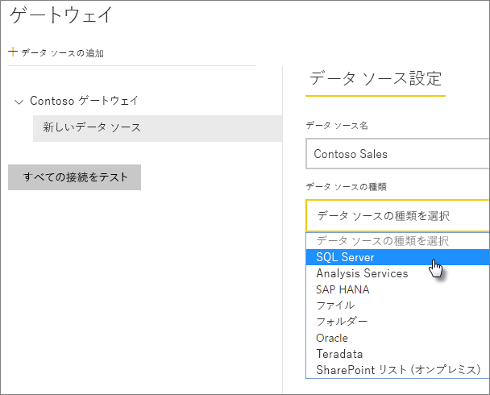
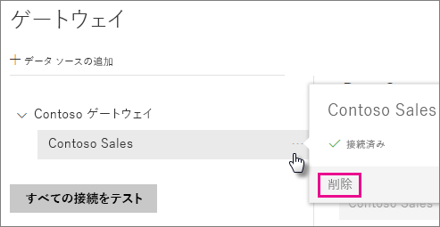
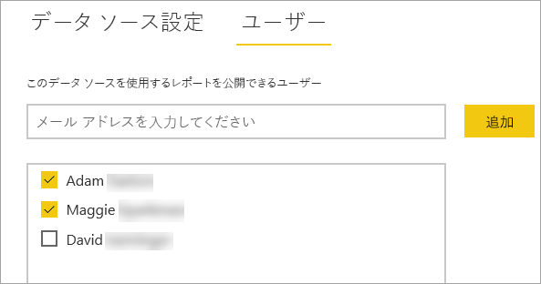

# データ ソースを管理する

[!INCLUDE [gateway-rewrite](includes/gateway-rewrite.md)]

Power BI は、多数のオンプレミス データ ソースをサポートしますが、各データ ソースには独自の要件があります。 ゲートウェイは、単一のデータ ソースにも複数のデータ ソースにも使用できます。 この例では、データソースとして SQL Server を追加する方法について説明します。 手順は、他のデータソースの場合と似ています。

ほとんどのデータ ソースの管理操作は、API を使用して実行することもできます。 詳細については、[REST API (ゲートウェイ)](/rest/api/power-bi/gateways) に関するページを参照してください。

## データ ソースの追加

1. Power BI サービスの右上にある歯車アイコン ![[設定] 歯車アイコン](media/service-gateway-data-sources/icon-gear.png) >  **[ゲートウェイの管理]** の順に選択します。

    

2. ゲートウェイを選択し、 **[データ ソースの追加]** を選択します。 または、 **[ゲートウェイ]**  >  **[データ ソースの追加]** の順に進みます。

    

3. **データ ソースの種類**を選択します。

    

4. データ ソースの情報を入力します。 この例では、**サーバー**、**データベース**、およびその他の情報です。 

    

5. SQL Server では、 **[認証方法]** で **[Windows]** または **[基本]** (SQL 認証) を選択します。 **[基本]** を選択した場合は、データ ソースの資格情報を入力します。

6. **[詳細設定]** で、必要に応じてご利用のデータ ソースに対して[プライバシー レベル](https://support.office.com/article/Privacy-levels-Power-Query-CC3EDE4D-359E-4B28-BC72-9BEE7900B540)を構成します ([DirectQuery](desktop-directquery-about.md) には適用されません)。

    

7. **[追加]** を選択します。 接続に成功すると、「"*接続成功*"」というメッセージが表示されます。

    

これで、このデータ ソースを使用して、Power BI ダッシュボードとレポートに SQL Server のデータを含めることができます。

## データ ソースの削除

使用しなくなったデータ ソースは削除できます。 データ ソースを削除すると、そのデータ ソースに依存するすべてのダッシュボードやレポートが壊れます。

データソースを削除するには、そのデータ ソースまで移動し、 **[削除]** を選択します。

## スケジュールされた更新または DirectQuery にデータ ソースを使用する

作成したデータ ソースは、DirectQuery 接続またはスケジュールされた更新のいずれかで使用できます。

> [!NOTE]
>Power BI Desktop とオンプレミス データ ゲートウェイ内のデータ ソースとの間で、サーバーとデータベース名が一致している必要があります。

データセットとゲートウェイ内のデータ ソース間のリンクは、サーバー名とデータベース名に基づいています。 これらの名前は一致している必要があります。 たとえば、Power BI Desktop 内でサーバー名の IP アドレスを指定する場合は、ゲートウェイ構成内のデータ ソースでその IP アドレスを使用する必要があります。 Power BI Desktop で *SERVER\INSTANCE* を使用する場合は、ゲートウェイ用に構成されているデータ ソース内で同じものを使用する必要があります。

ゲートウェイ内に構成されているデータ ソースの **[ユーザー]** タブの一覧に自分が表示されていて、さらにサーバーとデータベース名が一致している場合は、スケジュールされた更新で使用するオプションとして、ゲートウェイが表示されます。

> [!WARNING]
> データセットに複数のデータ ソースが含まれる場合、ゲートウェイで各データ ソースを追加する必要があります。 ゲートウェイに追加されていないデータ ソースがある場合、そのゲートウェイはスケジュールされた更新に更新可能なものとして表示されません。

### 制限事項

OAuth は、オンプレミスのデータ ゲートウェイを使用するカスタム コネクタに対してのみサポートされる認証方式です。 OAuth を必要とする他のデータ ソースを追加することはできません。 データセットに OAuth を必要とするデータ ソースが含まれ、このデータ ソースがカスタム コネクタでない場合は、スケジュールされた更新にゲートウェイを使用できません。

## ユーザーの管理

データ ソースをゲートウェイに追加した後、ユーザーとメールが有効なセキュリティ グループに (ゲートウェイ全体ではなく) 特定のデータ ソースへのアクセス権を与えます。 データ ソースのユーザーの一覧は、データ ソースのデータが含まれるレポートを発行できるユーザーを制御します。 レポートの所有者は、ダッシュボード、コンテンツ パック、アプリを作成し、それらの項目を他のユーザーと共有できます。

ゲートウェイへの管理アクセス権をユーザーとセキュリティ グループに与えることもできます。

### データ ソースへのユーザーの追加

1. Power BI サービスの右上にある歯車アイコン ![[設定] 歯車アイコン](media/service-gateway-data-sources/icon-gear.png) >  **[ゲートウェイの管理]** の順に選択します。

2. ユーザーを追加するデータ ソースを選択します。

3. **[ユーザー]** を選択し、選択したデータ ソースへのアクセス権を与える組織のユーザーを入力します。 たとえば、次の画面では、Maggie と Adam を追加します。

    ![[ユーザー] タブ](media/service-gateway-data-sources/users-tab.png)

4. **[追加]** を選択します。追加されたメンバーの名前がボックスに表示されます。

    

アクセス権を付与するデータ ソースごとにユーザーを追加する必要があることに注意してください。 データ ソースにはそれぞれ、ユーザーの一覧があります。 各データ ソースに個別にユーザーを追加します。

### データ ソースからのユーザーの削除

データ ソースの **[ユーザー]** タブで、このデータ ソースを使用できるユーザーまたはセキュリティ グループを削除できます。

## 暗号化された資格情報をクラウドに格納する

データ ソースをゲートウェイに追加する場合は、そのデータ ソースの資格情報を指定する必要があります。 データ ソースへのすべてのクエリは、これらの資格情報を使用して実行されます。 資格情報は安全に暗号化されます。 クラウド内で解読されないように、クラウドに格納される前に対称暗号化が資格情報で使用されます。 資格情報は、データ ソースにアクセスするときに、ゲートウェイを実行しているオンプレミスのコンピューターに送信されて暗号化が解除されます。

## 使用可能なデータ ソースの種類の一覧

オンプレミス データ ゲートウェイでは、Power BI に対して次のデータ ソースがサポートされています。 オンプレミスのデータ ソースに加えて、ファイアウォール、VPN、または仮想ネットワークの背後にあるソースにもデータ ゲートウェイが必要になる場合があります。

| **データ ソース** | **Live/DirectQuery** | **手動更新またはスケジュールされた更新 (ユーザー構成)** |
| --- | --- | --- |
| Amazon Redshift |はい |はい |
| Analysis Services |はい |はい |
| AtScale キューブ |はい |はい |
| Azure Active Directory |いいえ |はい |
| Azure Blob Storage |いいえ |はい |
| Azure DevOps Server |いいえ |はい |
| Azure Table Storage |いいえ |はい |
| BI コネクタ |はい |はい |
| Denodo |はい |はい |
| Dremio |はい |はい |
| EmigoDataSourceConnector |いいえ |はい |
| Essbase |はい |はい |
| Exasol |はい |はい |
| ファイル |いいえ |はい |
| フォルダー |いいえ |はい |
| Paxata |いいえ |はい |
| IBM DB2 |はい |はい |
| IBM Informix データベース |いいえ |はい |
| IBM Netezza |はい |はい |
| Impala |はい |はい |
| Jethro ODBC |はい |はい |
| Kyligence Enterprise |はい |はい |
| MarkLogic ODBC |はい |はい |
| Microsoft Graph Security |いいえ |はい |
| MySQL |いいえ |はい |
| ODBC |いいえ |はい |
| OData |いいえ |はい |
| OLE DB |いいえ |はい |
| Oracle |はい |はい |
| PostgreSQL |いいえ |はい |
| QubolePresto |はい |はい |
| Quick Base コネクタ |いいえ |はい |
| SAP Business Warehouse メッセージ サーバー |はい |はい |
| SAP Business Warehouse サーバー |はい |はい |
| SAP HANA |はい |はい |
| SQL Server |はい |はい |
| SharePoint |いいえ |はい |
| Snowflake |はい |はい |
| Spark |はい |はい |
| SurveyMonkey |いいえ |はい |
| Sybase |いいえ |はい |
| TeamDesk.Database |いいえ |はい |
| Teradata |はい |はい |
| Vertica |はい |はい |
| Web |いいえ |はい |
| Workforce Dimensions |いいえ |はい |

## 次の手順

* [データ ソースの管理 - Analysis Services](service-gateway-enterprise-manage-ssas.md)
* [データ ソースの管理 - SAP HANA](service-gateway-enterprise-manage-sap.md)
* [データ ソースの管理 - SQL Server](service-gateway-enterprise-manage-sql.md)
* [データ ソースの管理 - Oracle](service-gateway-onprem-manage-oracle.md)
* [データ ソースの管理 - インポート/スケジュールされた更新](service-gateway-enterprise-manage-scheduled-refresh.md)
* [データ ゲートウェイの展開に関するガイダンス](service-gateway-deployment-guidance.md)

他にわからないことがある場合は、 [Power BI コミュニティ](https://community.powerbi.com/)を利用してください。
