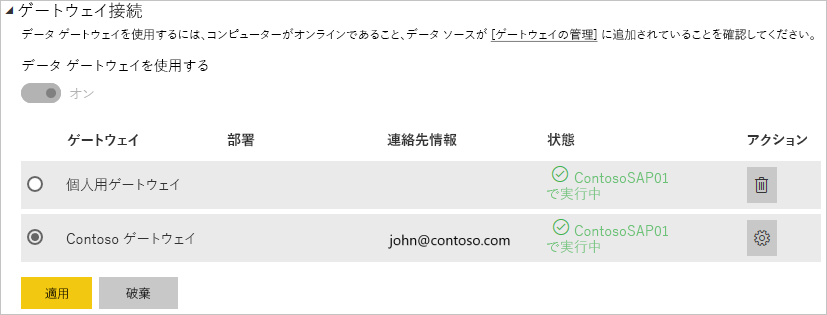

# データ ソースの管理 - SAP HANA

[!INCLUDE [gateway-rewrite](includes/gateway-rewrite.md)]

[オンプレミス データ ゲートウェイをインストール](/data-integration/gateway/service-gateway-install)したら、ゲートウェイで使用できる[データ ソースを追加する](service-gateway-data-sources.md#add-a-data-source)必要があります。 この記事では、スケジュールされた更新または DirectQuery に使用されるゲートウェイと SAP HANA データ ソースの操作方法について説明します。

## データ ソースの追加

データ ソースを追加する方法の詳細については、「[Add a data source](service-gateway-data-sources.md#add-a-data-source)」(データソースの追加) を参照してください。 **[データソースの種類]** として [SAP HANA] を選択します。

データ ソースの種類として [SAP HANA] を選択したら、データ ソースの **[サーバー]** 、 **[ユーザー名]** 、および **[パスワード]** の情報を入力します。

> [!NOTE]
> データ ソースへのすべてのクエリは、これらの資格情報を使用して実行されます。 資格情報の格納方法の詳細については、「[暗号化された資格情報をクラウドに格納する](service-gateway-data-sources.md#store-encrypted-credentials-in-the-cloud)」を参照してください。

すべてが入力されたら、 **[追加]** を選択します。 このデータ ソースは、オンプレミスの SAP HANA サーバーに対するスケジュールされた更新または DirectQuery に使用できるようになりました。 接続に成功すると、「 *接続成功* 」というメッセージが表示されます。

### 詳細設定

必要に応じて、データ ソースのプライバシー レベルを構成できます。 これにより、データを結合できる方法を制御します。 これは、スケジュールされた更新にのみ使用します。 DirectQuery には適用されません。 データ ソースのプライバシー レベルの詳細については、「[プライバシーレベル (Power Query)](https://support.office.com/article/Privacy-levels-Power-Query-CC3EDE4D-359E-4B28-BC72-9BEE7900B540)」を参照してください。

## データ ソースの使用

データ ソースを作成した後、DirectQuery 接続かスケジュールされた更新のいずれかによって使用できるようになります。

> [!NOTE]
> Power BI Desktop とオンプレミス データ ゲートウェイ内のデータ ソースとの間で、サーバーとデータベース名が一致している必要があります。

データセットとゲートウェイ内のデータ ソース間のリンクは、サーバー名とデータベース名に基づいています。 このため、これらは一致している必要があります。 たとえば、Power BI Desktop 内でサーバー名の IP アドレスを指定する場合は、ゲートウェイ構成内のデータ ソースでもその IP アドレスを使用する必要があります。 Power BI Desktop で *SERVER\INSTANCE* を使用する場合は、ゲートウェイ用に構成されているデータ ソース内でも同じものを使用する必要があります。

これは、DirectQuery とスケジュールされた更新のどちらにも該当します。

### DirectQuery 接続でデータ ソースを使用する

Power BI Desktop とゲートウェイ用に構成されているデータ ソースとの間では、サーバーとデータベース名が一致している必要があります。 また、DirectQuery のデータセットを公開するには、自分のアカウントがデータ ソースの **[ユーザー]** タブの一覧に表示されている必要があります。 DirectQuery の選択は、最初にデータをインポートする Power BI Desktop 内で発生します。 Directquery の使用方法の詳細については、「[Use DirectQuery in Power BI Desktop](desktop-use-directquery.md)」(Power BI Desktop で DirectQuery を使用する) を参照してください。

公開した後は、Power BI Desktop か **[データの取得]** のいずれかから、レポート機能が利用可能になります。 ゲートウェイ内にデータ ソースを作成してから、接続が使用できるようになるまでには、数分ほどかかることがあります。

### スケジュールされた更新でデータ ソースを使用する

ゲートウェイ内に構成されているデータ ソースの **[ユーザー]** タブの一覧に自分のアカウントが表示されていて、さらにサーバーとデータベース名が一致している場合は、スケジュールされた更新で使用するオプションとして、ゲートウェイが表示されます。

## 次の手順

* [オンプレミス データ ゲートウェイのトラブルシューティング](/data-integration/gateway/service-gateway-tshoot)
* [ゲートウェイのトラブルシューティング - Power BI](service-gateway-onprem-tshoot.md)  

他にわからないことがある場合は、 [Power BI コミュニティを利用してください](http://community.powerbi.com/)。

