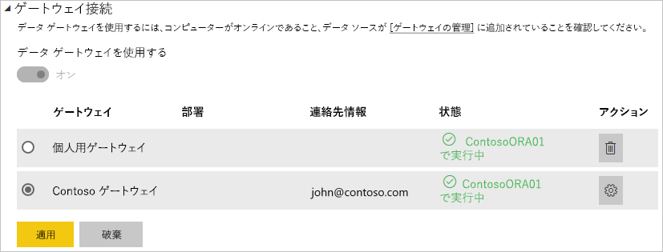

# データ ソースの管理 - インポート/スケジュールされた更新

[!INCLUDE [gateway-rewrite](includes/gateway-rewrite.md)]

[オンプレミス データ ゲートウェイをインストール](/data-integration/gateway/service-gateway-install)したら、ゲートウェイで使用できる[データ ソースを追加する](service-gateway-data-sources.md#add-a-data-source)必要があります。 この記事では、DirectQuery やライブ接続ではなく、スケジュールされた更新に使用されるゲートウェイとデータ ソースの操作方法について取り上げます。

## データ ソースの追加

データ ソースを追加する方法の詳細については、「[Add a data source](service-gateway-data-sources.md#add-a-data-source)」(データソースの追加) を参照してください。

一覧表示されているすべてのデータソースの種類は、オンプレミス データ ゲートウェイでスケジュールされた更新に使用できます。 Analysis Services、SQL Server、SAP HANA は、スケジュールされた更新、DirectQuery/ライブ接続のどちらに対しても使用できます。

次に、データ ソースにアクセスするために使用するソース情報や資格情報などの、データ ソースの情報を記入できます。

> [!NOTE]
> データ ソースへのすべてのクエリは、これらの資格情報を使用して実行されます。 資格情報の格納方法の詳細については、「[Storing encrypted credentials in the cloud](service-gateway-data-sources.md#storing-encrypted-credentials-in-the-cloud)」(暗号化された資格情報のクラウドへの格納) を参照してください。

スケジュールされた更新で使用できるデータ ソースの種類の一覧については、「[List of available data source types](service-gateway-data-sources.md#list-of-available-data-source-types)」(使用可能なデータ ソースの種類の一覧) を参照してください。

すべての情報を入力したら、 **[追加]** を選択します。 これで、オンプレミス データと一緒に、スケジュールされた更新にこのデータ ソースを使用できるようになりました。 成功すると、"*接続成功*" というメッセージが表示されます。

### 詳細設定

必要に応じて、データ ソースのプライバシー レベルを構成できます。 これにより、データを結合できる方法を制御します。 これは、スケジュールされた更新にのみ使用します。 データ ソースのプライバシー レベルの詳細については、「[プライバシーレベル (Power Query)](https://support.office.com/article/Privacy-levels-Power-Query-CC3EDE4D-359E-4B28-BC72-9BEE7900B540)」を参照してください。

## スケジュールされた更新でデータ ソースを使用する

データ ソースを作成した後、DirectQuery 接続かスケジュールされた更新のいずれかによって使用できるようになります。

> [!NOTE]
> Power BI Desktop とオンプレミス データ ゲートウェイ内のデータ ソースとの間で、サーバーとデータベース名が一致している必要があります。

データセットとゲートウェイ内のデータ ソース間のリンクは、サーバー名とデータベース名に基づいています。 このため、これらは一致している必要があります。 たとえば、Power BI Desktop 内でサーバー名の IP アドレスを指定する場合は、ゲートウェイ構成内のデータ ソースでもその IP アドレスを使用する必要があります。 Power BI Desktop で *SERVER\INSTANCE* を使用する場合は、ゲートウェイ用に構成されているデータ ソース内でも同じものを使用する必要があります。

ゲートウェイ内に構成されているデータ ソースの **[ユーザー]** タブの一覧に自分のアカウントが表示されていて、さらにサーバーとデータベース名が一致している場合は、スケジュールされた更新で使用するオプションとして、ゲートウェイが表示されます。

> [!WARNING]
> データセットに複数のデータ ソースが含まれる場合、ゲートウェイで各データ ソースを追加する必要があります。 ゲートウェイに追加されていないデータ ソースがある場合、そのゲートウェイはスケジュールされた更新に更新可能なものとして表示されません。

## 制限事項

OAuth は、オンプレミスのデータ ゲートウェイでサポートされる認証方式ではありません。 OAuth を必要とするデータ ソースを追加することはできません。 データセットに OAuth を必要とするデータ ソースが含まれる場合は、スケジュールされた更新にゲートウェイを使用できません。

## 次の手順

* [オンプレミス データ ゲートウェイのトラブルシューティング](/data-integration/gateway/service-gateway-tshoot)
* [ゲートウェイのトラブルシューティング - Power BI](service-gateway-onprem-tshoot.md)

他にわからないことがある場合は、 [Power BI コミュニティを利用してください](http://community.powerbi.com/)。
