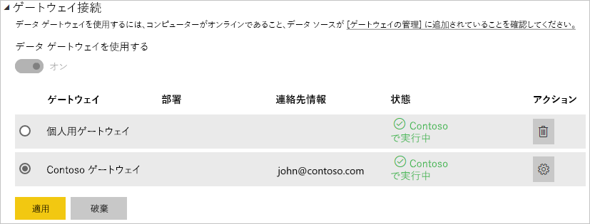

# <a name="manage-your-data-source---oracle"></a>データ ソースの管理 - Oracle

[!INCLUDE [gateway-rewrite](includes/gateway-rewrite.md)]

[オンプレミス データ ゲートウェイをインストール](/data-integration/gateway/service-gateway-install)したら、ゲートウェイで使用できる[データ ソースを追加する](service-gateway-data-sources.md#add-a-data-source)必要があります。 この記事では、スケジュールされた更新または DirectQuery でゲートウェイと Oracle データ ソースを使用する方法について説明します。

## <a name="install-the-oracle-client"></a>Oracle クライアントのインストール

ゲートウェイを Oracle サーバーに接続するには、Oracle Data Provider for .NET (ODP.NET) をインストールして構成する必要があります。 ODP.NET は、Oracle Data Access Components (ODAC) の一部です。

Power BI Desktop の 32 ビット バージョンの場合、次のリンクをクリックして 32 ビット Oracle クライアントをダウンロードし、インストールします。

* [32-bit Oracle Data Access Components (ODAC) with Oracle Developer Tools for Visual Studio (12.1.0.2.4)](http://www.oracle.com/technetwork/topics/dotnet/utilsoft-086879.html)

Power BI Desktop の 64 ビット バージョンまたはオンプレミス データ ゲートウェイの場合は、次のリンクをクリックして 64 ビットの Oracle クライアントをダウンロードしてインストールしてください。

* [64-bit ODAC 12.2c Release 1 (12.2.0.1.0) for Windows x64](http://www.oracle.com/technetwork/database/windows/downloads/index-090165.html)

クライアントをインストールした後は、データベースの適切な情報で tnsnames.ora ファイルを構成します。 Power BI Desktop とゲートウェイでは、tnsnames.ora ファイルで定義されている net_service_name が使用されます。 net_service_name が構成されていない場合、接続できません。 tnsnames.ora の既定のパスは `[Oracle Home Directory]\Network\Admin\tnsnames.ora` です。 tnsnames.ora ファイルの構成方法の詳細は、「[Oracle:Local naming parameters (tnsnames.ora)](https://docs.oracle.com/cd/B28359_01/network.111/b28317/tnsnames.htm)」 (Oracle: ローカル名パラメーター (tnsnames.ora)) をご覧ください。

### <a name="example-tnsnamesora-file-entry"></a>tnsnames.ora ファイルのエントリの例

tnsname.ora のエントリの基本的な形式は次のとおりです。

```
net_service_name=
 (DESCRIPTION=
   (ADDRESS=(protocol_address_information))
   (CONNECT_DATA=
     (SERVICE_NAME=service_name)))
```

サーバーとポートの情報の設定例を次に示します。

```
CONTOSO =
  (DESCRIPTION =
    (ADDRESS = (PROTOCOL = TCP)(HOST = oracleserver.contoso.com)(PORT = 1521))
    (CONNECT_DATA =
      (SERVER = DEDICATED)
      (SERVICE_NAME = CONTOSO)
    )
  )
```

## <a name="add-a-data-source"></a>データ ソースの追加

データ ソースを追加する方法の詳細については、「[データ ソースの追加](service-gateway-data-sources.md#add-a-data-source)」を参照してください。 **[データ ソースの種類]** で、 **[Oracle]** を選択します。


Oracle データ ソースの種類を選択したら、 **[サーバー]** や **[データベース]** など、データ ソースについての情報を入力します。 

**[認証方法]** で、 **[Windows]** または **[基本]** を選択できます。 Windows 認証ではなく Oracle 内で作成されたアカウントを使用する場合は、 **[基本]** を選択します。 次に、このデータ ソースに使用する資格情報を入力します。

> [!NOTE]
> データ ソースへのすべてのクエリは、これらの資格情報を使用して実行されます。 資格情報の格納方法の詳細については、「[暗号化された資格情報をクラウドに格納する](service-gateway-data-sources.md#store-encrypted-credentials-in-the-cloud)」を参照してください。


すべての情報を入力したら、 **[追加]** を選択します。 このデータ ソースで、オンプレミスの Oracle サーバーに対するスケジュールされた更新または DirectQuery に使用できるようになりました。 成功すると、"*接続成功*" というメッセージが表示されます。


### <a name="advanced-settings"></a>詳細設定

必要に応じて、データ ソースのプライバシー レベルを構成できます。 この設定により、データを結合できる方法が管理されます。 これは、スケジュールされた更新にのみ使用されます。 プライバシー レベルの設定は、DirectQuery には適用されません。 データ ソースのプライバシー レベルの詳細については、「[プライバシーレベル (Power Query)](https://support.office.com/article/Privacy-levels-Power-Query-CC3EDE4D-359E-4B28-BC72-9BEE7900B540)」を参照してください。


## <a name="use-the-data-source"></a>データ ソースを使用する

作成したデータ ソースは、DirectQuery 接続またはスケジュールされた更新のいずれかで使用できます。

> [!WARNING]
> Power BI Desktop とオンプレミス データ ゲートウェイ内のデータ ソースとの間で、サーバーとデータベース名が一致している必要があります。

データセットとゲートウェイ内のデータ ソース間のリンクは、サーバー名とデータベース名に基づいています。 これらの名前は一致している必要があります。 たとえば、Power BI Desktop 内でサーバー名の IP アドレスを指定する場合は、ゲートウェイ構成内のデータ ソースでもその IP アドレスを使用する必要があります。 また、この名前は、tnsnames.ora ファイルで定義されている別名と一致している必要があります。 tnsnames.ora ファイルの詳細は、「[Oracle クライアントのインストール](#install-the-oracle-client)」をご覧ください。

この要件は、DirectQuery とスケジュールされた更新のどちらにも該当します。

### <a name="use-the-data-source-with-directquery-connections"></a>DirectQuery 接続でデータ ソースを使用する

Power BI Desktop とゲートウェイ用に構成されているデータ ソースとの間で、サーバーとデータベース名が一致していることを確認します。 また、DirectQuery のデータセットを公開するには、自分のアカウントがデータ ソースの **[ユーザー]** タブの一覧に表示されている必要があります。 DirectQuery の選択は、最初にデータをインポートする Power BI Desktop 内で発生します。 Directquery の使用方法の詳細については、「[Power BI Desktop で DirectQuery を使用する](desktop-use-directquery.md)」を参照してください。

公開した後は、Power BI Desktop または **[データの取得]** のいずれかから、レポート機能が利用可能になります。 ゲートウェイ内にデータ ソースを作成してから、接続が使用できるようになるまでには、数分ほどかかることがあります。

### <a name="use-the-data-source-with-scheduled-refresh"></a>スケジュールされた更新でデータ ソースを使用する

ゲートウェイ内に構成されているデータ ソースの **[ユーザー]** タブの一覧に自分のアカウントが表示されていて、さらにサーバー名とデータベース名が一致している場合は、スケジュールされた更新で使用するオプションとして、ゲートウェイが表示されます。



## <a name="troubleshooting"></a>トラブルシューティング

名前付けの構文が正しくない、または適切に構成されていない場合、Oracle でエラーが発生する可能性があります。

* ORA-12154:TNS:could not resolve the connect identifier specified. (指定された接続識別子を解決できませんでした。)
* ORA-12514:TNS:listener does not currently know of service requested in connect descriptor. (接続記述子で要求されているサービスが現在、リスナーで認識されていません。)
* ORA-12541:TNS:no listener. (リスナーがありません。)
* ORA-12170:TNS:connect timeout occurred. (接続のタイムアウトが発生しました。)
* ORA-12504:TNS:listener was not given the SERVICE_NAME in CONNECT_DATA. (CONNECT_DATA でリスナーに SERVICE_NAME が与えられませんでした)

このようなエラーは、Oracle クライアントがインストールされていないか、正しく構成されていない場合に発生することがあります。 インストールされている場合は、tnsnames.ora ファイルが正しく構成されていることと正しい net_service_name を使用していることを確認します。 また、Power BI Desktop を使用しているコンピューターとゲートウェイを実行しているコンピューターの間で net_service_name が一致していることも確認する必要があります。 詳細については、「[Oracle クライアントのインストール](#install-the-oracle-client)」をご覧ください。

> [!NOTE]
> Oracle サーバーのバージョンと Oracle クライアントのバージョンとの間で互換性の問題が発生する場合もあります。 通常、これらのバージョンが一致する必要があります。

ゲートウェイに関する他のトラブルシューティングの情報については、「[オンプレミス データ ゲートウェイのトラブルシューティング](/data-integration/gateway/service-gateway-tshoot)」をご覧ください。

## <a name="next-steps"></a>次の手順

* [ゲートウェイのトラブルシューティング - Power BI](service-gateway-onprem-tshoot.md)
* [Power BI Premium](service-premium.md)

他にわからないことがある場合は、 [Power BI コミュニティ](http://community.powerbi.com/)で質問してみてください。

