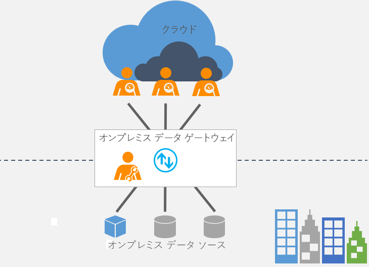

# オンプレミス データ ゲートウェイとは

[!INCLUDE [gateway-rewrite](includes/gateway-rewrite.md)]

オンプレミス データ ゲートウェイはブリッジとして機能し、オンプレミス データ (クラウド内に存在しないデータ) といくつかの Microsoft クラウド サービスとの間でデータをすばやく安全に転送できます。 そのようなクラウド サービスには、Power BI、PowerApps、Power Automate、Azure Analysis Services、Azure Logic Apps があります。 ゲートウェイを使用することにより、組織はオンプレミス ネットワーク上のデータベースやその他のデータソースを維持しながら、そのオンプレミス データをクラウド サービスで安全に使用することができます。

## ゲートウェイのしくみ

ゲートウェイのしくみの詳細については、「[オンプレミス データ ゲートウェイのアーキテクチャ](/data-integration/gateway/service-gateway-onprem-indepth)」を参照してください。

## ゲートウェイの種類

ゲートウェイには 2 種類あって、それぞれ異なるシナリオで使用されます。

* **オンプレミス データ ゲートウェイ**の場合、複数のユーザーが複数のオンプレミスのデータ ソースに接続できます。 単一のゲートウェイ インストールで、サポートされているすべてのサービスでオンプレミス データゲートウェイを使用できます。 このゲートウェイは、複数のユーザーが複数のデータ ソースにアクセスする複雑なシナリオに適しています。

* **オンプレミス データ ゲートウェイ (個人用モード)** の場合、1 人のユーザーがソースに接続できます。他のユーザーとは共有できません。 オンプレミスのデータ ゲートウェイ (個人用モード) は、Power BI でのみ使用できます。 このゲートウェイは、レポートを作成するユーザーが 1 人だけであり、データ ソースを他のユーザーと共有する必要がないシナリオに適しています。

## ゲートウェイの使用

ゲートウェイを使用するための 4 つの主要な手順があります。

1. [ゲートウェイをダウンロードして、ローカル コンピューターにインストールします](/data-integration/gateway/service-gateway-install)。
1. ご利用のファイアウォールやその他のネットワーク要件に基づいてゲートウェイを[構成](/data-integration/gateway/service-gateway-app)します。
1. 他のネットワーク要件も管理および操作できる[ゲートウェイ管理者を追加](/data-integration/gateway/service-gateway-manage)します。
1. [ゲートウェイを使用](service-gateway-sql-tutorial.md)して、オンプレミスのデータ ソースを更新します。
1. エラーが発生した場合にゲートウェイの[トラブルシューティング](service-gateway-onprem-tshoot.md)を行います。

## 次の手順

* [オンプレミス データ ゲートウェイのインストール](/data-integration/gateway/service-gateway-install)

他にわからないことがある場合は、 [Power BI コミュニティを利用してください](https://community.powerbi.com/)。
