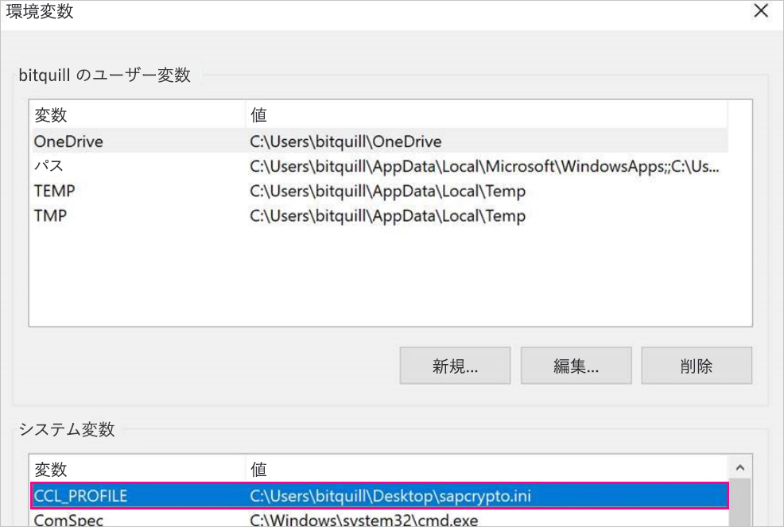
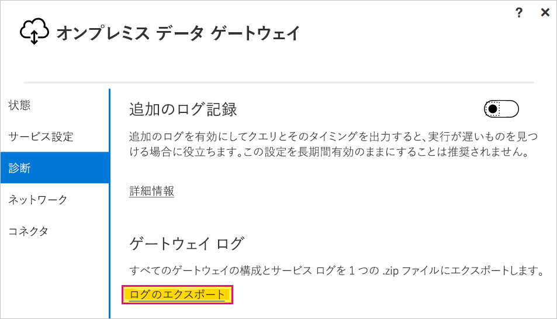

# <a name="use-kerberos-single-sign-on-for-sso-to-sap-bw-using-commoncryptolib-sapcryptodll"></a>CommonCryptoLib (sapcrypto.dll) を使用して SAP BW への SSO に Kerberos シングル サインオンを使用する

この記事では、CommonCryptoLib (sapcrypto.dll) を使用して Power BI サービスからの SSO を有効にするように SAP BW データ ソースを構成する方法を説明します。

> [!NOTE]
> Kerberos SSO を使用する SAP BW ベースのレポートを更新する前に、[Kerberos SSO の構成](service-gateway-sso-kerberos.md)に関する記事の手順に加えて、この記事の手順を完了してください。 SNC ライブラリとして CommonCryptoLib を使用すると、SAP BW アプリケーション サーバーと SAP BW メッセージ サーバーの両方への SSO 接続が可能になります。

## <a name="configure-sap-bw-to-enable-sso-using-commoncryptolib"></a>CommonCryptoLib を使用する SSO を有効にするように SAP BW を構成する

> [!NOTE]
> オンプレミス データ ゲートウェイは 64 ビットのソフトウェアであるため、BW SSO を実行するには 64 ビットバージョンの CommonCryptoLib (sapcrypto.dll) が必要です。 ゲートウェイ経由で SSO 接続を試みる前に、SAP GUI で SAP BW サーバーへの SSO 接続をテストすることを計画している場合 (推奨)、SAP GUI は 32 ビットのソフトウェアであるため、32 ビット版の CommonCryptoLib も必要になります。

1. お使いの BW サーバーが CommonCryptoLib を使用する Kerberos SSO 用に正しく構成されていることを確認します。 そうである場合は、CommonCryptoLib を使用するように構成されている SAP GUI などの SAP ツールで、SSO を使用して BW サーバーに (直接または SAP BW メッセージ サーバー経由で) アクセスできるはずです。 設定の手順の詳細については、次を参照してください: 「[SAP シングル サインオン: Kerberos/SPNEGO による認証](https://blogs.sap.com/2017/07/27/sap-single-sign-on-authenticate-with-kerberosspnego/)」。 自分の BW サーバーでは、SNC ライブラリとして CommonCryptoLib を使用し、"CN=" で始まる SNC 名 (たとえば "CN=BW1") を付ける必要があります。 SNC 名の要件の詳細については、「[Kerberos 構成の SNC パラメーター](https://help.sap.com/viewer/df185fd53bb645b1bd99284ee4e4a750/3.0/en-US/360534094511490d91b9589d20abb49a.html)」(具体的には、snc/identity/as パラメーター) を参照してください。

1. まだ行っていない場合は、x64 バージョンの [SAP .NET Connector](https://support.sap.com/en/product/connectors/msnet.html) を、ゲートウェイがインストールされているコンピューターにインストールしてください。 コンポーネントがインストールされているかどうかを確認するには、ゲートウェイ コンピューターから Power BI Desktop で自分の BW サーバーに接続してみます。 2\.0 実装を使用して接続できない場合は、.NET コネクタがインストールされていないか、GAC にインストールされていません。

1. ゲートウェイがインストールされているコンピューター上で、SAP Secure Login Client (SLC) が実行されていないことを確認します。 SLC は、SSO のために Kerberos を使用するゲートウェイの機能を妨げる可能性がある方法で、Kerberos チケットをキャッシュします。 SLC がインストールされている場合は、アンインストールするか、SAP Secure Login Client を必ず終了します。ゲートウェイを使用して SSO 接続を試行する前に、システム トレイ内のアイコンを右クリックし、[Log Out and Exit]\(ログアウトして終了\) を選択します。 SLC では、Windows Server マシン上での使用はサポートされていません。 詳細については、[SAP Note 2780475](https://launchpad.support.sap.com/#/notes/2780475) を参照してください (s-user が必要)。

    

    SLC をアンインストールするか、 **[Log Out** and **Exit]\(ログアウトして終了\)** を選択した場合は、コマンド ウィンドウを開いて「`klist purge`」と入力して、ゲートウェイ経由で SSO 接続を試行する前に、キャッシュされた Kerberos チケットをクリアします。

1. SAP スタート パッドから 64 ビット版の CommonCryptoLib (sapcrypto.dll) バージョン **8.5.25 以上**をダウンロードし、それを自分のゲートウェイ コンピューター上のフォルダーにコピーします。 sapcrypto.dll をコピーしたのと同じディレクトリに、次の内容が含まれた sapcrypto.ini という名前のファイルを作成します。

    ```
    ccl/snc/enable_kerberos_in_client_role = 1
    ```

    .ini ファイルには、ゲートウェイ シナリオで SSO を有効にするために CommonCryptoLib が必要とする構成情報が含まれています。

    > [!NOTE]
    > これらのファイルは同じ場所に格納する必要があります。つまり、 _/path/to/sapcrypto/_ に sapcrypto.ini と sapcrypto.dll の両方を含める必要があります。

    サービス ユーザーが偽装するゲートウェイ サービス ユーザーと Active Directory (AD) ユーザーの両方に、両方のファイルに対する読み取りおよび実行アクセス許可が必要です。 Authenticated Users グループに .ini ファイルと .dll ファイルの両方に対するアクセス許可を付与することをお勧めします。 テスト目的の場合、ゲートウェイ サービス ユーザーと、テストに使用する Active Directory ユーザーの両方に、これらのアクセス許可を明示的に付与することもできます。 次のスクリーンショットでは、Authenticated Users グループに sapcrypto.dll に対する**読み取りと実行**のアクセス許可を付与しました。

    

1. SSO 接続を通過させるゲートウェイに関連付けられた SAP BW データ ソースがまだない場合は、Power BI サービスの **[ゲートウェイの管理]** ページで追加します。 このようなデータ ソースが既にある場合は、編集する準備をします。 BW アプリケーション サーバーへの SSO 接続を作成する場合は、 **[データ ソースの種類]** として **[SAP Business Warehouse]** を選択します。 BW メッセージ サーバーへの SSO 接続を作成する場合は、 **[Sap Business Warehouse Message Server]\(SAP Business Warehouse メッセージ サーバー\)** を選択します。

    **[SNC ライブラリ]** では、 **[SNC\_LIB or SNC\_LIB\_64 environmental variable]\(SNC_LIB または SNC_LIB_64 環境変数\)** または **[カスタム]** を選択します。 **SNC\_LIB** オプションを選択する場合は、ゲートウェイ マシン上の **SNC\_LIB\_64** 環境変数の値を、ゲートウェイ マシン上の sapcrypto.dll の 64 ビット コピーの絶対パス (*C:\Users\Test\Desktop\sapcrypto.dll* など) に設定する必要があります。 **[カスタム]** を選択した場合は、 **[ゲートウェイの管理]** ページに表示される [カスタム SNC ライブラリ パス] フィールドに、sapcrypto .dll の絶対パスを貼り付けます。 **[SNC パートナー名]** には、BW サーバーの SNC 名を入力します。 **[詳細設定]** で、 **[DirectQuery クエリには Kerberos 経由で SSO を使用します]** チェック ボックスがオンになっていることを確認します。 他のフィールドは、PBI Desktop から Windows 認証接続を確立する場合と同じように入力する必要があります。

1. **CCL\_PROFILE** システム環境変数を作成し、sapcrypto.ini を指すように設定します。

    

    sapcrypto .dll と .ini ファイルは同じ場所に存在する必要があることに注意してください。 sapcrypto.ini がデスクトップ上にある上の例では、sapcrypto.dll もデスクトップ上にある必要があります。

1. ゲートウェイ サービスを再起動します。

    

1. [Power BI レポートを実行する](service-gateway-sso-kerberos.md#run-a-power-bi-report)

## <a name="troubleshooting"></a>トラブルシューティング

Power BI サービスでレポートを更新できない場合は、ゲートウェイ トレース、CPIC トレース、および CommonCryptoLib トレースを使用して、問題の診断に役立てることができます。 CPIC トレースと CommonCryptoLib は SAP 製品であるため、Microsoft ではそれらを直接サポートすることはできません。 BW への SSO アクセスを許可される Active Directory ユーザーについては、一部の Active Directory 構成で、ゲートウェイがインストールされているマシンの Administrators グループのメンバーであることが必要になる場合があります。

1. **ゲートウェイ ログ:** 単に問題を再現し、[ゲートウェイ アプリ](https://docs.microsoft.com/data-integration/gateway/service-gateway-app)を開き、 **[診断]** タブに移動して、 **[ログのエクスポート]** を選択します。

    

1. **CPIC トレース:** CPIC トレースを有効にするには、次の 2 つの環境変数を設定します。**CPIC\_TRACE** と **CPIC\_TRACE\_DIR** です。 最初の変数はトレース レベルを設定し、2 番目の変数はトレース ファイルのディレクトリを設定します。 ディレクトリは、Authenticated Users グループのメンバーが書き込み可能な場所である必要があります。 **CPIC\_TRACE** を 3 に設定し、**CPIC\_TRACE\_DIR** をトレース ファイルの書き込み先にする任意のディレクトリに設定します。 例:

    

    問題を再現し、CPIC\_TRACE\_DIR にトレース ファイルが含まれていることを確認します。

1. **CommonCryptoLib トレース:** 前に作成した sapcrypto.ini ファイルに 2 行を追加して、CommonCryptoLib トレースを有効にします。

    ```
    ccl/trace/level=5
    ccl/trace/directory=<drive>:\logs\sectrace
    ```

    _ccl/trace/directory_ オプションを、Authenticated Users グループのメンバーが書き込み可能な場所に必ず変更します。 または、新しい .ini ファイルを作成して、この動作を変更します。 sapcrypto.ini および sapcrypto.dll と同じディレクトリに、次の内容が含まれた sectrace.ini という名前のファイルを作成します。 **DIRECTORY** オプションを、**認証されたユーザー** グループのメンバーが書き込むことのできるコンピューター上の場所に置き換えます。

    ```
    LEVEL = 5
    DIRECTORY = <drive>:\logs\sectrace
    ```

    次に問題を再現し、**DIRECTORY** によって指されている場所にトレース ファイルが含まれていることを確認します。 完了したら、CPIC および CCL トレースを無効にしてください。

    CommonCryptoLib トレースの詳細については、[SAP Note 2491573](https://launchpad.support.sap.com/#/notes/2491573) (s-user が必要) を参照してください。

## <a name="next-steps"></a>次の手順

**オンプレミス データ ゲートウェイ**と **DirectQuery** の詳細については、次のリソースをご覧ください。

* [オンプレミス データ ゲートウェイとは](/data-integration/gateway/service-gateway-onprem)
* [Power BI の DirectQuery](desktop-directquery-about.md)
* [DirectQuery でサポートされるデータ ソース](desktop-directquery-data-sources.md)
* [DirectQuery と SAP BW](desktop-directquery-sap-bw.md)
* [DirectQuery と SAP HANA](desktop-directquery-sap-hana.md)
