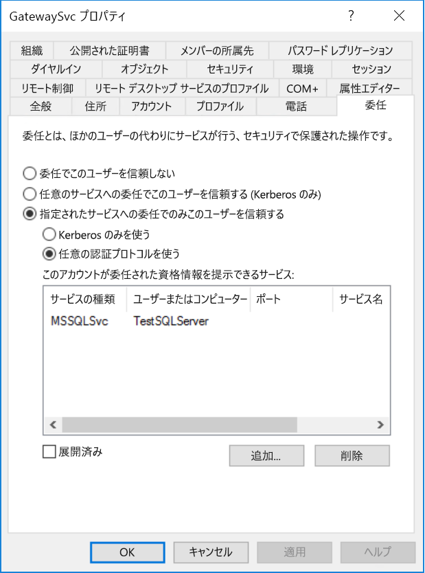

# <a name="configure-kerberos-based-sso-from-power-bi-service-to-on-premises-data-sources"></a>Power BI サービスからオンプレミス データ ソースへの Kerberos ベースの SSO を構成する

SSO を有効にすると、Power BI レポートおよびダッシュボードでは、オンプレミスのソース上で構成されているユーザー レベルのアクセス許可を考慮しながら、それらのソースからのデータを簡単に更新できるようになります。 [Kerberos の制約付き委任](/windows-server/security/kerberos/kerberos-constrained-delegation-overview)を使用して、シームレスな SSO 接続を有効にします。 

## <a name="prerequisites"></a>前提条件

Kerberos の制約付き委任が正しく機能するためには、"_サービス プリンシパル名 (SPN)_ " やサービス アカウントでの委任の設定など、いくつかの項目を構成する必要があります。

### <a name="install-and-configure-the-microsoft-on-premises-data-gateway"></a>Microsoft オンプレミス データ ゲートウェイをインストールして構成する

オンプレミス データ ゲートウェイでは、インプレース アップグレードと、既存のゲートウェイの "_引き継ぎの設定_" がサポートされています。

### <a name="run-the-gateway-windows-service-as-a-domain-account"></a>ゲートウェイの Windows サービスをドメイン アカウントとして実行する

標準のインストールでは、ゲートウェイは、マシンのローカル サービス アカウント **NT Service\PBIEgwService**として実行されます。


Azure Active Directory (Azure AD) インスタンスが既に (Azure AD DirSync または Azure AD Connect を使って) ローカルの Active Directory インスタンスと同期されている場合を除き、Kerberos の制約付き委任を有効にするには、ゲートウェイをドメイン アカウントとして実行する必要があります。 ドメイン アカウントに切り替えるには、「[ゲートウェイ サービス アカウントの変更](/data-integration/gateway/service-gateway-service-account)」を参照してください。

> [!NOTE]
> Azure AD Connect が構成済みで、かつユーザー アカウントが同期済みの場合、実行時にゲートウェイ サービスでローカル Azure AD 参照を実行する必要はありません。 代わりに、単にゲートウェイ サービスのローカル サービス SID を使用して、Azure AD で必要なすべての構成を完了できます。 この記事で説明する Kerberos の制約付き委任の構成手順は、Azure AD のコンテキストにおいて必要な構成手順と同じです。 それらは、ドメイン アカウントではなく、Azure AD 内の (ローカル サービス SID によって識別された) ゲートウェイのコンピューター オブジェクトに適用されます。

## <a name="obtain-domain-admin-rights-to-configure-spns-setspn-and-kerberos-constrained-delegation-settings"></a>SPN (SetSPN) および Kerberos の制約付き委任の設定を構成するためのドメイン管理者権限を取得する

SPN と Kerberos 委任の設定を構成するために、ドメイン管理者は、ドメイン管理者権限を持たないユーザーに権限を付与しないようにする必要があります。 次のセクションでは、推奨される構成手順について詳しく説明します。

## <a name="configure-kerberos-constrained-delegation-for-the-gateway-and-data-source"></a>ゲートウェイとデータ ソースに対して Kerberos の制約付き委任を構成する

必要に応じて、ドメイン管理者としてゲートウェイ サービスのドメイン アカウントの SPN を構成し、ゲートウェイ サービスのドメイン アカウントの委任設定を構成します。

### <a name="configure-an-spn-for-the-gateway-service-account"></a>ゲートウェイ サービス アカウントに SPN を構成する

最初に、ゲートウェイ サービス アカウントとして使われるドメイン アカウントに SPN が既に作成されているかどうかを調べます。

1. ドメイン管理者として、Microsoft 管理コンソール (MMC) スナップインの **[Active Directory ユーザーとコンピューター]** を起動します。

2. 左側のペインでドメイン名を右クリックし、 **[検索]** を選択して、ゲートウェイ サービス アカウントのアカウント名を入力します。

3. 検索結果で、ゲートウェイ サービス アカウントを右クリックし、 **[プロパティ]** を選択します。

4. **[委任]** タブが **[プロパティ]** ダイアログに表示される場合は、SPN は既に作成されているため、「[使用する Kerberos の制約付き委任の種類を決定する](#decide-on-the-type-of-kerberos-constrained-delegation-to-use)」に進むことができます。

5. **[委任]** タブが **[プロパティ]** ダイアログ ボックスにない場合、アカウントに SPN を手動で作成し、有効にすることができます。 Windows に付属する [setspn ツール](https://technet.microsoft.com/library/cc731241.aspx)を使用してください (SPN を作成するにはドメイン管理者権限が必要です)。

   たとえば、ゲートウェイ サービス アカウントが **Contoso\GatewaySvc** で、ゲートウェイ サービスが **MyGatewayMachine** という名前のマシンで実行されているとします。 ゲートウェイ サービス アカウントの SPN を設定するには、次のコマンドを実行します。

   ```setspn -a gateway/MyGatewayMachine Contoso\GatewaySvc```

   また、 **[Active Directory ユーザーとコンピューター]** MMC スナップインを使用して、SPN を設定することもできます。
   
### <a name="add-gateway-service-account-to-windows-authorization-and-access-group-if-required"></a>必要に応じて Windows 認証およびアクセス グループにゲートウェイ サービス アカウントを追加する

特定のシナリオでは、ゲートウェイ サービス アカウントを Windows 認証およびアクセス グループに追加する必要があります。 これらのシナリオには、Active Directory 環境のセキュリティの強化や、ゲートウェイで偽装するゲートウェイ サービス アカウントとユーザー アカウントが別のドメインまたはフォレストにある場合が含まれます。 ドメイン/フォレストが強化されていない状況で、ゲートウェイ サービス アカウントを Windows 認証およびアクセスグループに追加することもできますが、これは必須ではありません。

詳細については、[Windows 認証およびアクセスグループ](/windows/security/identity-protection/access-control/active-directory-security-groups#bkmk-winauthaccess)に関する記事を参照してください。

この構成手順を完了するには、ゲートウェイ サービス アカウントを偽装できるようにする Active Directory ユーザーが含まれるドメインごとに、次の手順を実行します。
1. ドメイン内のコンピューターにサインインし、Active Directory ユーザーとコンピューター MMC スナップインを起動します。
2. **[Windows Authorization and Access Group]\(Windows 認証およびアクセス グループ\)** グループを見つけます。これは、通常は、**Builtin** コンテナー内にあります。
3. グループをダブルクリックし、 **[メンバー]** タブをクリックします。
4. **[追加]** をクリックし、ドメインの場所をゲートウェイ サービス アカウントが存在するドメインに変更します。
5. ゲートウェイ サービス アカウント名を入力し、 **[名前の確認]** をクリックして、そのゲートウェイ サービス アカウントにアクセスできることを確認します。
6. **[OK]** をクリックします。
7. **[適用]** をクリックします。
8. ゲートウェイ サービスを再起動します。

### <a name="decide-on-the-type-of-kerberos-constrained-delegation-to-use"></a>使用する Kerberos の制約付き委任の種類を決定する

委任の設定は、標準の Kerberos の制約付き委任またはリソースに基づく Kerberos の制約付き委任のいずれかに対して構成することができます。 データ ソースがゲートウェイとは異なるドメインに属している場合は、リソースに基づく委任を使用します (Windows Server 2012 以降が必要)。 2 つの委任方法の違いの詳細については、「[Kerberos の制約付き委任の概要](/windows-server/security/kerberos/kerberos-constrained-delegation-overview)」を参照してください。

 使用する方法に応じて、次のいずれかのセクションに進みます。 両方のセクションを実行しないでください。
 - [標準の Kerberos の制約付き委任用にゲートウェイ サービス アカウントを構成する](#configure-the-gateway-service-account-for-standard-kerberos-constrained-delegation)
- [リソースに基づく Kerberos の制約付き委任用にゲートウェイ サービス アカウントを構成する](#configure-the-gateway-service-account-for-resource-based-kerberos-constrained-delegation)。 

## <a name="configure-the-gateway-service-account-for-standard-kerberos-constrained-delegation"></a>標準の Kerberos の制約付き委任用にゲートウェイ サービス アカウントを構成する

> [!NOTE]
> [標準の Kerberos の制約付き委任](/windows-server/security/kerberos/kerberos-constrained-delegation-overview)を有効にする場合は、このセクションの手順を実行してください。 そうではなく、リソースに基づく Kerberos の制約付き委任を有効にする場合は、「[リソースに基づく Kerberos の制約付き委任用にゲートウェイ サービス アカウントを構成する](#configure-the-gateway-service-account-for-resource-based-kerberos-constrained-delegation)」の手順を実行してください。

ここでは、ゲートウェイ サービス アカウントに対する委任の設定を行います。 この手順は複数のツールを使って実行できます。 ここでは **[Active Directory ユーザーとコンピューター]** を使用します。これは、ディレクトリ内の情報の管理と発行を行うための MMC のスナップインです。 ドメイン コントローラーでは既定で利用できますが、他のマシンでは Windows 機能の構成を使用してこれを有効にすることができます。

プロトコル遷移のある Kerberos の制約付き委任を構成する必要があります。 制約付き委任では、ゲートウェイが委任された資格情報を提示できるサービスを明示的に指定する必要があります。 たとえば、SQL Server または SAP HANA サーバーだけが、ゲートウェイ サービス アカウントからの委任呼び出しを受け入れます。

このセクションでは、基になるデータ ソース (SQL Server、SAP HANA、SAP BW、Teradata、Spark など) に対して SPN を既に構成してあるものとします。 これらのデータ ソース サーバーの SPN を構成する方法については、各データベース サーバーの技術ドキュメントを参照してください。また、ブログ記事「[私の Kerberos チェックリスト](https://techcommunity.microsoft.com/t5/SQL-Server-Support/My-Kerberos-Checklist-8230/ba-p/316160)」の「*アプリに必要な SPN*」セクションを参照してください。

次の手順では、同じドメイン内に次の 2 台のコンピューターがあるオンプレミス環境を想定しています: ゲートウェイ コンピューターと、Kerberos ベースの SSO に対して構成済みの SQL Server が実行されているデータベース サーバー。 この手順は、データ ソースが Kerberos ベースのシングルサインオン用に既に構成されている場合に限り、サポートされている他のデータ ソースの 1 つに対して使用できます。 この例では、次の設定を使用します。

* Active Directory ドメイン (Netbios): **Contoso**
* ゲートウェイ コンピューターの名前:**MyGatewayMachine**
* ゲートウェイ サービス アカウント:**Contoso\GatewaySvc**
* SQL Server データ ソースのコンピューター名:**TestSQLServer**
* SQL Server データ ソースのサービス アカウント:**Contoso\SQLService**

委任設定を構成する方法を次に示します。

1. ドメイン管理者権限で、 **[Active Directory ユーザーとコンピューター]** MMC スナップインを開きます。

2. ゲートウェイのサービス アカウント (**Contoso\GatewaySvc**) を右クリックし、 **[プロパティ]** を選択します。

3. **[委任]** タブを選びます。

4. **[指定されたサービスへの委任でのみこのコンピューターを信頼する]**  >  **[任意の認証プロトコルを使う]** をオンにします。

5. **[このアカウントが委任された資格情報を提示できるサービス]** で **[追加]** を選択します。

6. 新しいダイアログ ボックスで、 **[ユーザーまたはコンピューター]** を選びます。

7. データ ソースのサービス アカウントを入力し、 **[OK]** を選択します。

   たとえば、SQL Server データ ソースには、*Contoso\SQLService* のようなサービス アカウントを設定できます。 このアカウントには、データ ソース用に適切な SPN が既に設定されている必要があります。 

8. データベース サーバー用に作成した SPN を選びます。 

   この例では、SPN は *MSSQLSvc* で始まります。 データベース サービスに FQDN と NetBIOS 両方の SPN を追加した場合は、両方とも選びます。 表示されるのは 1 つだけです。

9. **[OK]** を選択します。 

   これで、ゲートウェイ サービス アカウントが委任された資格情報を提示できるサービスの一覧に SPN が表示されるはずです。

    

10. セットアップ プロセスを続行するには、「[ゲートウェイ マシンでゲートウェイ サービス アカウントにローカル ポリシー権限を付与する](#grant-the-gateway-service-account-local-policy-rights-on-the-gateway-machine)」に進みます。

## <a name="configure-the-gateway-service-account-for-resource-based-kerberos-constrained-delegation"></a>リソースに基づく Kerberos の制約付き委任用にゲートウェイ サービス アカウントを構成する

> [!NOTE]
> [リソースに基づく Kerberos の制約付き委任](/windows-server/security/kerberos/kerberos-constrained-delegation-overview#resource-based-constrained-delegation-across-domains)を有効にする場合は、このセクションの手順を実行してください。 そうではなく、標準の Kerberos の制約付き委任を有効にする場合は、「[標準の Kerberos の制約付き委任用にゲートウェイ サービス アカウントを構成する](#configure-the-gateway-service-account-for-standard-kerberos-constrained-delegation)」の手順を実行してください。

[リソースに基づく Kerberos の制約付き委任](/windows-server/security/kerberos/kerberos-constrained-delegation-overview#resource-based-constrained-delegation-across-domains)を使用して、Windows Server 2012 以降のバージョンに対するシングル サインオン接続を有効にします。 この種類の委任によって、フロントエンドおよびバックエンド サービスを異なるドメインに配置できるようになります。 これを機能させるには、バックエンド サービスのドメインでフロントエンド サービスのドメインを信頼する必要があります。

次の手順では、ゲートウェイ コンピューターと、Kerberos ベースの SSO を構成済みの SQL Server が実行されているデータベース サーバーの、異なるドメインの 2 つのコンピューターで構成されるオンプレミス環境を想定しています。 これらの手順は、データ ソースが Kerberos ベースのシングル サインオン用に既に構成されている場合に限り、サポートされている他のデータ ソースの 1 つに対して使用できます。 この例では、次の設定を使用します。

* Active Directory フロントエンド ドメイン (Netbios): **ContosoFrontEnd**
* Active Directory バックエンド ドメイン (Netbios): **ContosoBackEnd**
* ゲートウェイ コンピューターの名前:**MyGatewayMachine**
* ゲートウェイ サービス アカウント:**ContosoFrontEnd\GatewaySvc**
* SQL Server データ ソースのコンピューター名:**TestSQLServer**
* SQL Server データ ソースのサービス アカウント:**ContosoBackEnd\SQLService**

次の構成手順を実行します。

1. **ContosoFrontEnd** ドメイン用のドメイン コントローラーで **[Active Directory ユーザーとコンピューター]** MMC スナップインを使用して、ゲートウェイ サービス アカウントに委任設定が適用されていないことを確認します。

    

2. **ContosoBackEnd** ドメインのドメイン コントローラーで **[Active Directory ユーザーとコンピューター]** を使用して、バックエンド サービス アカウントに委任設定が適用されていないことを確認します。

    

3. アカウントのプロパティの **[属性エディター]** タブで、**msDS-AllowedToActOnBehalfOfOtherIdentity** 属性が設定されていないことを確認します。

    

4. **[Active Directory ユーザーとコンピューター]** で、**ContosoBackEnd** ドメインのドメイン コントローラー上にグループを作成します。 **GatewaySvc** ゲートウェイ サービス アカウントを **ResourceDelGroup** グループに追加します。 

    

5. **ContosoBackEnd** ドメインのドメイン コントローラーでコマンド プロンプトを開いて次のコマンドを実行し、バックエンド サービス アカウントの **msDS-AllowedToActOnBehalfOfOtherIdentity** 属性を更新します。

    ```powershell
    $c = Get-ADGroup ResourceDelGroup
    Set-ADUser SQLService -PrincipalsAllowedToDelegateToAccount $c
    ```

6. **[Active Directory ユーザーとコンピューター]** で、バックエンド サービス アカウントのプロパティの **[属性エディター]** タブに更新が反映されていることを確認します。 

## <a name="grant-the-gateway-service-account-local-policy-rights-on-the-gateway-machine"></a>ゲートウェイ コンピューターでゲートウェイ サービス アカウントのローカル ポリシー権限を付与する

最後に、ゲートウェイ サービス (この例では **MyGatewayMachine**) が実行されているマシンで、ゲートウェイ サービス アカウントにローカル ポリシーの **[認証後にクライアントを偽装]** と **[オペレーティング システムの一部として機能 (SeTcbPrivilege)]** を付与します。 この構成は、ローカル グループ ポリシー エディター (**gpedit.msc**) で実行できます。

1. ゲートウェイ マシンで、**gpedit.msc** を実行します。

2. **[ローカル コンピューター ポリシー]** &gt; **[コンピューターの構成]** &gt; **[Windows の設定]** &gt; **[セキュリティの設定]** &gt; **[ローカル ポリシー]** &gt; **[ユーザー権利の割り当て]** に移動します。

    

3. **[ユーザー権利の割り当て]** で、ポリシーの一覧から **[認証後にクライアントを偽装]** を選択します。

    
    
4. ポリシーを右クリックし、 **[プロパティ]** を開いて、アカウントの一覧を表示します。 

    一覧には、ゲートウェイ サービス アカウント (制約付き委任の種類に応じて、**Contoso\GatewaySvc** または **ContosoFrontEnd\GatewaySvc**) が含まれている必要があります。

5. **[ユーザー権利の割り当て]** で、ポリシーの一覧から **[オペレーティング システムの一部として機能 (SeTcbPrivilege)]** を選択します。 アカウントの一覧にゲートウェイ サービス アカウントが含まれることを確認します。

6. **オンプレミス データ ゲートウェイ** サービス プロセスを再起動します。

### <a name="set-user-mapping-configuration-parameters-on-the-gateway-machine-if-necessary"></a>ゲートウェイ マシンでユーザー マッピングの構成パラメーターを設定する (必要な場合)

Azure AD Connect を構成していない場合は、次の手順に従って、Power BI サービス ユーザーをローカル Azure AD ユーザーにマップします。 この方法でマップされた各 Active Directory ユーザーは、データ ソースに対する SSO アクセス許可を持っている必要があります。 詳細については、[Guy in a Cube のビデオ](https://www.youtube.com/watch?v=NG05PG9aiRw)をご覧ください。

1. メインのゲートウェイ構成ファイル Microsoft.PowerBI.DataMovement.Pipeline.GatewayCore.dll を開きます。 このファイルは、既定では C:\Program Files\On-premises data gateway に格納されています。

1. **ADUserNameLookupProperty** を未使用の Active Directory 属性に設定します。 `msDS-cloudExtensionAttribute1` は、以降の手順で使用します。 この属性は、Windows Server 2012 以降でのみ使用できます。 

1. **ADUserNameReplacementProperty** を `SAMAccountName` に設定し、構成ファイルを保存します。

1. タスク マネージャーの **[サービス]** タブで、ゲートウェイ サービスを右クリックして **[再起動]** を選択します。

    ![タスク マネージャーの [サービス] タブのスクリーン ショット](media/service-gateway-sso-kerberos/restart-gateway.png)

1. Kerberos SSO を有効にする Power BI サービス ユーザーごとに、(データ ソースへの SSO アクセス許可を持つ) ローカル Active Directory ユーザーの `msDS-cloudExtensionAttribute1` プロパティを、Power BI サービス ユーザーの完全なユーザー名 (UPN) に設定します。 たとえば、Power BI サービスに test@contoso.com としてサインインしていて、このユーザーを SSO アクセス許可を持つローカル Active Directory ユーザー (例: test@LOCALDOMAIN.COM) にマップする場合は、このユーザーの `msDS-cloudExtensionAttribute1` 属性を test@contoso.com に設定します。

    `msDS-cloudExtensionAttribute1` プロパティは、[Active Directory ユーザーとコンピューター] MMC スナップインで、次のように設定できます。
    
    1. ドメイン管理者として **[Active Directory ユーザーとコンピューター]** を起動します。
    
    1. ドメイン名を右クリックし、 **[検索]** を選択して、マップするローカル Active Directory ユーザーのアカウント名を入力します。
    
    1. **[属性エディター]** タブを選びます。
    
        `msDS-cloudExtensionAttribute1` プロパティを見つけてダブルクリックします。 その値を、Power BI サービスへのサインインに使用するユーザーの完全なユーザー名 (UPN) に設定します。
    
    1. **[OK]** を選択します。
    
        ![[文字列属性エディター] ウィンドウ](media/service-gateway-sso-kerberos/edit-attribute.png)
    
    1. **[適用]** を選びます。 **[値]** 列に正しい値が設定されていることを確認します。

## <a name="complete-data-source-specific-configuration-steps"></a>データソース固有の構成手順を完了する

SAP HANA と SAP BW には、これらのデータ ソースへのゲートウェイ経由の SSO 接続を確立する前に満たす必要がある、データ ソース固有の追加の構成要件と前提条件があります。 詳細については、[SAP HANA の構成](service-gateway-sso-kerberos-sap-hana.md)に関するページ、および [SAP BW - CommonCryptoLib (sapcrypto.dll) の構成](service-gateway-sso-kerberos-sap-bw-commoncryptolib.md)に関するページを参照してください。 [gx64krb5 SNC ライブラリで使用できるように SAP BW を構成する](service-gateway-sso-kerberos-sap-bw-gx64krb.md)こともできますが、これは SAP でサポートされなくなったため、お勧めしません。 SNC ライブラリとしては、CommonCryptoLib "_または_" gx64krb5 を使用する必要があります。 両方のライブラリの構成手順を実行しないでください。

> [!NOTE]
> 他の SNC ライブラリも BW SSO で機能する可能性はありますが、Microsoft は公式にはサポートしていません。

## <a name="run-a-power-bi-report"></a>Power BI レポートを実行する

すべての構成手順が完了したら、Power BI の **[Manage Gateway]\(ゲートウェイの管理\)** ページを使って、SSO に使用するデータ ソースを構成します。 複数のゲートウェイがある場合は、Kerberos SSO 用に構成したゲートウェイを選択してください。 データ ソースの **[詳細設定]** で、DirectQuery ベースのレポートの場合は、 **[DirectQuery クエリには Kerberos 経由で SSO を使用します]** チェックボックスまたは **[Kerberos を使用した SSO を DirectQuery とインポート クエリに使用する]** チェックボックスのいずれかをオンにし、更新ベースのレポートの場合は、 **[Kerberos を使用した SSO を DirectQuery とインポート クエリに使用する]** チェックボックスをオンにします。

![[詳細設定] のオプション](media/service-gateway-sso-kerberos/advanced-settings-02.png)

DirectQuery ベースのレポートを Power BI Desktop から発行し、それを、 **[DirectQuery クエリには Kerberos 経由で SSO を使用します]** チェックボックスまたは **[Kerberos を使用した SSO を DirectQuery とインポート クエリに使用する]** チェックボックスをオンにしたデータ ソースにマップすると、そのレポートでは、Power BI サービスにサインインする (Azure) Active Directory ユーザーにマップされるユーザーがアクセス可能なデータが使用されます。

同様に、更新ベースのレポートを Power BI Desktop から発行し、それを、 **[Kerberos を使用した SSO を DirectQuery とインポート クエリに使用する]** チェックボックスをオンにしたデータ ソースにマップする場合、資格情報を入力する必要はありません。 更新は、データセット所有者の Active Directory コンテキストに基づいて実行されます。

ただし、 **[Kerberos を使用した SSO を DirectQuery とインポート クエリに使用する]** チェックボックスがオンになっていないデータ ソースにレポートをマップする場合は、データ ソースの作成時に **[ユーザー名]** フィールドと **[パスワード]** フィールドに入力した資格情報が使用されます。 言い換えると、Kerberos SSO は使用*されません*。 

 複数のゲートウェイがある場合は、発行時に、SSO 用に構成したゲートウェイを選択してください。 

この構成は、ほとんどの場合に機能します。 ただし、Kerberos については、環境に応じて構成が異なる可能性があります。 レポートが読み込まれない場合は、ドメイン管理者に連絡してさらに詳しく調査してください。 データ ソースが SAP BW の場合は、選択した SNC ライブラリに応じて、[CommonCryptoLib](service-gateway-sso-kerberos-sap-bw-commoncryptolib.md#troubleshooting) および [gx64krb5/gsskrb5](service-gateway-sso-kerberos-sap-bw-gx64krb.md#troubleshooting) のデータ ソース固有の構成ページのトラブルシューティング セクションを参照してください。

## <a name="next-steps"></a>次の手順

オンプレミス データ ゲートウェイと DirectQuery の詳細については、次のリソースを参照してください。

* [オンプレミス データ ゲートウェイとは](/data-integration/gateway/service-gateway-onprem)
* [Power BI の DirectQuery](desktop-directquery-about.md)
* [DirectQuery でサポートされるデータ ソース](desktop-directquery-data-sources.md)
* [DirectQuery と SAP BW](desktop-directquery-sap-bw.md)
* [DirectQuery と SAP HANA](desktop-directquery-sap-hana.md)
