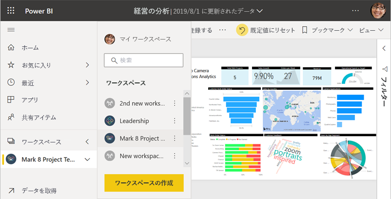
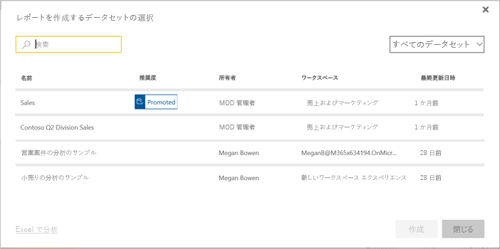

# Power BI で作業を共有する方法

ダッシュボードとレポートを作成しました。 ダッシュボードやレポートで同僚と共同作業することもあります。 その場合は、相手にアクセス許可を与える必要があります。 それらを配布する最善の方法は何でしょう。 この記事では、Power BI で共同作業および共有を行うための以下のオプションについて比較します。

* 同僚と共同作業を行い、*ワークスペース*で意味のあるレポートやダッシュボードを作成します。
* こうしたダッシュボードとレポートを*アプリ*にバンドルし、より大きいグループや組織全体に配布します。
* 同僚が自分のレポートの基礎として自分のワークスペース内で使用できる*共有データセット*を作成します。
* Microsoft AppSource を介して外部の Power BI ユーザーに配布することができる*テンプレート アプリ*を作成します。
* サービスまたは Power BI モバイル アプリから、数人のユーザーでダッシュボードまたはレポートを共有します。
* レポートを印刷します。
* セキュリティで保護されたポータルまたはパブリック Web サイトにレポートを*埋め込みます*。

どのオプションでも、コンテンツを共有するには [Power BI Pro のライセンス](service-features-license-type.md)が必要です。あるいは、コンテンツを [Premium 容量](service-premium-what-is.md)に格納する必要があります。 ライセンスの要件は、コンテンツを表示する同僚については、選んだオプションに応じて異なります。 次のセクションでは、詳細を説明します。 

*Power BI サービスでのアプリ*

## ワークスペースで共同作業する

チームで協力して作業する場合、迅速に共同作業できるように同じドキュメントにアクセスする必要があります。 Power BI ワークスペースでは、チームはダッシュボード、レポート、データセット、ワークブックの所有権と管理を共有でます。 Power BI ユーザーは、組織の構造に基づいてワークスペースを編成する場合や、特定のプロジェクト用に作成する場合があります。 さらに組織によっては、複数のワークスペースを使用して、組織で使用するレポートやダッシュボードの異なるバージョンを保存する場合もあります。 

ワークスペースには、同僚に付与するアクセス許可を指定するロールも用意されています。 このようなロールを使用して、ワークスペース全体を管理できるユーザー、コンテンツを編集できるユーザー、コンテンツを配布できるユーザーを指定することができます。

当然ながら、自分のマイ ワークスペースにコンテンツを配置し、そこから共有することもできます。 しかしワークスペースにはコンテンツの共同所有機能があるため、共同作業の点でマイ ワークスペースよりも優れています。 チームの管理者とチーム全体が更新を加え、他のユーザーにアクセス権を付与する操作も簡単です。 マイ ワークスペースは、1 人のユーザーが 1 回限りのコンテンツや個人用のコンテンツに使用する場合に適しています。

たとえば、ダッシュボードが完成し、同僚と共有する必要があるとします。 同僚にダッシュボードへのアクセス権を付与するために最適な方法は何でしょうか。 さまざまな要因でその答えは変わります。 

- 同僚がダッシュボードを最新の状態に保つ必要がある場合、またはワークスペース内のすべてのコンテンツにアクセスする必要がある場合は、その同僚をワークスペースに追加することを検討します。 
- 同僚に必要な操作がそのダッシュボードの閲覧だけで、ワークスペース内のすべてのコンテンツを閲覧する必要がない場合は、やはり他の選択肢があります。 数人のユーザーで 1 つのダッシュボードのみが必要な場合は、ダッシュボードの共有が最適なソリューションと考えられます。
- ただし、ダッシュボードが、より多くの同僚に配布する必要がある、さらに大きなコンテンツ セットの一部である場合は、*アプリ*の公開が最適な選択肢の可能性があります。

Power BI のワークスペース エクスペリエンスが新しくなりました。 ワークスペースがどのように変更されたかについては、[新しいワークスペースの作成](service-create-the-new-workspaces.md)に関する記事を参照してください。 

## アプリで分析情報を配布する

組織で多くの対象ユーザーにダッシュボードを配布するとします。 チームは*ワークスペース*を作成し、そのワークスペースに、ダッシュボード、レポート、およびデータセットを作成して、調整しました。 次に、目的のダッシュボードとレポートを選択し、それらをアプリとしてグループまたは組織全体に発行します。

アプリは Power BI サービス ([https://app.powerbi.com](https://app.powerbi.com)) で簡単に検索してインストールすることができます。 アプリへの直接リンクをビジネス ユーザーに送信したり、ユーザーが AppSource でアプリを検索しりすることができます。 Power BI 管理者からアクセス許可が与えられている場合は、同僚の Power BI アカウントにアプリを自動的にインストールすることができます。 詳細については、[アプリの発行](service-create-distribute-apps.md)に関するページを参照してください。

インストールしたアプリは、ブラウザーまたはモバイル デバイスで表示できます。

ユーザーがアプリを表示するには、ユーザーに Power BI Pro ライセンスが付与されているか、アプリを Power BI Premium 容量に格納する必要があります。 詳しくは、[Power BI Premium](service-premium-what-is.md) に関するページをご覧ください。

組織外の人向けにアプリを発行することもできます。 組織外のユーザーは、アプリのコンテンツを表示し、操作することはできますが、他のユーザーと共有することはできません。 これで、*テンプレート アプリ*を作成して、Power BI の顧客に配布できます。

## データセットを共有する

レポート内に、高品質で適切に設計されたデータ モデルを作成するスキルが人より高いユーザーがいる場合があります。 あなたが、その人かもしれません。 適切に設計された同じデータ モデルを組織全体で使用できれば便利です。 *共有データセット*がその役目を果たします。 全員が使用すべきデータ モデルでレポートを作成したら、そのレポートを Power BI サービスに保存して、適切なユーザーに使用権限を付与することができます。 それにより、ユーザーはそのデータセットに基づいてレポートを作成できます。 これで、誰もが同じデータに基づいてレポートを作成し、同じ "真実に基づく結果" を見ることができます。

詳細については、[共有データセットの作成と使用](service-datasets-across-workspaces.md)に関する記事を参照してください。

## ダッシュボードとレポートを共有する

マイ ワークスペースまたはワークスペースでダッシュボードとレポートの作成が完了し、他の少数のユーザーにアクセス許可を与える場合を考えてみましょう。 アクセス許可を与える方法の 1 つが、 *共有* することです。 

コンテンツを共有するには Power BI Pro ライセンスが必要です。また、共有先の人にも同様のライセンスが必要です。または、コンテンツを [Premium 容量](service-premium-what-is.md)のワークスペースに格納する必要があります。 ダッシュボードまたはレポートを共有すると、共有相手は、ダッシュボードを表示し、対話操作を行うことができますが、編集はできません。 行レベルのセキュリティ (RLS) が内部のデータセットに適用されない限り、自分のダッシュボードおよびレポートに表示されるものと同じデータが同僚にも表示されます。 共有元のユーザーが許可した場合、共有先のユーザーはそれを同僚と共有できます。 

組織外のユーザーと共有することもできます。 組織外のユーザーは、ダッシュボードまたはレポートを表示し、対話操作を行うことはできますが、共有することはできません。 

Power BI サービスからの[ダッシュボードとレポートの共有](service-share-dashboards.md)について、詳細を確認してください。 リンクにフィルターを追加して、[レポートのフィルター処理されたビューを共有](service-share-reports.md)することもできます。

## Power BI モバイル アプリから注釈を付けて共有する

iOS および Android デバイス用 Power BI モバイル アプリでは、タイル、レポート、またはビジュアルに注釈を付けて、電子メール経由で他のユーザーと共有できます。

タイル、レポート、ビジュアルのスナップショットが共有され、受信者にはメールで送信したものと同じ内容が表示されます。 メールにはダッシュボードまたはレポートへのリンクも含まれています。 受信者に Power BI Pro ライセンスがある、またはコンテンツが [Premium 容量](service-premium-what-is.md)に格納されていて、既にオブジェクトが共有されている場合、その受信者は、オブジェクトを開くことができます。 同じメール ドメインの同僚だけでなく、すべてのユーザーにタイルのスナップショットを送信できます。

iOS および Android モバイル アプリからの、[タイル、レポート、およびビジュアルの共有および注釈付け](consumer/mobile/mobile-annotate-and-share-a-tile-from-the-mobile-apps.md)の詳細を確認してください。

Windows 10 デバイス用 Power BI アプリから、[タイルのスナップショットを共有する](consumer/mobile/mobile-windows-10-phone-app-get-started.md)こともできます。

## PDF または他の静的ファイルとして印刷または保存する

Power BI サービスからダッシュボード全体、ダッシュボードのタイル、レポート ページ、または視覚エフェクトを PDF (または他の静的ファイル形式) として印刷または保存することができます。 レポートは、一度に 1 ページのみを印刷できます。レポート全体を一度に印刷することはできません。 詳しくは、「[Power BI からの印刷](consumer/end-user-print.md)」をご覧ください。

## セキュリティで保護されたポータルまたはパブリック Web サイトにレポートを埋め込む

### セキュリティで保護されたポータルに埋め込む

ユーザーに表示するポータルまたは Web サイトに Power BI レポートを埋め込むことができます。  
Power BI サービスの **[SharePoint Online に埋め込む]** および **[埋め込み]** オプションを使用すると、内部ユーザー向けに安全にレポートを埋め込むことができます。 

- **[SharePoint Online に埋め込む]** は、SharePoint Online の Power BI Web パーツで動作します。 レポートの埋め込み方法を制御できるシングル サインオン エクスペリエンスが提供されます。 
- **[埋め込み]** オプションは、URL または iFrame を使用したコンテンツの埋め込みをサポートするすべてのポータルまたは Web サイトで動作します。 

どちらのオプションを選択しても、ユーザーがコンテンツを表示する前にすべてのアクセス許可とデータのセキュリティが Power BI により適用されます。 レポートを表示するユーザーには、適切なライセンスが必要です。 Power BI の [[SharePoint Online に埋め込む]](service-embed-report-spo.md) および [[埋め込み]](service-embed-secure.md) オプションの詳細をご確認ください。

### パブリック Web サイトに公開する

**[Web に公開]** では、ブログ記事、Web サイト、ソーシャル メディア、および任意のデバイス上のその他オンライン通信に対話的な視覚エフェクトを埋め込むことで、Power BI レポートをインターネット全体に公開することができます。 インターネット上のすべてのユーザーがレポートを表示できるため、公開した内容を閲覧できるユーザーは制御できません。 ユーザーに Power BI ライセンスは必要ありません。 Web に公開できるのは、自分で編集可能なレポートだけです。 他のユーザーから共有されているレポート、またはアプリ内にあるレポートは、Web に公開できません。 [Web への公開について詳しくはこちら](service-publish-to-web.md)。

>[!Warning]
>内部の共有ではなく、一般向けにコンテンツを共有する場合にのみ、[[Web に公開]](service-publish-to-web.md) を使用してください。

## テンプレート アプリを作成して配布する

*テンプレート アプリ*は、特に Microsoft AppSource で、一般に配布するように設計されています。 アプリを作成し、ほとんどまたはまったくコーディングせずに Power BI の顧客すべてに展開することができます。 顧客は自分のデータに接続して自分のアカウントをインスタンス化します。 詳細については、[Power BI テンプレート アプリ](service-template-apps-overview.md)に関する記事を参照してください。

## 次の手順

* [同僚や他のユーザーとダッシュボードを共有する](service-share-dashboards.md)
* [Power BI でのアプリの作成および発行](service-create-distribute-apps.md)
* [セキュリティで保護されたポータルまたは Web サイトにレポートを埋め込む](service-embed-secure.md)

ご意見およびご提案がある場合は、 [Power BI コミュニティ サイト](https://community.powerbi.com/)をご利用ください。

他にわからないことがある場合は、 [Power BI コミュニティを利用してください](http://community.powerbi.com/)。
