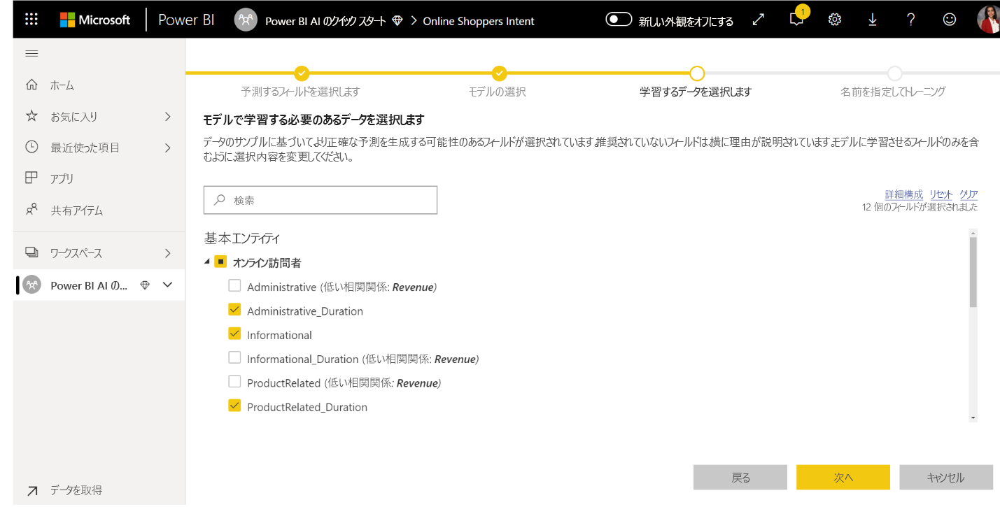
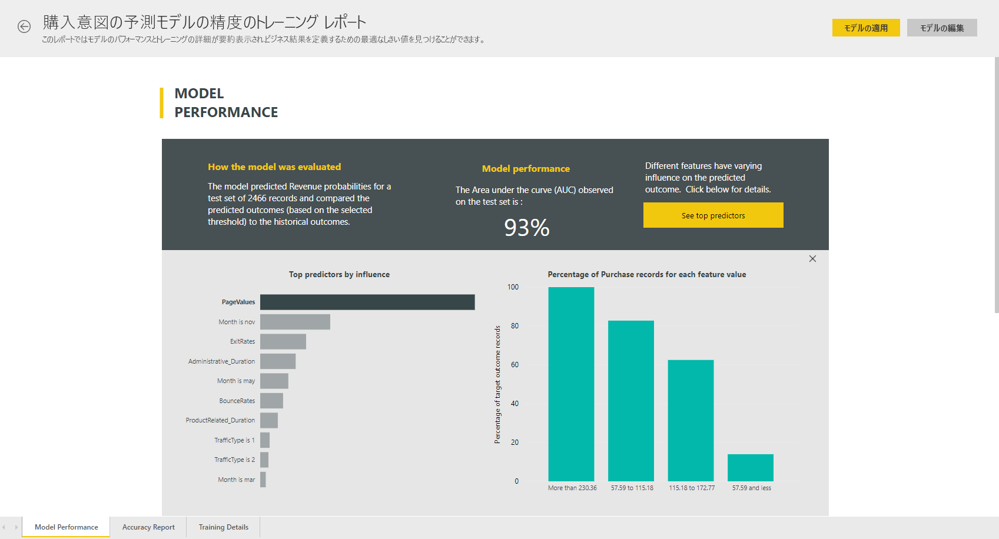
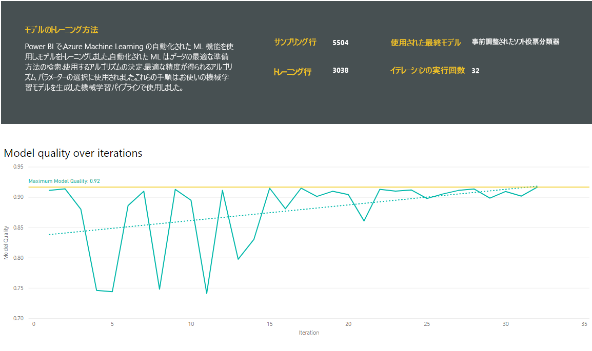
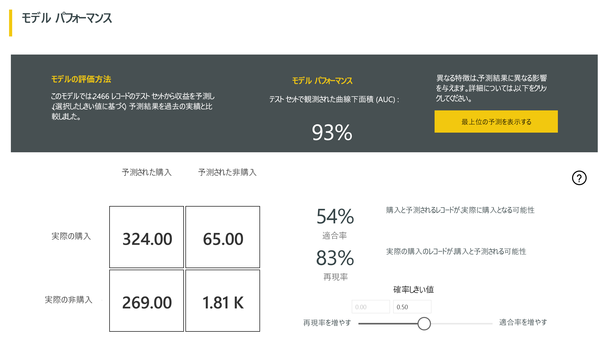
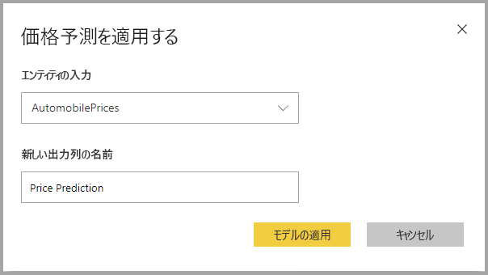

# Power BI での自動化 された機械学習

ビジネス アナリストはデータフローに自動機械学習 (AutoML) を使用すると、Power BI で Machine Learning (ML) モデルのトレーニング、検証、および呼び出しを直接行うことができます。 新しい ML モデルを作成するためのシンプルなエクスペリエンスが含まれており、アナリストはデータフローを使用して、モデルをトレーニングするための入力データを指定できます。 このサービスでは、最も関連性の高い特徴の抽出、適切なアルゴリズムの選択、ML モデルの調整と検証が自動的に行われます。 モデルのトレーニングが完了すると、Power BI によって、検証結果を含むパフォーマンス レポートが自動的に生成されます。 これで、データフロー内の新しいデータまたは更新されたデータに対してモデルを呼び出すことができるようになります。

自動機械学習は、Power BI Premium および Embedded 容量でホストされているデータフローにのみ使用できます。

## AutoML の使用

[Power BI データフロー](service-dataflows-overview.md)には、ビッグ データ用のセルフサービス データ準備が用意されています。 AutoML はデータフローに統合されており、Power BI 内で機械学習モデルを構築するためのデータ準備作業を活用できます。

データ アナリストは Power BI で AutoML を使用すると、Power BI スキルのみを使用して、シンプルなエクスペリエンスで機械学習モデルを構築できます。 ML モデルの作成の背後にあるほとんどのデータ サイエンスは Power BI で自動化されています。 これには、良好な品質のモデルを確実に作成できるガードレールがあり、ML モデルの作成に使用されたプロセスの可視性が提供されます。

AutoML では、データフローのために**バイナリの予測**、**分類**、**回帰モデル**の作成がサポートされています。 これらは監視対象の機械学習技術の種類です。つまり、過去の観測の既知の結果から学習して、他の観測結果を予測します。 AutoML モデルをトレーニングするための入力データセットは、既知の結果を使用して**ラベル付け**されたレコードのセットです。

Power BI の AutoML では、[Azure Machine Learning service](https://docs.microsoft.com/azure/machine-learning/service/overview-what-is-azure-ml) の[自動 ML](https://docs.microsoft.com/azure/machine-learning/service/concept-automated-ml) を統合して ML モデルが作成されます。 ただし、Power BI で AutoML を使用するために Azure サブスクリプションは必要ありません。 ML モデルのトレーニングとホストのプロセスは、Power BI サービスによって完全に管理されます。

ML モデルをトレーニングした後、AutoML によって、ML モデルの可能性のパフォーマンスを説明する Power BI レポートが自動的に生成されます。 AutoML では、モデルから返される予測に影響を与える入力の中で主要なインフルエンサーを強調することにより、説明可能性を強調します。 このレポートには、モデルの主要なメトリックも含まれています。

生成されたレポートのその他のページには、モデルの統計の概要とトレーニングの詳細が表示されます。 統計の概要は、モデル パフォーマンスの標準的なデータ サイエンス メジャーを表示したいと考えているユーザーにとって重要です。 トレーニングの詳細には、モデルを作成するために実行されたすべてのイテレーションと、関連するモデリングのパラメーターがまとめられています。 また、ML モデルを作成するために各入力がどのように使用されたかも示されます。

次に ML モデルをデータに適用してスコアリングを行うことができます。 データフローが更新されると、データは ML モデルからの予測によって更新されます。 Power BI には、ML モデルで生成される特定の予測ごとの個別の説明も含まれています。

## 機械学習モデルの作成

このセクションでは、AutoML モデルを作成する方法について説明します。

### ML モデルを作成するためのデータ準備

Power BI で機械学習モデルを作成するには、まず、履歴結果情報を含むデータのデータフローを作成する必要があります。これは ML モデルのトレーニングに使用されます。 また、予測しようとしている結果に対して強力な予測子である可能性があるビジネス メトリックの計算列も追加する必要があります。 データフローの構成の詳細については、「[Power BI でのセルフ サービスのデータの準備](service-dataflows-overview.md)」を参照してください。

AutoML には、機械学習モデルをトレーニングするための特定のデータ要件があります。 これらの要件については、以下のセクションで各モデルの種類に基づいて説明します。

### ML モデル入力の構成

AutoML モデルを作成するには、データフロー エンティティの **[アクション]** 列にある ML アイコンを選択し、 **[機械学習モデルの追加]** を選択します。

ML モデルを作成するプロセスを案内するウィザードで構成される簡素化されたエクスペリエンスが開始されます。 このウィザードには、次のシンプルな手順が含まれています。

**1.履歴データを含むエンティティと、予測が必要な結果フィールドを選択する**

次の図に示すように、結果フィールドによって ML モデルをトレーニングするためのラベル属性が特定されます。

**2.モデルの種類を選択する**

結果フィールドを指定すると、AutoML によってラベル データが分析され、トレーニング可能な最も可能性の高い ML モデルの種類が推奨されます。 次に示すように、[別のモデルを選択します] をクリックして、別のモデルの種類を選択できます。

> [!NOTE]
> 一部のモデルの種類は、選択したデータに対してサポートされていない可能性があるため、無効になります。 上の例では、テキスト列が結果フィールドとして選択されているため、回帰が無効になっています。

**3.モデルで予測シグナルとして使用する入力を選択する**

AutoML では、選択されたエンティティのサンプルが分析され、ML モデルのトレーニングに使用できる入力が提案されます。 選択されていないフィールドの横に説明が表示されます。 特定のフィールドに個別の値が多すぎるか 1 つの値しかない場合、または出力フィールドとの相関関係が低い、または高い場合は、推奨されません。

結果フィールド (またはラベル フィールド) に依存する入力は、パフォーマンスに影響があるため、ML モデルのトレーニングには使用しないでください。 このようなフィールドには、"出力フィールドとの不自然に高い相関関係" としてフラグが設定されます。 これらのフィールドをトレーニング データに導入すると、ラベルの漏えいが発生します。この場合、モデルは検証データまたはテスト データに対して適切に動作しますが、運用環境でスコアリングのために使用したときのパフォーマンスとは一致しません。 トレーニング モデルのパフォーマンスがあまりにも良い場合は、AutoML モデルでラベルの漏えいが懸念される場合があります。

この機能の推奨事項は、データのサンプルに基づいているため、使用した入力を確認する必要があります。 モデルで調査するフィールドだけを含めるように選択を変更することもできます。 また、エンティティ名の横にあるチェックボックスをオンにして、すべてのフィールドを選択することもできます。

**4.モデルに名前を付けて構成を保存する**

最後の手順では、モデルに名前を付け、[保存] を選択して、ML モデルのトレーニングを開始することができます。 トレーニング時間を短縮して簡単な結果を表示するか、トレーニングにかける時間を増やして最適なモデルを得るかを選択できます。

### ML モデルのトレーニング

AutoML モデルのトレーニングは、データフローの更新の一部です。 AutoML では、最初にトレーニング用のデータが準備されます。
AutoML によって、指定した履歴データがトレーニング データセットとテスト データセットに分割されます。 テスト データセットは、トレーニング後にモデルのパフォーマンスを検証するために使用される予約データ セットです。 これらは、データフローの**トレーニングおよびテスト** エンティティとして実現されます。 AutoML では、モデルの検証にクロス検証が使用されます。

次に、各入力フィールドが分析され、欠損値がある場合は代替値に置き換えるインピュテーションが適用されます。 AutoML では、いくつかの異なるインピュテーション戦略が使用されます。 数値特徴として扱われる入力属性の場合、列の値の平均がインピュテーションに使用されます。 カテゴリ特徴として扱われる入力属性の場合、AutoML で列値のモードがインピュテーションに使用されます。 インピュテーションに使用される値の平均とモードは、サブサンプリングされたトレーニング データセットの AutoML フレームワークによって計算されます。

次に、必要に応じて、サンプリングと正規化がデータに適用されます。 分類モデルの場合、AutoML では層化サンプリングを使用して入力データを実行され、クラスのバランスを取ることで、行カウントが確実にすべて等しくなるようにします。

AutoML によって、データ型とその統計プロパティに基づいて、選択された各入力フィールドにいくつかの変換が適用されます。 AutoML では、これらの変換を使用して、ML モデルのトレーニングに使用する特徴が抽出されます。

AutoML モデルのトレーニング プロセスは、最適なパフォーマンスのモデルを見つけるために、さまざまなモデリング アルゴリズムとハイパーパラメーター設定を使用する最大 50 個のイテレーションで構成されます。 AutoML でパフォーマンスが向上していないことが通知された場合、より少ないイテレーションで早期にトレーニングを終了できます。 これらの各モデルのパフォーマンスは、予約データのテスト データセットを使用した検証によって評価されます。 このトレーニング手順では、これらのイテレーションのトレーニングと検証のために、AutoML によって複数のパイプラインが作成されます。 モデルのパフォーマンスを評価するプロセスには、データセットと使用可能な専用容量リソースのサイズに応じて、数分からウィザードで構成されているトレーニング時間の上限の数時間までかかることがあります。

場合によっては、複数のモデルを使用して予測パフォーマンスを向上させるアンサンブル学習を最終的に生成されるモデルに使用できます。

### AutoML モデルの説明可能性

モデルのトレーニングが完了すると、AutoML によって入力機能とモデル出力の間のリレーションシップが分析されます。 これにより、各入力の特徴について、予約データのテスト データセットのモデル出力に対する変更の大きさが評価されます。 これは、"_特徴の重要度_" と呼ばれます。 これは、トレーニングが完了すると、更新の一部として行われます。 そのため、更新には、ウィザードで構成されているトレーニング時間よりも長い時間がかかることがあります。

### AutoML モデル レポート

AutoML では、グローバルな特徴の重要度と共に、検証中のモデルのパフォーマンスをまとめた Power BI レポートが生成されます。 データフローの更新が正常に完了したら、[Machine Learning モデル] タブからこのレポートにアクセスできます。 このレポートには、予約データのテスト データに ML モデルを適用し、その予測を既知の結果値と比較した結果がまとめられます。

モデルのレポートを確認すると、そのパフォーマンスを把握できます。 また、モデルの主要なインフルエンサーが、既知の結果に関するビジネスの分析情報に沿っているかどうかを検証することもできます。

レポート内でモデルのパフォーマンスを説明するために使用されるグラフとメジャーは、モデルの種類によって異なります。 これらのパフォーマンス グラフとメジャーについては、以下のセクションで説明します。

レポート内の追加ページには、データ サイエンスの観点からモデルに関する統計的なメジャー値が記載される場合があります。 たとえば、**バイナリの予測**レポートには、モデルのゲイン グラフと ROC 曲線が含まれています。

このレポートには、モデルのトレーニング方法についての説明が記載された **[トレーニングの詳細]** ページと、各イテレーションの実行に対するモデルのパフォーマンスを説明するグラフも含まれています。

このページのもう 1 つのセクションには、入力フィールドの欠損値を埋めるためにインピュテーション方法がどのように使用されたかが記載されています。 また、最終的なモデルで使用されたパラメーターも含まれます。

生成されるモデルにアンサンブル学習が使用される場合、 **[トレーニングの詳細]** ページには、そのパラメーターだけでなく、アンサンブルにおける各構成モデルの重みを示すグラフも含まれます。

## AutoML モデルの適用

作成された ML モデルのパフォーマンスに問題がなければ、データフローが更新されるときに、新しいデータまたは更新されたデータに適用することができます。 これを行うには、モデル レポートで右上隅の **[適用]** ボタンを選択するか、[Machine Learning モデル] タブの [アクション] の下にある [ML モデルの適用] ボタンを選択します。

ML モデルを適用するには、適用する先のエンティティの名前と、モデル出力用にこのエンティティに追加される列のプレフィックスを指定する必要があります。 列名の既定のプレフィックスはモデル名です。 _Apply_ 関数には、モデルの種類に固有の追加のパラメーターを含めることができます。

ML モデルを適用すると、2 つの新しいデータフロー エンティティが作成されます。これには、出力エンティティでスコアが付けられる各行の予測と個別の説明が含まれています。 たとえば、_OnlineShoppers_ エンティティに _PurchaseIntent_ モデルを適用すると、出力で **OnlineShoppers enriched PurchaseIntent** エンティティと **OnlineShoppers enriched PurchaseIntent explanations** エンティティが生成されます。 強化されたエンティティの各行に対して、**Explanations** が入力の特徴に基づいて、強化された説明エンティティ内の複数の行に分割されます。 **ExplanationIndex** は、強化された説明エンティティの行を、強化されたエンティティの行にマップするのに役立ちます。

モデルを適用すると、AutoML では、データフローが更新されるとすぐに予測が常に最新の状態に保たれます。

Power BI レポートで ML モデルの分析情報と予測を使用するには、**データフロー** コネクタを使用して Power BI Desktop から出力エンティティに接続します。

## バイナリの予測モデル

バイナリの予測モデル (より正式な呼び方では**二項分類**) は、データセットを 2 つのグループに分類するために使用されます。 これらは、二元の結果を持つ可能性のあるイベントを予測するために使用されます。 たとえば、営業案件が転換されるかどうか、アカウントが解約されるかどうか、請求書が期日どおりに支払われるかどうか、トランザクションが不正かどうかなどです。

バイナリの予測モデルの出力は確率スコアで、ターゲットの結果が達成される可能性が特定されます。

### バイナリの予測モデルのトレーニング

前提条件:

- 結果のクラスごとに最低 20 行の履歴データが必要

バイナリの予測モデルの作成プロセスは、前述のセクション「**ML モデル入力の構成**」で説明されているように、他の AutoML モデルと同じ手順に従います。 唯一の違いは、"モデルの選択" ステップで最も関心のあるターゲットの結果値を選択できることです。 モデルの検証結果を要約する、自動的に生成されるレポートで使用される結果に対してわかりやすいラベルを指定することもできます。

### バイナリの予測モデル レポート

バイナリの予測モデルでは、レコードがターゲットの結果を達成する確率が出力として生成されます。 このレポートには確率のしきい値のスライサーが含まれます。これは、確率のしきい値を上回るまたは下回るスコアの解釈方法に影響します。

このレポートでは、モデルのパフォーマンスが _[True Positives]\(真陽性\)、[False Positives]\(偽陽性\)、[True Negatives]\(真陰性\)、[False Negatives]\(偽陰性\)_ で示されます。 [True Positives]\(真陽性の数\) と [True Negatives]\(真陰性の数\) は、結果データの 2 つのクラスに対して正しく予測された結果です。 [False Positives]\(偽陽性\) は、ターゲットの結果があると予測されたが、実際にはなかったレコードです。 逆に、[False Negatives]\(偽陰性\) は、ターゲットの結果があったが、ないと予測されていたレコードのことです。

精度やリコールなどのメジャーは、予測される結果に対する確率のしきい値の影響を示します。 確率しきい値のスライサーを使用すると、精度とリコールのバランスが取れた妥協点を達成するしきい値を選択できます。

このレポートには、最高の利益を得るためにターゲットとする母集団のサブセットを特定するのに役立つ、費用対効果分析ツールも含まれています。 目標設定のための推定単位費用と、目標の結果を達成すると得られる単位便益を考慮して、費用対効果分析では利益の最大化が試行されます。 このツールを使用すると、グラフ内の最大ポイントに基づいて確率のしきい値を選択して、利益を最大化することができます。 また、グラフを使用して、確率のしきい値の選択に伴う利益またはコストを計算することもできます。

モデル レポートの **[Accuracy Report]\(精度レポート\)** ページには、モデルの _[Cumulative Gains]\(累積ゲイン\)_ グラフと ROC 曲線が含まれます。 これらは、モデルのパフォーマンスの統計的なメジャーです。 レポートには、表示されているグラフの説明が含まれます。

![[Accuracy report]\(精度レポート\) 画面](media/service-machine-learning-automated/automated-machine-learning-power-bi-15.png)

### バイナリの予測モデルの適用

バイナリの予測モデルを適用するには、ML モデルから予測を適用する先のデータを含むエンティティを指定する必要があります。 その他のパラメーターには、出力列名のプレフィックス、予測される結果を分類するための確率しきい値があります。

バイナリの予測モデルを適用すると、強化された出力エンティティに次の 4 つの出力列が追加されます。**Outcome**、**PredictionScore**、**PredictionExplanation**、および **ExplanationIndex** です。 エンティティ内の列名には、モデルの適用時に指定されるプレフィックスがあります。

**PredictionScore** は確率を示すパーセントで、ターゲットの結果が達成される可能性を割り出します。

**Outcome** 列には、予測結果ラベルが含まれています。 確率がしきい値を超えているレコードは、ターゲットの結果を達成できる可能性が高いと予測され、True としてラベル付けされます。 しきい値を下回っているレコードは、結果を達成する可能性が低いと予測され、False としてラベル付けされます。

**PredictionExplanation** 列には、**PredictionScore** に対して入力の特徴が与えた具体的な影響を示す説明が含まれています。

## 分類モデル

分類モデルは、データセットを複数のグループまたはクラスに分類するために使用されます。 これらは、複数の考えられる結果のいずれになるかイベントを予測するために使用されます。 たとえば、顧客の有効期間値が非常に高い、高い、中くらい、または低いのいずれの可能性が高いか、既定のリスクが高い、中くらい、低い、非常に低いのいずれかなどです。

分類モデルの出力は、特定のクラスの条件をレコードが達成する確率を特定する確率スコアです。

### 分類モデルのトレーニング

分類モデルのトレーニング データを含む入力エンティティには、過去の既知の結果を特定する文字列または整数フィールドが結果フィールドとして含まれている必要があります。

前提条件:

- 結果のクラスごとに最低 20 行の履歴データが必要

分類モデルの作成プロセスは、前述のセクション「**ML モデル入力の構成**」で説明されているように、他の AutoML モデルと同じ手順に従います。

### 分類モデル レポート

分類モデル レポートを生成するには、予約データのテスト データに ML モデルを適用し、レコードの予測クラスを実際の既知のクラスと比較します。

モデル レポートには、既知の各クラスについて分類が正しいレコードと不適切なレコードの内訳を含むグラフが表示されます。

さらにクラス固有のドリルダウンを使用すると、既知のクラスの予測がどのように分散されているかを分析できます。 これには、その既知のクラスのレコードが誤って分類される可能性のある他のクラスが示されます。

レポート内のモデルの説明には、各クラスの上位の予測子も含まれています。

分類モデル レポートには、この記事のセクション「**AutoML モデル レポート**」で前述したように、他の種類のモデルのページと同様の [トレーニングの詳細] ページも表示されます。

### 分類モデルの適用

分類 ML モデルを適用するには、入力データと出力列名のプレフィックスを持つエンティティを指定する必要があります。

分類モデルを適用すると、強化された出力エンティティに次の 5 つの出力列が追加されます。**ClassificationScore**、**ClassificationResult**、**ClassificationExplanation**、**ClassProbabilities**、**ExplanationIndex** です。 エンティティ内の列名には、モデルの適用時に指定されるプレフィックスがあります。

**ClassProbabilities** 列には、使用可能な各クラスのレコードの確率スコアの一覧が含まれています。

**ClassificationScore** は、確率を示すパーセントで、特定のクラスの条件をレコードが達成する確率を割り出します。

**ClassificationResult** 列には、レコードに対して予測される可能性が最も高いクラスが含まれています。

**ClassificationExplanation** 列には、**ClassificationScore** に対して入力の特徴が与えた具体的な影響を示す説明が含まれています。

## 回帰モデル

回帰モデルは、数値を予測するために使用されます。 たとえば、販売取引によって実現する可能性が高い収益、アカウントの有効期間の値、支払われる可能性のある売掛金請求書の金額、請求書が支払われる可能性がある日付などです。

回帰モデルの出力は予測値です。

### 回帰モデルのトレーニング

回帰モデルのトレーニング データを含む入力エンティティには、既知の結果値を特定する数値フィールドが結果フィールドとして含まれている必要があります。

前提条件:

- 回帰モデルには、少なくとも 100 行の履歴データが必要です

回帰モデルの作成プロセスは、前述のセクション「**ML モデル入力の構成**」で説明されているように、他の AutoML モデルと同じ手順に従います。

### 回帰モデル レポート

他の AutoML モデル レポートと同様に、回帰レポートは、予約データのテスト データにモデルを適用した結果に基づいています。

モデル レポートには、予測値と実際の値を比較するグラフが含まれています。 このグラフでは、斜線からの距離は、予測の誤差を示しています。

残余誤差グラフは、予約データのテスト データセット内のさまざまな値に関する平均誤差の割合の分布を示します。 横軸は、グループの実際の値の平均を表します。バブルのサイズは、その範囲内の値の頻度または数を示しています。 縦軸は、平均残余誤差です。

回帰モデル レポートには、セクション「**AutoML モデル レポート**」で前述したように、他の種類のモデルのレポートと同様の [トレーニングの詳細] ページも表示されます。

### 回帰モデルの適用

回帰 ML モデルを適用するには、入力データと出力列名のプレフィックスを持つエンティティを指定する必要があります。

回帰モデルを適用すると、強化された出力エンティティに次の 3 つの出力列が追加されます。**RegressionResult**、**RegressionExplanation**、**ExplanationIndex** です。 エンティティ内の列名には、モデルの適用時に指定されるプレフィックスがあります。

**RegressionResult** 列には、入力フィールドに基づいて、レコードの予測値が格納されます。 **RegressionExplanation** 列には、**RegressionResult** に対して入力の特徴が与えた具体的な影響を示す説明が含まれています。

## 次の手順

この記事では、Power BI サービスのデータフローの自動機械学習の概要について説明しました。 次の記事も推奨されます。

- [チュートリアル:Power BI で Machine Learning モデルを構築する](service-tutorial-build-machine-learning-model.md)
- [チュートリアル:Power BI での Cognitive Services の使用](service-tutorial-use-cognitive-services.md)
- [チュートリアル:Power BI での Machine Learning Studio モデルの呼び出し (プレビュー)](service-tutorial-invoke-machine-learning-model.md)
- [Power BI の Cognitive Services](service-cognitive-services.md)
- [Azure Machine Learning の Power BI への統合](service-machine-learning-integration.md)

データフローの詳細については、以下の記事をご覧ください。

- [Power BI でのデータフローの作成と使用](service-dataflows-create-use.md)
- [Power BI Premium での計算されたエンティティの使用](service-dataflows-computed-entities-premium.md)
- [オンプレミス データ ソースでのデータフローの使用](service-dataflows-on-premises-gateways.md)
- [Power BI データフロー用の開発者向けリソース](service-dataflows-developer-resources.md)
- [データフローと Azure Data Lake の統合 (プレビュー)](service-dataflows-azure-data-lake-integration.md)
