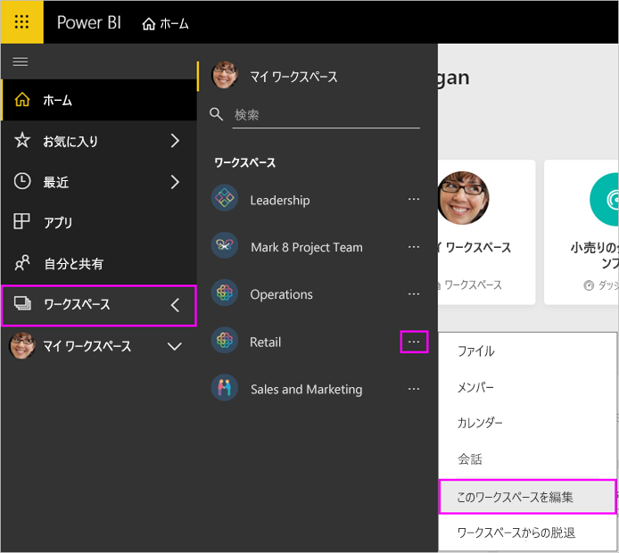
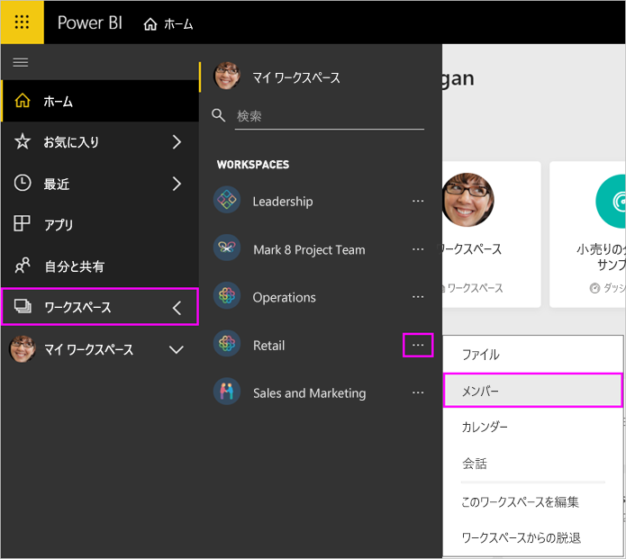
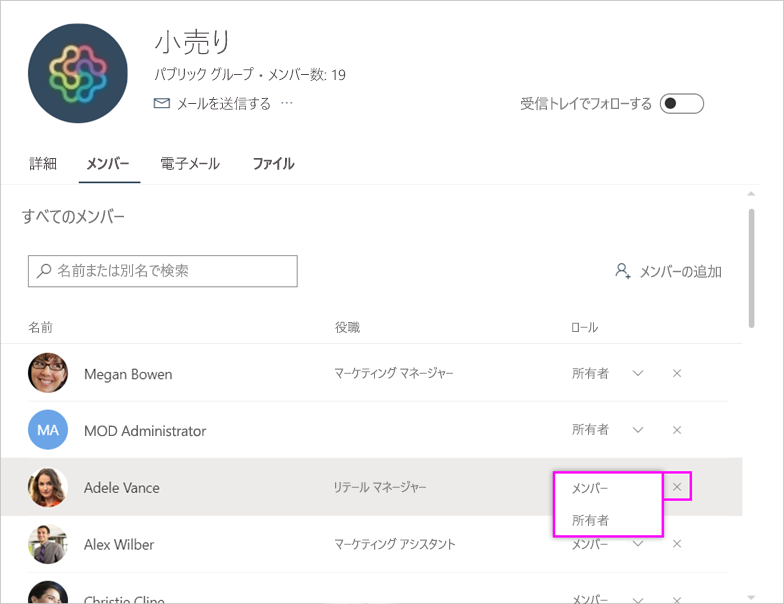

# Power BI と Office 365 でアプリ ワークスペースを管理する

Office 365 または [Power BI でのアプリ ワークスペース](service-create-distribute-apps.md)の作成者または管理者として、Power BI でワークスペースの一部の側面を管理します。 その他の側面は、Office 365 で管理します。

> [!NOTE]
> 新しいワークスペース エクスペリエンスでは、Power BI ワークスペースと Office 365 グループ間の関係が変わります。 新しいワークスペースのいずれかを作成するたびに、Office 365 グループが自動的に作成されることはありません。 新しいワークスペースの作成については、[こちら](service-create-the-new-workspaces.md)を参照してください。

**Power BI** では、次のことができます。

* アプリ ワークスペース メンバーを追加または削除します (ワークスペース メンバーを管理者にすることもできます)。
* アプリ ワークスペース名を編集します。
* アプリ ワークスペースを削除します。

**Office 365** では、次のことができます。

* アプリ ワークスペースのグループ メンバーを追加または削除します (メンバーを所有者にする操作も含まれます)。
* グループ名、画像、説明、およびその他の設定を編集します。
* グループの電子メール アドレスを参照します。
* グループを削除します。

アプリ ワークスペースの管理者またはメンバーになるには、[Power BI Pro](service-features-license-type.md) ライセンスが必要です。 アプリ ワークスペースが Power BI Premium 容量にない場合は、アプリ ユーザーにも Power BI Pro ライセンスが必要です。 詳しくは、[Power BI Premium](service-premium-what-is.md) に関するページをご覧ください。

## Power BI でアプリ ワークスペースを編集する

1. Power BI サービスで、 **[ワークスペース]** の横にある矢印を選択し、目的のワークスペース名の横にある省略記号 (…) を選択して、 **[このワークスペースを編集]** を選択します。

   

   > [!NOTE]
   > アプリ ワークスペース管理者の場合は、 **[このワークスペースを編集]** のみが表示されます。

1. ここでは、ワークスペースの名前の変更、メンバーの追加または削除、またはワークスペースの削除を行うことができます。

   ![[ワークスペースの編集] ダイアログ ボックス](media/service-manage-app-workspace-in-power-bi-and-office-365/power-bi-app-edit-workspace.png)

1. **[保存]** または **[キャンセル]** を選びます。

## Office 365 で Power BI アプリ ワークスペースのプロパティを編集する

Outlook for Office 365 でアプリ ワークスペースの側面を直接編集することもできます。

### アプリ ワークスペース グループのメンバーを編集する

1. Power BI サービスで、 **[ワークスペース]** の横にある矢印を選択し、目的のワークスペース名の横にある省略記号 (…) を選択して、 **[メンバー]** を選択します。

   

   サインインすると、アプリ ワークスペースの Outlook for Office 365 グループ ビューが開きます。 会社のアカウントにサインインする必要があります。

1. チームメイト名の横にあるロールを選択して、その人を**メンバー**または**所有者**にします。 **[X]** を選択して、グループからその人を削除します。

   

### イメージを追加してその他のワークスペースのプロパティを設定する

アプリ ワークスペースからアプリを配布するときに、ここで追加したイメージがアプリのイメージになります。 **新しいワークスペースの作成**に関する記事の「[Office 365 アプリ ワークスペースにイメージを追加する](service-create-workspaces.md#add-an-image-to-your-office-365-workspace-optional)」を参照してください。

1. アプリ ワークスペースの Outlook for Office 365 で、 **[バージョン情報]** タブにアクセスし、 **[編集]** を選択します。

    ![[グループの編集] アイコン](media/service-manage-app-workspace-in-power-bi-and-office-365/pbi_editgroupo365.png)
1. グループ関連の通知の名前、説明、および言語を編集できます。 ここでは、画像を追加したり、その他のプロパティを設定することもできます。

   ![[グループの編集] ダイアログ ボックス](media/service-manage-app-workspace-in-power-bi-and-office-365/pbi_editgrpo365dialog.png)

1. **[保存]** または **[破棄]** を選択します。

## 次の手順

* [Power BI でアプリを発行する](service-create-distribute-apps.md)

* 他にわからないことがある場合は、 [Power BI コミュニティを利用してください](http://community.powerbi.com/)。
