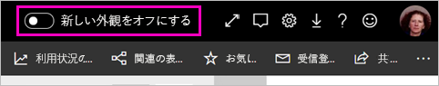
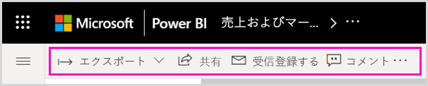

# Power BI サービスの "新しい外観"

Power BI サービス (app.powerbi.com) には、レポートの表示と操作を容易にする新しい外観が備わっています。 新しい外観はよりシンプルで、他の Microsoft 製品で慣れ親しんでいる外観に基づいています。 Power BI サービス全体で、明るい色のテーマに切り替え、アイコンを更新して、レポート コンテンツが焦点の中心になるようにしました。 

**Power BI Desktop** の新しい外観に関する情報をお探しですか? 「[Power BI Desktop で更新されたリボンを使用する](desktop-ribbon.md)」を参照してください。

新しい外観の変更点の概要を次に示します。 詳細については、番号付きのセクションを参照してください。

特定のアクションをお探しですか。 「["新しい外観": アクションの新しい場所](service-new-look-where-actions.md)」を参照してください。

## 変更のクイック ツアー

このアニメーションは、レポートの外観の変更をその動きで示しています。

## 1.新しい外観を選択する

Power BI サービスのすべてのユーザーは、新しい外観を選択できます。 **[新しい外観をオフにする]** を **[新しい外観をオンにする]** にスライドさせるだけです。

以前の外観に戻す必要がある場合は、![[新しい外観をオンにする]](media/service-new-look/power-bi-new-look-toggle-on.png) をスライドして**オフ**に戻すだけです。 表示されない場合は、右上隅にある省略記号メニューを選択します。

## 2.レポートの詳細の表示 

上部のバナーで、最終更新日や連絡先情報などの詳細をすばやく確認できます。  レポートに関する追加の詳細を表示するには、メニューを開きます。 レポートの所有者にメールを送信することもできます。

## 3.縦長のページ リスト 
レポート ページの名前が縦長のウィンドウに一覧表示されるようになりました。 これらは目立ち、見逃されることがなく、Word や PowerPoint のナビゲーションに似ています。 縦長のウィンドウのサイズを変更することで、レポート領域の残りの部分を拡大または縮小できます。

## 4.単純化されたアクション バー 

上部に表示される最新のアクション バーには、レポート コンシューマーにとって最も重要なコマンドが配置されています。 エクスポート、サブスクライブ、他のユーザーとのコラボレーション、フィルターとブックマークを使用した詳細な探索をより簡単に行うことができます。

## 5.レポート コマンドの場所

以前の外観にあった機能はどれも削除されていません。 アクション バーの省略記号 ([...] メニュー) を展開すると、追加のコマンド (編集、コピーの保存など) を見つけることができます。 また、コンテンツ リストから使用状況メトリックにアクセスすることもできます。

### [ファイル] メニューのアクションの場所

**[ファイル]** メニューのアクションをお探しですか。 **[ファイル]** メニューにあったアクションは、 **[その他のオプション]** (...) メニューにもあります。 

![新しい外観の [ファイル] メニュー](media/service-new-look/power-bi-file-menu-new-look.gif)

## 6.新しいフィルター エクスペリエンス

適用されたフィルターの表示や新しいフィルター ウィンドウなど、最近の更新は、新しい外観で既定で使用できます。 レポート デザイナーが新しいフィルター エクスペリエンスにアップグレードしていない場合でも、新しいフィルター ウィンドウが表示されます。

## ダッシュボードの "新しい外観" エクスペリエンス 

ダッシュボードには、レポートやアプリのように、簡素化されたアクション バーもあり、機能の違いを保ちながら一貫したエクスペリエンスが実現されます。 ダッシュボードでのアクションを次に示します。
 

## 編集モードへの変更なし 

作成エクスペリエンスは、デスクトップでのエクスペリエンスと同様に保たれています。 新しい外観の変更は、読み取りビューにのみ適用されます。

## 次の手順

- [Power BI Desktop で更新されたリボンを使用する](desktop-ribbon.md)
- [ワークスペースの "新しい外観" を選択する](collaborate-share/service-workspaces-new-look.md)
- [コンシューマー向けの Power BI](consumer/end-user-consumer.md)
