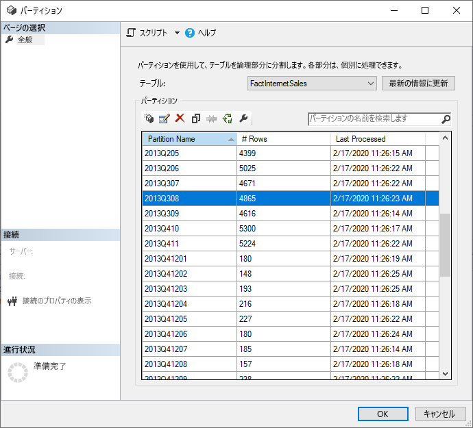
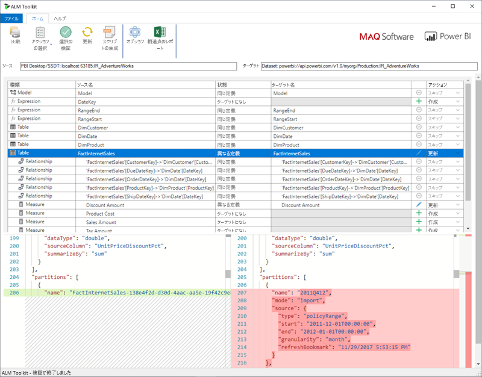

# <a name="incremental-refresh-in-power-bi"></a>Power BI での増分更新

Power BI の非常に大きいデータセットの増分更新には、次の利点があります。

> [!div class="checklist"]
> * **更新が高速化される** - 更新する必要があるのは変更されたデータのみです。 たとえば、10 年間のデータセットのうち過去 5 日間だけを更新します。
> * **更新の信頼性が高くなる** - 揮発性のソース システムに対して長時間の接続を維持する必要がなくなります。
> * **リソースの消費量が減る** - 更新するデータが少ないと、メモリや他のリソースの全体的な消費量が減少します。

> [!NOTE]
> 増分更新は、Power BI Pro、Premium および共有サブスクリプションとデータセットで行えます。 

## <a name="configure-incremental-refresh"></a>増分更新を構成する

増分更新ポリシーは、Power BI Desktop で定義し、発行されると Power BI サービスに適用されます。


### <a name="filter-large-datasets-in-power-bi-desktop"></a>Power BI Desktop で大きいデータセットをフィルター処理する

PBIX ファイルはデスクトップ コンピューターで利用可能なメモリ リソースによって制限されるため、数十億行になる可能性のある大きいデータセットは Power BI Desktop モデルに収まらない場合があります。 したがって、そのようなデータセットは、一般に、インポート時にフィルター処理されます。 この種のフィルター処理には、増分更新を使用するかどうかどうかが適用されます。 増分更新の場合は、Power Query の日付/時刻パラメーターを使用してフィルター処理します。

#### <a name="rangestart-and-rangeend-parameters"></a>RangeStart パラメーターと RangeEnd パラメーター

増分更新の場合、大文字と小文字が区別される予約済みの名前 **RangeStart** と **RangeEnd** で、Power Query の日付/時刻パラメーターを使用して、データセットがフィルター処理されます。 これらのパラメーターは、Power BI Desktop にインポートされるデータをフィルター処理するためだけでなく、Power BI サービスに発行された複数の範囲に動的にデータをパーティション分割するためにも使用されます。 パラメーターの値は、サービスによってパーティションごとにフィルター処理のために置き換えられます。 サービスのデータセットの設定で設定する必要はありません。 発行すると、パラメーター値は Power BI サービスによって自動的にオーバーライドされます。

既定値でパラメーターを定義するには、Power Query エディターで **[パラメーターの管理]** を選択します。


パラメーターを定義した後は、列の **[カスタム フィルター]** メニュー オプションを選択してフィルターを適用することができます。


列の値が **RangeStart** *以降で* **RangeEnd** "*より前*" になるように、行がフィルター処理されることを確認します。 他のフィルターの組み合わせによっては、行が二重にカウントされる場合があります。


> [!IMPORTANT]
> **RangeStart** または **RangeEnd** のいずれか (両方ではなく) で、クエリに等しい (=) があることを確認します。 等しい (=) が両方のパラメーターに存在する場合、行が 2 つのパーティションの条件を満たし、その結果、モデル内にデータが重複する可能性があります。 たとえば、  
> \#"Filtered Rows" = Table.SelectRows(dbo_Fact, each [OrderDate] **>= RangeStart** and [OrderDate] **<= RangeEnd**) は、データが重複する結果になる可能性があります。

> [!TIP]
> パラメーターのデータ型は日付/時刻でなければなりませんが、データ ソースの要件に合うように変換できます。 たとえば、次の Power Query 関数は、*yyyymmdd* という形式の整数代理キーと同じように日付/時刻値を変換します。これは、データ ウェアハウスの一般的な形式です。 この関数は、フィルター手順から呼び出すことができます。
>
> `(x as datetime) => Date.Year(x)*10000 + Date.Month(x)*100 + Date.Day(x)`

Power Query エディターで **[適用して閉じる]** を選びます。 Power BI Desktop にデータセットのサブセットが存在する必要があります。

#### <a name="filter-date-column-updates"></a>日付列の更新をフィルター処理する

Power BI サービスで日付列のフィルターを使用して、複数の範囲にデータを動的にパーティション分割します。 増分更新は、フィルター処理された日付列をソース システムでも更新するようには設計されていません。 更新は、実際の更新ではなく、挿入と削除として解釈されます。 削除が増分の範囲でなく、履歴の範囲で発生する場合は、ピックアップされません。 この場合、パーティション キーの競合によって、データ更新エラーが発生する可能性があります。

#### <a name="query-folding"></a>クエリの折りたたみ

更新操作のためにクエリが送信されるときに、パーティション フィルターがソース システムにプッシュされることが重要です。 フィルターをプッシュ ダウンするには、データ ソースでクエリの折りたたみがサポートされている必要があります。 SQL クエリをサポートするほとんどのデータ ソースは、クエリの折りたたみをサポートしています。 しかし、フラット ファイル、BLOB、Web フィードなどのデータ ソースでは、通常サポートされません。 フィルターがデータ ソース バックエンドでサポートされていない場合、プッシュ ダウンすることはできません。 そのような場合、フィルターはマッシュアップ エンジンによってローカルで補われて適用されます。そのためには、データ ソースから完全なデータセットを取得する必要が生じる場合があります。 これにより、増分更新が非常に低速になり、Power BI サービスまたはオンプレミスのデータ ゲートウェイ (使用されている場合) でプロセスがリソース不足になる可能性があります。

各データ ソースでさまざまなレベルのクエリの折りたたみがサポートされている場合は、ソースのクエリにフィルター ロジックが含まれていることを確認するための検証を実行することをお勧めします。 これを簡単にするため、Power BI Desktop ではこの検証の自動実行が試みられます。 検証できない場合は、増分更新ポリシーを定義するときに、増分更新ダイアログで警告が表示されます。 SQL、Oracle、Teradata などの SQL ベースのデータ ソースでは、この警告を利用できます。 他のデータ ソースでは、クエリをトレースしないと検証できない場合があります。 Power BI Desktop で確認できない場合は、次の警告が表示されます。 この警告が表示され、必要なクエリの折りたたみが行われていることを確認するには、クエリ診断機能を使用するか、ソース データベースが受け取ったクエリをトレースします。

 

### <a name="define-the-refresh-policy"></a>更新ポリシーを定義する

増分更新は、ライブ接続モデルを除く、テーブルのコンテキスト メニューで使用できます。


#### <a name="incremental-refresh-dialog"></a>[増分更新] ダイアログ

[増分更新] ダイアログが表示されます。 トグルを使用してダイアログを有効にします。


> [!NOTE]
> テーブルに対する Power Query の式が予約された名前のパラメーターを参照していない場合は、トグルが無効になっています。

ヘッダー テキストでは次のことが説明されています。

- 更新ポリシーは Power BI Desktop で定義され、サービスでの更新操作によって適用されます。

- Power BI サービスから増分更新ポリシーが含まれる PBIX ファイルをダウンロードできたとしても、それを Power BI Desktop で開くことはできません。 これは将来的にはサポートされる可能性がありますが、これらのデータセットは非常に大きくなる可能性があり、標準的なデスクトップ コンピューター上でダウンロードして開くことは実際的ではないということに注意してください。

#### <a name="refresh-ranges"></a>更新範囲

次の例では、丸 5 年間のデータと、現在の日付までの今年のデータを格納し、10 日間のデータを増分更新するように、更新ポリシーを定義します。 最初の更新操作では、履歴データを読み込みます。 その後の更新は増分的であり、(毎日実行するようにスケジュールされている場合は) 次の操作が実行されます。

- 新しい日のデータが追加されます。

- 現在の日付までの 10 日分が更新されます。

- 現在の日付より 5 年以上前のデータが削除されます。 たとえば、今日の日付が 2019 年 1 月 1 日の場合は、2013 年が削除されます。

Power BI サービスの最初の更新では、丸 5 年間のすべてをインポートするのに長くかかる可能性があります。 その後の更新は、わずかな時間で完了する可能性があります。


#### <a name="current-date"></a>現在の日付

"*現在の日付*" とは、更新時のシステム日付です。 Power BI サービスのデータセットでスケジュールされている更新が有効になっている場合は、指定したタイム ゾーンが考慮され、現在の日付が決定されます。 手動で呼び出された更新でも、スケジュールされている更新でも、指定されている場合はタイム ゾーンが順守されます。 たとえば、タイム ゾーンが指定された、太平洋標準時の午後 8 時 (米国およびカナダ) に発生する更新では、(それ以外の場合では翌日になる) GMT ではなく、太平洋標準時に基づいて現在の日付が決定されます。


> [!NOTE]
> これらの範囲の定義がすべて必要な場合は、後の発行操作にすぐに進むことができます。 追加のドロップダウンは高度な機能用です。

### <a name="advanced-policy-options"></a>高度なポリシーのオプション

#### <a name="detect-data-changes"></a>データ変更の検出

10 日間の増分更新は、5 年間の完全更新より効率的です。 ただし、さらによくすることができます。 **[データ変更の検出]** チェック ボックスをオンにすると、識別に使用する日付/時刻列を選択して、データが変更された日だけを更新することができます。 この場合、そのような列がソース システムに存在するものとします。一般的にこれは監査目的です。 **RangeStart パラメーターや RangeEnd パラメーターでデータをパーティション分割するために使用される列と同じ列にはしないでください。** この列の最大値が、増分範囲の各期間に対して評価されます。 前回の更新以降変更されていない場合、その期間を更新する必要はありません。 例では、増分更新される日数がさらに 10 日から約 2 日に減るはずです。


> [!TIP]
> 現在の設計では、データの変更を検出する列は永続化されてメモリにキャッシュされる必要があります。 次のいずれかの手法を使ってカーディナリティとメモリ消費量を減らすことを検討することが必要な場合があります。
>
> おそらく Power Query 関数を使って、更新時にこの列の最大値のみを保持します。
>
> 更新頻度の要件で許容されるレベルに有効桁数を減らします。
>
> XMLA エンドポイントを使用してデータの変更を検出するためのカスタム クエリを定義し、列の値の全体的な永続化を回避します。 詳細については、後述する「データ変更の検出のためのカスタム クエリ」を参照してください。

#### <a name="only-refresh-complete-periods"></a>完了期間のみを更新

たとえば、毎朝午前 4 時に更新を実行するようスケジュールされているものとします。 この 4 時間の間にソース システムに追加されたデータは考慮しないようにする必要があります。 石油ガス業界における 1 日あたりバレル数のような一部のビジネス メトリックでは、部分的な日には意味がありません。

別の例としては、前月のデータが 12 日に承認されるような財務システムからのデータ更新があります。 増分の範囲を 1 か月に設定し、12 日に実行するように更新をスケジュールします。 このオプションをオンにすると、たとえば 1 月のデータは 2 月 12 日に更新されます。


> [!NOTE]
> サービスの更新操作は、UTC 時刻で実行されます。 これにより、有効な日付を決定して、完全な期間に影響を与えることができます。 更新操作の有効日をオーバーライドする機能を追加する予定です。

## <a name="publish-to-the-service"></a>サービスへの公開

これで、モデルを更新できるようになりました。 最初の更新は、履歴データをインポートするため長くかかる可能性があります。 その後の更新は、増分更新を使用するため大幅に短縮できます。

## <a name="query-timeouts"></a>クエリのタイムアウト

[更新のトラブルシューティング](refresh-troubleshooting-refresh-scenarios.md)に関する記事では、Power BI サービスでの更新操作がタイムアウトの対象になることが説明されています。 クエリは、データ ソースの既定のタイムアウトによっても制限できます。 ほとんどのリレーショナル ソースでは、M 式でタイムアウトをオーバーライドできます。 たとえば、次の例では、[SQL Server のデータ アクセス関数](https://docs.microsoft.com/powerquery-m/sql-database)を使って 2 時間に設定しています。 ポリシーの範囲によって定義されている各期間が、コマンド タイムアウトの設定に従ってクエリを送信します。

```powerquery-m
let
    Source = Sql.Database("myserver.database.windows.net", "AdventureWorks", [CommandTimeout=#duration(0, 2, 0, 0)]),
    dbo_Fact = Source{[Schema="dbo",Item="FactInternetSales"]}[Data],
    #"Filtered Rows" = Table.SelectRows(dbo_Fact, each [OrderDate] >= RangeStart and [OrderDate] < RangeEnd)
in
    #"Filtered Rows"
```

## <a name="xmla-endpoint-benefits-for-incremental-refresh"></a>増分更新に関する XMLA エンドポイントの利点

Premium 容量でのデータセットに対する [XMLA エンドポイント](service-premium-connect-tools.md)を、読み取り、書き込み操作に対して有効にすることができます。これは、増分更新において大きな利点となります。 XMLA エンドポイントを介した更新操作は、[1 日 48 回の更新](refresh-data.md#data-refresh)に制限されるものではなく、さらに[スケジュールされた更新のタイムアウト](refresh-troubleshooting-refresh-scenarios.md#scheduled-refresh-timeout)も適用されません。このことは、増分更新のシナリオで役に立ちます。

### <a name="refresh-management-with-sql-server-management-studio-ssms"></a>SQL Server Management Studio (SSMS) を使用した更新管理

XMLA エンドポイントの読み取り、書き込みが有効になっていると、増分更新ポリシーの適用によって生成されたパーティションを、SSMS を使用して表示および管理することができます。



#### <a name="refresh-historical-partitions"></a>履歴パーティションを最新の情報に更新する

これにより、たとえば、増分範囲内にない特定の履歴パーティションを更新することで、日付を遡って更新を実行することができます。すべての履歴データを最新の情報に更新する必要はありません。

#### <a name="override-incremental-refresh-behavior"></a>増分更新の動作をオーバーライドする

SSMS では、[テーブル モデルのスクリプト言語 (TMSL)](https://docs.microsoft.com/analysis-services/tmsl/tabular-model-scripting-language-tmsl-reference?view=power-bi-premium-current) と[表形式オブジェクト モデル (TOM)](https://docs.microsoft.com/analysis-services/tom/introduction-to-the-tabular-object-model-tom-in-analysis-services-amo?view=power-bi-premium-current) を使用して、増分更新を呼び出す方法をより細かく制御することもできます。 たとえば、SSMS では、オブジェクト エクスプローラーでテーブルを右クリックしてから、 **[テーブルの処理]** メニュー オプションを選択します。 次に、 **[スクリプト]** ボタンをクリックして、TMSL 更新コマンドを生成します。

![[テーブルの処理] ダイアログの [スクリプト] ボタン](media/service-premium-incremental-refresh/ssms-process-table.png)

次のパラメーターを TMSL 更新コマンドに挿入すれば、既定の増分更新動作をオーバーライドできます。

- **applyRefreshPolicy** – テーブルで増分更新ポリシーが定義されている場合、そのポリシーを適用するかどうかは applyRefreshPolicy で決定されます。 ポリシーが適用されていない場合、完全処理操作では、パーティション定義は変わらないままで、テーブル内のすべてのパーティションは完全に更新されます。 既定値は true です。

- **effectiveDate** – 増分更新ポリシーが適用されている場合は、履歴範囲と増分範囲に対するローリング ウィンドウ範囲を決定するために現在の日付を把握しておく必要があります。 effectiveDate パラメーターを使用すると、現在の日付をオーバーライドすることができます。 これは、データを過去または将来の日付まで増分更新するテスト、デモ、およびビジネスのシナリオにおいて役立ちます (たとえば、将来の予算)。 既定値は[現在の日付](#current-date)です。

```json
{ 
  "refresh": {
    "type": "full",

    "applyRefreshPolicy": true,
    "effectiveDate": "12/31/2013",

    "objects": [
      {
        "database": "IR_AdventureWorks", 
        "table": "FactInternetSales" 
      }
    ]
  }
}
```

### <a name="custom-queries-for-detect-data-changes"></a>データ変更の検出のためのカスタム クエリ

TMSL または TOM を使用して、検出されたデータ変更動作をオーバーライドできます。 これを使用すれば、メモリ内キャッシュでの最終更新列の永続化を回避できるだけでなく、更新が必要なパーティションのみにフラグを付ける目的で ETL プロセスによって構成または命令テーブルが準備されるというシナリオを有効にすることができます。 これにより、データ更新がどれほど前に行われたかに関係なく、必要な期間についてのみ更新されるという、より効率的な増分更新プロセスを作成できます。

pollingExpression は、他の M クエリの簡易な M 式または名前とすることを目的としています。 スカラー値が返される必要があり、パーティションごとに実行されます。 返された値が、増分更新を最後に実行したときとは異なる場合、パーティションには完全処理のフラグが設定されます。

次の例では、日付を遡った変更について履歴の範囲内の 120 か月すべてが対象とされています。 10 年ではなく 120 か月を指定した場合、データ圧縮はそれほど効率的ではないかもしれませんが、履歴年の 1 年全体を最新の情報に更新する必要はなくなります (それを行うとしたら、日付を遡った変更には 1 か月で十分である場合によりコストがかかります)。

```json
"refreshPolicy": {
    "policyType": "basic",
    "rollingWindowGranularity": "month",
    "rollingWindowPeriods": 120,
    "incrementalGranularity": "month",
    "incrementalPeriods": 120,
    "pollingExpression": "<M expression or name of custom polling query>",
    "sourceExpression": [
    "let ..."
    ]
}
```

## <a name="metadata-only-deployment"></a>メタデータのみの配置

新しいバージョンの PBIX ファイルを Power BI Desktop から Power BI サービス内のワークスペースに発行すると、同じ名前を持つデータセットが既に存在している場合、既存のデータセットを置き換えるように求められます。


場合によっては、データセットを置換したくないこともあります (特に増分更新で)。 Power BI Desktop 内のデータセットは、サービス内のものより大幅に小さくなる可能性があります。 サービス内のデータセットに増分更新ポリシーが適用されている場合、データセットが置換されると、数年分の履歴データが失われる可能性があります。 すべての履歴データを最新の情報に更新すると、時間がかかり、ユーザーに対してシステムのダウンタイムが発生する可能性があります。

代わりに、メタデータのみの展開を実行することをお勧めします。 そうすれば、履歴データを失うことなく新しいオブジェクトを展開することができます。 たとえば、いくつかのメジャーを追加した場合、データを最新の情報に更新する必要なく新しいメジャーのみを展開できるので、時間を大幅に節約できます。

読み取り、書き込みに対して構成した場合、XMLA エンドポイントは、それを行うツールとの互換性を提供します。 たとえば、ALM Toolkit は Power BI データセット用のスキーマ差分ツールであり、これを使用すればメタデータの展開のみを実行することができます。

[Analysis Services の Git リポジトリ](https://github.com/microsoft/Analysis-Services/releases)から最新バージョンの ALM Toolkit をダウンロードしてインストールします。 ドキュメントのリンクと、サポートの可否に関する情報には、[ヘルプ] リボンからアクセスできます。 メタデータのみの展開を実行するには、比較を実行し、実行中の Power BI Desktop インスタンスをソースとして、サービス内の既存のデータセットをターゲットとして選択します。 表示される相違点を検討し、テーブルと増分更新パーティションの更新をスキップするか、[オプション] ダイアログを使用してテーブルの更新のためにパーティションを維持します。 選択内容を検証してターゲット モデルの整合性を確保してから、更新を行います。



## <a name="see-also"></a>関連項目

[XMLA エンドポイントを使用したデータセット接続](service-premium-connect-tools.md)   
[更新に関するトラブルシューティング シナリオ](refresh-troubleshooting-refresh-scenarios.md)   
