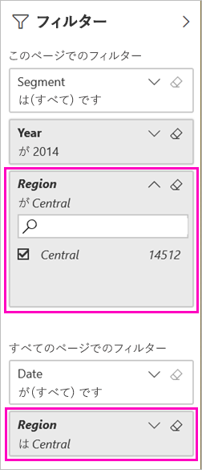

# フィルター処理された Power BI レポートを共有する 2 つの方法
"*共有*" は、自分のダッシュボードおよびレポートに他のユーザーがアクセスできるようにするのによい方法です。 フィルター処理されたバージョンのレポートを共有したい場合は、どうすればよいでしょうか。 たとえば、特定の都市や販売員、または特定の年のデータだけを表示するレポートを共有したい場合があります。 レポートをフィルター処理して共有するか、カスタム URL を作成してみてください。 受信者が初めてレポートを開くと、フィルターが適用されます。 URL を変更することでフィルターを解除できます。 

Power BI では、[レポートの共同作業や配布を行う他の方法](service-how-to-collaborate-distribute-dashboards-reports.md)も用意されています。 共有する際、共有元と共有先の双方に [Power BI Pro ライセンス](service-features-license-type.md)が必要です。または、コンテンツを [Premium 容量](service-premium-what-is.md)に格納する必要があります。 

## レポートをフィルター処理する 2 つの方法

どちらのフィルター処理手法でも、マーケティングと売上のサンプル テンプレート アプリを使用します。 試してみたいですか。 [マーケティングと売上サンプル テンプレート アプリ](https://appsource.microsoft.com/product/power-bi/microsoft-retail-analysis-sample.salesandmarketingsample?tab=Overview)をインストールすることもできます。

### フィルターを設定する

[編集ビュー](consumer/end-user-reading-view.md)でレポートを開き、フィルターを適用します。

この例では、マーケティングと売上サンプル テンプレート アプリの YTD Category ページをフィルター処理して、**Region** が **Central** と等しい値のみを表示しています。 
 
![[レポート フィルター] ウィンドウ](media/service-share-reports/power-bi-share-report-filter.png)

レポートを保存します。

### URL でフィルターを作成する

レポート ページの URL の末尾にフィルターを追加すると、動作は少し異なります。 フィルター処理されたページは同じように見えます。 ただし、Power BI によりレポート全体にフィルターが追加されて、フィルター ウィンドウからの他の値は削除されます。  

レポート ページの URL の末尾に以下を追加します:
   
    ?filter=*tablename*/*fieldname* eq *value*
   
フィールドの型は、数値、日時、または文字列である必要があります。 *tablename* 値または *fieldname* 値にはスペースを含めることができません。
   
この例では、テーブルの名前は **Geo**、フィールドの名前は **Region**、フィルター処理の対象の値は **Central** です。
   
    ?filter=Geo/Region eq 'Central'

スラッシュ、スペース、およびアポストロフィを表すために、ブラウザーによって特殊文字が追加されるため、最終的に次のようになります。
   
    app.powerbi.com/groups/xxxx/reports/xxxx/ReportSection4d00c3887644123e310e?filter=Geo~2FRegion%20eq%20'Central'

レポートを保存します。

詳しくは、記事「[URL のクエリ文字列パラメーターを使用してレポートをフィルター処理する](service-url-filters.md)」をご覧ください。

## フィルター処理されたレポートを共有する

1. [レポートを共有](service-share-dashboards.md)ときは、 **[受信者に電子メールの通知を送信する]** チェック ボックスをオフにします。

    ![[レポートの共有] ダイアログ ボックス](media/service-share-reports/power-bi-share-report-dialog.png)

4. 先ほど作成したフィルターを使用して、リンクを送信します。

## 次の手順
* [Power BI で作業を共有する方法](service-how-to-collaborate-distribute-dashboards-reports.md)
* [ダッシュボードの共有](service-share-dashboards.md)
* 他にわからないことがある場合は、 [Power BI コミュニティを利用してください](https://community.powerbi.com/)。
* ご意見およびご提案がある場合は、 [Power BI コミュニティ サイト](https://community.powerbi.com/)をご利用ください。

