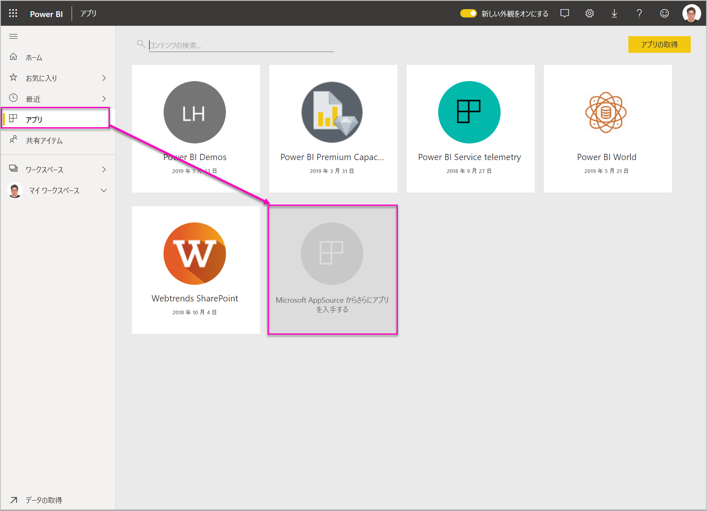
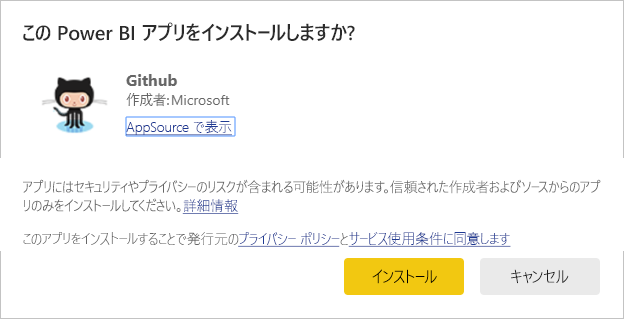
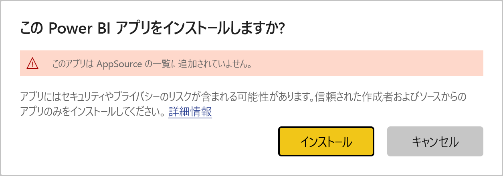
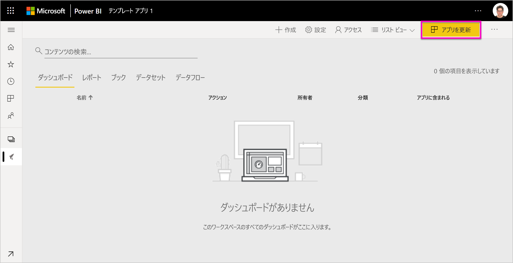
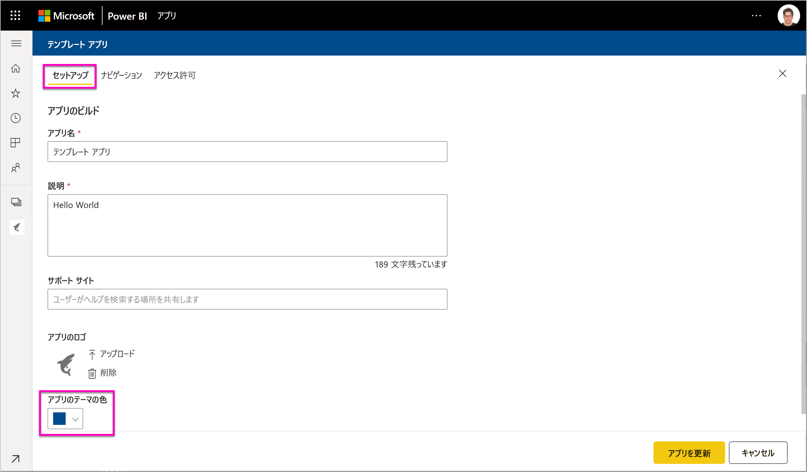

# 組織でテンプレート アプリをインストールし、配布する - Power BI

あなたは Power BI のアナリストですか? そうであれば、この記事では*テンプレート アプリ*をインストールし、Salesforce、Microsoft Dynamics、Google Analytics など、ビジネスに使用するさまざまなサービスに接続する方法について説明します。 組織のニーズに合わせてダッシュボードとレポートを変更し、その後*アプリ*として同僚に配布できます。 

自分で配布するテンプレート アプリを作成する場合、「[Create a template app in Power BI](service-template-apps-create.md)」 (Power BI でテンプレート アプリを作成する) を参照してください。 Power BI パートナーは、ほとんどまたはまったくコーディングせずに Power BI アプリを作成し、Power BI ユーザーに展開することができます。 

## 前提条件  

テンプレート アプリをインストールし、カスタマイズし、配布するための要件: 

- [Power BI Pro ライセンス](service-self-service-signup-for-power-bi.md)
- [Power BI の基本的概念](service-basic-concepts.md)に関する知識
- テンプレート アプリの作成者または AppSource から受け取った有効なインストールのリンク 
- テンプレート アプリをインストールする許可 

## テンプレート アプリをインストールする

テンプレート アプリのリンクは送られてくることがあります。 そうでない場合、興味のあるテンプレート アプリを AppSource で探すことができます。 いずれの方法でも、インストール後、変更し、自分の組織に配布できます。

### ブラウザーから AppSource を検索する

ブラウザーで下のリンクを選択し、AppSource を開きます。Power BI アプリに絞り込まれています。

- https://appsource.microsoft.com/marketplace/apps?product=power-bi

### Power BI サービスから AppSource を検索する

1. Power BI サービスの左側のナビゲーション ウィンドウで、 **[アプリ]** 、 **[アプリの取得]** の順に選択します。

    

2. AppSource で **[アプリ]** を選択します。

    

3. アプリを参照するか、検索し、 **[今すぐ入手する]** を選択します。

4. ダイアログ ボックスで **[インストール]** を選択します。

     Power BI Pro ライセンスを持っている場合、アプリとそれに関連するアプリ ワークスペースがインストールされます。 関連ワークスペースでアプリをカスタマイズします。

    インストールが正常に完了すると、新しいアプリの準備ができたことが通知されます。
4. **[アプリに移動]** を選択します。
5. **[新しいアプリを開始する]** で 3 つの選択肢のいずれかを選択します。

    

    - **アプリを探索**:基本的なサンプル データの探索。 アプリのルックアンドフィールはここから取得します。 
    - **データに接続**:データ ソースをサンプル データから独自のデータ ソースに変更します。 データセット パラメーターとデータ ソースの資格情報を再定義できます。 テンプレート アプリのヒント記事で「[既知の制限事項](service-template-apps-tips.md#known-limitations)」をご覧ください。 
    - **ワークスペースに移動** (最も細かく設定する場合): アプリ ビルダーが許可しているあらゆる変更を実行できます。

    あるいは、このダイアログ ボックスをスキップし、左側のナビゲーション ウィンドウにある **[ワークスペース]** から直接、関連ワークスペースにアクセスします。
    >[!NOTE]
    >テンプレート アプリをインストールすると、*組織アプリ*と*アプリ ワークスペース*の両方がインストールされました。 詳細については、[Power BI でのアプリの配布](service-create-distribute-apps.md)に関するページをご覧ください。
 
6. 同僚と共有する前に、独自のデータに接続することをお勧めします。 また、組織に合わせてレポートやダッシュボードを修正することもお勧めします。 この段階で他のレポートやダッシュボードも追加できます。

   AppSource にリストされていないアプリのインストール リンクを選択した場合は、ご自分の選択内容を確認するように求める検証ダイアログボックスが表示されます。

   

   >[!NOTE]
   >AppSource にリストされていないテンプレート アプリをインストールするには、ご自分の管理者アクセス許可から要求する必要があります。 詳細については、Power BI [管理ポータルのテンプレート アプリの設定](service-admin-portal.md#template-apps-settings)に関するセクションを参照してください。

## アプリを更新し、配布する

組織に合わせてアプリを調整したら、それを公開できます。 手順は、他のアプリを公開する場合と同じです。

1. カスタマイズが終わったら、ワークスペース リスト ビューの右上隅にある **[アプリを更新]** を選択します。  

    

2. **[詳細]** では、説明や背景色を変更できます。

   

3. **[コンテンツ]** では、ランディング ページとしてダッシュボードかレポートを選択できます。

   

4. **[アクセス]** では、選んだユーザーか組織全体にアクセスを与えます。  

   

5. **[アプリを更新]** を選択します。 

6. 正常に公開されたら、リンクをコピーし、アクセスを与えている人と共有できます。 共有すると、共有相手にも、AppSource の **[組織]** タブでそのアプリが表示されます。

## 次の手順 

[Power BI で同僚と一緒にワークスペースを作成する](service-create-workspaces.md)

  

 
