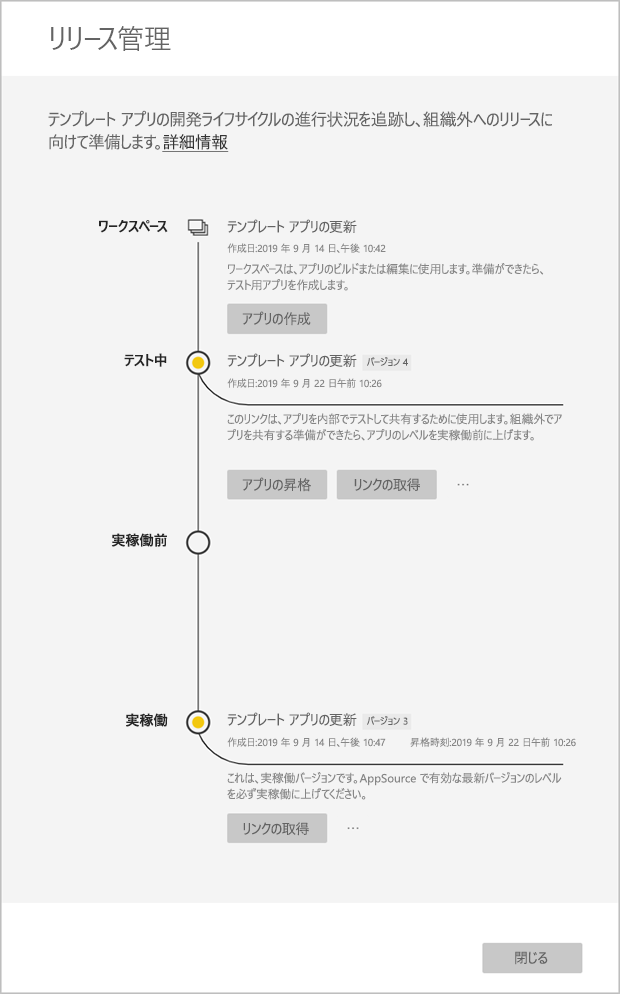

# テンプレート アプリの更新、削除、および抽出

これでアプリが実稼働に入りました。実稼働のアプリを邪魔することなく、テスト段階を繰り返すことができます。
## アプリを更新する

1. **[リリース管理]** ウィンドウで **[アプリの作成]** を選択します。
2. アプリ作成プロセスを繰り返します。
3. **[ブランド]** 、 **[コンテンツ]** 、 **[コントロール]** 、 **[アクセス]** を設定し、もう一度 **[アプリの作成]** を選択します。
4. **[閉じる]** を選択し、 **[リリース管理]** に戻ります。

   これで実稼働のバージョンとテスト中の新しいバージョンという 2 つのバージョンが表示されます。

    

5. アプリを実稼働前ステージに昇格させ、テナントの外でテストする準備ができたら、[リリース管理] ウィンドウに戻り、 **[テスト]** の隣にある **[アプリの昇格]** を選択します。
6. これでリンクはライブになります。 [Power BI アプリ オファーの更新](https://docs.microsoft.com/azure/marketplace/cloud-partner-portal/power-bi/cpp-update-existing-offer)に関する記事の手順に従って、Cloud パートナー ポータル (CPP) にそれを再度送信します。
7. CPP で、オファーをもう一度検証するだけでなく、再度**公開**する必要があります。

>[!NOTE]
>アプリを実稼働ステージに昇格させるのは、アプリが Cloud パートナー ポータルで承認され、それを公開した後のみです。

## ワークスペースの抽出
以前のバージョンのテンプレート アプリへのロールバックは、抽出機能を使用して今までより簡単になりました。 次の手順では、さまざまなリリースの段階から新しいワークスペースに特定のアプリ バージョンを抽出します。

1. [リリース管理] ウィンドウで、詳細 **(...)** を押してから、 **[抽出]** を押します。

     
2. ダイアログ ボックスで、抽出されたワークスペースの名前を入力します。 新しいワークスペースが追加されます。

新しいワークスペースのバージョン管理がリセットされ、新しく抽出されたワークスペースからテンプレート アプリの開発および配布を続行できます。

## テンプレート アプリのバージョンの削除
テンプレート アプリ ワークスペースは、アクティブな配布済みテンプレート アプリのソースです。 テンプレート アプリのユーザーを保護するために、まずワークスペース内の作成済みのアプリ バージョンをすべて削除しなければ、ワークスペースを削除することはできません。
アプリのバージョンを削除すると、機能しなくなるアプリ URL も削除されます。

1. [リリース管理] ウィンドウで、省略記号 **(...)** を押してから、 **[削除]** を選択します。
 
 

>[!NOTE]
>顧客や **AppSource** によって使用されているアプリのバージョンを削除しないようにしてください。削除すると、それらは機能しなくなります。

## 次の手順

顧客がテンプレート アプリを操作するしくみについては、[組織でのアプリのインストールと配布](service-template-apps-install-distribute.md)に関するページをご覧ください。

アプリ配布の詳細については、「[Power BI アプリケーション プラン](https://docs.microsoft.com/azure/marketplace/cloud-partner-portal/power-bi/cpp-power-bi-offer)」をご覧ください。
