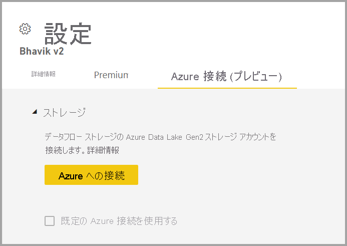
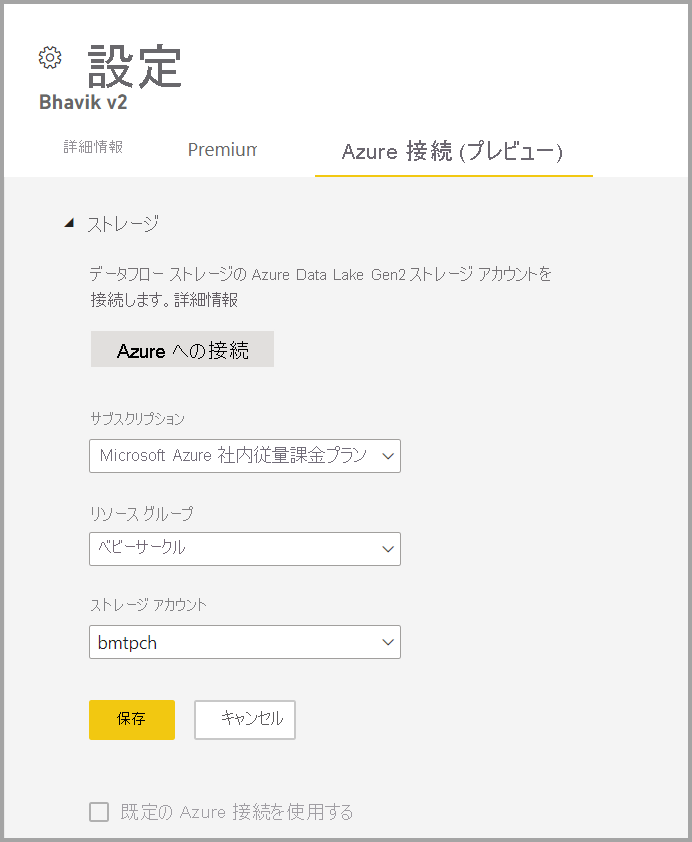

# Azure Data Lake Gen 2 を使用するようにデータフロー ストレージを構成する 

既定では、Power BI で使用されるデータは、Power BI によって提供される内部ストレージに保存されます。 データフローと Azure Data Lake Storage Gen2 (ADLS Gen2) を統合すると、組織の Azure Data Lake Storage Gen2 アカウントにデータフローを保存できます。

使用する ADLS Gen 2 ストアを構成するには、2 つの方法があります。ADLS Gen 2 アカウントが割り当てられたテナントを使用する方法と、ワークスペース レベルで独自の ADLS Gen 2 ストアを使用する方法です。 

## 前提条件

独自の ADLS Gen 2 アカウントを使用するには、ストレージ アカウント、リソース グループ、サブスクリプションのいずれかの層で所有者のアクセス許可が必要です。 管理者であっても、自分自身に所有者のアクセス許可を割り当てる必要があります。 

さらに、ADLS Gen 2 アカウントを、Power BI テナントと同じリージョンにデプロイする必要があります。 リソースの場所が同じリージョンにない場合、エラーが発生します。

最後に、管理ポータルから任意の ADLS Gen 2 に接続できますが、ワークスペースに直接接続する場合は、接続する前にまず、ワークスペースを確実にデータフローがない状態にする必要があります。

## ワークスペースで Azure Data Lake Gen 2 に接続する
データフローがないワークスペースに移動します。 **[ワークスペースの設定]** を選択すると、 **[Azure Connections]\(Azure 接続\)** という名前の新しいタブが表示されます。 **[Azure Connections]\(Azure 接続\)** タブを選択し、 **[ストレージ]** セクションを選択します。

 
テナントで ADLS Gen 2 が既に構成されている場合、 **[Use default Azure connection]\(既定の Azure 接続を使用する\)** オプションが表示されます。 2 つのオプションがあります。 **[Use the default Azure connection]\(既定の Azure 接続を使用する\)** という名前のボックスを選択して、ADLS Gen 2 が構成されているテナントを使用するか、または **[Azure に接続する]** を選択して、新しい Azure Storage アカウントをポイントします。 

**[Azure に接続する]** を選択すると、Power BI により、アクセスできる Azure サブスクリプションの一覧が取得されます。 ドロップダウンに入力し、階層型名前空間オプションが有効になっている有効な Azure サブスクリプション、リソース グループ、ストレージ アカウントを選択します。これは、ADLS Gen 2 フラグです。

 
選択したら、 **[保存]** を選択します。これで、ワークスペースが独自の ADLS Gen2 アカウントに正常に接続されます。 Power BI により、必要なアクセス許可を使用してストレージ アカウントが自動的に構成され、データが書き込まれる Power BI ファイル システムが設定されます。 この時点で、このワークスペース内のすべてのデータフローのデータはこのファイル システムに直接書き込まれ、他の Azure サービスで使用できるため、すべての組織データまたは部門データの単一ソースが作成されます。

## Azure Data Lake Gen 2 をワークスペースまたはテナントから接続解除する

ワークスペース レベルで接続を削除するには、まず、ワークスペース内のすべてのデータフローを確実に削除する必要があります。 すべてのデータフローが削除されたら、ワークスペースの設定で **[接続解除]** を選択します。 同じことがテナントにも当てはまります。ただし、テナント レベルで接続解除する場合は、その前にまず、すべてのワークスペースをテナント ストレージ アカウントから確実に接続解除する必要があります。

## Azure Data Lake Gen 2 を無効にする

**管理ポータル**の **[データフロー]** で、ユーザーがこの機能を使用するためのアクセスを無効にしたり、ワークスペース管理者が独自の Azure Storage を使用するのを禁止したりすることができます。

## 次のステップ
データフローと Power BI の詳細については、以下の記事を参照してください。

* [データフローとセルフサービスのデータ準備の概要](dataflows-introduction-self-service.md)
* [データフローの作成](dataflows-create.md)
* [データフローの構成と使用](dataflows-configure-consume.md)
* [データフローの Premium 機能](dataflows-premium-features.md)
* [データフローでの AI の使用](dataflows-machine-learning-integration.md)
* [データフローの制限事項と考慮事項](dataflows-features-limitations.md)