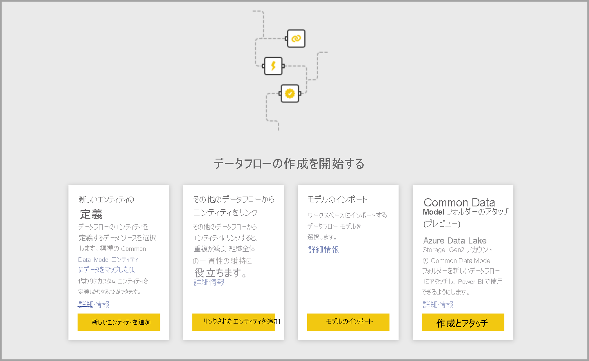
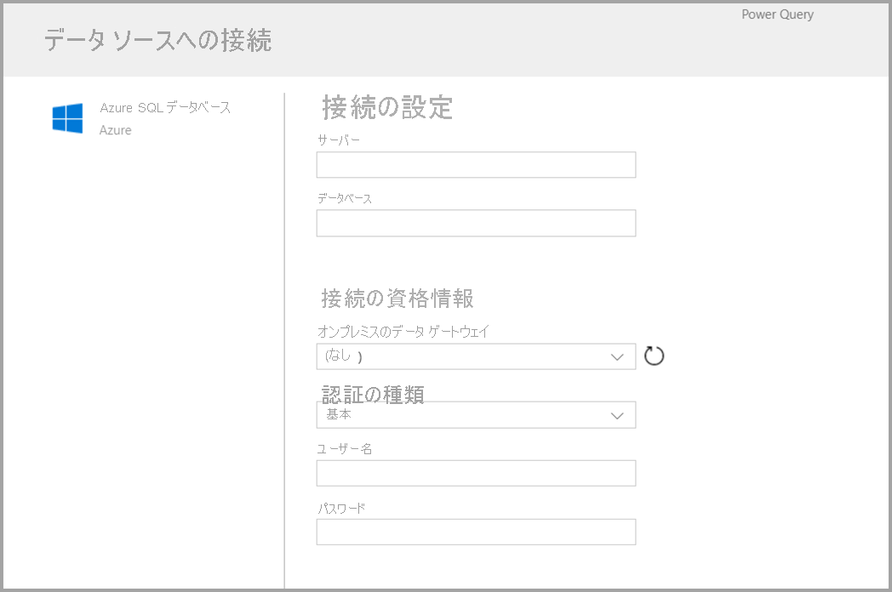
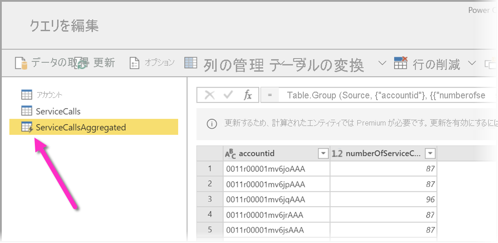
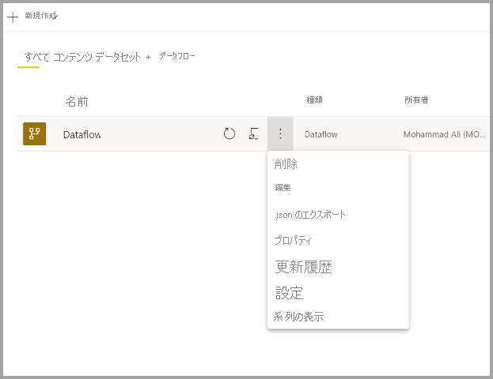

# データフローの作成
**データフロー**は、Power BI サービス内のワークスペースで作成されて管理される "エンティティ" (エンティティはテーブルに似ています) のコレクションです。 **エンティティとテーブル**は、データベース内のテーブルと同様に、データを格納するために使用される一連のフィールドです。 データフローを作成したワークスペースから直接、データフロー内のエンティティとテーブルの追加と編集や、データ更新スケジュールの管理を行うことができます。

データフローを作成するには、ブラウザーで Power BI サービスを起動し、次の画面のように、左側のナビ ペインから**ワークスペース**を選択します (データフローは、Power BI サービスの "*マイ ワークスペース*" では使用できません)。 新しいデータフローを作成するワークスペースを新しく作成することもできます。

新しいデータフローを基にして作成または構築する方法は複数あります。

* [新しいエンティティの定義を使用してデータフローを作成する](#create-a-dataflow-using-define-new-entities)
* [リンクされたエンティティを使用してデータフローを作成する](#create-a-dataflow-using-linked-entities)
* [計算対象エンティティを使用してデータフローを作成する](#create-a-dataflow-using-a-computed-entity)
* [インポート/エクスポートを使用してデータフローを作成する](#create-a-dataflow-using-importexport)

以下のセクションでは、これらのデータフロー作成の各方法について詳しく説明します。

## 新しいエンティティの定義を使用してデータフローを作成する

[新しいエンティティの定義] オプションを使用すると、新しいエンティティやテーブルを定義し、新しいデータソースに接続できます。

次の図のように、データ ソースを選択すると、データ ソースに接続するときに使用するアカウントなどの接続設定を指定するように求められます。

接続したら、エンティティに使用するデータを選択できます。 データとソースを選択すると、Power BI により、データフロー内のデータを最新に維持するため、セットアップ プロセスの後半で選択する頻度で、データ ソースへの再接続が行われます。

エンティティで使用するデータを選択した後は、データフロー エディターを使用して、データフローで使用するために必要な形式に、データを整形または変換できます。 

## リンクされたエンティティを使用してデータフローを作成する

リンクされたエンティティを使用してデータフローを作成すると、別のデータフローで定義されている既存のエンティティを読み取り専用の方法で参照できます。 以下では、この方法を選択するいくつかの理由について説明します。

* 日付エンティティや静的ルックアップ テーブルなどのエンティティを複数のデータフロー間で再利用する場合は、エンティティを一度作成してから、他のデータフロー全体で参照する必要があります。

* データ ソースに対して複数の更新を作成したくない場合は、リンクされたエンティティを使用してデータを格納し、キャッシュとして使用することをお勧めします。 このようにすると、後続のすべてのコンシューマーでそのエンティティを利用できるようになり、基になるデータ ソースへの負荷が軽くなります。

* 2 つのエンティティ間でマージを実行する必要がある場合。

> [!NOTE]
> リンクされたエンティティは、Power BI Premium でのみ使用できます。

## 計算対象エンティティを使用してデータフローを作成する

計算対象エンティティを使用してデータフローを作成すると、リンクされたエンティティを参照し、書き込み専用の方法でそのエンティティに対して操作を実行できます。 結果として新しいエンティティが作成され、データフローの一部になります。 リンクされたエンティティを計算対象エンティティに変換するには、マージ操作から新しいクエリを作成するか、エンティティを編集または変換する場合は、エンティティの参照または複製を作成します。

### 計算されたエンティティを作成する方法

エンティティの一覧でデータフローを作成した後は、それらのエンティティに対して計算を実行することができます。
Power BI サービスのデータフロー作成ツールで **[エンティティの編集]** を選択した後、計算されたエンティティの基礎として使用し、それに対して計算を実行するエンティティを右クリックします。 コンテキスト メニューで **[参照]** を選択します。
計算されたエンティティの対象になるエンティティについては、次の図のように、**[読み込みを有効にする]** をオンにする必要があります。 このコンテキスト メニューを表示するにはエンティティを右クリックします。

**[読み込みを有効にする]** をオンにすることで、そのソースが参照されたエンティティである新しいエンティティを作成します。 次の図のように、アイコンが**計算**アイコンに変化します。

この新しく作成されたエンティティで実行するすべての変換は、Power BI のデータフロー ストレージに既にあるデータに対して実行されます。 つまり、クエリはデータのインポート元である外部データ ソース (たとえば、データの取得元である SQL データベース) に対しては実行されず、データフローのストレージ内に存在するデータに対して実行されます。

**ユースケースの例** 計算対象エンティティを使用すると、どのような種類の変換を実行できるでしょうか。 Power BI または M エディターの変換ユーザー インターフェイスを使用して通常指定するすべての変換が、ストレージ内計算を実行するときにサポートされます。

次のような例を考えます。Dynamics 365 サブスクリプションのすべての顧客の生データを含む *Account* エンティティがあるものとします。 また、1 年間の日ごとにさまざまなアカウントから実行されたサポート コールのデータを含む、サービス センターからの *ServiceCalls* という生データもあります。

*Account* エンティティを *ServiceCalls* からのデータで補強するものとします。
最初に、*ServiceCalls* からのデータを集計して、過去 1 年間に各アカウントで行われたサポート コールの数を計算する必要があります。

次に、*Account* エンティティと *ServiceCallsAggregated* エンティティをマージして、補強された *Account* テーブルを計算します。

結果として、次の図のような *EnrichedAccount* が表示されます。

これで完了です。ソース データではなく、Power BI Premium サブスクリプションに存在するデータフロー内のデータに対して変換が実行されています。

> [!NOTE]
> 計算対象エンティティは Premium のみの機能です

## CDM フォルダーを使用してデータフローを作成する

CDM フォルダーからデータフローを作成すると、Common Data Model (CDM) 形式で別のアプリケーションによって書き込まれたエンティティを参照できます。 ADLS Gen 2 に格納されている CDM 形式のファイルへの完全なパスを指定するように求められます。

 

次の一覧に示すように、CDM フォルダーからデータフローを作成するための要件がいくつかあります。

* PBI でファイルにアクセスするには、ADLS Gen 2 アカウントに適切なアクセス許可が設定されている必要があります

* データフローを作成しようとしているユーザーが、ADLS Gen 2 アカウントにアクセスできる必要があります

* CDM フォルダーからのデータフローの作成は、新しいワークスペース エクスペリエンス "のみ" で使用できます。

* URL は JSON ファイルへの直接ファイル パスである必要があり、ADLS Gen 2 エンドポイントが使用される必要があります。blob.core はサポートされていません

## インポート/エクスポートを使用してデータフローを作成する

インポート/エクスポートを使用してデータフローを作成すると、ファイルからデータフローをインポートできます。 これは、データフローのコピーをオフライン環境に保存する場合や、データフローをあるワークスペースから別のものに移動する場合に便利です。 

データフローをエクスポートするには、作成したデータフローを選択し、 **[詳細]** メニュー項目 (省略記号) を選択してオプションを展開し、 **[.json のエクスポート]** を選択します。 CDM 形式で表されたデータフローのダウンロードを開始するように求められます。

データフローをインポートするには、インポート ボックスを選択して、ファイルをアップロードします。 Power BI によってデータフローが自動的に作成され、データフローをそのまま保存したり、追加の変換を実行したりできます。

## 次のステップ

データ フローを作成した後は、Power BI Desktop と Power BI サービスを使用して、Power BI データフローに取り込んだデータに基づくデータセット、レポート、ダッシュボード、アプリを作成し、それによってビジネス アクティビティについての分析情報を取得できます。 以下の記事では、データフローの一般的な使用シナリオについてさらに詳しく説明されています。

* [データフローとセルフサービスのデータ準備の概要](dataflows-introduction-self-service.md)
* [データフローの構成と使用](dataflows-configure-consume.md)
* [Azure Data Lake Gen 2 を使用するようにデータフロー ストレージを構成する](dataflows-azure-data-lake-storage-integration.md)
* [データフローの Premium 機能](dataflows-premium-features.md)
* [データフローを使用した AI](dataflows-machine-learning-integration.md)
* [データフローの制限事項と考慮事項](dataflows-features-limitations.md)