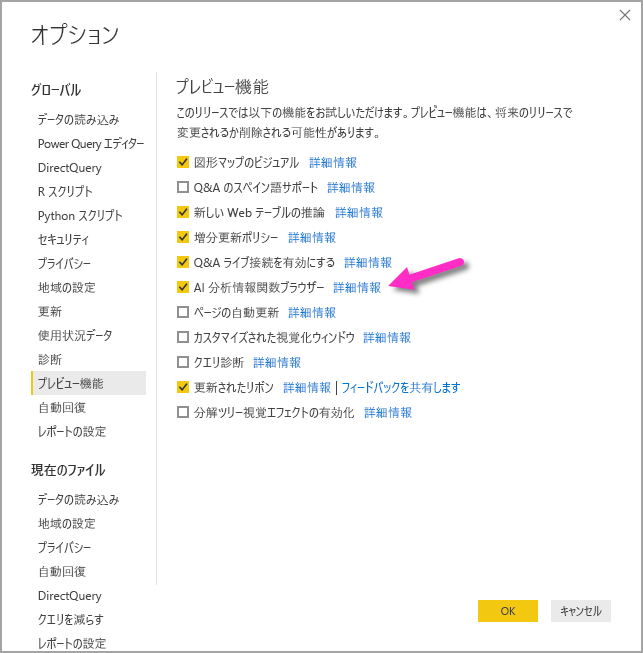
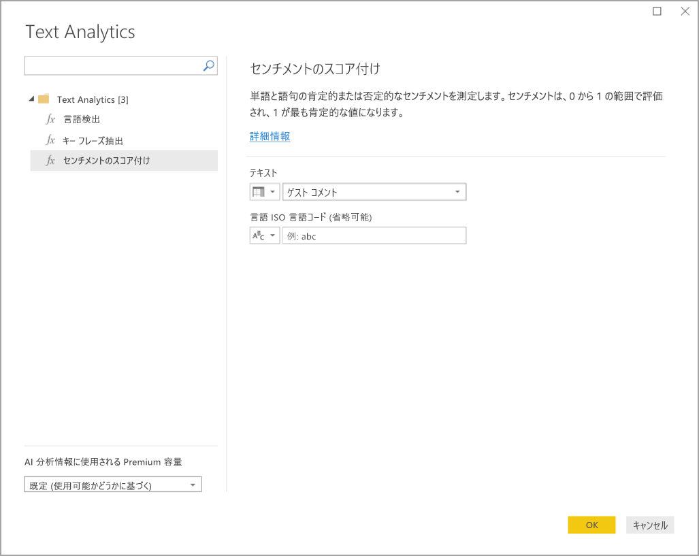
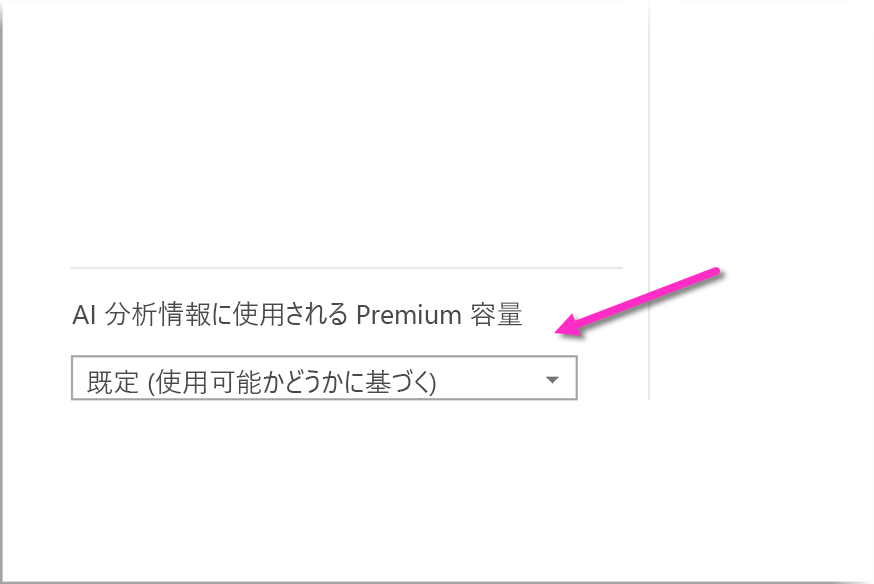
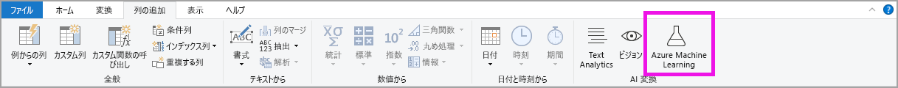

# Power BI Desktop で AI 分析情報を使用する

Power BI では、AI 分析情報を使用して、データ準備作業を強化するトレーニング済みの機械学習モデルのコレクションにアクセスできます。 AI 分析情報には **Power Query エディター**でアクセスし、関連する機能や関数には **Power Query エディター** の **[ホーム]** タブと **[列の追加]** タブからアクセスします。 

この記事では、どちらも Azure Cognitive Services のものである Text Analytics 関数と Vision 関数について説明します。 さらに、この記事には、Power BI で使用できる Azure Machine Learning のカスタム関数について説明するセクションがあります。

## AI 分析情報を有効にする方法

AI 分析情報は、Power BI Desktop の 2020 年 6 月のリリースで一般提供されました。 以前のバージョンの Power BI Desktop では、Power BI で AI 分析情報を有効にするには、 **[ファイル] > [オプションと設定] > [オプション]** を選択し、左側の列から **[プレビュー機能]** を選択する必要がありました。 右側のウィンドウに、 **[AI 分析情報関数ブラウザー]** 選択項目が表示されます。 **[AI 分析情報関数ブラウザー]** の横にあるチェックボックスをオンにして、プレビュー機能を有効にします。 プレビュー機能の変更を有効にするには、Power BI Desktop を再起動する必要があります。

> [!NOTE]
> AI 分析情報は、2020 年 6 月リリース以降のすべてのバージョンの Power BI Desktop で一般提供されており、これらのバージョンでは、プレビュー機能として有効にする必要はありません。

## Text Analytics と Vision の使用

Power BI で Text Analytics と Vision を使用すると、[Azure Cognitive Services](https://azure.microsoft.com/services/cognitive-services/) とは異なるアルゴリズムを適用することで、Power Query のデータを強化できます。

現在サポートされているサービスを次に示します。

* [感情分析](/azure/cognitive-services/text-analytics/how-tos/text-analytics-how-to-sentiment-analysis)
* [キー フレーズ抽出](/azure/cognitive-services/text-analytics/how-tos/text-analytics-how-to-keyword-extraction)
* [言語検出](/azure/cognitive-services/text-analytics/how-tos/text-analytics-how-to-language-detection)
* [画像のタグ付け](/azure/cognitive-services/computer-vision/concept-tagging-images) 

変換は Power BI サービス上で実行されます。Azure Cognitive Services サブスクリプションは不要です。 

> [!IMPORTANT]
> 
> Text Analytics または Vision の機能を使用するには、Power BI Premium が必要です。

### Premium 容量で Text Analytics と Vision を有効にする

Cognitive Services は、Premium 容量ノード EM2、A2、または P1 以降でサポートされます。 Cognitive Services を実行する際は、容量上の別個の AI ワークロードが使用されます。 これらの機能のパブリック プレビュー期間中 (2019 年 6 月より前) は、このワークロードは既定で無効になっていました。 Power BI で Cognitive Services を使用する前に、管理ポータルの **[容量の設定]** で AI ワークロードを有効にする必要があります。 **[ワークロード]** セクションで **[AI ワークロード]** を有効にし、このワークロードで消費する最大メモリ量を定義します。 推奨されるメモリ制限は、20% です。 この制限を超えると、クエリ速度が低下します。

### 使用できる関数

このセクションでは、Power BI 内の Cognitive Services で使用可能な関数について説明します。

#### 言語検出

言語検出関数では、テキスト入力が評価され、フィールドごとに言語名と ISO 識別子が返されます。 この関数は、データ列で任意のテキストが収集され、言語が不明な場合に役立ちます。 この関数では、入力データがテキスト形式であることが前提となっています。

Text Analytics では、最大 120 の言語が認識されます。 詳細については、[サポートされる言語](/azure/cognitive-services/text-analytics/text-analytics-supported-languages)に関する記事を参照してください。

#### キー フレーズ抽出

**キー フレーズ抽出**関数では、非構造化テキストが評価され、テキスト フィールドごとにキー フレーズの一覧が返されます。 この関数では、入力としてテキスト フィールドが必要です。**カルチャ情報**も入力できます (省略可能)。

キー フレーズ抽出は、指定したテキストのチャンクが大きいほど、効果的に機能します。 これは、テキストのブロックが小さいほどパフォーマンスが向上する感情分析とは反対です。 両方の操作から最良の結果を得るには、入力を適宜再構築することを検討してください。

#### センチメントのスコア付け

**センチメントのスコア付け**関数では、テキスト入力が評価され、0 (否定的) から 1 (肯定的) までのセンチメント スコアがドキュメントごとに返されます。 この関数は、ソーシャル メディア、顧客のレビュー、およびディスカッション フォーラムで肯定的および否定的なセンチメントを検出するのに役立ちます。

Text Analytics では、機械学習分類アルゴリズムを使用して、0 ～ 1 のセンチメント スコアが生成されます。 センチメントは、スコアが 1 に近いほど肯定的、0 に近いほど否定的となります。 モデルは、センチメントが関連付けられている幅広いテキスト本文を使用して、事前にトレーニングされています。 現時点では、独自のトレーニング データを指定することはできません。 テキストの分析時、モデルでは、テキスト処理、品詞分析、語の配置、語の関連付けなど、さまざまな手法が組み合わされて使用されます。 アルゴリズムの詳細については、「[Introducing Text Analytics (テキスト分析の概要)](/archive/blogs/machinelearning/machine-learning-and-text-analytics)」を参照してください。

センチメント分析は、テキスト内の特定のエンティティのセンチメントを抽出するのではなく、入力フィールド全体に対して実行されます。 実際には、ドキュメントに大きなテキストのブロックではなく、1 つか 2 つの文が含まれているときにスコリング精度が向上する傾向があります。 客観性評価フェーズでは、入力フィールドが全体として客観的であるのか、それとも入力フィールドにセンチメントが含まれているのかがモデルによって判断されます。 入力フィールドが概ね客観的な場合は、センチメント検出フェーズに進まず、スコアが .50 となり、処理が終了します。 入力フィールドがパイプライン内を進行した場合は、入力フィールドで検出されたセンチメントの程度に応じて、.50 より上または下のスコアが次のフェーズで生成されます。

現時点では、感情分析では、英語、ドイツ語、スペイン語、およびフランス語がサポートされています。 他の言語はプレビュー段階です。 詳細については、[サポートされる言語](/azure/cognitive-services/text-analytics/text-analytics-supported-languages)に関する記事を参照してください。

#### 画像のタグ付け

**画像のタグ付け**関数では、生き物、風景、アクションなどの 2,000 を超える認識可能なオブジェクトに基づいてタグが返されます。 タグがあいまいだったり、常識的なものでなかったりする場合は、既知の状況のコンテキストでタグの意味を明確にするための "*ヒント*" が表示されます。 タグは分類として編成されず、継承の階層は存在しません。 コンテンツのタグのコレクションは、完全な文の形式に整えられた、人が読解可能な言語として表示される画像の "*説明*" の基盤となります。

イメージをアップロードするか、またはイメージの URL を指定すると、Computer Vision のアルゴリズムにより、そのイメージ内で識別されたオブジェクト、生物、およびアクションに基づいてタグが出力されます。 タグ付けの対象は、前景の人間などの主題だけではありません。セット (室内またはアウトドア)、家具、道具、植物、動物、アクセサリ、小物なども対象となります。

この関数では、入力として画像の URL または base-64 のフィールドが必要です。 現時点でイメージのタグ付けでサポートされるのは、英語、スペイン語、日本語、ポルトガル語、および簡体中国語です。 詳細については、[サポートされる言語](/rest/api/cognitiveservices/computervision/tagimage/tagimage#uri-parameters)に関する記事を参照してください。

### Power Query で Text Analytics 関数または Vision 関数を呼び出す

Text Analytics 関数または Vision 関数を使用してデータを強化するには、**Power Query エディター**を開きます。 この例では、テキストのセンチメントのスコア付けの手順を示します。 同じ手順を使用して、キーフレーズ抽出、言語検出、および画像のタグ付けを実行できます。

**[ホーム]** または **[列の追加]** リボンで **[Text analytics]** ボタンを選択します。 サインインするように求められます。

サインインしたら、ポップアップ ウィンドウで、使用する関数と、変換するデータ列を選択します。

Power BI によって、関数を実行して結果を Power BI Desktop に戻すための Premium 容量が選択されます。 選択された容量は、アプリケーション中のText Analytics 関数と Vision 関数でのみ使用され、Power BI Desktop で更新されます。 レポートが発行されると、レポートの発行先であるワークスペースの Premium 容量に対して更新が実行されます。 ポップアップ ウィンドウの左下隅にあるドロップダウンで、すべての Cognitive Services で使用される容量を変更できます。

**Cultureinfo** は、テキストの言語を指定する省略可能な入力です。 このフィールドは ISO コードです。 Cultureinfo の入力としては、列、または静的フィールドを使用します。 この例では、列全体で言語が英語 (en) として指定されています。 このフィールドを空白のままにすると、Power BI は、言語を自動的に検出してから、関数を適用します。 次に、 **[適用]** を選択します。

AI 分析情報を新しいデータ ソースで初めて使用するときは、データのプライバシー レベルを設定するように求められます。

> [!NOTE]
> Power BI でのデータセットの更新は、[プライバシー レベル] が [パブリック] または [組織] に設定されているデータ ソースに対してのみ機能します。

関数を呼び出すと、結果が新しい列としてテーブルに追加されます。 変換もクエリ内の適用された手順として追加されます。

画像のタグ付けとキーフレーズ抽出の場合、結果として複数の値が返されることがあります。 個々の結果は、元の行の複製に対して返されます。

### Text Analytics 関数または Vision 関数を使用したレポートの発行

Power Query での編集と Power BI Desktop での更新の実行中は、Power Query エディターで選択された Premium 容量が Text Analytics と Vision によって使用されます。 Power BI へのレポートの発行後は、レポートの発行先のワークスペースの Premium 容量が使用されます。

Text Analytics 関数と Vision 関数が適用されているレポートは、Premium 容量以外のワークスペースに発行する必要があります。そうしないと、データセットの更新が失敗します。

### Premium 容量への影響の管理

以下のセクションでは、容量に対する Text Analytics と Vision の影響を管理する方法について説明します。

#### 容量の選択

レポート作成者は、AI 分析情報を実行する Premium 容量を選択できます。 既定では、最初に作成された容量で、ユーザーがアクセスしているものが Power BI によって選択します。

#### Capacity Metrics アプリを使用した監視

Premium 容量の所有者は、[Power BI Premium Capacity Metrics アプリ](../admin/service-admin-premium-monitor-capacity.md)を使用して、容量に対する Text Analytics 関数と Vision 関数の影響を監視できます。 アプリによって、容量内の AI ワークロードの正常性に関する詳細なメトリックが提供されます。 上部のグラフに、AI ワークロードによるメモリ使用量が示されます。 Premium 容量の管理者は、容量ごとに AI ワークロードのメモリ制限を設定できます。 メモリ使用量がメモリの上限に達したら、メモリの制限を大きくするか、一部のワークスペースを別の容量に移動することを検討できます。

### Power Query と Power Query Online の比較

Power Query と Power Query Online で使用される Text Analytics 関数と Vision 関数は同じものです。 エクスペリエンスのみが次のように異なっています。

* Power Query には、Text Analytics、Vision、Azure Machine Learning 用の別個のボタンがあります。 Power Query Online では、これらは 1 つのメニューにまとめられています。
* Power Query では、レポート作成者は、関数の実行に使用する Premium 容量を選択できます。 データフローは既に特定の容量上にあるため、Power Query Online ではこれは必要ありません。

### Text Analytics の考慮事項と制限事項

Text Analytics を使用するときに留意が必要な注意事項と制限事項をいくつか示します。

* 増分更新はサポートされていますが、AI 分析情報を含むクエリで使用すると、パフォーマンスの問題が発生する可能性があります。
* 直接クエリはサポートされていません。

## Azure ML の使用

多くの組織が **Machine Learning** モデルを使用して、ビジネスに関する分析情報の質や予測を向上させています。 これらのモデルからの分析情報は、レポートやダッシュボードなどの分析で視覚化したり、呼び出したりできるので、その情報を最も必要としているビジネス ユーザーに提供することが可能です。 Power BI では、ポイントアンドクリック ジェスチャを使用するだけで、Azure Machine Learning 上でホストされているモデルから、簡単に分析情報を取り込めます。

この機能を使用するには、最初にデータ サイエンティストが Azure portal を使用して、Azure ML モデルへのアクセス権を BI アナリストに付与します。 次に、Power Query が、セッションが開始されるたびに、ユーザーがアクセス可能なすべての Azure ML モデルを検出して、動的な Power Query 関数として公開します。 ユーザーがこれらの関数を呼び出すには、Power Query エディター内のリボンからこれらの関数にアクセスするか、M 関数を直接呼び出します。 また、一連の行のパフォーマンスを向上させるため、Power BI は、Azure ML モデルを呼び出すときに、アクセス要求を自動的にバッチ処理します。

この機能は、Power BI Desktop、Power BI データフロー、Power BI サービスの Power Query Online でサポートされています。

データフローの詳細については、「[Self-service data prep in Power BI (Power BI でのセルフサービス データの準備)](service-dataflows-overview.md)」を参照してください。

Azure Machine Learning の詳細については、以下の記事を参照してください。

- 概要:[Azure Machine Learning とは](/azure/machine-learning/service/overview-what-is-azure-ml)
- Azure Machine Learning のクイック スタートおよびチュートリアル:「[Azure Machine Learning のドキュメント](/azure/machine-learning/)」

### Azure ML モデルへのアクセス権の付与

Power BI から Azure ML モデルにアクセスするには、Azure サブスクリプションへの**読み取り**アクセス権が必要です。 さらに、以下を所有している必要があります。

- Machine Learning Studio (クラシック) モデルの場合は、Machine Learning Studio (クラシック) Web サービスへの**読み取り**アクセス権
- Machine Learning モデルの場合は、Machine Learning ワークスペースへの**読み取り**アクセス権

このセクションでは、Azure ML service でホストされているモデルへのアクセス権を Power BI ユーザーに付与して、このモデルに Power Query 関数としてアクセスできるようにする手順を説明します。 詳細については、[RBAC および Azure portal を使用したアクセスの管理](/azure/role-based-access-control/role-assignments-portal)に関する記事を参照してください。

1. [Azure portal](https://portal.azure.com/) にサインインします。
2. **[Subscriptions]\(サブスクリプション\)** ページに移動します。 Azure portal の左側のナビゲーション メニューにある **[すべてのサービス]** リストに **[サブスクリプション]** ページがあります。
3. サブスクリプションを選択する
4. **[アクセス制御 (IAM)]** を選択し、 **[追加]** ボタンを選択します。
5. ロールとして **[閲覧者]** を選択します。 Azure ML モデルへのアクセス権を付与する Power BI ユーザーを選択します。
6. **[保存]** を選択する
7. 上記の 3 から 6 の手順を繰り返し、特定の Machine Learning Studio (クラシック) Web サービスのユーザー、"*または*" モデルをホストしている Machine Learning ワークスペースのユーザーに **[閲覧者]** アクセス権を付与します。

### Machine Learning モデルのスキーマの検出

データ サイエンティストは、Machine Learning の機械学習モデルを開発する際、さらにはデプロイする際にも、主に Python を使用しています。 モデルのスキーマ ファイルの作成タスクを自動化する Machine Learning Studio (クラシック) とは異なり、Machine Learning の場合、データ サイエンティストは、Python を使用して、スキーマ ファイルを明示的に生成する必要があります。

Machine Learning モデルでは、デプロイされた Web サービスにこのスキーマ ファイルを含める必要があります。 Web サービスのスキーマを自動的に生成するには、デプロイされたモデルのエントリ スクリプトで入力/出力のサンプルを指定する必要があります。 記事「[Azure Machine Learning を使用してモデルをデプロイする」のサブセクション「(省略可能) Swagger スキーマの自動生成」](/azure/machine-learning/how-to-deploy-and-where#optional-define-model-web-service-schema)を参照してください。 このリンクには、スキーマ生成のステートメントを含む、エントリ スクリプトの例が含まれます。

具体的には、エントリ スクリプト内の _@input\_schema_ 関数と _@output\_schema_ 関数によって、 _input\_sample_変数と _output\_sample_ 変数の入出力のサンプル形式が参照され、デプロイ時にこれらのサンプルを使用して Web サービス用の OpenAPI (Swagger) 仕様が生成されます。

エントリ スクリプトの更新によるこれらのスキーマ生成は、Azure Machine Learning SDK を使用して自動機械学習エクスペリエンスにより作成されたモデルにも適用する必要があります。

> [!NOTE]
> Azure Machine Learning ビジュアル インターフェイスを使用して作成されたモデルでは、現在のところスキーマ生成はサポートされていませんが、今後のリリースではサポートされる予定です。
> 
### Power BI での Azure ML モデルの呼び出し

アクセス権があれば、どの Azure ML モデルでも、Power Query エディターから直接呼び出すことができます。 Azure ML モデルにアクセスするには、Power Query エディターで、 **[ホーム]** または **[列の追加]** リボンの **[Azure Machine Learning]** ボタンをクリックします。

アクセス権があるすべての Azure ML モデルが Power Query 関数としてここに一覧表示されます。 また、Azure ML モデルの入力パラメーターは、対応する Power Query 関数のパラメーターとして自動的にマップされます。

Azure ML モデルを呼び出すには、選択したエンティティのいずれかの列を、ドロップダウン リストからの入力として指定します。 入力ダイアログの左側にある列アイコンを切り替えることにより、入力として使用する定数値を指定することもできます。

**[OK]** を選択すると、Azure ML モデルの出力のプレビューが、エンティティ テーブルの新しい列として表示されます。 また、モデル呼び出しが、クエリに適用された手順として表示されます。

モデルから複数の出力パラメーターが返された場合、それらのパラメーターは、出力列内で 1 つのレコードとしてグループ化されます。 列を展開すると、個々の出力パラメーターを別々の列内に生成できます。

### Azure ML の考慮事項と制限事項

Power BI Desktop の Azure ML には、次の考慮事項と制限事項が適用されます。

* Azure Machine Learning ビジュアル インターフェイスを使用して作成されたモデルでは、現在のところスキーマ生成はサポートされていません。 今後のリリースでサポートされる予定です。
* 増分更新はサポートされていますが、AI 分析情報を含むクエリで使用すると、パフォーマンスの問題が発生する可能性があります。
* 直接クエリはサポートされていません。

## 次の手順

この記事では、Machine Learning を Power BI Desktop. に統合する手順を概説しました。 以下の記事も興味深い内容で、役立つかもしれません。

- [チュートリアル: Power BI での Machine Learning Studio (クラシック) モデルの呼び出し](../connect-data/service-tutorial-invoke-machine-learning-model.md)
- [チュートリアル: Power BI での Cognitive Services の使用](../connect-data/service-tutorial-use-cognitive-services.md)
- [Power BI の Cognitive Services](service-cognitive-services.md)
- [Azure Machine Learning の Power BI への統合](service-machine-learning-integration.md)
- [アプリで Premium 容量を監視する](../admin/service-admin-premium-monitor-capacity.md)
- [AI metrics in the Premium Capacity Metrics アプリの AI メトリック](https://powerbi.microsoft.com/blog/ai-metrics-now-available-in-power-bi-premium-capacity-metrics-app/)