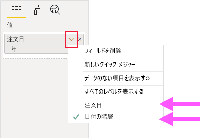

# <a name="apply-auto-datetime-in-power-bi-desktop"></a>Power BI Desktop で自動の日付/時刻を適用する

この記事では、Power BI Desktop でインポート モデルまたは複合モデルを開発しているデータ モデラーを対象としています。 _[自動の日付/時刻]_ オプションについて紹介し、説明します。

[自動の日付/時刻] は、Power BI Desktop のデータ読み込みオプションです。 このオプションの目的は、モデルに読み込まれた日付列に基づく便利なタイム インテリジェンス レポートをサポートすることです。 具体的には、レポート作成者は、データ モデルを使用して、カレンダーの期間 (年、四半期、月、日) を使用して、フィルター、グループ化、およびドリルダウンを行うことができます。 重要な点は、これらのタイム インテリジェンス機能を明示的に開発する必要がないことです。

このオプションを有効にすると、次の条件がすべて満たされていれば、Power BI Desktop によって各日付列に対して非表示の自動の日付/時刻テーブルが作成されます。

- テーブル ストレージ モードがインポートである
- 列が計算列ではない
- 列のデータ型が日付または日付/時刻である
- 列がモデル リレーションシップの "多" の側ではない

## <a name="how-it-works"></a>使い方

各自動の日付/時刻テーブルは、実際には、DAX の [CALENDAR](/dax/calendar-function-dax) 関数を使用してデータ行が生成される[計算テーブル](desktop-calculated-tables.md)です。 各テーブルには、次の 6 つの計算列も含まれます: **Day**、**MonthNo**、**Month**、**QuarterNo**、**Quarter**、**Year**。

> [!NOTE]
> Power BI では、[モデルの言語](../fundamentals/supported-languages-countries-regions.md#choose-the-language-for-the-model-in-power-bi-desktop)に従って、列名と値が変換および書式設定されます。 たとえば、モデルが英語で作成された場合、韓国語のクライアントで表示される場合でも、月名などは英語で表示されます。

また、Power BI Desktop を使うと、自動の日付/時刻テーブルの **[日付]** 列とモデルのデータ列の間にリレーションシップも作成されます。

自動の日付/時刻テーブルには、モデルの日付列に格納されているすべての日付値を含む完全なカレンダー年が含まれています。 たとえば、日付列の最初の値が 2016 年 3 月 20 日で、最新の値が 2019 年 10 月 23 日である場合、テーブルには 1,461 行が格納されます。 2016 年から 2019 年までの 4 カレンダー年の各日付が 1 行で表わされています。 Power BI によってモデルが更新されると、自動の日付/時刻テーブルもそれぞれ更新されます。 これにより、モデルには、常に日付列の値を使用する日付が含まれます。

自動の日付/時刻テーブルの行を表示できる場合は、次のようになります。


> [!NOTE]
> 自動の日付/時刻テーブルは、モデラーからも完全に非表示になります。 **[フィールド]** ペインまたはモデル ビュー ダイアグラムで表示することはできず、その行は [データ] ビューに表示できません。 また、テーブルとその列を、DAX 式で直接参照することはできません。
>
> さらに、[[Excel で分析]](../collaborate-share/service-analyze-in-excel.md) を使用する場合、または Power BI 以外のレポート デザイナーを使用してモデルに接続する場合は、これらを使用することはできません。

また、テーブルでは階層も定義されており、年、四半期、月、日の各レベルを経るドリルダウン パスがビジュアルに提供されます。

モデル ビュー ダイアグラムで自動の日付/時刻テーブルを表示できるとしたら、次のようになります (関連する列が強調して示されています)。


## <a name="work-with-auto-datetime"></a>自動の日付/時刻を使用する

日付列に対して自動の日付/時刻テーブルが存在する場合 (そして、その列が表示されている場合)、レポート作成者に対してその列は **[フィールド]** ペインのフィールドとしては表示されません。 代わりに、日付列の名前を持つ展開可能なオブジェクトとして表示されます。 カレンダー アイコンが前に付いているので、簡単に識別できます。 レポート作成者がカレンダー オブジェクトを展開すると、 **[日付の階層]** という名前の階層が表示されます。 階層を展開すると、次の 4 つのレベルが表示されます。**Year**、**Quarter**、**Month**、**Day**。

![Sales テーブルが展開されている [フィールド] ペインの例。 前にカレンダー アイコンの付いた OrderDate フィールドが含まれます。 展開して開かれており、Date Hierarchy という名前の階層が含まれています。 それも展開されており、4 つのレベルが含まれます: Year、Quarter、Month、Day。](media/desktop-auto-date-time/auto-date-time-fields-pane-example.png)

自動の日付/時刻で生成される階層を使用すると、通常の階層とまったく同じ方法でビジュアルを構成できます。 **Date Hierarchy** 階層全体を使用して、または階層の特定のレベルを使用して、ビジュアルを構成できます。

ただし、通常の階層ではサポートされていない機能が 1 つ追加されています。 自動の日付/時刻の階層または階層のレベルがビジュアル ウェルに追加されていると、レポート作成者は、階層の使用と日付列の使用を切り替えることができます。 この方法は、階層とそのレベルではなく日付列のみが必要なビジュアルの場合に役に立ちます。 最初にビジュアルのフィールドを構成し (ビジュアルのフィールドを右クリックするか、下向き矢印をクリック)、次にコンテキスト メニューを使用して、日付列または日付階層に切り替えます。



最後に、DAX で記述されたモデルの計算では、日付列を "_直接_" 参照することも、非表示の自動の日付/時刻テーブルの列を "_間接的に_" 参照することもできます。

Power BI Desktop で記述された数式では、通常の方法で日付列を参照できます。 一方、自動の日付/時刻テーブルの列は、特殊な拡張構文を使用して参照する必要があります。 最初に日付列を参照し、その後にピリオド (.) を入力します。 数式バーのオート コンプリートによって、自動の日付/時刻テーブルの列を選択できます。

![数式バーに DAX メジャー式を入力する例。 式は、"Date Count = COUNT(Sales[OrderDate]." まで入力されており、 オート コンプリートの一覧に非表示の自動の日付/時刻テーブルの 7 つの列がすべて表示されています。 それらは次の列です: Date、Day、Month、MonthNo、Quarter、QuarterNo、Year。](media/desktop-auto-date-time/auto-date-time-dax-auto-complete.png)

Power BI Desktop で、有効なメジャー式は次のようになります。

```dax
Date Count = COUNT(Sales[OrderDate].[Date])
```

> [!NOTE]
> このメジャー式は Power BI Desktop では有効ですが、正しい DAX 構文ではありません。 内部的には、Power BI Desktop によって、実際の (非表示の) 自動の日付/時刻テーブルの列が参照されるように、式が入れ替えられます。

## <a name="configure-auto-datetime-option"></a>自動の日付/時刻オプションを構成する

自動の日付/時刻は、"_グローバル_" に、または "_現在のファイル_" 向けに、構成できます。 グローバル オプションは新しい Power BI Desktop ファイルに適用され、いつでも有効または無効にすることができます。 Power BI Desktop の新規インストールでは、両方のオプションが既定でオンに設定されます。

現在のファイルのオプションも、いつでも有効または無効にすることができます。 有効にすると、自動の日付/時刻テーブルが作成されます。 オフにすると、自動の日付/時刻テーブルはモデルからすべて削除されます。

> [!CAUTION]
> 現在のファイル オプションをオフにすると、自動の日付/時刻テーブルが削除されるため、注意が必要です。 それらを使用するように構成されていて破損したレポート フィルターやビジュアルを必ず修正してください。

Power BI Desktop で、 _[ファイル] > [オプションと設定] > [オプション]_ の順に選択し、 **[グローバル]** ページまたは **[現在のファイル]** ページを選択します。 どちらのページでも、オプションは **[タイム インテリジェンス]** セクションにあります。

![Power BI Desktop のオプションの構成。 [グローバル] グループの [データの読み込み] ページが選択されています。 [タイム インテリジェンス] セクションで、[新しいファイルの自動の日付/時刻] オプションがオンになっています。](media/desktop-auto-date-time/auto-date-time-configure-global-options.png)

## <a name="next-steps"></a>次の手順

この記事に関する詳細については、次のリソースを参照してください。

- [Power BI Desktop での自動の日付/時刻のガイダンス](../guidance/auto-date-time.md)
- [Power BI Desktop で日付テーブルを設定し、使用する](desktop-date-tables.md)
- わからないことがある場合は、 [Power BI コミュニティで質問してみてください](https://community.powerbi.com/)。
- Power BI チームへのご提案は、 [Power BI を改善するためのアイデアをお寄せください](https://ideas.powerbi.com/)
