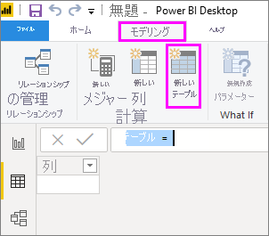

# <a name="create-calculated-tables-in-power-bi-desktop"></a>Power BI Desktop で計算テーブルを作成する
ほとんどの場合、外部データ ソースからモデルにデータをインポートしてテーブルを作成します。 しかし、*計算テーブル*を使用すると、モデルに既に読み込まれているデータに基づいて新しいテーブルを追加できます。 値のクエリを実行してデータ ソースから新しいテーブルの列に値を読み込む代わりに、[Data Analysis Expressions (DAX)](/dax/index) 数式を作成してテーブルの値を定義します。

DAX は、Power BI Desktop などのリレーショナル データを扱うための数式言語です。 DAX は 200 以上の関数、演算子、およびコンストラクトを含むライブラリを提供しているため、数式を作成する際の柔軟性が非常に高く、データ分析に必要なほとんどすべての計算結果を得ることができます。 計算テーブルは、計算の途中経過に最適です。必要なデータは、その場で計算されたりクエリの一部として計算されたりするのではなく、モデルの一部として格納されます。 たとえば、2 つの既存のテーブルの "*和集合*" または "*クロス結合*" を選択できます。

他の Power BI Desktop テーブルと同じように、計算テーブルには他のテーブルとのリレーションシップを設定できます。 計算テーブル列にはデータ型や書式設定があり、データ カテゴリに所属させることもできます。 列に好きな名前を付けたり、列を他のフィールドと同じようにレポートのビジュアルに追加したりできます。 計算テーブルは、テーブルで DirectQuery を使用するテーブルのデータを使用しない限り、データの取り込み元のテーブルが更新されると再計算されます。DirectQuery を使用するテーブルのデータを使用している場合、テーブルには、データセットが更新されたときのみ変更が反映されます。 テーブルで DirectQuery を使用する必要がある場合は、計算テーブルも DirectQuery に含めることをお勧めします。

## <a name="create-a-calculated-table"></a>計算テーブルを作成する

Power BI Desktop のレポート ビューまたはデータ ビューの **[新しいテーブル]** 機能を使用して計算テーブルを作成します。

たとえば、あなたは人事担当マネージャーで、**北西部の従業員**のテーブルと、**南西部の従業員**という別のテーブルを持っているとします。 あたなは、2 つのテーブルを結合して、**西部地域の従業員**という 1 つのテーブルにしたいと考えています。

**北西部の従業員**

 

**南西部の従業員**

 

Power BI Desktop のレポート ビューまたはデータ ビューで、 **[モデリング]** タブの **[計算]** グループで、 **[新しいテーブル]** を選択します。 データ ビューの方が、新しい計算テーブルがすぐに表示されるので、もう少し簡単に行えます。

 

数式バーに次の式を入力します。

```dax
Western Region Employees = UNION('Northwest Employees', 'Southwest Employees')
```

**西部地域の従業員**という名前の新しいテーブルが作成され、 **[フィールド]** ペイン内の他のテーブルと同様に表示されます。 他のテーブルと同様に、他のテーブルとのリレーションシップを作成したり、メジャーや計算列を追加したり、フィールドをレポートに追加したりすることができます。

 

 ![[フィールド] ペインの新しいテーブル](media/desktop-calculated-tables/calctables_fieldlist.png)

## <a name="functions-for-calculated-tables"></a>計算テーブル用の関数

計算テーブルは、テーブルを返す任意の DAX 式を使って定義できます。別のテーブルを単に参照するだけでも構いません。 例:

```dax
New Western Region Employees = 'Western Region Employees'
```

この記事では、計算テーブルについて簡単に紹介するだけにします。 DAX による計算テーブルを使うと、分析上の多くの課題を解決できます。 使用する可能性のある一般的な DAX テーブル関数をいくつか次に示します。

* DISTINCT
* VALUES
* CROSSJOIN
* UNION
* NATURALINNERJOIN
* NATURALLEFTOUTERJOIN
* INTERSECT
* CALENDAR
* CALENDARAUTO

これらの関数と、テーブルを返す他の DAX 関数については、「[DAX 関数リファレンス](/dax/dax-function-reference)」をご覧ください。

