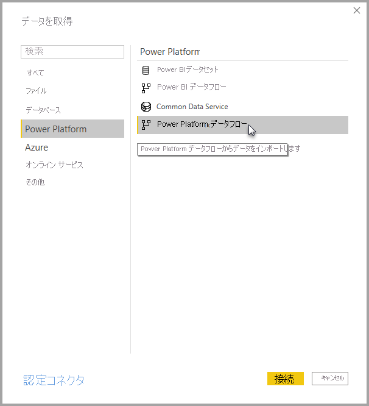

# Power BI Desktop で Power Platform データフローによって作成されたデータに接続する
**Power BI Desktop** では、Power BI Desktop の他のデータ ソースと同様に、**Power Platform データフロー**によって作成されたデータに接続できます。

**Power Platform データフロー** コネクタを使用すると、Power BI サービスでデータフローによって作成されたエンティティに接続できます。 

## 考慮事項と制限事項

**Power Platform データフロー コネクタ**を使用するには、最新バージョンの **Power BI Desktop** を実行している必要があります。 最新バージョンを確保するために、いつでも [Power BI Desktop をダウンロード](../fundamentals/desktop-get-the-desktop.md)し、コンピューターにインストールできます。  

> [!NOTE]
> 以前のバージョンの Power Platform データフロー コネクタでは、.MEZ ファイルをダウンロードしてフォルダーに配置する必要がありました。 最新バージョンの **Power BI Desktop** には Power Platform データフロー コネクタが含まれているため、このファイルは不要であり、付属のバージョンのコネクタとの競合の原因になる可能性があります。 この .MEZ ファイルをフォルダーに手動で配置した場合は、ダウンロードした .MEZ ファイルを **Documents > Power BI Desktop > カスタム コネクタ** フォルダーから削除して、競合を回避する "*必要があります*"。 

## デスクトップのパフォーマンス
**Power BI Desktop** は、インストールされているコンピューター上でローカルに実行します。 データフローのインジェストのパフォーマンスは、さまざまな要因によって決まります。 これらの要因には、データのサイズ、コンピューターの CPU と RAM、ネットワーク帯域幅、データ センターからの距離などが含まれます。

データフローのデータ インジェストのパフォーマンスを向上することができます。 たとえば、取り込むデータのサイズが大きすぎて **Power BI Desktop** によってコンピューター上で管理できない場合は、データフロー内のリンクおよび計算されたエンティティを使用して (データフロー内の) データを集約し、あらかじめ準備された集約データだけを取り込むことができます。 

この方法では、大規模なデータの処理が **Power BI Desktop** の実行中のインスタンス内でローカルに実行されるのではなく、データフロー内でオンライン実行されます。 このアプローチにより、Power BI Desktop では少量のデータを取り込んで、データフローの応答性と迅速性を確保することができます。

## その他の注意点

ほとんどのデータフローは、Power BI サービスのテナント内にあります。 ただし、**Power BI Desktop** の顧客は、データフローの所有者である場合か、データフローの CDM フォルダーに対して明示的に承認済みになっている場合を除いて、Azure Data Lake Storage Gen2 アカウント内に保管されているデータフローにはアクセスできません。 次の状況を検討します。

1.  Anna は新しいワークスペースを作成して、組織内の Data Lake にデータフローを格納するように構成しました。
2.  ベンは、アンナが作成したワークスペースのメンバーでもあり、Power BI Desktop とデータフロー コネクターを使用して、アンナが作成したデータフローからデータを取得することを考えています。
3.  Ben は Data Lake 内のデータフローの CDM フォルダーに対して承認されたユーザーとして追加されていないため、エラーを受け取ります。

この問題を解決するには、ベンに CDM フォルダーとその中のファイルに対する閲覧者のアクセス許可を付与する必要があります。 CDM フォルダーに対するアクセスを付与する方法の詳細については、「[データフローの構成と使用](dataflows/dataflows-configure-consume.md)」を参照してください。

## 次のステップ
データフローを使用し、さまざまな目的の処理を実行できます。 詳細については、次のリソースをご覧ください。

* [データフローとセルフサービスのデータ準備の概要](dataflows/dataflows-introduction-self-service.md)
* [データフローの作成](dataflows/dataflows-create.md)
* [データフローの構成と使用](dataflows/dataflows-configure-consume.md)
* [Azure Data Lake Gen 2 を使用するようにデータフロー ストレージを構成する](dataflows/dataflows-azure-data-lake-storage-integration.md)
* [データフローの Premium 機能](dataflows/dataflows-premium-features.md)
* [データフローを使用した AI](dataflows/dataflows-machine-learning-integration.md)

**Power BI Desktop** に関する以下の記事が役立つ場合もあります。

* [Power BI Desktop のデータ ソース](../connect-data/desktop-data-sources.md)
* [Power BI Desktop でのデータの整形と結合](../connect-data/desktop-shape-and-combine-data.md)
* [Power BI Desktop にデータを直接入力する](../connect-data/desktop-enter-data-directly-into-desktop.md)