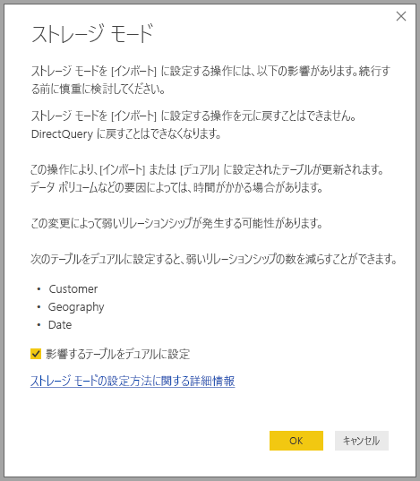

# Power BI Desktop でストレージ モードを管理する

Microsoft Power BI Desktop では、テーブルのストレージ モードを指定することができます。 ストレージ モードでは、Power BI Desktop でレポートのテーブル データをメモリ内にキャッシュするかどうかを制御することができます。 

ストレージ モードを設定すると、多くの利点があります。 ご利用のモデルで、各テーブルのストレージ モードを個別に設定できます。 これにより、単一データセットが有効になり、次の利点が得られます。

* **クエリのパフォーマンス**:ユーザーが Power BI レポートのビジュアルを操作するときに、Data Analysis Expressions (DAX) クエリがデータセットに送信されます。 ストレージ モードを適切に設定してデータをメモリにキャッシュすると、クエリのパフォーマンスとレポートの対話機能が向上します。

* **大規模なデータセット**:キャッシュされていないテーブルでは、キャッシュ目的でメモリが消費されません。 大きすぎて、またはコストが高すぎてメモリ内に完全にキャッシュできない大規模なデータセットに対して、対話型の分析を有効にすることができます。 キャッシュする価値があるテーブルと、そうでないテーブルを選択できます。

* **データ更新の最適化**:キャッシュされていないテーブルを更新する必要はありません。 サービス レベル アグリーメントとビジネス要件を満たすために必要なデータのみをキャッシュすることで、更新時間を短縮できます。

* **ほぼリアルタイムの要件**:ほぼリアルタイムの要件があるテーブルの場合、キャッシュしないことで、データの待機時間を短縮できる可能性があります。

* **書き戻し**:ビジネス ユーザーは、書き戻しを利用し、セル値を変更して what-if シナリオを探索できます。 カスタム アプリケーションは、データ ソースに変更を適用できます。 キャッシュされていないテーブルでは変更をすぐに表示できるため、結果を即時に分析できます。

Power BI Desktop のストレージ モード設定は、次の 3 つの関連機能の 1 つです。

* **複合モデル**:DirectQuery 接続やインポートなど、2 つ以上のデータ接続を任意の組み合わせでレポートに含めることができます。 詳細については、「[Power BI Desktop で複合モデルを使用する](desktop-composite-models.md)」を参照してください。

* **多対多のリレーションシップ**:複合モデルでは、テーブル間で "*多対多のリレーションシップ*" を確立することができます。 多対多リレーションシップでは、テーブル内の一意の値については要件が除外されます。 また、リレーションシップを確立するためだけに新しいテーブルを導入するなどの以前の回避策も除外されます。 詳細については、「[Power BI Desktop での多対多カーディナリティのリレーションシップ](desktop-many-to-many-relationships.md)」を参照してください。

* **ストレージ モード**:ストレージ モードでは、バックエンド データ ソースへのクエリが必要とされるビジュアルを指定できるようになりました。 クエリを必要としないビジュアルは、それらが DirectQuery に基づいている場合でもインポートされます。 この機能はパフォーマンスの向上とバック エンドの負荷の軽減に役立ちます。 以前は、スライサーなどのシンプルなビジュアルでも、バックエンド ソースに送信されるクエリが開始されました。 

## [ストレージ モード] プロパティを使用する

**[ストレージ モード]** プロパティは、ご利用のモデル内の各テーブルに設定できるプロパティです。これにより、Power BI でテーブル データをキャッシュする方法を制御できます。

**[ストレージ モード]** プロパティを設定するには、またはその現在の設定を表示するには、次のようにします。 

1. **[モデル]** ビューで、プロパティを表示または設定するテーブルを選択します。 
2. **[プロパティ]** ペインで、 **[詳細]** セクションを展開し、 **[ストレージ モード]** ドロップダウンを展開します。

   ![[ストレージ モード] プロパティを選択する](media/desktop-storage-mode/storage-mode-02.png)

**[ストレージ モード]** プロパティを、次の 3 つの値のいずれかに設定します。

* **インポート**: この設定でインポートされたテーブルはキャッシュされます。 インポート テーブルからデータを返す Power BI データセットに送信されるクエリは、キャッシュされたデータからのみ実行できます。

* **DirectQuery**: この設定のテーブルはキャッシュされません。 Power BI データセットに送信され、DirectQuery テーブルからデータを返すクエリ &mdash;たとえば、DAX クエリ&mdash; は、データ ソースに対してオンデマンド クエリを実行することでのみ実行できます。 データ ソースに送信されるクエリでは、そのデータ ソースのクエリ言語 (SQL など) が使用されます。

* **デュアル**: この設定を使用したテーブルは、Power BI データセットに送信されたクエリのコンテキストに応じて、キャッシュまたは非キャッシュとして機能することができます。 場合によっては、キャッシュされたデータからクエリを実行します。 それ以外の場合は、データ ソースへのオンデマンド クエリを実行することで、クエリを実行します。

テーブルの **[ストレージ モード]** を **[インポート]** に変更することは、"*元に戻すことができない*" 操作です。 一度設定すると、このプロパティを後で **[DirectQuery]** または **[デュアル]** に変更することはできません。

> [!NOTE]
> Power BI Desktop と Power BI サービスの両方で、 **[デュアル]** ストレージ モードを使用できます。

## DirectQuery テーブルとデュアル テーブルに関する制約

デュアル テーブルの機能的な制約は、DirectQuery テーブルのものと同じです。 これらの制約には、計算列での M 変換の制限や DAX 関数の制限が含まれます。 詳細については、「[DirectQuery を使用する影響](../connect-data/desktop-directquery-about.md#implications-of-using-directquery)」を参照してください。

## [デュアル] 設定の伝達
次の単純なモデルを考えてみましょう。このモデルでは、すべてのテーブルがインポートと DirectQuery をサポートする単一のソースのテーブルです。

このモデルのすべてのテーブルが、最初は **[DirectQuery]** に設定されているとします。 次に、**SurveyResponse** テーブルの **[ストレージ モード]** を **[インポート]** に変更すると、次の警告ウィンドウが表示されます。

データセットにある制限付きリレーションシップの数を減らし、パフォーマンスを向上させるために、ディメンション テーブル (**Customer** (顧客)、**Geography** (地域)、**Date** (日付)) を **[デュアル]** に設定することができます。 通常、制限付きリレーションシップは、結合のロジックをソース システムにプッシュできない 1 つ以上の DirectQuery テーブルと関係しています。 デュアル テーブルは DirectQuery テーブルとしてもインポート テーブルとしても機能するため、この状況は回避されます。

伝達ロジックは、多数のテーブルが含まれるモデルに役立つように設計されています。 たとえば、テーブル数が 50 個のモデルがあり、特定のファクト (トランザクション) テーブルのみをキャッシュする必要があるとします。 Power BI Desktop のロジックによって、 **[デュアル]** に設定する必要があるディメンション テーブルの最小セットが計算されるので、ユーザーが行う必要はありません。

伝達ロジックは、1 対多のリレーションシップの一方向に対してのみ横断されます。

## ストレージ モードの使用例
前のセクションの例を続けて、次のストレージ モードのプロパティ設定を適用してみましょう。

| テーブル                   | ストレージ モード         |
| ----------------------- |----------------------| 
| 売上                 | DirectQuery          | 
| SurveyResponse        | インポート               | 
| Date                  | デュアル                 | 
| 顧客              | デュアル                 | 
| Geography             | デュアル                 | 

**Sales** (売上) テーブルに大規模なデータ ボリュームがあると仮定した場合、これらのストレージ モード プロパティを設定すると、次のような動作になります。
* Power BI Desktop でディメンション テーブル (**Date** (日付)、**Customer** (顧客)、**Geography** (地域)) がキャッシュされるため、表示するスライサー値を取得するときに、初期レポートの読み込み時間が短縮されます。
* Power BI Desktop では、**Sales** (売上) テーブルはキャッシュされません。 このテーブルをキャッシュしないことで、Power BI Desktop では次のような結果になります。
    * データの更新時間が改善され、メモリ消費量が減少します。
    * **Sales** (売上) テーブルに基づくレポート クエリが、**DirectQuery** モードで実行されます。 これらのクエリには時間がかかる場合がありますが、キャッシュの待機時間が発生しないため、リアルタイムに近くなります。

* **SurveyResponse** テーブルに基づくレポート クエリはメモリ内のキャッシュから返されるので、比較的高速になります。

## キャッシュにヒットするクエリまたはヒットしないクエリ

SQL Profiler を Power BI Desktop 用の診断ポートに接続した場合、次のイベントに基づくトレースを実行することで、メモリ内のキャッシュにヒットするクエリとヒットしないクエリを確認できます。

* Queries Events\Query Begin
* Query Processing\Vertipaq SE Query Begin
* Query Processing\DirectQuery Begin

*Query Begin* イベントごとに、同じ *ActivityID* を使用して他のイベントを確認します。 たとえば、*DirectQuery Begin* イベントは存在しないが、*Vertipaq SE Query Begin* イベントは存在する場合、クエリはキャッシュから応答されます。

デュアル テーブルを参照するクエリでは、可能であれば、キャッシュからデータが返され、そうでない場合は、DirectQuery に戻されます。

前の例を続けて、次のクエリでは、**デュアル** モードの **Date** (日付) テーブルの列のみを参照します。 そのため、クエリはキャッシュにヒットします。

次のクエリは、**DirectQuery** モードの **Sales** (売上) テーブルの列のみを参照します。 そのため、キャッシュにはヒット "*しません*"。

次の例は、両方の列を結合する興味深いクエリです。 このクエリはキャッシュにヒットしません。 最初は、キャッシュから **CalendarYear** 値を取得し、ソースから **SalesAmount** 値を取得した後で、結果を組み合わせることを考えるかもしれませんが、この方法はソース システムに SUM/GROUP BY 操作を送信するよりも効率的ではありません。 操作がソースにプッシュされた場合、返される行数がはるかに少なくなる可能性があります。 

> [!NOTE]
> キャッシュされたテーブルとキャッシュされていないテーブルを組み合わせた場合、この動作は、Power BI Desktop での[多対多リレーションシップ](desktop-many-to-many-relationships.md)とは異なります。

## キャッシュの同期状態を保つ

前のセクションで示したクエリは、デュアル テーブルがキャッシュにヒットする場合と、しない場合があることを示しています。 そのため、キャッシュが古い場合、異なる値が返される可能性があります。 クエリを実行しても、たとえばキャッシュされた値と一致するように DirectQuery の結果をフィルター処理するなどして、データに関する問題に対処することはありません。 お客様がデータ フローを把握し、それに応じて設計する必要があります。 必要に応じて、ソースのそのようなケースを処理する手法が確立されています。

**デュアル** ストレージ モードはパフォーマンスの最適化です。 ビジネス要件を満たすことができる条件を損なわない方法でのみ使用する必要があります。 他の動作については、「[Power BI Desktop で多対多リレーションシップを適用する](desktop-many-to-many-relationships.md)」で説明されている手法を使用することを検討してください。

## データ ビュー
データセット内の少なくとも 1 つのテーブルのストレージ モードが **[インポート]** または **[デュアル]** に設定されている場合、 **[データ]** ビュー タブが表示されます。

**[データ]** ビューでデュアル テーブルとインポート テーブルを選択すると、キャッシュされたデータが表示されます。 DirectQuery テーブルにはデータが表示されず、DirectQuery テーブルを表示できないことを示すメッセージが表示されます。

## 制限事項と考慮事項

このリリースのストレージ モードと複合モデルとの相関関係にはいくつかの制限事項があります。

次のライブ接続 (多次元) ソースは、複合モデルでは使用できません。

* SAP HANA
* SAP Business Warehouse
* SQL Server Analysis Services
* Power BI データセット
* Azure Analysis Services

DirectQuery を使用してそれらの多次元ソースに接続すると、別の DirectQuery ソースに接続することも、これをインポートしたデータと結合することもできません。

DirectQuery を使用する際の既存の制限事項は、複合モデルを使用する場合にも適用されます。 これらの制限事項の多くは、テーブルのストレージ モードに応じて、テーブルごとに適用されるようになりました。 たとえば、インポートされたテーブルの計算列からは他のテーブルを参照できますが、DirectQuery テーブルの計算列は同じテーブルの列のみを参照するように制限されています。 モデル内のテーブルのいずれかが DirectQuery の場合、モデル全体に他の制限事項が適用されます。 たとえば、モデル内のいずれかのテーブルにストレージ モードの DirectQuery がある場合、QuickInsights 機能と Q&A 機能は使用できません。 

## 次の手順

複合モデルと DirectQuery について詳しくは、次の記事をご覧ください。
* [Power BI Desktop の複合モデル](desktop-composite-models.md)
* [Power BI Desktop での多対多カーディナリティのリレーションシップ](desktop-many-to-many-relationships.md)
* [Power BI で DirectQuery を使用する](../connect-data/desktop-directquery-about.md)
* [Power BI の DirectQuery でサポートされるデータ ソース](../connect-data/power-bi-data-sources.md)
