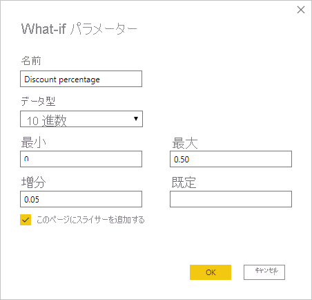
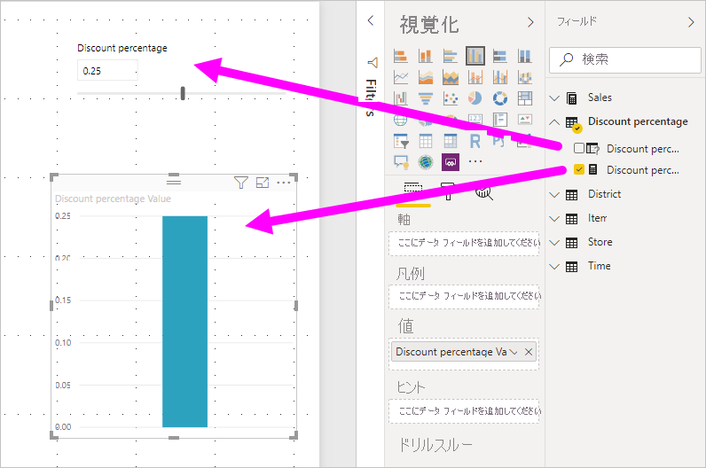

# Power BI Desktop で変数を視覚化する what-if パラメーターを作成して使用する

2018 年 8 月リリースの *Power BI Desktop* 以降では、レポート用の *what-if* 変数を作成し、スライサーで変数を操作して、レポート内の異なるキー値を視覚化および定量化できます。

*what-if* パラメーターは、Power BI Desktop の **[モデリング]** タブで作成します。 これを選択すると、パラメーターを構成できるダイアログ ボックスが表示されます。

## what-if パラメーターの作成

what-if パラメーターを作成するには、Power BI Desktop の **[モデリング]** タブで **[新しいパラメーター]** を選択します。 次の図では、"*割引率*" という名前のパラメーターを作成し、データ型を **[10 進数]** に設定しています。 **[最小値]** の値は 0 です。 **[最大値]** は 0.50 (50%) です。 また、"**増分**" を 0.05 (5%) に設定してあります。 これはレポートで操作したときのパラメーターの調整量です。

> [!NOTE]
> 10 進数の場合、単に .50 ではなく 0.50 のように先頭のゼロが必要です。 このようにしないと、値が妥当と見なされず、 **[OK]** ボタンを選択できません。
> 
> 

使いやすいように、 **[このページにスライサーを追加する]** チェック ボックスをオンにすると、現在のレポート ページに what-if パラメーターを含むスライサーが自動的に追加されます。

what-if パラメーターを作成すると、パラメーターだけでなくメジャーも作成されて、what-if パラメーターの現在値を視覚化するために使用できます。

what-if パラメーターを作成すると、パラメーターとメジャーの両方がモデルの一部になるということは重要であり、覚えておくと役に立ちます。 したがって、これらをレポート全体および他のレポート ページで使うことができます。 また、モデルの一部であるため、レポート ページからスライサーを削除できます。 戻す必要がある場合は、 **[フィールド]** 一覧で what-if パラメーターを選択し、キャンバスにドラッグして、ビジュアルをスライサーに変更するだけです。

## what-if パラメーターの使用

what-if パラメーターを使用する簡単な例を作成しましょう。 前のセクションで、what-if パラメーターを作成しました。 ここでは、スライダーを使用して値を調整する新しいメジャーを作成することによって、それを使用します。

新しいメジャーは、割引率を適用した合計売上金額を表示するだけの簡単なものです。 複雑な興味深いメジャーを作成して、レポートの使用者が what-if パラメーターの変数を視覚化できるようにすることができます。 たとえば、販売員が販売目標や割合を達成したときの報酬を表示したり、より大きい割引への売上増加の影響を表示したりするレポートを作成できます。

数式バーにメジャーの式を入力し、式に *Sales after Discount* という名前を設定します。

その後、**SalesAmount** と作成した **Sales after Discount** メジャーを値にして、軸上に **OrderDate** がある縦棒グラフ ビジュアルを作成します。

スライダーを動かすと、**Sales after Discount** の縦棒に割引後の売り上げ高が反映されるのがわかります。

これで完了です。 what-if パラメーターは、あらゆる種類の状況で使用できます。 これらのパラメーターを使用すると、レポートのユーザーがレポートのさまざまなシナリオと対話できるようにすることができます。
