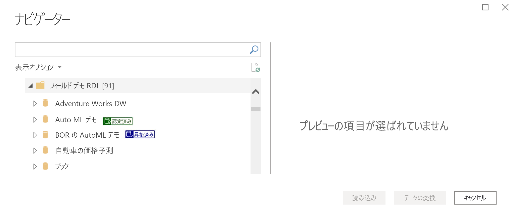
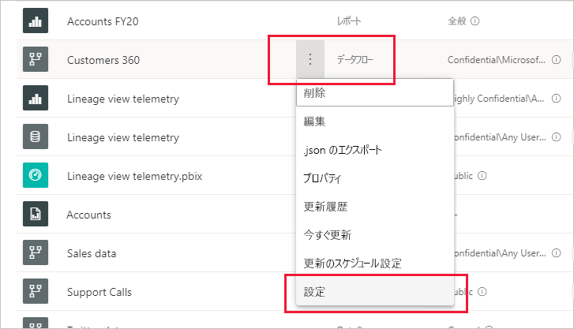
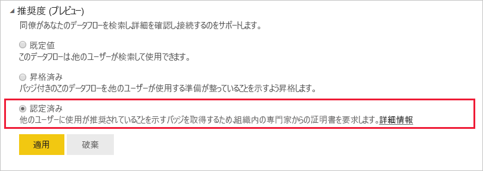

# データフローの昇格または認定 (プレビュー)

Power BI には、価値が高く高品質なデータフローの可視性を向上させるための 2 つの方法が用意されています。**昇格**と**認定**です。

* **昇格**: 昇格によって、ユーザーは価値が高く、他のユーザーが使用するに値すると考えたデータフローを強調表示できるようになります。 このようにして、組織内のデータフローを共同作業するための拡散が促進されます。 データフローの所有者、またはデータフローが配置されているワークスペースに対する書き込みアクセス許可を持つメンバーは、データフローが共有に十分適していると考えた場合に、それを簡単に昇格させることができます。

* **認定**: 認定とは、データフローが、権限を与えられたレビュー担当者によってチェックされ、組織全体ですぐに使用できる真に信頼性の高い正当なデータソースであることを意味します。 Power BI テナント管理者によって定義された一部のレビュー担当者グループが、認定するデータフローを決定します。 特定のデータフローを認定する必要があると考えているが、それを認定する権限が与えられていないユーザーは、テナント管理者に連絡する必要があります。

  データフローの認証は、それが [Power BI テナント管理者によって有効にされている](../admin/service-admin-setup-certification.md)場合にのみ可能です。

データフローの昇格または認定は、"*承認*" と呼ばれます。 Power BI のレポート作成者には、多くの場合、さまざまなデータフローの選択肢が与えられています。そして、承認によって彼らは信頼性の高い、信頼に値する正当なデータフローへと導かれます。

承認されたデータフローには Power BI の多くの場所で明確なラベルが付けられています。そのため、レポート作成者は信頼性の高いデータを探しているときにそれらを容易に見つけることができ、管理者およびレポート作成者はそれらが組織全体でどのように使用されているかを追跡できます。

次の画像では、昇格および認定されたデータフローを Power Query で簡単に識別する方法を示しています。

この記事では、次の内容について説明します。
* データフローの昇格 (データフロー所有者またはデータフローが配置されているワークスペース上でメンバー権限を持つ任意のユーザー)
* データフローの認定 (テナント管理者によって決定された、権限を持つデータフロー認定者)

データフローの認定の設定 (テナント管理者) については、「[データセットとデータフローの認定を設定する](../admin/service-admin-setup-certification.md)」を参照してください。

## データフローを昇格させる

データフローを昇格させるには、昇格させるデータフローが配置されているワークスペースに対する書き込みアクセス許可が必要です。

1. ワークスペース内のデータフローの一覧に移動します。
 
1. 昇格させるデータフローで **[その他のオプション]** (...) を選択し、次に **[設定]** を選択します。

    

1. 承認セクションを展開し、 **[昇格しました]** を選択します。

    ![[昇格しました]、[適用] の順に選択する](media/service-dataflows-promote-certify/power-bi-dataflow-promoted-endorsement.png)

1. **[適用]** を選びます。

## データフローを認定する

このセクションでは、テナント管理者から、データフローを認定する権限が与えられたユーザーを対象としています。 データフローの認定には、大きな責任があります。 このセクションでは、実施する認定プロセスについて説明します。

1. 認定するデータフローが置かれているワークスペースに対する書き込みアクセス許可を取得します。 データフローの所有者から、またはワークスペースに対する管理者のアクセス許可を持つユーザーから取得可能です。 

1. データフローを慎重に確認し、認定に値するかどうかを判断します。

1. データフローを認定することを決めた場合は、それが置かれているワークスペースに移動します。
 
1. 探しているデータフローを見つけて、 **[その他のオプション]** (...) をクリックし、次に **[設定]** を選択します。

    

1. 承認セクションを展開し、 **[認定済み]** をクリックします。 

    

2. **[適用]** をクリックします。

## 次の手順

* [データセットとデータフローの認定を設定する](../admin/service-admin-setup-certification.md)
* わからないことがある場合は、 [Power BI コミュニティで質問してみてください](https://community.powerbi.com/)。