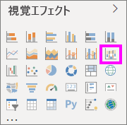
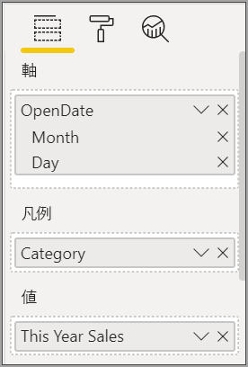
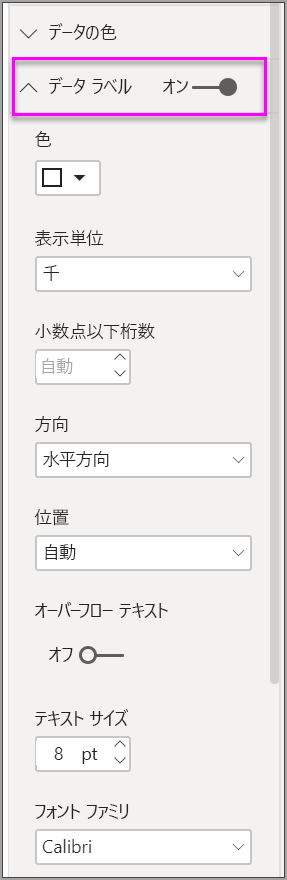

# Power BI のリボン グラフを使用する

[!INCLUDE [power-bi-visuals-desktop-banner](../includes/power-bi-visuals-desktop-banner.md)]

リボン グラフを利用してデータを視覚化し、ランクが最も高い (最大値の) データ カテゴリをすばやく判断できます。 リボン グラフでは、ランクの変化を効果的に確認できます。各期間を対象に、最高位の範囲 (値) が常に一番上に表示されます。 

## 前提条件

このチュートリアルでは、[小売の分析のサンプル PBIX ファイル](http://download.microsoft.com/download/9/6/D/96DDC2FF-2568-491D-AAFA-AFDD6F763AE3/Retail%20Analysis%20Sample%20PBIX.pbix)を使用します。

1. メニューバーの左上にある **[ファイル]**  >  **[開く]** を選択します。
   
2. **小売の分析のサンプル PBIX ファイル**を探します。

1. **小売の分析のサンプル PBIX ファイル**をレポート ビュー  で開きます。

1. 選択  を選択して、新しいページを追加します。

## リボン グラフを作成する

1. リボン グラフを作成するには、 **[視覚化]** ウィンドウで **[リボン グラフ]** を選択します。

    

    リボン グラフでは、リボンによりデータのカテゴリがつながり、その連続する時間が視覚化されます。グラフの X 軸 (通常、時系列) 期間全体での特定のカテゴリのランク変化を確認できます。

2. **[軸]** 、 **[凡例]** 、 **[値]** のフィールドを選択します。  この例では、次のように選択しています: **[Store]\(店舗\)**  >  **[OpenDate]\(開始日\)** 、 **[品目]**  >  **[カテゴリ]** 、および **[売上]**  >  **[This year sales]\(今年の売上\)**  >  **[値]** 。  

    

    データセットには 1 年間のデータしか格納されていないため、 **[軸]** ウェルから **[年]** フィールドと **[四半期]** フィールドを削除しました。

3. リボン グラフには、毎月のランクが表示されます。 ランクが時間の経過と共にどのように変化するかに注意してください。 たとえば、Home カテゴリは、2 月から 3 月の間に 2 位から 5 位に移動しています。

    

## リボン グラフを書式設定する
リボン グラフを作成するとき、 **[視覚化]** ウィンドウの **[書式]** セクションの書式設定オプションを利用できます。 リボン グラフの書式設定オプションは、積み上げ縦棒グラフのそれと似ています。リボンに固有の追加書式設定オプションがあります。

![[視覚化] ウィンドウのリボン テンプレート](media/desktop-ribbon-charts/power-bi-format-ribbon.png)

リボン グラフのこの書式設定オプションでは、次の項目を調整できます。

* **[間隔]** では、リボン間の間隔を調整できます。 この数値は、列の最大の高さの割合になります。
* **[系列の色を一致させる]** では、リボンの色を系列の色に合わせることができます。 **オフ**に設定した場合、リボンは灰色になります。
* **[透過性]** では、リボンの透明度が指定されます。初期設定は 30 です。
* **[罫線]** では、リボンの上下に濃い色の罫線を引くことができます。 既定では、罫線はオフになっています。

リボン グラフには Y 軸のラベルがないため、データ ラベルを追加したい場合があります。 [書式] ウィンドウで、 **[データ ラベル]** を選択します。 

データ ラベルの書式オプションを設定します。 この例では、テキストの色を白に、表示単位を千に設定しています。

![[視覚化] ウィンドウのリボン テンプレート](media/desktop-ribbon-charts/power-bi-data-labels.png)

## 次の手順

[Power BI の散布図とバブル チャート](power-bi-visualization-scatter.md)

[Power BI での視覚化の種類](power-bi-visualization-types-for-reports-and-q-and-a.md)
