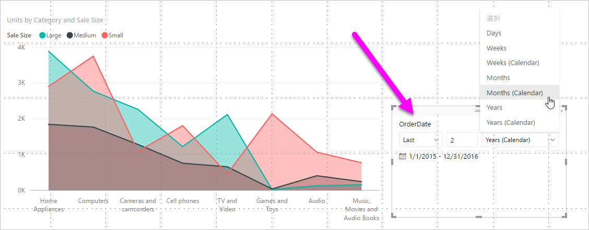
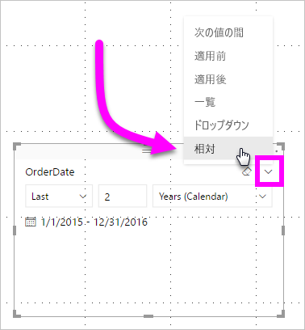

# Power BI での相対日付のスライサーおよびフィルターの作成

[!INCLUDE[consumer-appliesto-nyyn](../includes/consumer-appliesto-nyyn.md)]

**相対日付スライサー**または**相対日付フィルター**では、データ モデルの任意の日付列に時間ベースのフィルターを適用することができます。 たとえば、**相対日付スライサー**を使って、過去 30 日間 (または 1 か月、カレンダー月など) に発生した販売データのみを表示できます。 データを更新すると、相対期間によって適切な相対日付制約が自動的に適用されます。

Power BI を使用する同僚とレポートを共有するには、それぞれのユーザーが個別の Power BI Pro ライセンスを持っているか、レポートが Premium 容量に保存されている必要があります。

## 相対日付範囲スライサーを作成する

他のスライサーと同じように相対日付スライサーを使用できます。 レポートの**スライサー** ビジュアルを作成し、 **[フィールド]** 値の日付値を選択します。 次の図では、"*OrderDate*" フィールドが選択されています。

![スライサー ビジュアル アイコンとフィールドを指す矢印を示す [視覚化] ウィンドウのスクリーンショット。](media/desktop-slicer-filter-date-range/relative-date-range-slicer-filter-02.png)

キャンバス上のスライサー、そしてスライサー ビジュアルの右上隅にあるカラットの順に選択します。 ビジュアルに日付データが含まれる場合、メニューには**相対**のオプションが表示されます。

相対日付スライサーの場合は、"*相対*" を選びます。

その後、設定を選択できます。

"*相対日付スライサー*" の最初の設定には、次の選択肢があります。

* 最後

* 次へ

* この

"*相対日付スライサー*" の 2 番目 (真ん中) の設定では、数字を入力して、相対的な日付範囲を定義できます。

3 番目の設定では、日付の測定値を選択できます。 次の選択肢があります。

* 日

* 週

* 週 (暦)

* Months

* 月 (暦)

* 年

* 年 (暦)

一覧から "**月**" を選択して、真ん中の設定で *2* と入力した場合、次のような状態になります。

* 今日が 7 月 20 日の場合

* スライサーによって制約されるビジュアルに含まれているデータには、前の 2 か月間のデータが表示されます

* 5 月 21 日から 7 月 20 日 (今日の日付) まで

一方、"*月 (暦)* " を選択すると、制約されたビジュアルに、5 月 1 日から 6 月 30 日 (過去 2 カレンダー月) までのデータが表示されます。

## 相対日付範囲フィルターを作成する

レポート ページまたはレポート全体の相対日付範囲フィルターを作成することもできます。 そのためには、日付フィールドを **[フィールド]** ウィンドウの **[ページ レベル フィルター]** または **[レポート レベル フィルター]** にドラッグします。

![[ページ レベル フィルター] にドラッグされている OrderDate フィールドのスクリーンショット。](media/desktop-slicer-filter-date-range/relative-date-range-slicer-filter-06.png)

すると、相対日付範囲を変更することができます。 **相対日付スライサー**をカスタマイズするのと同様の方法です。 **[フィルターの種類]** ドロップダウンから **[相対日付フィルター]** を選びます。

![[フィルターの種類] ドロップダウンと [相対日付フィルター] 上のマウス ポインターを示すスクリーンショット。](media/desktop-slicer-filter-date-range/relative-date-range-slicer-filter-07.png)

**[相対日付フィルター]** を選択すると、スライサーと同様に、真ん中の数値ボックスを含む 3 つのセクションが変わるのがわかります。

![[次の値のときに項目を表示] オプションを指す矢印を示す [レポート レベル フィルター] のスクリーンショット。](media/desktop-slicer-filter-date-range/relative-date-range-slicer-filter-08.png)

## 制限事項と考慮事項

現在、**相対日付範囲スライサー**とフィルターには次の制限事項と考慮事項が適用されています。

* **Power BI** のデータ モデルには、タイム ゾーン情報が含まれていません。 モデルは時間を保存できますが、タイム ゾーンの指定はありません。

* スライサーとフィルターは、常に協定世界時 (UTC) に基づいています。 レポートでフィルターを設定して、別のタイム ゾーンにいる同僚に送る場合、双方とも同じデータが表示されます。 UTC タイム ゾーンを使用していない場合は、ご自分と同僚との間の時刻のずれを考慮する必要があります。

* **クエリ エディター**を使って、キャプチャされたデータを現地のタイム ゾーンから UTC に変換できます。

## 次の手順

- [Power BI で相対日付のスライサーおよびフィルターを使用する](desktop-slicer-filter-date-range.md)
- [Power BI のスライサー](power-bi-visualization-slicers.md)
