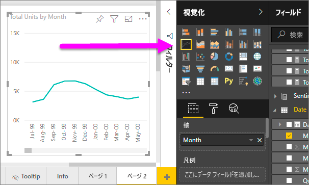
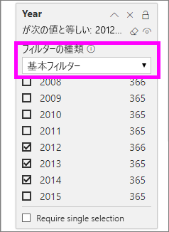
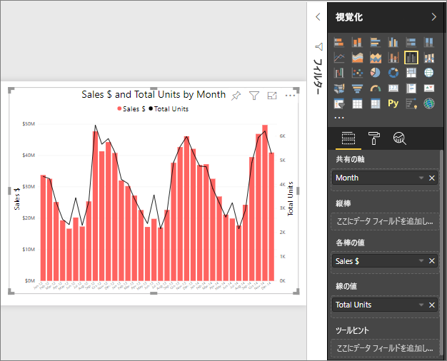
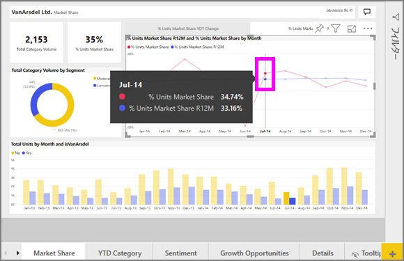

# Power BI の折れ線グラフ
折れ線グラフでは、ドットで表された一連のデータ ポイントが直線で接続されています。 折れ線グラフには 1 つまたは複数の線を含めることができ、 X と Y 軸があります。 

## 折れ線グラフを作成する
以下の手順では、売上およびマーケティングのサンプル アプリを使って、今年の売上をカテゴリ別に表示する折れ線グラフを作成します。 作業を進めるために、appsource.com からサンプル アプリを取得します。

1. 空のレポート ページで開始します。 Power BI サービスを使っている場合は、[編集ビュー](../service-interact-with-a-report-in-editing-view.md)でレポートを開いていることを確認します。

2. [フィールド] ウィンドウで、 **[SalesFact]** \> **[合計単位]** を選択し、 **[日付]**  >  **[月]** を選択します。  お使いのレポート キャンバスに縦棒グラフが作成されます。

    ![[フィールド] ウィンドウから選択する](media/power-bi-line-charts/power-bi-step1.png)

4. [視覚化] ウィンドウから折れ線グラフのテンプレートを選択して、折れ線グラフに変換します。 

    
   

4. 2012 ～ 2014 年のデータが表示されるように折れ線グラフをフィルター処理します。 [フィルター] ウィンドウが折りたたまれている場合は、ここで展開します。 [フィールド] ウィンドウで **[日付]** \> **[年]** を選択し、[フィルター] ウィンドウにドラッグして、 **[このビジュアルでのフィルター]** 見出しにドロップします。 
     
    ![[フィールド] ウィンドウの横にある折れ線](media/power-bi-line-charts/power-bi-year-filter.png)

    **[高度なフィルター]** を **[基本フィルター]** に変更し、 **[2012]** 、 **[2013]** 、および **[2014]** を選択します。

    

6. 必要に応じて、[グラフのテキストの色とサイズを調整](power-bi-visualization-customize-title-background-and-legend.md)します。 

    

## 折れ線をグラフに追加する
折れ線グラフには、さまざまな線を多数追加できます。 また、それぞれの折れ線の値の差が大きすぎて、一緒には上手く表示されないことがあります。 ここでは現在のグラフに折れ線を追加して、折れ線によって表される値の差が非常に大きいときに、グラフの書式を設定する方法について説明します。 

### 折れ線を追加する
グラフ上のすべてのリージョンの合計ユニット数を 1 本の折れ線で表すのではなく、合計ユニットをリージョン別に分割してみましょう。 **[Geo]**  >  **[リージョン]** を [凡例] ウェルにドラッグして、折れ線を追加します。

   

### 2 つの Y 軸を使用する
同じグラフで売上合計と合計ユニット数を確認したい場合は、どうしますか。 販売数がユニット数を大幅に上回っている場合、折れ線グラフは使用できません。 実際、合計ユニット数を示す赤色の線はゼロのように見えます。

   

それぞれの値の差が大きい場合、その値を 1 つのグラフに表示するには、複合グラフを使用します。 複合グラフの詳細については、「[Power BI の複合グラフ](power-bi-visualization-combo-chart.md)」を参照してください。 以下の例では、2 つ目の Y 軸を追加することで、売上と合計ユニット数を 1 つのグラフに表示しています。 

   

## 強調表示とクロス フィルター処理
[フィルター] ウィンドウの使用方法については、「[Power BI でのレポートへのフィルターの追加](../power-bi-report-add-filter.md)」をご覧ください。

折れ線グラフでデータ ポイントを選択すると、レポート ページ上の他の視覚化がクロス強調表示およびクロス フィルター処理されます。逆の場合も同様です。 作業を進めるには、 **[マーケット シェア]** タブを開きます。  

折れ線グラフでは、1 つのデータ ポイントが X 軸と Y 軸上の交差ポイントです。 データ ポイントを選択すると、マーカーが追加されます。このマーカーは、レポート ページの他のビジュアルで、クロス強調表示およびクロス フィルター処理のソースであるポイント (折れ線が 1 本の場合は 1 つのポイント、折れ線が複数の場合は複数のポイント) を示しています。 お使いのビジュアルの密度が非常に高い場合、ビジュアル上でクリックした場所に最も近いポイントが選択されます。

この例では、2014 年 7 月の R12 のユニット数マーケット シェア % 33.16 とユニット数マーケット シェア% 34.74 が含まれるデータ ポイントが選択されています。

縦棒グラフがどのようにクロス強調表示され、ゲージがクロス フィルター処理されているかを確認してください。

グラフ相互間のクロスフィルター処理とクロス強調表示を管理するには、「[Power BI レポートでの視覚エフェクトの相互作用](../service-reports-visual-interactions.md)」を参照してください。

## 考慮事項とトラブルシューティング
* 1 つの折れ線グラフで 2 つの Y 軸を使用することはできません。  代わりに複合グラフを使用する必要があります。
* 上記の例のグラフでは、フォント サイズを増やし、フォントの色を変更して、軸のタイトルを追加しました。また、グラフのタイトルと凡例を中央に揃える、両方の軸を 0 で開始する、などの書式も設定しています。 [書式設定] ウィンドウ (ペイント ローラー アイコン) には、無限と思われるようなオプション セットがあり、ご自身のグラフの外観を自由に設定できます。 [書式設定] ウィンドウを開いて、書式を設定する方法を確認することをお勧めします。

## 次の手順

[Power BI での視覚化の種類](power-bi-visualization-types-for-reports-and-q-and-a.md)

